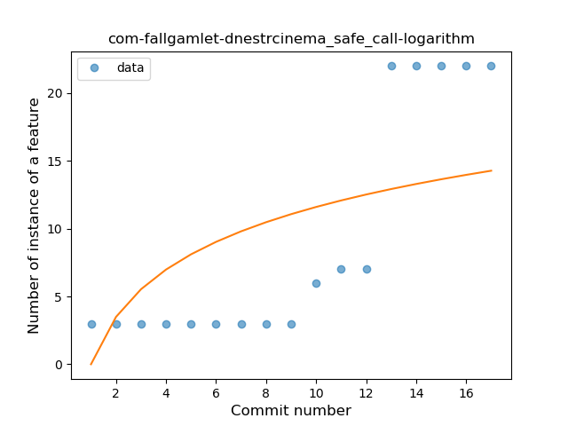
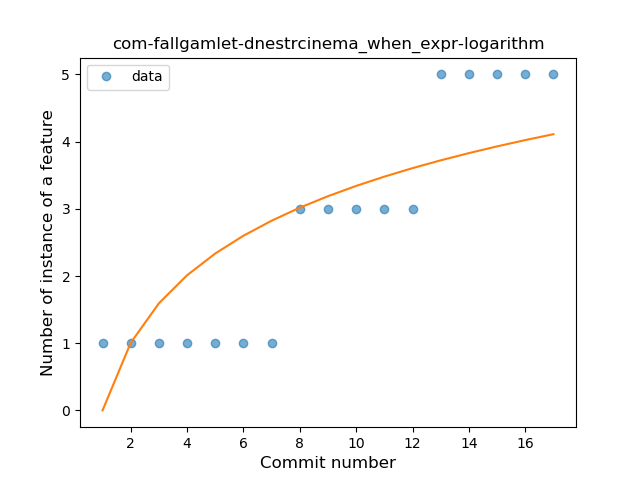
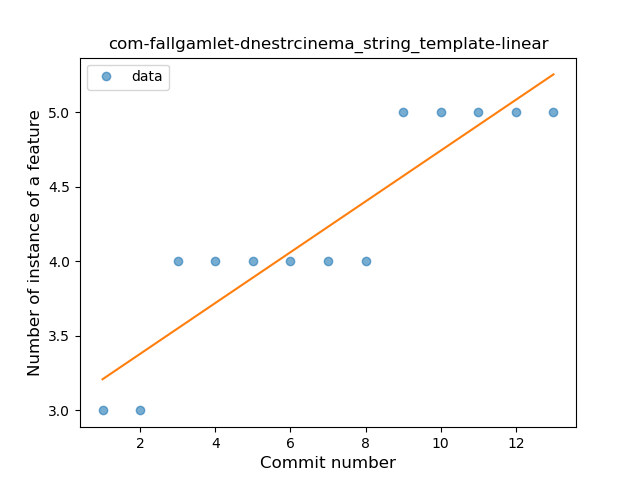
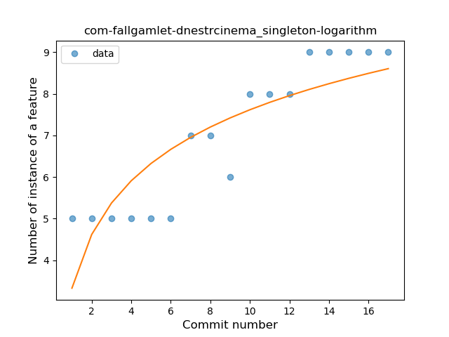
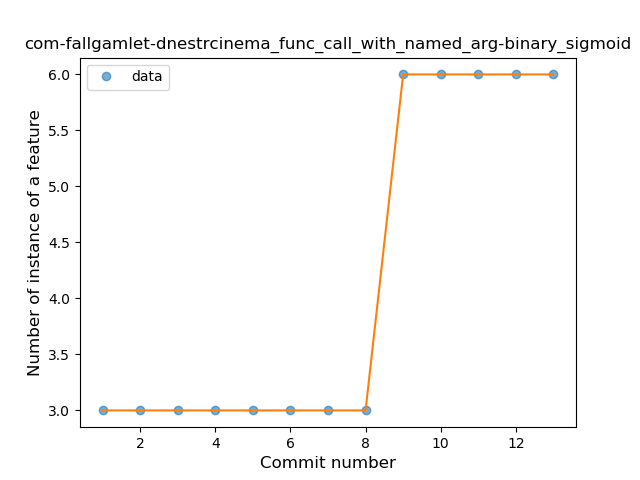
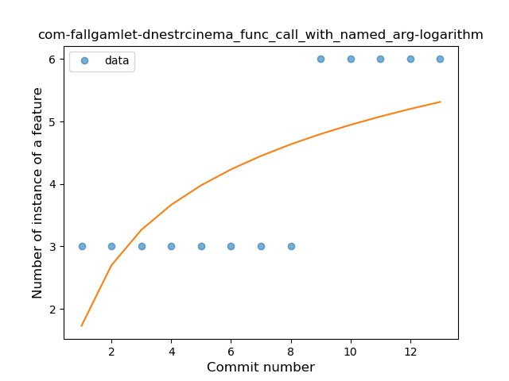
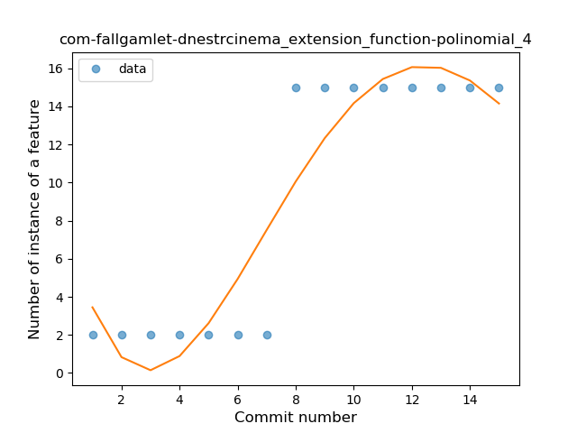
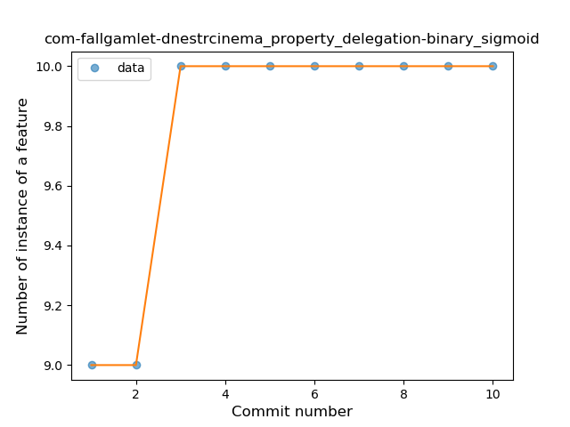
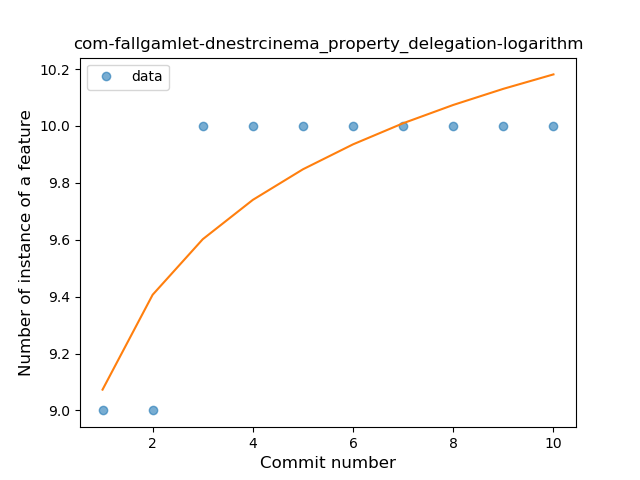

## com-fallgamlet-dnestrcinema
----
#### Metrics provided by Detekt
* Number of lines of code 2644
* Number of Kotlin files: 37
* Cyclomatic complexity: 374
* Cyclomatic complexity by thousands of lines: 272 

----
**12** features analyzed

*	<a href="#type_inference">Type Inference</a> 
*	<a href="#lambda">Lambda</a> 
*	<a href="#safe_call">Safe Call</a> 
*	<a href="#when_expr">When expression</a> 
*	<a href="#unsafe_call">Unsafe Call</a> 
*	<a href="#companion_object">Companion Object</a> 
*	<a href="#string_template">String Template</a> 
*	<a href="#func_with_default_value">Function with Default Value</a> 
*	<a href="#singleton">Singleton</a> 
*	<a href="#func_call_with_named_arg">Function call with Named Argument</a> 
*	<a href="#extension_function">Extension Function</a> 
*	<a href="#property_delegation">Property Delegation</a> 

### <a name="type_inference">Type Inference</a>
----
#### Functions
* **Constant Rise - Linear:** 
    * **R_Squared:** 0.95033985
* **Sudden Rise Plateau - Logarithm:** 
    * **R_Squared:** 0.80438264

**Plots** :chart_with_upwards_trend:
-----

### <a name="lambda">Lambda</a>
----
#### Functions
* **Instability - Polinomial 4:** 
    * **R_Squared:** 0.98166297
* **Sudden Rise - Exponential:** 
    * **R_Squared:** 0.91471153
* **Constant Rise - Linear:** 
    * **R_Squared:** 0.89236915
* **Sudden Rise Plateau - Logarithm:** 
    * **R_Squared:** 0.54930063

**Plots** :chart_with_upwards_trend:
-----

### <a name="safe_call">Safe Call</a>
----
#### Functions
* **Instability - Polinomial 4:** 
    * **R_Squared:** 0.93138875
* **Sudden Rise - Exponential:** 
    * **R_Squared:** 0.83436862
* **Constant Rise - Linear:** 
    * **R_Squared:** 0.72729285
* **Sudden Rise Plateau - Logarithm:** 
    * **R_Squared:** 0.408376

**Plots** :chart_with_upwards_trend:
-----

### <a name="when_expr">When expression</a>
----
#### Functions
* **Plateau Sudden Rise - Binary Sigmoid:** 
    * **R_Squared:** 0.92348362
* **Instability - Polinomial 4:** 
    * **R_Squared:** 0.92971997
* **Sudden Rise - Exponential:** 
    * **R_Squared:** 0.8908223
* **Constant Rise - Linear:** 
    * **R_Squared:** 0.88020833
* **Sudden Rise Plateau - Logarithm:** 
    * **R_Squared:** 0.64538049

**Plots** :chart_with_upwards_trend:
-----

### <a name="unsafe_call">Unsafe Call</a>
----
#### Functions
* **Plateau Gradual Rise - Sigmoid:** 
    * **R_Squared:** 0.97348624
* **Instability - Polinomial 4:** 
    * **R_Squared:** 0.94843549
* **Sudden Rise Plateau - Logarithm:** 
    * **R_Squared:** 0.80127367
* **Constant Rise - Linear:** 
    * **R_Squared:** 0.7122093

**Plots** :chart_with_upwards_trend:
-----

### <a name="companion_object">Companion Object</a>
----
#### Functions
* **Plateau Gradual Rise - Sigmoid:** 
    * **R_Squared:** 0.95896662
* **Instability - Polinomial 4:** 
    * **R_Squared:** 0.95754459
* **Sudden Rise - Exponential:** 
    * **R_Squared:** 0.86696523
* **Constant Rise - Linear:** 
    * **R_Squared:** 0.81756757
* **Sudden Rise Plateau - Logarithm:** 
    * **R_Squared:** 0.55894492

**Plots** :chart_with_upwards_trend:
-----

### <a name="string_template">String Template</a>
----
#### Functions
* **Constant Rise - Linear:** 
    * **R_Squared:** 0.83710801
* **Sudden Rise Plateau - Logarithm:** 
    * **R_Squared:** 0.82536504

**Plots** :chart_with_upwards_trend:
-----

### <a name="func_with_default_value">Function with Default Value</a>
----
#### Functions
* **Plateau Gradual Rise - Sigmoid:** 
    * **R_Squared:** 0.98979345
* **Instability - Polinomial 4:** 
    * **R_Squared:** 0.97384098
* **Instability - Polinomial 3:** )
    * **R_Squared:** 0.96357195
* **Sudden Rise - Exponential:** 
    * **R_Squared:** 0.88793038
* **Constant Rise - Linear:** 
    * **R_Squared:** 0.876304
* **Sudden Rise Plateau - Logarithm:** 
    * **R_Squared:** 0.58374587

**Plots** :chart_with_upwards_trend:
-----

### <a name="singleton">Singleton</a>
----
#### Functions
* **Plateau Gradual Rise - Sigmoid:** 
    * **R_Squared:** 0.93056246
* **Instability - Polinomial 3:** )
    * **R_Squared:** 0.9342589
* **Instability - Polinomial 4:** 
    * **R_Squared:** 0.93453799
* **Constant Rise - Linear:** 
    * **R_Squared:** 0.88970588
* **Sudden Rise Plateau - Logarithm:** 
    * **R_Squared:** 0.7318272

**Plots** :chart_with_upwards_trend:
-----

### <a name="func_call_with_named_arg">Function call with Named Argument</a>
----
#### Functions
* **Plateau Sudden Rise - Binary Sigmoid:** 
    * **R_Squared:** 1.0
* **Instability - Polinomial 4:** 
    * **R_Squared:** 0.88968678
* **Sudden Rise - Exponential:** 
    * **R_Squared:** 0.76008193
* **Constant Rise - Linear:** 
    * **R_Squared:** 0.71428571
* **Sudden Rise Plateau - Logarithm:** 
    * **R_Squared:** 0.4953867

**Plots** :chart_with_upwards_trend:
-----

### <a name="extension_function">Extension Function</a>
----
#### Functions
* **Plateau Sudden Rise - Binary Sigmoid:** 
    * **R_Squared:** 1.0
* **Instability - Polinomial 3:** )
    * **R_Squared:** 0.86255656
* **Instability - Polinomial 4:** 
    * **R_Squared:** 0.86847518
* **Constant Rise - Linear:** 
    * **R_Squared:** 0.75
* **Sudden Rise Plateau - Logarithm:** 
    * **R_Squared:** 0.58442779

**Plots** :chart_with_upwards_trend:
-----

### <a name="property_delegation">Property Delegation</a>
----
#### Functions
* **Plateau Sudden Rise - Binary Sigmoid:** 
    * **R_Squared:** 1.0
* **Instability - Polinomial 3:** )
    * **R_Squared:** 0.84498834
* **Instability - Polinomial 4:** 
    * **R_Squared:** 0.84848485
* **Sudden Rise Plateau - Logarithm:** 
    * **R_Squared:** 0.70027477
* **Constant Rise - Linear:** 
    * **R_Squared:** 0.48484848

**Plots** :chart_with_upwards_trend:
-----

