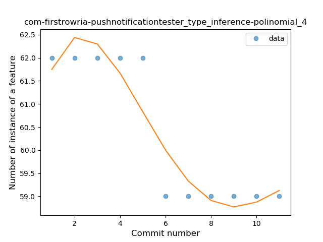
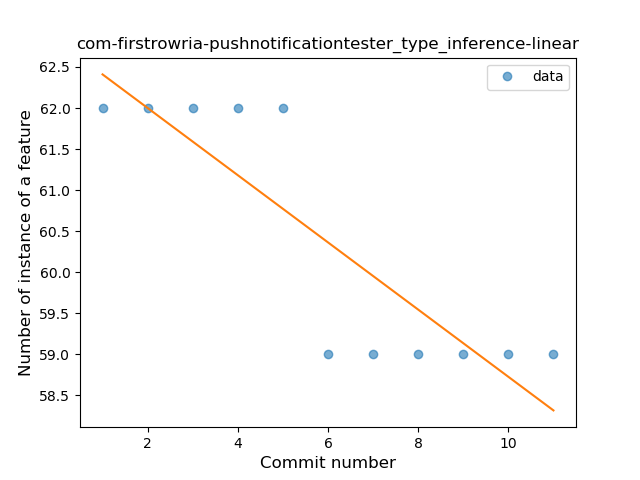
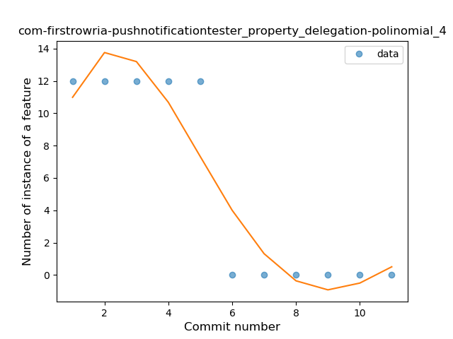
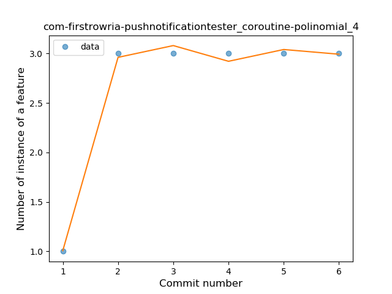

## com-firstrowria-pushnotificationtester
----
#### Metrics provided by Detekt
* Number of lines of code 558
* Number of Kotlin files: 4
* Cyclomatic complexity: 84
* Cyclomatic complexity by thousands of lines: 264 

----
**7** features analyzed

*	<a href="#type_inference">Type Inference</a> 
*	<a href="#lambda">Lambda</a> 
*	<a href="#companion_object">Companion Object</a> 
*	<a href="#string_template">String Template</a> 
*	<a href="#func_call_with_named_arg">Function call with Named Argument</a> 
*	<a href="#property_delegation">Property Delegation</a> 
*	<a href="#coroutine">Coroutine</a> 

### <a name="type_inference">Type Inference</a>
----
#### Functions
* **Instability - Polinomial 4:** 
    * **R_Squared:** 0.87692308
* **Instability - Polinomial 3:** )
    * **R_Squared:** 0.86538462
* **Constant Decline - Linear:** 
    * **R_Squared:** 0.75
* **Sudden Decline - Exponential:** 
    * **R_Squared:** 0.75718437
* **Sudden Rise Plateau - Logarithm:** 
    * **R_Squared:** -0.0

**Plots** :chart_with_upwards_trend:
-----

### <a name="lambda">Lambda</a>
----
#### Functions
* **Plateau Gradual Rise - Sigmoid:** 
    * **R_Squared:** 1.0
* **Instability - Polinomial 3:** )
    * **R_Squared:** 0.93240093
* **Constant Rise - Linear:** 
    * **R_Squared:** 0.81818182
* **Sudden Rise Plateau - Logarithm:** 
    * **R_Squared:** 0.67805986

**Plots** :chart_with_upwards_trend:
-----

### <a name="companion_object">Companion Object</a>
----
#### Functions
* **Instability - Polinomial 4:** 
    * **R_Squared:** 0.87692308
* **Instability - Polinomial 3:** )
    * **R_Squared:** 0.86538462
* **Constant Decline - Linear:** 
    * **R_Squared:** 0.75
* **Sudden Decline - Exponential:** 
    * **R_Squared:** 0.75718437
* **Sudden Rise Plateau - Logarithm:** 
    * **R_Squared:** -0.0

**Plots** :chart_with_upwards_trend:
-----

### <a name="string_template">String Template</a>
----
#### Functions
* **Plateau Sudden Rise - Binary Sigmoid:** 
    * **R_Squared:** 1.0
* **Instability - Polinomial 4:** 
    * **R_Squared:** 0.87692308
* **Instability - Polinomial 3:** )
    * **R_Squared:** 0.86538462
* **Constant Rise - Linear:** 
    * **R_Squared:** 0.75
* **Sudden Rise Plateau - Logarithm:** 
    * **R_Squared:** 0.66287077

**Plots** :chart_with_upwards_trend:
-----

### <a name="func_call_with_named_arg">Function call with Named Argument</a>
----
#### Functions
* **Plateau Sudden Decline - Binary Sigmoid:** 
    * **R_Squared:** 1.0
* **Instability - Polinomial 4:** 
    * **R_Squared:** 0.87692308
* **Instability - Polinomial 3:** )
    * **R_Squared:** 0.86538462
* **Constant Decline - Linear:** 
    * **R_Squared:** 0.75
* **Sudden Decline - Exponential:** 
    * **R_Squared:** 0.75718437
* **Sudden Rise Plateau - Logarithm:** 
    * **R_Squared:** -0.0

**Plots** :chart_with_upwards_trend:
-----

### <a name="property_delegation">Property Delegation</a>
----
#### Functions
* **Instability - Polinomial 4:** 
    * **R_Squared:** 0.87692308
* **Instability - Polinomial 3:** )
    * **R_Squared:** 0.86538462
* **Constant Decline - Linear:** 
    * **R_Squared:** 0.75
* **Sudden Decline - Exponential:** 
    * **R_Squared:** 0.75718437
* **Sudden Rise Plateau - Logarithm:** 
    * **R_Squared:** -0.0

**Plots** :chart_with_upwards_trend:
-----

### <a name="coroutine">Coroutine</a>
----
#### Functions
* **Instability - Polinomial 4:** 
    * **R_Squared:** 0.9952381
* **Instability - Polinomial 3:** )
    * **R_Squared:** 0.95238095
* **Sudden Rise Plateau - Logarithm:** 
    * **R_Squared:** 0.65720643
* **Constant Rise - Linear:** 
    * **R_Squared:** 0.42857143

**Plots** :chart_with_upwards_trend:
-----

