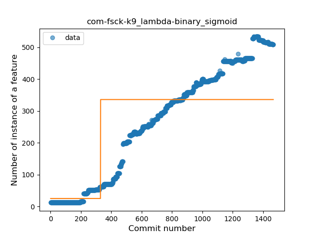
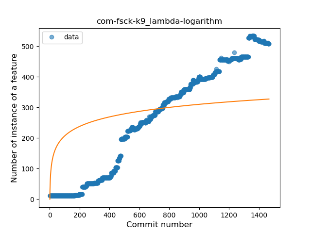
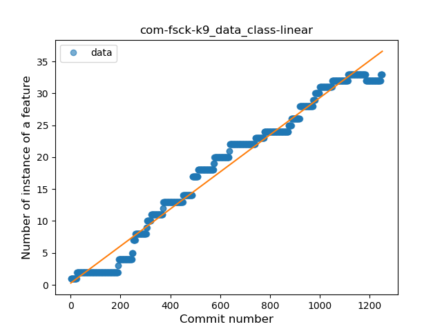
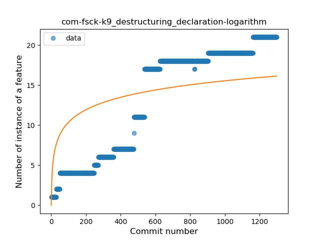
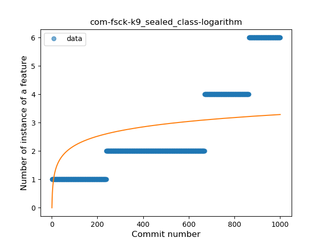
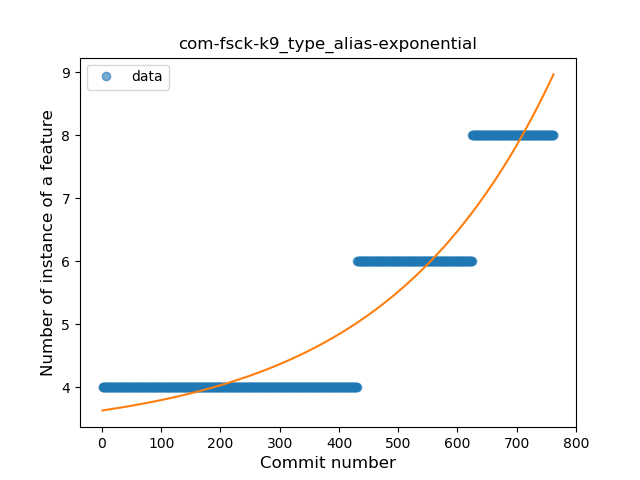

## com-fsck-k9
----
#### Metrics provided by Detekt
* Number of lines of code 20766
* Number of Kotlin files: 310
* Cyclomatic complexity: 3016
* Cyclomatic complexity by thousands of lines: 255 

----
**20** features analyzed

*	<a href="#type_inference">Type Inference</a> 
*	<a href="#lambda">Lambda</a> 
*	<a href="#safe_call">Safe Call</a> 
*	<a href="#when_expr">When expression</a> 
*	<a href="#unsafe_call">Unsafe Call</a> 
*	<a href="#companion_object">Companion Object</a> 
*	<a href="#string_template">String Template</a> 
*	<a href="#func_with_default_value">Function with Default Value</a> 
*	<a href="#singleton">Singleton</a> 
*	<a href="#range_expr">Range Expression</a> 
*	<a href="#smart_cast">Smart Cast</a> 
*	<a href="#data_class">Data Class</a> 
*	<a href="#func_call_with_named_arg">Function call with Named Argument</a> 
*	<a href="#extension_function">Extension Function</a> 
*	<a href="#property_delegation">Property Delegation</a> 
*	<a href="#destructuring_declaration">Destructuring Declaration</a> 
*	<a href="#inline_func">Inline Function</a> 
*	<a href="#coroutine">Coroutine</a> 
*	<a href="#sealed_class">Sealed Class</a> 
*	<a href="#type_alias">Type Alias</a> 

### <a name="type_inference">Type Inference</a>
----
#### Functions
* **Sudden Rise - Exponential:** 
    * **R_Squared:** 0.9888269
* **Constant Rise - Linear:** 
    * **R_Squared:** 0.97432022
* **Sudden Rise Plateau - Logarithm:** 
    * **R_Squared:** 0.29564741

**Plots** :chart_with_upwards_trend:
-----

### <a name="lambda">Lambda</a>
----
#### Functions
* **Constant Rise - Linear:** 
    * **R_Squared:** 0.97380162
* **Plateau Sudden Rise - Binary Sigmoid:** 
    * **R_Squared:** 0.54842851
* **Sudden Rise Plateau - Logarithm:** 
    * **R_Squared:** 0.36011804

**Plots** :chart_with_upwards_trend:
-----

### <a name="safe_call">Safe Call</a>
----
#### Functions
* **Plateau Gradual Rise - Sigmoid:** 
    * **R_Squared:** 0.96924098
* **Constant Rise - Linear:** 
    * **R_Squared:** 0.94593601
* **Sudden Rise Plateau - Logarithm:** 
    * **R_Squared:** 0.29576278

**Plots** :chart_with_upwards_trend:
-----

### <a name="when_expr">When expression</a>
----
#### Functions
* **Constant Rise - Linear:** 
    * **R_Squared:** 0.97510913
* **Sudden Rise Plateau - Logarithm:** 
    * **R_Squared:** 0.43721267
* **Plateau Sudden Rise - Binary Sigmoid:** 
    * **R_Squared:** 0.11380338

**Plots** :chart_with_upwards_trend:
-----

### <a name="unsafe_call">Unsafe Call</a>
----
#### Functions
* **Constant Rise - Linear:** 
    * **R_Squared:** 0.94479117
* **Sudden Rise Plateau - Logarithm:** 
    * **R_Squared:** 0.49903872

**Plots** :chart_with_upwards_trend:
-----

### <a name="companion_object">Companion Object</a>
----
#### Functions
* **Constant Rise - Linear:** 
    * **R_Squared:** 0.98006903
* **Sudden Rise Plateau - Logarithm:** 
    * **R_Squared:** 0.43387207

**Plots** :chart_with_upwards_trend:
-----

### <a name="string_template">String Template</a>
----
#### Functions
* **Sudden Rise - Exponential:** 
    * **R_Squared:** 0.84191488
* **Constant Rise - Linear:** 
    * **R_Squared:** 0.82549155
* **Sudden Rise Plateau - Logarithm:** 
    * **R_Squared:** 0.20348616
* **Plateau Sudden Rise - Binary Sigmoid:** 
    * **R_Squared:** 0.12037094

**Plots** :chart_with_upwards_trend:
-----

### <a name="func_with_default_value">Function with Default Value</a>
----
#### Functions
* **Constant Rise - Linear:** 
    * **R_Squared:** 0.9263553
* **Sudden Rise Plateau - Logarithm:** 
    * **R_Squared:** 0.37578268
* **Plateau Sudden Rise - Binary Sigmoid:** 
    * **R_Squared:** 0.04456125

**Plots** :chart_with_upwards_trend:
-----

### <a name="singleton">Singleton</a>
----
#### Functions
* **Constant Rise - Linear:** 
    * **R_Squared:** 0.97801277
* **Sudden Rise Plateau - Logarithm:** 
    * **R_Squared:** 0.42960708

**Plots** :chart_with_upwards_trend:
-----

### <a name="range_expr">Range Expression</a>
----
#### Functions
* **Constant Rise - Linear:** 
    * **R_Squared:** 0.73494568
* **Sudden Rise Plateau - Logarithm:** 
    * **R_Squared:** 0.70257527

**Plots** :chart_with_upwards_trend:
-----

### <a name="smart_cast">Smart Cast</a>
----
#### Functions
* **Sudden Rise - Exponential:** 
    * **R_Squared:** 0.95997279
* **Constant Rise - Linear:** 
    * **R_Squared:** 0.93319752
* **Sudden Rise Plateau - Logarithm:** 
    * **R_Squared:** 0.37103232

**Plots** :chart_with_upwards_trend:
-----

### <a name="data_class">Data Class</a>
----
#### Functions
* **Constant Rise - Linear:** 
    * **R_Squared:** 0.97584216
* **Sudden Rise Plateau - Logarithm:** 
    * **R_Squared:** 0.4221326

**Plots** :chart_with_upwards_trend:
-----

### <a name="func_call_with_named_arg">Function call with Named Argument</a>
----
#### Functions
* **Sudden Rise - Exponential:** 
    * **R_Squared:** 0.94015276
* **Constant Rise - Linear:** 
    * **R_Squared:** 0.87638785
* **Sudden Rise Plateau - Logarithm:** 
    * **R_Squared:** 0.28609758
* **Plateau Sudden Rise - Binary Sigmoid:** 
    * **R_Squared:** 0.02733217

**Plots** :chart_with_upwards_trend:
-----

### <a name="extension_function">Extension Function</a>
----
#### Functions
* **Constant Rise - Linear:** 
    * **R_Squared:** 0.86003332
* **Sudden Rise Plateau - Logarithm:** 
    * **R_Squared:** 0.37191713
* **Plateau Sudden Rise - Binary Sigmoid:** 
    * **R_Squared:** 0.03557039

**Plots** :chart_with_upwards_trend:
-----

### <a name="property_delegation">Property Delegation</a>
----
#### Functions
* **Constant Rise - Linear:** 
    * **R_Squared:** 0.89342286
* **Sudden Rise Plateau - Logarithm:** 
    * **R_Squared:** 0.61332869
* **Plateau Sudden Rise - Binary Sigmoid:** 
    * **R_Squared:** 0.20916709

**Plots** :chart_with_upwards_trend:
-----

### <a name="destructuring_declaration">Destructuring Declaration</a>
----
#### Functions
* **Constant Rise - Linear:** 
    * **R_Squared:** 0.87535617
* **Sudden Rise Plateau - Logarithm:** 
    * **R_Squared:** 0.45333017

**Plots** :chart_with_upwards_trend:
-----

### <a name="inline_func">Inline Function</a>
----
#### Functions
* **Sudden Rise - Exponential:** 
    * **R_Squared:** 0.83584238
* **Constant Rise - Linear:** 
    * **R_Squared:** 0.79363451
* **Sudden Rise Plateau - Logarithm:** 
    * **R_Squared:** 0.6680951

**Plots** :chart_with_upwards_trend:
-----

### <a name="coroutine">Coroutine</a>
----
#### Functions
* **Constant Rise - Linear:** 
    * **R_Squared:** 0.75689227
* **Sudden Rise Plateau - Logarithm:** 
    * **R_Squared:** 0.52090447

**Plots** :chart_with_upwards_trend:
-----

### <a name="sealed_class">Sealed Class</a>
----
#### Functions
* **Sudden Rise - Exponential:** 
    * **R_Squared:** 0.92003068
* **Plateau Gradual Rise - Sigmoid:** 
    * **R_Squared:** 0.92186185
* **Constant Rise - Linear:** 
    * **R_Squared:** 0.81832792
* **Sudden Rise Plateau - Logarithm:** 
    * **R_Squared:** 0.30919542

**Plots** :chart_with_upwards_trend:
-----

### <a name="type_alias">Type Alias</a>
----
#### Functions
* **Plateau Gradual Rise - Sigmoid:** 
    * **R_Squared:** 0.92053727
* **Sudden Rise - Exponential:** 
    * **R_Squared:** 0.89217383
* **Constant Rise - Linear:** 
    * **R_Squared:** 0.77871331
* **Sudden Rise Plateau - Logarithm:** 
    * **R_Squared:** 0.40317548

**Plots** :chart_with_upwards_trend:
-----

