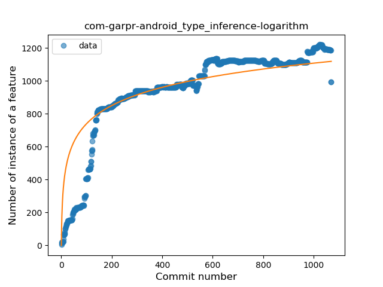
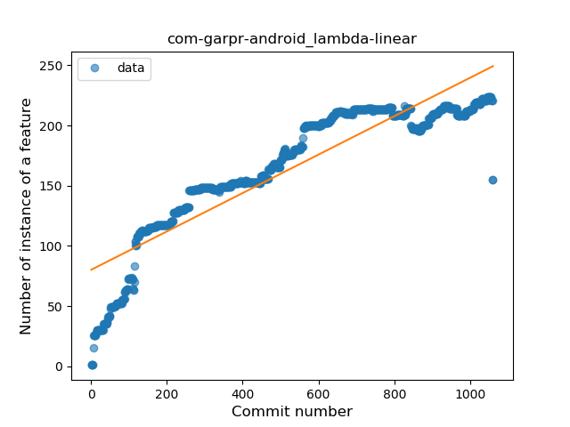
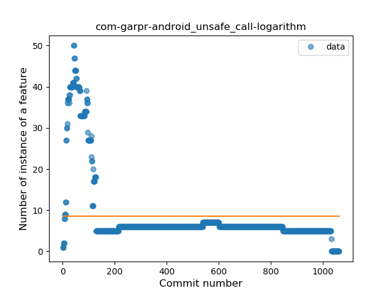
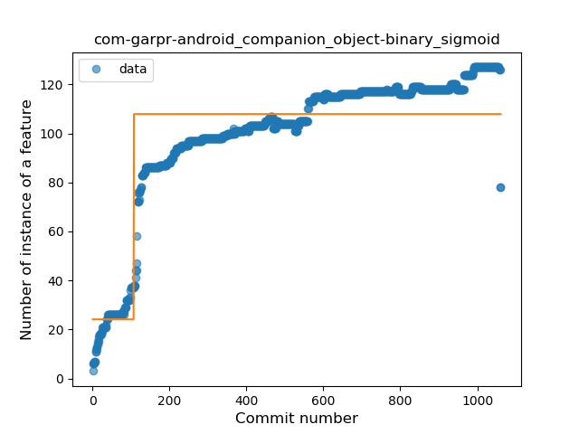
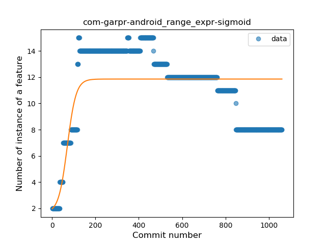
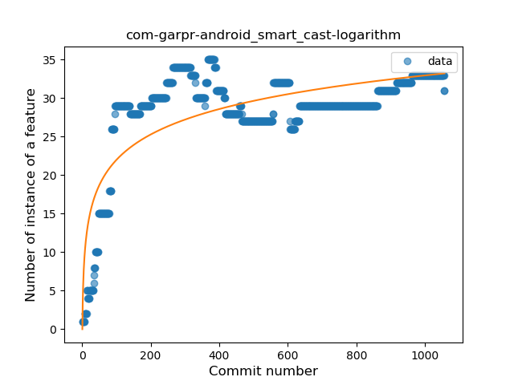
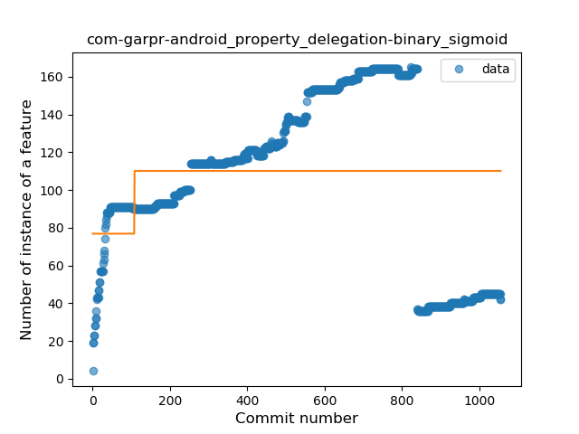
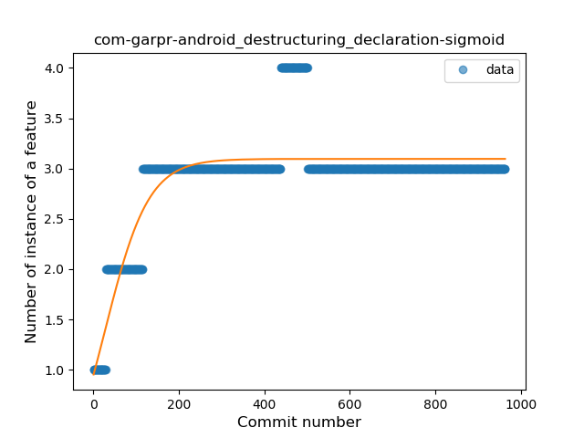

## com-garpr-android
----
#### Metrics provided by Detekt
* Number of lines of code 23817
* Number of Kotlin files: 313
* Cyclomatic complexity: 2545
* Cyclomatic complexity by thousands of lines: 178 

----
**17** features analyzed

*	<a href="#type_inference">Type Inference</a> 
*	<a href="#lambda">Lambda</a> 
*	<a href="#safe_call">Safe Call</a> 
*	<a href="#when_expr">When expression</a> 
*	<a href="#unsafe_call">Unsafe Call</a> 
*	<a href="#companion_object">Companion Object</a> 
*	<a href="#string_template">String Template</a> 
*	<a href="#func_with_default_value">Function with Default Value</a> 
*	<a href="#singleton">Singleton</a> 
*	<a href="#range_expr">Range Expression</a> 
*	<a href="#smart_cast">Smart Cast</a> 
*	<a href="#data_class">Data Class</a> 
*	<a href="#func_call_with_named_arg">Function call with Named Argument</a> 
*	<a href="#extension_function">Extension Function</a> 
*	<a href="#property_delegation">Property Delegation</a> 
*	<a href="#destructuring_declaration">Destructuring Declaration</a> 
*	<a href="#overloaded_op">Overloaded Operator</a> 

### <a name="type_inference">Type Inference</a>
----
#### Functions
* **Sudden Rise Plateau - Logarithm:** 
    * **R_Squared:** 0.75216142
* **Plateau Sudden Rise - Binary Sigmoid:** 
    * **R_Squared:** 0.73991613
* **Constant Rise - Linear:** 
    * **R_Squared:** 0.65756925

**Plots** :chart_with_upwards_trend:
-----

### <a name="lambda">Lambda</a>
----
#### Functions
* **Constant Rise - Linear:** 
    * **R_Squared:** 0.82687728
* **Sudden Rise Plateau - Logarithm:** 
    * **R_Squared:** 0.72122654
* **Plateau Sudden Rise - Binary Sigmoid:** 
    * **R_Squared:** 0.63326764

**Plots** :chart_with_upwards_trend:
-----

### <a name="safe_call">Safe Call</a>
----
#### Functions
* **Sudden Rise Plateau - Logarithm:** 
    * **R_Squared:** 0.676825
* **Plateau Sudden Rise - Binary Sigmoid:** 
    * **R_Squared:** 0.63090418
* **Constant Rise - Linear:** 
    * **R_Squared:** 0.51811322

**Plots** :chart_with_upwards_trend:
-----

### <a name="when_expr">When expression</a>
----
#### Functions
* **Sudden Rise Plateau - Logarithm:** 
    * **R_Squared:** 0.7492587
* **Plateau Gradual Rise - Sigmoid:** 
    * **R_Squared:** 0.75185446
* **Constant Rise - Linear:** 
    * **R_Squared:** 0.38875829

**Plots** :chart_with_upwards_trend:
-----

### <a name="unsafe_call">Unsafe Call</a>
----
#### Functions
* **Sudden Decline - Exponential:** 
    * **R_Squared:** 0.60637036
* **Constant Decline - Linear:** 
    * **R_Squared:** 0.28952236
* **Sudden Rise Plateau - Logarithm:** 
    * **R_Squared:** -0.0

**Plots** :chart_with_upwards_trend:
-----

### <a name="companion_object">Companion Object</a>
----
#### Functions
* **Plateau Sudden Rise - Binary Sigmoid:** 
    * **R_Squared:** 0.78522761
* **Sudden Rise Plateau - Logarithm:** 
    * **R_Squared:** 0.76458513
* **Constant Rise - Linear:** 
    * **R_Squared:** 0.66231088

**Plots** :chart_with_upwards_trend:
-----

### <a name="string_template">String Template</a>
----
#### Functions
* **Constant Rise - Linear:** 
    * **R_Squared:** 0.72722883
* **Sudden Rise Plateau - Logarithm:** 
    * **R_Squared:** 0.63084791

**Plots** :chart_with_upwards_trend:
-----

### <a name="func_with_default_value">Function with Default Value</a>
----
#### Functions
* **Constant Rise - Linear:** 
    * **R_Squared:** 0.90209494
* **Sudden Rise Plateau - Logarithm:** 
    * **R_Squared:** 0.44729119
* **Plateau Sudden Rise - Binary Sigmoid:** 
    * **R_Squared:** 0.18658529

**Plots** :chart_with_upwards_trend:
-----

### <a name="singleton">Singleton</a>
----
#### Functions
* **Plateau Sudden Rise - Binary Sigmoid:** 
    * **R_Squared:** 0.71598355
* **Sudden Rise - Exponential:** 
    * **R_Squared:** 0.5861134
* **Constant Rise - Linear:** 
    * **R_Squared:** 0.50061515
* **Sudden Rise Plateau - Logarithm:** 
    * **R_Squared:** 0.36893757

**Plots** :chart_with_upwards_trend:
-----

### <a name="range_expr">Range Expression</a>
----
#### Functions
* **Plateau Gradual Rise - Sigmoid:** 
    * **R_Squared:** 0.46191427
* **Sudden Rise Plateau - Logarithm:** 
    * **R_Squared:** 0.06837644
* **Constant Decline - Linear:** 
    * **R_Squared:** 0.03465049

**Plots** :chart_with_upwards_trend:
-----

### <a name="smart_cast">Smart Cast</a>
----
#### Functions
* **Sudden Rise Plateau - Logarithm:** 
    * **R_Squared:** 0.59067216
* **Plateau Sudden Rise - Binary Sigmoid:** 
    * **R_Squared:** 0.58137166
* **Constant Rise - Linear:** 
    * **R_Squared:** 0.24305041

**Plots** :chart_with_upwards_trend:
-----

### <a name="data_class">Data Class</a>
----
#### Functions
* **Sudden Rise Plateau - Logarithm:** 
    * **R_Squared:** 0.70720882
* **Constant Rise - Linear:** 
    * **R_Squared:** 0.57701942

**Plots** :chart_with_upwards_trend:
-----

### <a name="func_call_with_named_arg">Function call with Named Argument</a>
----
#### Functions
* **Sudden Rise - Exponential:** 
    * **R_Squared:** 0.91824799
* **Constant Rise - Linear:** 
    * **R_Squared:** 0.80238495
* **Sudden Rise Plateau - Logarithm:** 
    * **R_Squared:** 0.25798568

**Plots** :chart_with_upwards_trend:
-----

### <a name="extension_function">Extension Function</a>
----
#### Functions
* **Sudden Rise Plateau - Logarithm:** 
    * **R_Squared:** 0.29610202
* **Constant Rise - Linear:** 
    * **R_Squared:** 0.05824782

**Plots** :chart_with_upwards_trend:
-----

### <a name="property_delegation">Property Delegation</a>
----
#### Functions
* **Plateau Sudden Rise - Binary Sigmoid:** 
    * **R_Squared:** 0.05349767
* **Sudden Rise Plateau - Logarithm:** 
    * **R_Squared:** 0.02883696
* **Constant Decline - Linear:** 
    * **R_Squared:** 0.0101054
* **Sudden Decline - Exponential:** 
    * **R_Squared:** 0.0

**Plots** :chart_with_upwards_trend:
-----

### <a name="destructuring_declaration">Destructuring Declaration</a>
----
#### Functions
* **Plateau Gradual Rise - Sigmoid:** 
    * **R_Squared:** 0.71864042
* **Sudden Rise Plateau - Logarithm:** 
    * **R_Squared:** 0.53237855
* **Constant Rise - Linear:** 
    * **R_Squared:** 0.19714347

**Plots** :chart_with_upwards_trend:
-----

### <a name="overloaded_op">Overloaded Operator</a>
----
#### Functions
* **Plateau Sudden Rise - Binary Sigmoid:** 
    * **R_Squared:** 0.29696983
* **Sudden Decline - Exponential:** 
    * **R_Squared:** 0.04998442
* **Constant Decline - Linear:** 
    * **R_Squared:** 0.01405448
* **Sudden Rise Plateau - Logarithm:** 
    * **R_Squared:** -0.0

**Plots** :chart_with_upwards_trend:
-----

