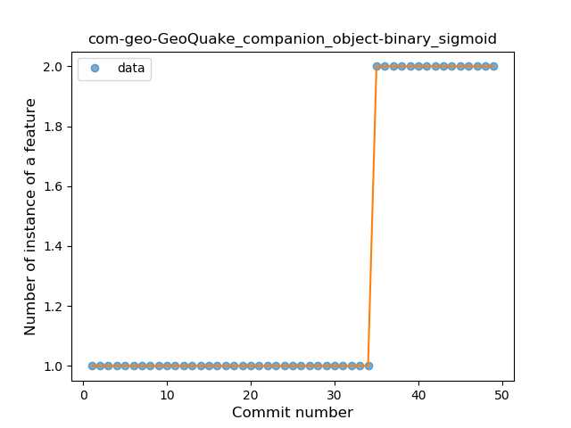

## com-geo-GeoQuake
----
#### Metrics provided by Detekt
* Number of lines of code 357
* Number of Kotlin files: 8
* Cyclomatic complexity: 44
* Cyclomatic complexity by thousands of lines: 278 

----
**4** features analyzed

*	<a href="#type_inference">Type Inference</a> 
*	<a href="#when_expr">When expression</a> 
*	<a href="#unsafe_call">Unsafe Call</a> 
*	<a href="#companion_object">Companion Object</a> 

### <a name="type_inference">Type Inference</a>
----
#### Functions
* **Constant Rise - Linear:** 
    * **R_Squared:** 0.8204371
* **Sudden Rise Plateau - Logarithm:** 
    * **R_Squared:** 0.75967699

**Plots** :chart_with_upwards_trend:
-----

### <a name="when_expr">When expression</a>
----
#### Functions
* **Plateau Sudden Rise - Binary Sigmoid:** 
    * **R_Squared:** 1.0
* **Instability - Polinomial 3:** )
    * **R_Squared:** 0.79177086
* **Sudden Rise Plateau - Logarithm:** 
    * **R_Squared:** 0.62104292
* **Constant Rise - Linear:** 
    * **R_Squared:** 0.3225

**Plots** :chart_with_upwards_trend:
-----

### <a name="unsafe_call">Unsafe Call</a>
----
#### Functions
* **Plateau Sudden Decline - Binary Sigmoid:** 
    * **R_Squared:** 0.75148441
* **Sudden Decline - Exponential:** 
    * **R_Squared:** 0.46716772
* **Instability - Polinomial 3:** )
    * **R_Squared:** 0.41741414
* **Constant Decline - Linear:** 
    * **R_Squared:** 0.1175
* **Sudden Rise Plateau - Logarithm:** 
    * **R_Squared:** -0.0

**Plots** :chart_with_upwards_trend:
-----

### <a name="companion_object">Companion Object</a>
----
#### Functions
* **Plateau Sudden Rise - Binary Sigmoid:** 
    * **R_Squared:** 1.0
* **Sudden Rise - Exponential:** 
    * **R_Squared:** 0.76291693
* **Constant Rise - Linear:** 
    * **R_Squared:** 0.6375
* **Sudden Rise Plateau - Logarithm:** 
    * **R_Squared:** 0.3494264

**Plots** :chart_with_upwards_trend:
-----

