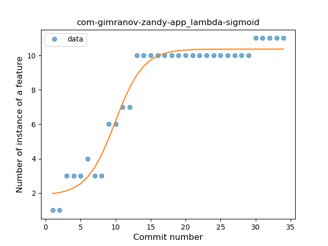
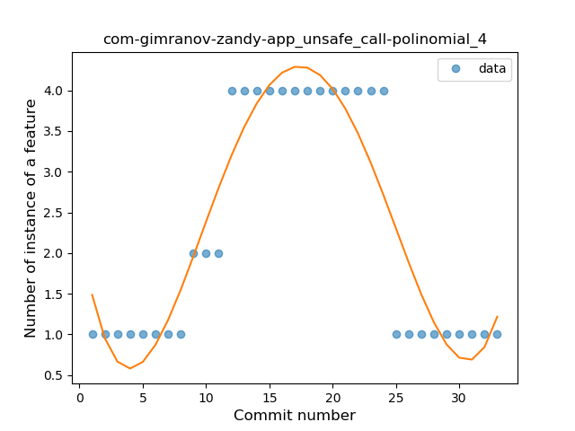

## com-gimranov-zandy-app
----
#### Metrics provided by Detekt
* Number of lines of code 483
* Number of Kotlin files: 10
* Cyclomatic complexity: 77
* Cyclomatic complexity by thousands of lines: 304 

----
**8** features analyzed

*	<a href="#type_inference">Type Inference</a> 
*	<a href="#lambda">Lambda</a> 
*	<a href="#safe_call">Safe Call</a> 
*	<a href="#when_expr">When expression</a> 
*	<a href="#unsafe_call">Unsafe Call</a> 
*	<a href="#string_template">String Template</a> 
*	<a href="#singleton">Singleton</a> 
*	<a href="#smart_cast">Smart Cast</a> 

### <a name="type_inference">Type Inference</a>
----
#### Functions
* **Instability - Polinomial 4:** 
    * **R_Squared:** 0.97065006
* **Plateau Sudden Rise - Binary Sigmoid:** 
    * **R_Squared:** 0.88189997
* **Constant Rise - Linear:** 
    * **R_Squared:** 0.80809843
* **Sudden Rise Plateau - Logarithm:** 
    * **R_Squared:** 0.61047214

**Plots** :chart_with_upwards_trend:
-----

### <a name="lambda">Lambda</a>
----
#### Functions
* **Plateau Gradual Rise - Sigmoid:** 
    * **R_Squared:** 0.96244947
* **Instability - Polinomial 4:** 
    * **R_Squared:** 0.95305612
* **Sudden Rise Plateau - Logarithm:** 
    * **R_Squared:** 0.85801027
* **Constant Rise - Linear:** 
    * **R_Squared:** 0.76665077

**Plots** :chart_with_upwards_trend:
-----

### <a name="safe_call">Safe Call</a>
----
#### Functions
* **Plateau Gradual Rise - Sigmoid:** 
    * **R_Squared:** 0.79142078
* **Instability - Polinomial 4:** 
    * **R_Squared:** 0.79435705
* **Constant Rise - Linear:** 
    * **R_Squared:** 0.6328023
* **Sudden Rise Plateau - Logarithm:** 
    * **R_Squared:** 0.52884464

**Plots** :chart_with_upwards_trend:
-----

### <a name="when_expr">When expression</a>
----
#### Functions
* **Plateau Gradual Rise - Sigmoid:** 
    * **R_Squared:** 0.9702543
* **Instability - Polinomial 4:** 
    * **R_Squared:** 0.93831857
* **Constant Rise - Linear:** 
    * **R_Squared:** 0.77966942
* **Sudden Rise Plateau - Logarithm:** 
    * **R_Squared:** 0.77625469

**Plots** :chart_with_upwards_trend:
-----

### <a name="unsafe_call">Unsafe Call</a>
----
#### Functions
* **Instability - Polinomial 4:** 
    * **R_Squared:** 0.86945298
* **Plateau Sudden Rise - Binary Sigmoid:** 
    * **R_Squared:** 0.26977974
* **Sudden Rise Plateau - Logarithm:** 
    * **R_Squared:** 0.07018425
* **Constant Rise - Linear:** 
    * **R_Squared:** 0.00162729

**Plots** :chart_with_upwards_trend:
-----

### <a name="string_template">String Template</a>
----
#### Functions
* **Plateau Sudden Rise - Binary Sigmoid:** 
    * **R_Squared:** 0.99047658
* **Instability - Polinomial 4:** 
    * **R_Squared:** 0.81647164
* **Sudden Rise Plateau - Logarithm:** 
    * **R_Squared:** 0.61101071
* **Constant Rise - Linear:** 
    * **R_Squared:** 0.53639609

**Plots** :chart_with_upwards_trend:
-----

### <a name="singleton">Singleton</a>
----
#### Functions
* **Plateau Gradual Rise - Sigmoid:** 
    * **R_Squared:** 0.97965386
* **Constant Rise - Linear:** 
    * **R_Squared:** 0.78346276
* **Sudden Rise Plateau - Logarithm:** 
    * **R_Squared:** 0.70099672

**Plots** :chart_with_upwards_trend:
-----

### <a name="smart_cast">Smart Cast</a>
----
#### Functions
* **Plateau Sudden Rise - Binary Sigmoid:** 
    * **R_Squared:** 1.0
* **Instability - Polinomial 4:** 
    * **R_Squared:** 0.83594741
* **Instability - Polinomial 3:** )
    * **R_Squared:** 0.79431438
* **Sudden Rise Plateau - Logarithm:** 
    * **R_Squared:** 0.60579889
* **Constant Rise - Linear:** 
    * **R_Squared:** 0.31730769

**Plots** :chart_with_upwards_trend:
-----

