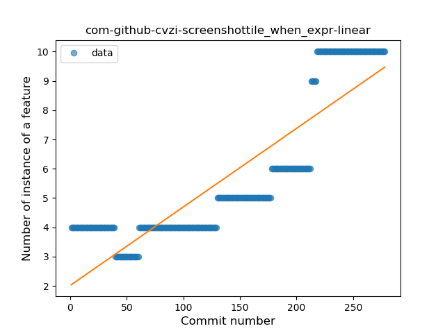
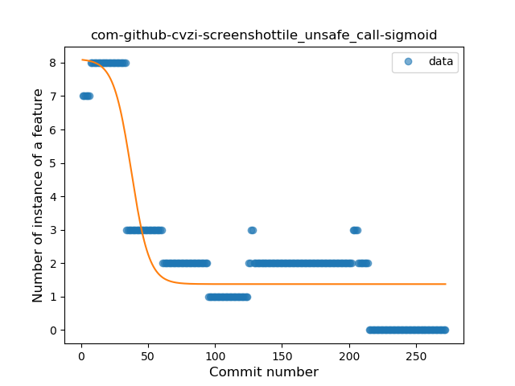
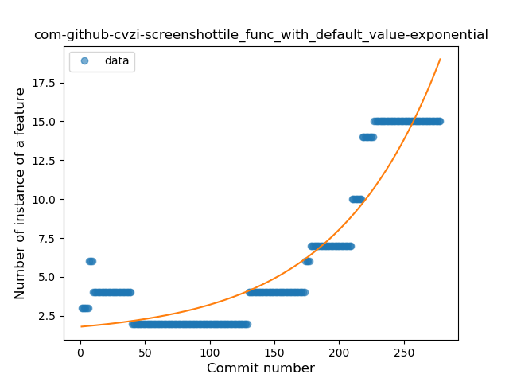

## com-github-cvzi-screenshottile
----
#### Metrics provided by Detekt
* Number of lines of code 2430
* Number of Kotlin files: 17
* Cyclomatic complexity: 328
* Cyclomatic complexity by thousands of lines: 240 

----
**11** features analyzed

*	<a href="#type_inference">Type Inference</a> 
*	<a href="#lambda">Lambda</a> 
*	<a href="#safe_call">Safe Call</a> 
*	<a href="#when_expr">When expression</a> 
*	<a href="#unsafe_call">Unsafe Call</a> 
*	<a href="#companion_object">Companion Object</a> 
*	<a href="#string_template">String Template</a> 
*	<a href="#func_with_default_value">Function with Default Value</a> 
*	<a href="#data_class">Data Class</a> 
*	<a href="#func_call_with_named_arg">Function call with Named Argument</a> 
*	<a href="#property_delegation">Property Delegation</a> 

### <a name="type_inference">Type Inference</a>
----
#### Functions
* **Sudden Rise - Exponential:** 
    * **R_Squared:** 0.93788229
* **Constant Rise - Linear:** 
    * **R_Squared:** 0.91785116
* **Sudden Rise Plateau - Logarithm:** 
    * **R_Squared:** 0.58480068
* **Plateau Sudden Rise - Binary Sigmoid:** 
    * **R_Squared:** 0.46807218

**Plots** :chart_with_upwards_trend:
-----

### <a name="lambda">Lambda</a>
----
#### Functions
* **Sudden Rise - Exponential:** 
    * **R_Squared:** 0.96426454
* **Constant Rise - Linear:** 
    * **R_Squared:** 0.93834028
* **Sudden Rise Plateau - Logarithm:** 
    * **R_Squared:** 0.47304624
* **Plateau Gradual Rise - Sigmoid:** 
    * **R_Squared:** 0.09450308

**Plots** :chart_with_upwards_trend:
-----

### <a name="safe_call">Safe Call</a>
----
#### Functions
* **Sudden Rise - Exponential:** 
    * **R_Squared:** 0.97388894
* **Constant Rise - Linear:** 
    * **R_Squared:** 0.94727044
* **Sudden Rise Plateau - Logarithm:** 
    * **R_Squared:** 0.39245064
* **Plateau Sudden Rise - Binary Sigmoid:** 
    * **R_Squared:** 0.26517561

**Plots** :chart_with_upwards_trend:
-----

### <a name="when_expr">When expression</a>
----
#### Functions
* **Plateau Gradual Rise - Sigmoid:** 
    * **R_Squared:** 0.94192818
* **Sudden Rise - Exponential:** 
    * **R_Squared:** 0.89436025
* **Constant Rise - Linear:** 
    * **R_Squared:** 0.77015279
* **Sudden Rise Plateau - Logarithm:** 
    * **R_Squared:** 0.37937279

**Plots** :chart_with_upwards_trend:
-----

### <a name="unsafe_call">Unsafe Call</a>
----
#### Functions
* **Plateau Gradual Decline - Sigmoid:** 
    * **R_Squared:** 0.8242551
* **Sudden Decline - Exponential:** 
    * **R_Squared:** 0.78267746
* **Constant Decline - Linear:** 
    * **R_Squared:** 0.57387196
* **Sudden Rise Plateau - Logarithm:** 
    * **R_Squared:** -0.0

**Plots** :chart_with_upwards_trend:
-----

### <a name="companion_object">Companion Object</a>
----
#### Functions
* **Sudden Rise - Exponential:** 
    * **R_Squared:** 0.75682952
* **Constant Rise - Linear:** 
    * **R_Squared:** 0.73482308
* **Sudden Rise Plateau - Logarithm:** 
    * **R_Squared:** 0.63918167

**Plots** :chart_with_upwards_trend:
-----

### <a name="string_template">String Template</a>
----
#### Functions
* **Sudden Rise - Exponential:** 
    * **R_Squared:** 0.94896289
* **Constant Rise - Linear:** 
    * **R_Squared:** 0.91937753
* **Sudden Rise Plateau - Logarithm:** 
    * **R_Squared:** 0.38337543
* **Plateau Sudden Rise - Binary Sigmoid:** 
    * **R_Squared:** 0.12664887

**Plots** :chart_with_upwards_trend:
-----

### <a name="func_with_default_value">Function with Default Value</a>
----
#### Functions
* **Plateau Gradual Rise - Sigmoid:** 
    * **R_Squared:** 0.95409648
* **Sudden Rise - Exponential:** 
    * **R_Squared:** 0.87540639
* **Constant Rise - Linear:** 
    * **R_Squared:** 0.6888611
* **Sudden Rise Plateau - Logarithm:** 
    * **R_Squared:** 0.22647149

**Plots** :chart_with_upwards_trend:
-----

### <a name="data_class">Data Class</a>
----
#### Functions
* **Plateau Sudden Rise - Binary Sigmoid:** 
    * **R_Squared:** 1.0
* **Constant Rise - Linear:** 
    * **R_Squared:** 0.67597968
* **Sudden Rise Plateau - Logarithm:** 
    * **R_Squared:** 0.64073497

**Plots** :chart_with_upwards_trend:
-----

### <a name="func_call_with_named_arg">Function call with Named Argument</a>
----
#### Functions
* **Plateau Sudden Rise - Binary Sigmoid:** 
    * **R_Squared:** 1.0
* **Constant Rise - Linear:** 
    * **R_Squared:** 0.67597968
* **Sudden Rise Plateau - Logarithm:** 
    * **R_Squared:** 0.64073497

**Plots** :chart_with_upwards_trend:
-----

### <a name="property_delegation">Property Delegation</a>
----
#### Functions
* **Constant Decline - Linear:** 
    * **R_Squared:** 0.03683809
* **Plateau Sudden Decline - Binary Sigmoid:** 
    * **R_Squared:** 0.02209678
* **Sudden Rise Plateau - Logarithm:** 
    * **R_Squared:** -0.0

**Plots** :chart_with_upwards_trend:
-----

