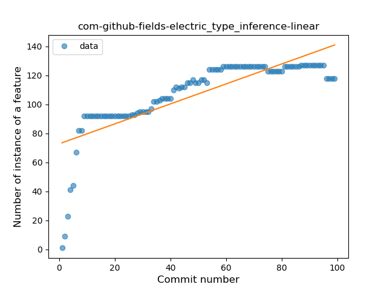
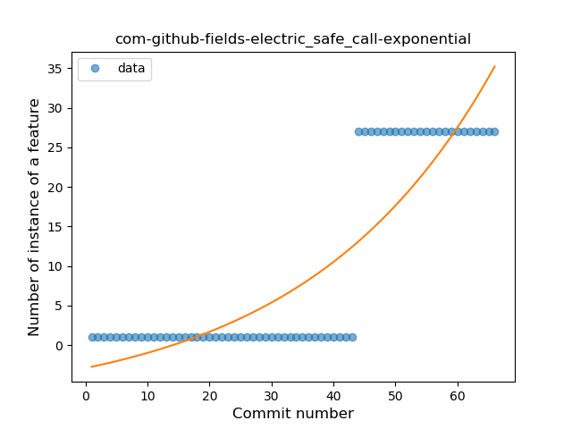
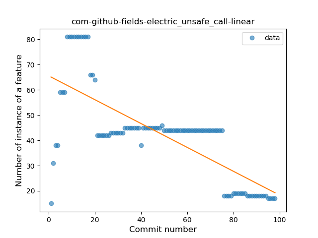
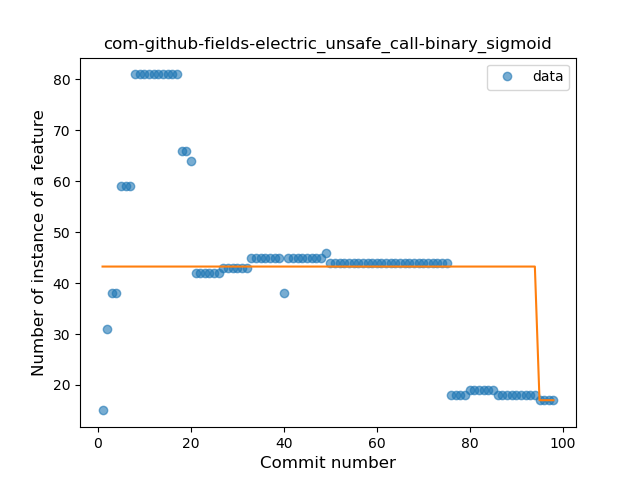
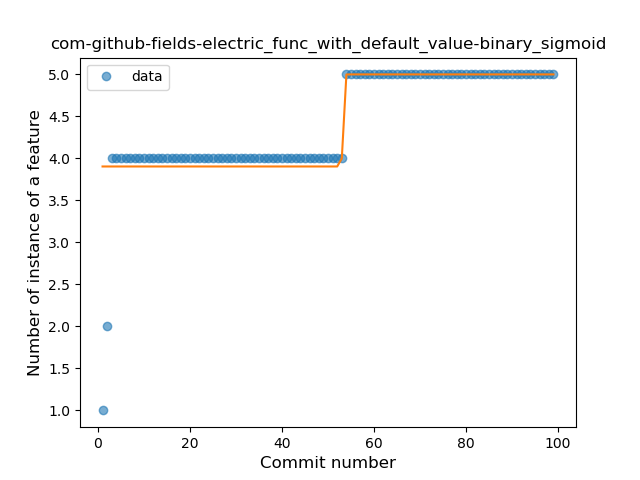

## com-github-fields-electric
----
#### Metrics provided by Detekt
* Number of lines of code 1851
* Number of Kotlin files: 13
* Cyclomatic complexity: 248
* Cyclomatic complexity by thousands of lines: 287 

----
**8** features analyzed

*	<a href="#type_inference">Type Inference</a> 
*	<a href="#lambda">Lambda</a> 
*	<a href="#safe_call">Safe Call</a> 
*	<a href="#unsafe_call">Unsafe Call</a> 
*	<a href="#companion_object">Companion Object</a> 
*	<a href="#string_template">String Template</a> 
*	<a href="#func_with_default_value">Function with Default Value</a> 
*	<a href="#range_expr">Range Expression</a> 

### <a name="type_inference">Type Inference</a>
----
#### Functions
* **Sudden Rise Plateau - Logarithm:** 
    * **R_Squared:** 0.90857602
* **Constant Rise - Linear:** 
    * **R_Squared:** 0.63983981

**Plots** :chart_with_upwards_trend:
-----

### <a name="lambda">Lambda</a>
----
#### Functions
* **Constant Rise - Linear:** 
    * **R_Squared:** 0.71394684
* **Sudden Rise Plateau - Logarithm:** 
    * **R_Squared:** 0.48694633

**Plots** :chart_with_upwards_trend:
-----

### <a name="safe_call">Safe Call</a>
----
#### Functions
* **Sudden Rise - Exponential:** 
    * **R_Squared:** 0.75784109
* **Constant Rise - Linear:** 
    * **R_Squared:** 0.68128588
* **Sudden Rise Plateau - Logarithm:** 
    * **R_Squared:** 0.24098995

**Plots** :chart_with_upwards_trend:
-----

### <a name="unsafe_call">Unsafe Call</a>
----
#### Functions
* **Constant Decline - Linear:** 
    * **R_Squared:** 0.54755192
* **Plateau Sudden Decline - Binary Sigmoid:** 
    * **R_Squared:** 0.08257147
* **Sudden Decline - Exponential:** 
    * **R_Squared:** 0.0
* **Sudden Rise Plateau - Logarithm:** 
    * **R_Squared:** 0.0

**Plots** :chart_with_upwards_trend:
-----

### <a name="companion_object">Companion Object</a>
----
#### Functions
* **Constant Rise - Linear:** 
    * **R_Squared:** 0.84497089
* **Sudden Rise Plateau - Logarithm:** 
    * **R_Squared:** 0.76854699

**Plots** :chart_with_upwards_trend:
-----

### <a name="string_template">String Template</a>
----
#### Functions
* **Plateau Sudden Rise - Binary Sigmoid:** 
    * **R_Squared:** 1.0
* **Sudden Rise - Exponential:** 
    * **R_Squared:** 0.76847715
* **Constant Rise - Linear:** 
    * **R_Squared:** 0.58102041
* **Sudden Rise Plateau - Logarithm:** 
    * **R_Squared:** 0.27872172

**Plots** :chart_with_upwards_trend:
-----

### <a name="func_with_default_value">Function with Default Value</a>
----
#### Functions
* **Plateau Sudden Rise - Binary Sigmoid:** 
    * **R_Squared:** 0.7020664
* **Sudden Rise Plateau - Logarithm:** 
    * **R_Squared:** 0.6689393
* **Constant Rise - Linear:** 
    * **R_Squared:** 0.62915345

**Plots** :chart_with_upwards_trend:
-----

### <a name="range_expr">Range Expression</a>
----
#### Functions
* **Plateau Gradual Rise - Sigmoid:** 
    * **R_Squared:** 0.84398139
* **Sudden Rise Plateau - Logarithm:** 
    * **R_Squared:** 0.30267784
* **Constant Rise - Linear:** 
    * **R_Squared:** 0.03102783

**Plots** :chart_with_upwards_trend:
-----

