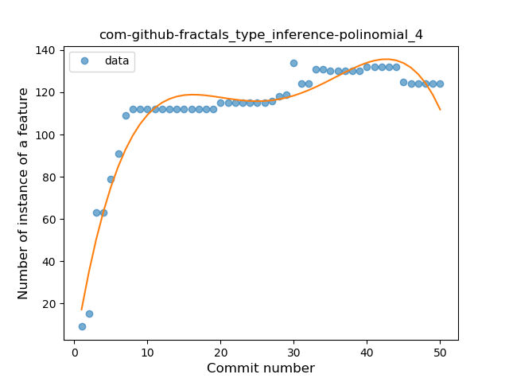
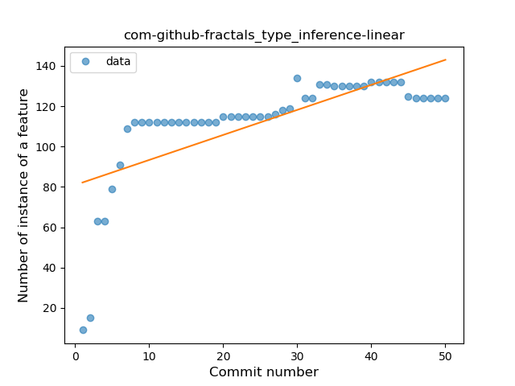
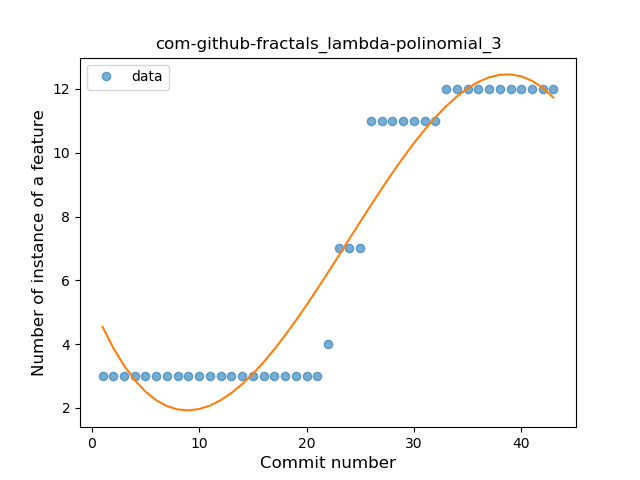
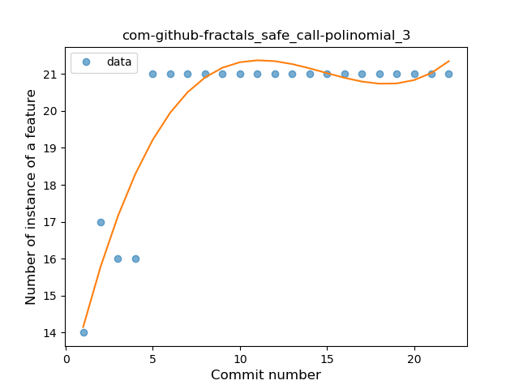
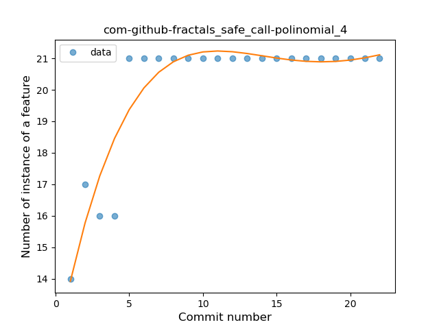
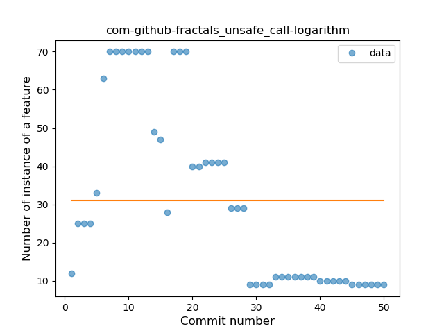

## com-github-fractals
----
#### Metrics provided by Detekt
* Number of lines of code 1620
* Number of Kotlin files: 12
* Cyclomatic complexity: 209
* Cyclomatic complexity by thousands of lines: 274 

----
**6** features analyzed

*	<a href="#type_inference">Type Inference</a> 
*	<a href="#lambda">Lambda</a> 
*	<a href="#safe_call">Safe Call</a> 
*	<a href="#unsafe_call">Unsafe Call</a> 
*	<a href="#companion_object">Companion Object</a> 
*	<a href="#func_with_default_value">Function with Default Value</a> 

### <a name="type_inference">Type Inference</a>
----
#### Functions
* **Instability - Polinomial 4:** 
    * **R_Squared:** 0.93047924
* **Sudden Rise Plateau - Logarithm:** 
    * **R_Squared:** 0.82496323
* **Instability - Polinomial 3:** )
    * **R_Squared:** 0.80043628
* **Constant Rise - Linear:** 
    * **R_Squared:** 0.49383811

**Plots** :chart_with_upwards_trend:
-----

### <a name="lambda">Lambda</a>
----
#### Functions
* **Instability - Polinomial 3:** )
    * **R_Squared:** 0.92995174
* **Sudden Rise - Exponential:** 
    * **R_Squared:** 0.83987646
* **Constant Rise - Linear:** 
    * **R_Squared:** 0.82562066
* **Sudden Rise Plateau - Logarithm:** 
    * **R_Squared:** 0.50544851

**Plots** :chart_with_upwards_trend:
-----

### <a name="safe_call">Safe Call</a>
----
#### Functions
* **Instability - Polinomial 3:** )
    * **R_Squared:** 0.85833956
* **Instability - Polinomial 4:** 
    * **R_Squared:** 0.86184712
* **Sudden Rise Plateau - Logarithm:** 
    * **R_Squared:** 0.71623354
* **Constant Rise - Linear:** 
    * **R_Squared:** 0.43614734

**Plots** :chart_with_upwards_trend:
-----

### <a name="unsafe_call">Unsafe Call</a>
----
#### Functions
* **Instability - Polinomial 4:** 
    * **R_Squared:** 0.86556076
* **Instability - Polinomial 3:** )
    * **R_Squared:** 0.80619503
* **Plateau Gradual Decline - Sigmoid:** 
    * **R_Squared:** 0.68766853
* **Constant Decline - Linear:** 
    * **R_Squared:** 0.49696436
* **Sudden Rise Plateau - Logarithm:** 
    * **R_Squared:** -0.0

**Plots** :chart_with_upwards_trend:
-----

### <a name="companion_object">Companion Object</a>
----
#### Functions
* **Sudden Rise - Exponential:** 
    * **R_Squared:** 0.88402299
* **Instability - Polinomial 3:** )
    * **R_Squared:** 0.87273513
* **Constant Rise - Linear:** 
    * **R_Squared:** 0.61668158
* **Sudden Rise Plateau - Logarithm:** 
    * **R_Squared:** 0.28007327

**Plots** :chart_with_upwards_trend:
-----

### <a name="func_with_default_value">Function with Default Value</a>
----
#### Functions
* **Sudden Rise - Exponential:** 
    * **R_Squared:** 0.65646963
* **Constant Rise - Linear:** 
    * **R_Squared:** 0.64614851
* **Sudden Rise Plateau - Logarithm:** 
    * **R_Squared:** 0.57595129
* **Plateau Sudden Rise - Binary Sigmoid:** 
    * **R_Squared:** 0.33834173

**Plots** :chart_with_upwards_trend:
-----

