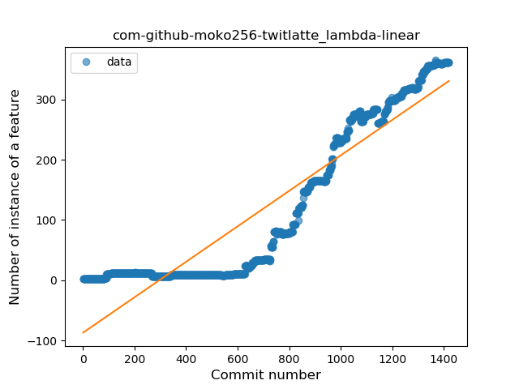
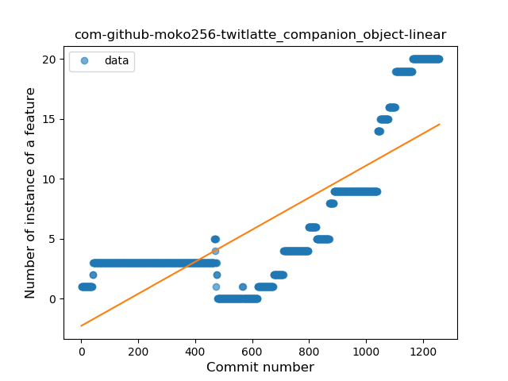
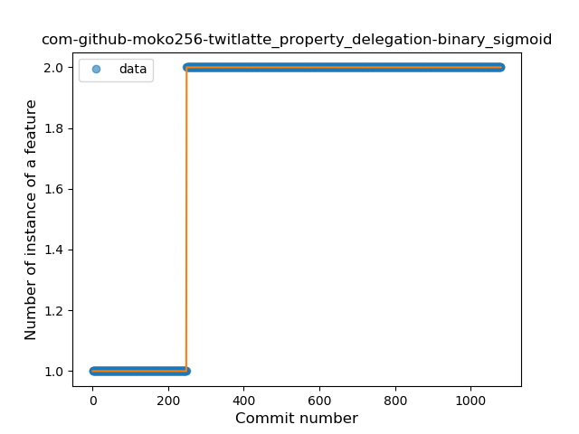
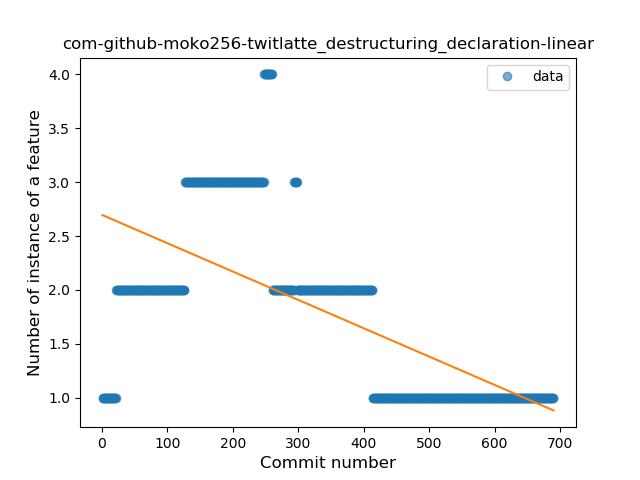
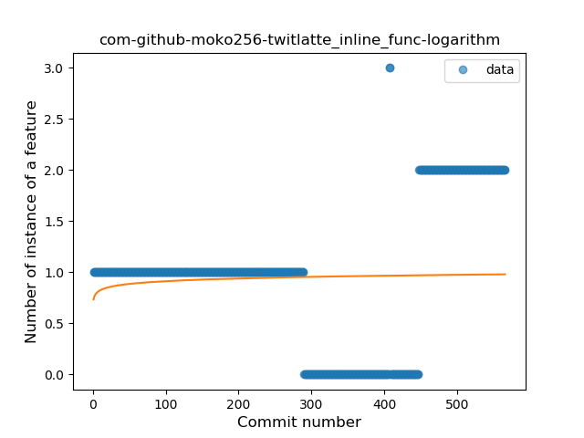
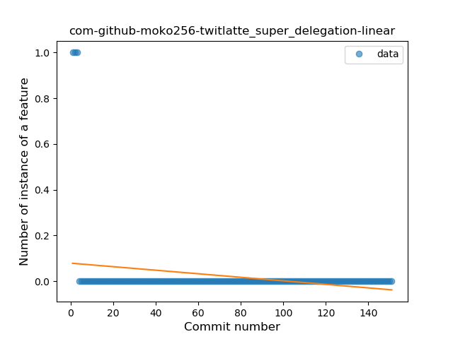

## com-github-moko256-twitlatte
----
#### Metrics provided by Detekt
* Number of lines of code 12183
* Number of Kotlin files: 155
* Cyclomatic complexity: 1309
* Cyclomatic complexity by thousands of lines: 249 

----
**19** features analyzed

*	<a href="#type_inference">Type Inference</a> 
*	<a href="#lambda">Lambda</a> 
*	<a href="#safe_call">Safe Call</a> 
*	<a href="#when_expr">When expression</a> 
*	<a href="#unsafe_call">Unsafe Call</a> 
*	<a href="#companion_object">Companion Object</a> 
*	<a href="#string_template">String Template</a> 
*	<a href="#func_with_default_value">Function with Default Value</a> 
*	<a href="#singleton">Singleton</a> 
*	<a href="#range_expr">Range Expression</a> 
*	<a href="#smart_cast">Smart Cast</a> 
*	<a href="#data_class">Data Class</a> 
*	<a href="#func_call_with_named_arg">Function call with Named Argument</a> 
*	<a href="#extension_function">Extension Function</a> 
*	<a href="#property_delegation">Property Delegation</a> 
*	<a href="#destructuring_declaration">Destructuring Declaration</a> 
*	<a href="#inline_func">Inline Function</a> 
*	<a href="#overloaded_op">Overloaded Operator</a> 
*	<a href="#super_delegation">Super Delegation</a> 

### <a name="type_inference">Type Inference</a>
----
#### Functions
* **Sudden Rise - Exponential:** 
    * **R_Squared:** 0.93817639
* **Constant Rise - Linear:** 
    * **R_Squared:** 0.9006163
* **Sudden Rise Plateau - Logarithm:** 
    * **R_Squared:** 0.23372538
* **Plateau Sudden Rise - Binary Sigmoid:** 
    * **R_Squared:** 0.17690773

**Plots** :chart_with_upwards_trend:
-----

### <a name="lambda">Lambda</a>
----
#### Functions
* **Sudden Rise - Exponential:** 
    * **R_Squared:** 0.94116983
* **Constant Rise - Linear:** 
    * **R_Squared:** 0.85667149
* **Sudden Rise Plateau - Logarithm:** 
    * **R_Squared:** 0.18618509
* **Plateau Gradual Rise - Sigmoid:** 
    * **R_Squared:** 0.08157997

**Plots** :chart_with_upwards_trend:
-----

### <a name="safe_call">Safe Call</a>
----
#### Functions
* **Sudden Rise - Exponential:** 
    * **R_Squared:** 0.9328306
* **Constant Rise - Linear:** 
    * **R_Squared:** 0.77239885
* **Sudden Rise Plateau - Logarithm:** 
    * **R_Squared:** 0.17612972
* **Plateau Sudden Rise - Binary Sigmoid:** 
    * **R_Squared:** 0.02541486

**Plots** :chart_with_upwards_trend:
-----

### <a name="when_expr">When expression</a>
----
#### Functions
* **Plateau Gradual Rise - Sigmoid:** 
    * **R_Squared:** 0.97524136
* **Sudden Rise - Exponential:** 
    * **R_Squared:** 0.89087444
* **Constant Rise - Linear:** 
    * **R_Squared:** 0.87603642
* **Sudden Rise Plateau - Logarithm:** 
    * **R_Squared:** 0.30597352

**Plots** :chart_with_upwards_trend:
-----

### <a name="unsafe_call">Unsafe Call</a>
----
#### Functions
* **Constant Rise - Linear:** 
    * **R_Squared:** 0.73851513
* **Sudden Rise Plateau - Logarithm:** 
    * **R_Squared:** 0.21817257

**Plots** :chart_with_upwards_trend:
-----

### <a name="companion_object">Companion Object</a>
----
#### Functions
* **Plateau Gradual Rise - Sigmoid:** 
    * **R_Squared:** 0.95009833
* **Sudden Rise - Exponential:** 
    * **R_Squared:** 0.91225531
* **Constant Rise - Linear:** 
    * **R_Squared:** 0.61773324
* **Sudden Rise Plateau - Logarithm:** 
    * **R_Squared:** 0.14768937

**Plots** :chart_with_upwards_trend:
-----

### <a name="string_template">String Template</a>
----
#### Functions
* **Constant Rise - Linear:** 
    * **R_Squared:** 0.75129134
* **Sudden Rise Plateau - Logarithm:** 
    * **R_Squared:** 0.26323761

**Plots** :chart_with_upwards_trend:
-----

### <a name="func_with_default_value">Function with Default Value</a>
----
#### Functions
* **Plateau Gradual Rise - Sigmoid:** 
    * **R_Squared:** 0.97715051
* **Constant Rise - Linear:** 
    * **R_Squared:** 0.89410181
* **Sudden Rise - Exponential:** 
    * **R_Squared:** 0.9010209
* **Sudden Rise Plateau - Logarithm:** 
    * **R_Squared:** 0.27122031

**Plots** :chart_with_upwards_trend:
-----

### <a name="singleton">Singleton</a>
----
#### Functions
* **Sudden Rise - Exponential:** 
    * **R_Squared:** 0.43810448
* **Constant Rise - Linear:** 
    * **R_Squared:** 0.09148369
* **Sudden Rise Plateau - Logarithm:** 
    * **R_Squared:** 0.02665234
* **Plateau Sudden Rise - Binary Sigmoid:** 
    * **R_Squared:** 0.02249594

**Plots** :chart_with_upwards_trend:
-----

### <a name="range_expr">Range Expression</a>
----
#### Functions
* **Constant Decline - Linear:** 
    * **R_Squared:** 0.00060497
* **Sudden Decline - Exponential:** 
    * **R_Squared:** 0.00802219
* **Sudden Rise Plateau - Logarithm:** 
    * **R_Squared:** -0.0
* **Plateau Gradual Rise - Sigmoid:** 
    * **R_Squared:** 0.00920833

**Plots** :chart_with_upwards_trend:
-----

### <a name="smart_cast">Smart Cast</a>
----
#### Functions
* **Constant Rise - Linear:** 
    * **R_Squared:** 0.82010116
* **Sudden Rise Plateau - Logarithm:** 
    * **R_Squared:** 0.27488186

**Plots** :chart_with_upwards_trend:
-----

### <a name="data_class">Data Class</a>
----
#### Functions
* **Plateau Gradual Rise - Sigmoid:** 
    * **R_Squared:** 0.98367306
* **Sudden Rise - Exponential:** 
    * **R_Squared:** 0.94070606
* **Constant Rise - Linear:** 
    * **R_Squared:** 0.90397017
* **Sudden Rise Plateau - Logarithm:** 
    * **R_Squared:** 0.36579079

**Plots** :chart_with_upwards_trend:
-----

### <a name="func_call_with_named_arg">Function call with Named Argument</a>
----
#### Functions
* **Constant Rise - Linear:** 
    * **R_Squared:** 0.85230054
* **Sudden Rise - Exponential:** 
    * **R_Squared:** 0.85310872
* **Sudden Rise Plateau - Logarithm:** 
    * **R_Squared:** 0.24403352

**Plots** :chart_with_upwards_trend:
-----

### <a name="extension_function">Extension Function</a>
----
#### Functions
* **Constant Rise - Linear:** 
    * **R_Squared:** 0.94061346
* **Sudden Rise Plateau - Logarithm:** 
    * **R_Squared:** 0.43872411

**Plots** :chart_with_upwards_trend:
-----

### <a name="property_delegation">Property Delegation</a>
----
#### Functions
* **Plateau Sudden Rise - Binary Sigmoid:** 
    * **R_Squared:** 1.0
* **Sudden Rise Plateau - Logarithm:** 
    * **R_Squared:** 0.6411215
* **Constant Rise - Linear:** 
    * **R_Squared:** 0.53104515

**Plots** :chart_with_upwards_trend:
-----

### <a name="destructuring_declaration">Destructuring Declaration</a>
----
#### Functions
* **Constant Decline - Linear:** 
    * **R_Squared:** 0.42521245
* **Plateau Sudden Rise - Binary Sigmoid:** 
    * **R_Squared:** 0.03021282
* **Sudden Rise Plateau - Logarithm:** 
    * **R_Squared:** -0.0

**Plots** :chart_with_upwards_trend:
-----

### <a name="inline_func">Inline Function</a>
----
#### Functions
* **Sudden Rise - Exponential:** 
    * **R_Squared:** 0.34706198
* **Constant Rise - Linear:** 
    * **R_Squared:** 0.04556119
* **Sudden Rise Plateau - Logarithm:** 
    * **R_Squared:** 0.00288302

**Plots** :chart_with_upwards_trend:
-----

### <a name="overloaded_op">Overloaded Operator</a>
----
#### Functions
* **Plateau Sudden Decline - Binary Sigmoid:** 
    * **R_Squared:** 1.0
* **Constant Decline - Linear:** 
    * **R_Squared:** 0.38671989
* **Sudden Rise Plateau - Logarithm:** 
    * **R_Squared:** -0.0

**Plots** :chart_with_upwards_trend:
-----

### <a name="super_delegation">Super Delegation</a>
----
#### Functions
* **Sudden Decline - Exponential:** 
    * **R_Squared:** 0.82375148
* **Constant Decline - Linear:** 
    * **R_Squared:** 0.05842105
* **Sudden Rise Plateau - Logarithm:** 
    * **R_Squared:** -0.0

**Plots** :chart_with_upwards_trend:
-----

