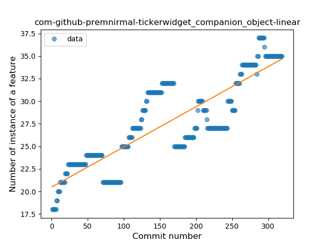
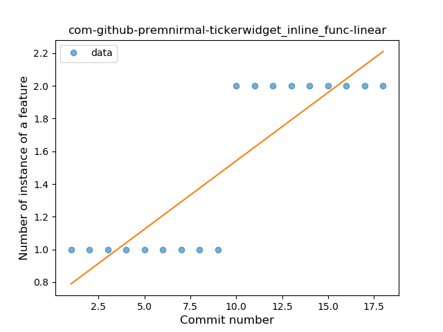
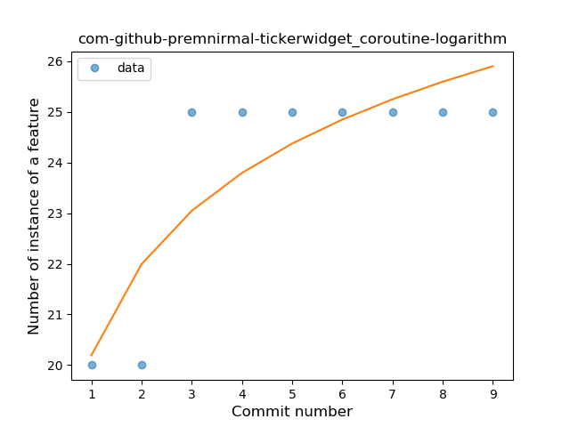

## com-github-premnirmal-tickerwidget
----
#### Metrics provided by Detekt
* Number of lines of code 8300
* Number of Kotlin files: 113
* Cyclomatic complexity: 1105
* Cyclomatic complexity by thousands of lines: 243 

----
**20** features analyzed

*	<a href="#type_inference">Type Inference</a> 
*	<a href="#lambda">Lambda</a> 
*	<a href="#safe_call">Safe Call</a> 
*	<a href="#when_expr">When expression</a> 
*	<a href="#unsafe_call">Unsafe Call</a> 
*	<a href="#companion_object">Companion Object</a> 
*	<a href="#string_template">String Template</a> 
*	<a href="#func_with_default_value">Function with Default Value</a> 
*	<a href="#singleton">Singleton</a> 
*	<a href="#range_expr">Range Expression</a> 
*	<a href="#smart_cast">Smart Cast</a> 
*	<a href="#data_class">Data Class</a> 
*	<a href="#func_call_with_named_arg">Function call with Named Argument</a> 
*	<a href="#extension_function">Extension Function</a> 
*	<a href="#property_delegation">Property Delegation</a> 
*	<a href="#destructuring_declaration">Destructuring Declaration</a> 
*	<a href="#inline_func">Inline Function</a> 
*	<a href="#overloaded_op">Overloaded Operator</a> 
*	<a href="#coroutine">Coroutine</a> 
*	<a href="#sealed_class">Sealed Class</a> 

### <a name="type_inference">Type Inference</a>
----
#### Functions
* **Sudden Rise - Exponential:** 
    * **R_Squared:** 0.96647644
* **Constant Rise - Linear:** 
    * **R_Squared:** 0.95025701
* **Sudden Rise Plateau - Logarithm:** 
    * **R_Squared:** 0.67298662

**Plots** :chart_with_upwards_trend:
-----

### <a name="lambda">Lambda</a>
----
#### Functions
* **Sudden Rise - Exponential:** 
    * **R_Squared:** 0.97967892
* **Constant Rise - Linear:** 
    * **R_Squared:** 0.84811327
* **Sudden Rise Plateau - Logarithm:** 
    * **R_Squared:** 0.47008692

**Plots** :chart_with_upwards_trend:
-----

### <a name="safe_call">Safe Call</a>
----
#### Functions
* **Plateau Gradual Rise - Sigmoid:** 
    * **R_Squared:** 0.91657002
* **Sudden Rise - Exponential:** 
    * **R_Squared:** 0.73834518
* **Constant Rise - Linear:** 
    * **R_Squared:** 0.60010211
* **Sudden Rise Plateau - Logarithm:** 
    * **R_Squared:** 0.2427714

**Plots** :chart_with_upwards_trend:
-----

### <a name="when_expr">When expression</a>
----
#### Functions
* **Plateau Gradual Rise - Sigmoid:** 
    * **R_Squared:** 0.95785095
* **Sudden Rise - Exponential:** 
    * **R_Squared:** 0.85898526
* **Constant Rise - Linear:** 
    * **R_Squared:** 0.6154843
* **Sudden Rise Plateau - Logarithm:** 
    * **R_Squared:** 0.32122154

**Plots** :chart_with_upwards_trend:
-----

### <a name="unsafe_call">Unsafe Call</a>
----
#### Functions
* **Sudden Rise - Exponential:** 
    * **R_Squared:** 0.55565862
* **Constant Rise - Linear:** 
    * **R_Squared:** 0.26832449
* **Sudden Rise Plateau - Logarithm:** 
    * **R_Squared:** 0.10421644

**Plots** :chart_with_upwards_trend:
-----

### <a name="companion_object">Companion Object</a>
----
#### Functions
* **Constant Rise - Linear:** 
    * **R_Squared:** 0.72201137
* **Sudden Rise - Exponential:** 
    * **R_Squared:** 0.7231144
* **Sudden Rise Plateau - Logarithm:** 
    * **R_Squared:** 0.5977381

**Plots** :chart_with_upwards_trend:
-----

### <a name="string_template">String Template</a>
----
#### Functions
* **Sudden Decline - Exponential:** 
    * **R_Squared:** 0.05293199
* **Constant Decline - Linear:** 
    * **R_Squared:** 0.01442903
* **Sudden Rise Plateau - Logarithm:** 
    * **R_Squared:** -0.0

**Plots** :chart_with_upwards_trend:
-----

### <a name="func_with_default_value">Function with Default Value</a>
----
#### Functions
* **Sudden Rise - Exponential:** 
    * **R_Squared:** 0.89721437
* **Constant Rise - Linear:** 
    * **R_Squared:** 0.84263591
* **Sudden Rise Plateau - Logarithm:** 
    * **R_Squared:** 0.28830644

**Plots** :chart_with_upwards_trend:
-----

### <a name="singleton">Singleton</a>
----
#### Functions
* **Plateau Gradual Rise - Sigmoid:** 
    * **R_Squared:** 0.88712915
* **Constant Rise - Linear:** 
    * **R_Squared:** 0.5714713
* **Sudden Rise Plateau - Logarithm:** 
    * **R_Squared:** 0.5486021

**Plots** :chart_with_upwards_trend:
-----

### <a name="range_expr">Range Expression</a>
----
#### Functions
* **Plateau Sudden Rise - Binary Sigmoid:** 
    * **R_Squared:** 0.7314753
* **Constant Rise - Linear:** 
    * **R_Squared:** 0.49937572
* **Sudden Rise Plateau - Logarithm:** 
    * **R_Squared:** 0.4058928

**Plots** :chart_with_upwards_trend:
-----

### <a name="smart_cast">Smart Cast</a>
----
#### Functions
* **Plateau Gradual Rise - Sigmoid:** 
    * **R_Squared:** 0.36043518
* **Sudden Rise Plateau - Logarithm:** 
    * **R_Squared:** 0.07987101
* **Constant Rise - Linear:** 
    * **R_Squared:** 0.00229519

**Plots** :chart_with_upwards_trend:
-----

### <a name="data_class">Data Class</a>
----
#### Functions
* **Constant Rise - Linear:** 
    * **R_Squared:** 0.86572205
* **Sudden Rise Plateau - Logarithm:** 
    * **R_Squared:** 0.7271006
* **Plateau Gradual Rise - Sigmoid:** 
    * **R_Squared:** 0.39311108

**Plots** :chart_with_upwards_trend:
-----

### <a name="func_call_with_named_arg">Function call with Named Argument</a>
----
#### Functions
* **Sudden Rise - Exponential:** 
    * **R_Squared:** 0.82452201
* **Constant Rise - Linear:** 
    * **R_Squared:** 0.20704552
* **Sudden Rise Plateau - Logarithm:** 
    * **R_Squared:** 0.10402327

**Plots** :chart_with_upwards_trend:
-----

### <a name="extension_function">Extension Function</a>
----
#### Functions
* **Constant Decline - Linear:** 
    * **R_Squared:** 0.00904344
* **Sudden Rise Plateau - Logarithm:** 
    * **R_Squared:** 0.01028965

**Plots** :chart_with_upwards_trend:
-----

### <a name="property_delegation">Property Delegation</a>
----
#### Functions
* **Plateau Gradual Rise - Sigmoid:** 
    * **R_Squared:** 0.89870437
* **Sudden Rise - Exponential:** 
    * **R_Squared:** 0.87909446
* **Constant Rise - Linear:** 
    * **R_Squared:** 0.73512764
* **Sudden Rise Plateau - Logarithm:** 
    * **R_Squared:** 0.31243625

**Plots** :chart_with_upwards_trend:
-----

### <a name="destructuring_declaration">Destructuring Declaration</a>
----
#### Functions
* **Plateau Gradual Decline - Sigmoid:** 
    * **R_Squared:** 0.83544346
* **Constant Decline - Linear:** 
    * **R_Squared:** 0.74050328
* **Sudden Rise Plateau - Logarithm:** 
    * **R_Squared:** -0.0

**Plots** :chart_with_upwards_trend:
-----

### <a name="inline_func">Inline Function</a>
----
#### Functions
* **Plateau Sudden Rise - Binary Sigmoid:** 
    * **R_Squared:** 1.0
* **Instability - Polinomial 3:** )
    * **R_Squared:** 0.86377709
* **Constant Rise - Linear:** 
    * **R_Squared:** 0.75232198
* **Sudden Rise Plateau - Logarithm:** 
    * **R_Squared:** 0.59195413

**Plots** :chart_with_upwards_trend:
-----

### <a name="overloaded_op">Overloaded Operator</a>
----
#### Functions
* **Constant Rise - Linear:** 
    * **R_Squared:** 0.13640387
* **Sudden Rise Plateau - Logarithm:** 
    * **R_Squared:** 0.13036647

**Plots** :chart_with_upwards_trend:
-----

### <a name="coroutine">Coroutine</a>
----
#### Functions
* **Plateau Sudden Rise - Binary Sigmoid:** 
    * **R_Squared:** 1.0
* **Instability - Polinomial 4:** 
    * **R_Squared:** 0.85664336
* **Sudden Rise Plateau - Logarithm:** 
    * **R_Squared:** 0.71914264
* **Constant Rise - Linear:** 
    * **R_Squared:** 0.525

**Plots** :chart_with_upwards_trend:
-----

### <a name="sealed_class">Sealed Class</a>
----
#### Functions
* **Plateau Sudden Rise - Binary Sigmoid:** 
    * **R_Squared:** 1.0
* **Sudden Rise - Exponential:** 
    * **R_Squared:** 0.75464127
* **Constant Rise - Linear:** 
    * **R_Squared:** 0.71022727
* **Sudden Rise Plateau - Logarithm:** 
    * **R_Squared:** 0.42411791

**Plots** :chart_with_upwards_trend:
-----

