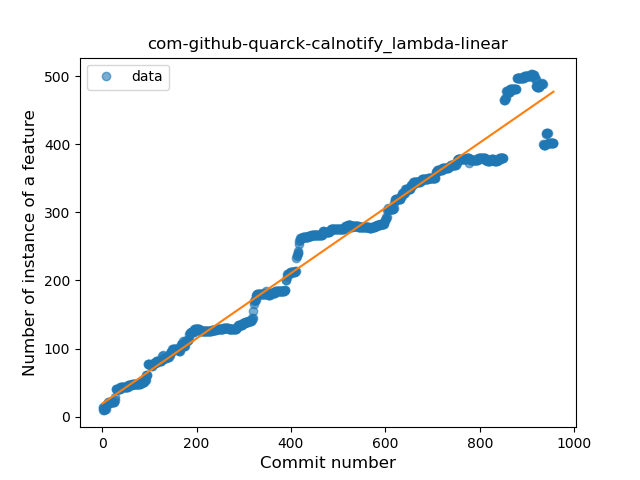
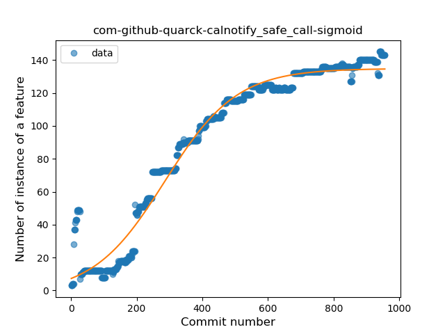
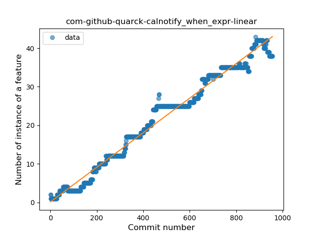
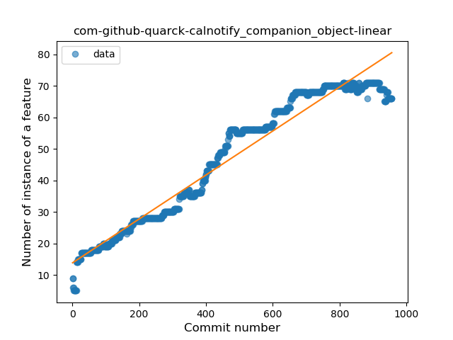
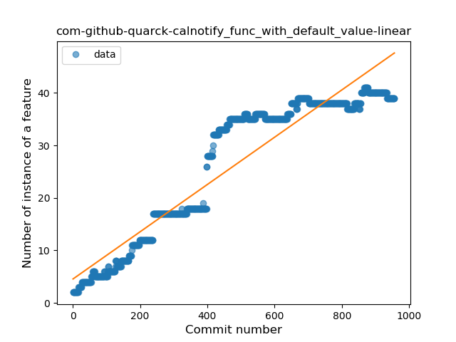
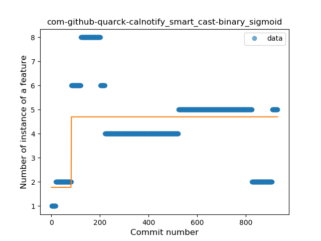
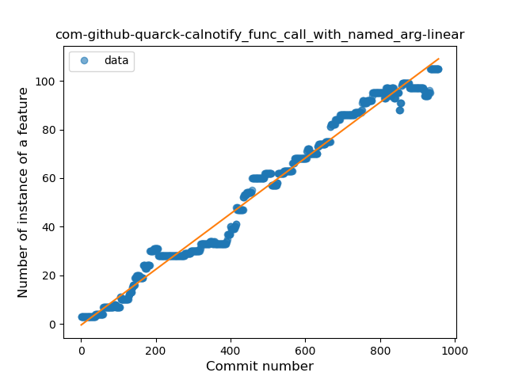
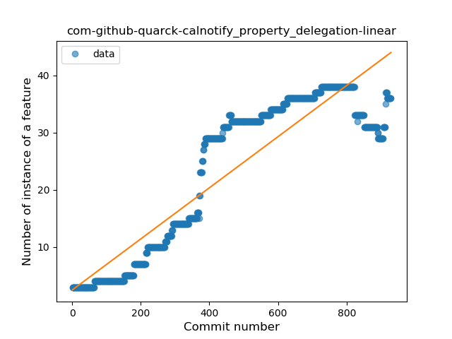
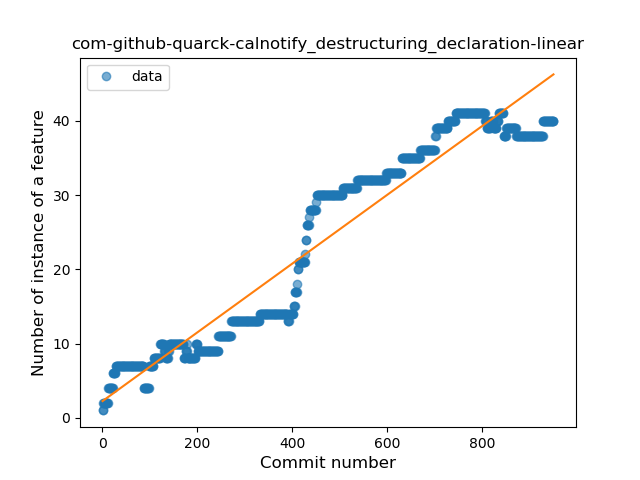

## com-github-quarck-calnotify
----
#### Metrics provided by Detekt
* Number of lines of code 24814
* Number of Kotlin files: 129
* Cyclomatic complexity: 2791
* Cyclomatic complexity by thousands of lines: 212 

----
**18** features analyzed

*	<a href="#type_inference">Type Inference</a> 
*	<a href="#lambda">Lambda</a> 
*	<a href="#safe_call">Safe Call</a> 
*	<a href="#when_expr">When expression</a> 
*	<a href="#unsafe_call">Unsafe Call</a> 
*	<a href="#companion_object">Companion Object</a> 
*	<a href="#string_template">String Template</a> 
*	<a href="#func_with_default_value">Function with Default Value</a> 
*	<a href="#singleton">Singleton</a> 
*	<a href="#range_expr">Range Expression</a> 
*	<a href="#smart_cast">Smart Cast</a> 
*	<a href="#data_class">Data Class</a> 
*	<a href="#func_call_with_named_arg">Function call with Named Argument</a> 
*	<a href="#extension_function">Extension Function</a> 
*	<a href="#property_delegation">Property Delegation</a> 
*	<a href="#destructuring_declaration">Destructuring Declaration</a> 
*	<a href="#inline_func">Inline Function</a> 
*	<a href="#overloaded_op">Overloaded Operator</a> 

### <a name="type_inference">Type Inference</a>
----
#### Functions
* **Constant Rise - Linear:** 
    * **R_Squared:** 0.96231495
* **Sudden Rise Plateau - Logarithm:** 
    * **R_Squared:** 0.46888271
* **Plateau Sudden Rise - Binary Sigmoid:** 
    * **R_Squared:** 0.01866917

**Plots** :chart_with_upwards_trend:
-----

### <a name="lambda">Lambda</a>
----
#### Functions
* **Constant Rise - Linear:** 
    * **R_Squared:** 0.97058938
* **Plateau Sudden Rise - Binary Sigmoid:** 
    * **R_Squared:** 0.69985767
* **Sudden Rise Plateau - Logarithm:** 
    * **R_Squared:** 0.44848547

**Plots** :chart_with_upwards_trend:
-----

### <a name="safe_call">Safe Call</a>
----
#### Functions
* **Plateau Gradual Rise - Sigmoid:** 
    * **R_Squared:** 0.96955443
* **Constant Rise - Linear:** 
    * **R_Squared:** 0.87311572
* **Sudden Rise Plateau - Logarithm:** 
    * **R_Squared:** 0.49532392

**Plots** :chart_with_upwards_trend:
-----

### <a name="when_expr">When expression</a>
----
#### Functions
* **Constant Rise - Linear:** 
    * **R_Squared:** 0.9805774
* **Sudden Rise Plateau - Logarithm:** 
    * **R_Squared:** 0.42961867
* **Plateau Sudden Rise - Binary Sigmoid:** 
    * **R_Squared:** 0.06316517

**Plots** :chart_with_upwards_trend:
-----

### <a name="unsafe_call">Unsafe Call</a>
----
#### Functions
* **Constant Rise - Linear:** 
    * **R_Squared:** 0.01138324
* **Sudden Rise - Exponential:** 
    * **R_Squared:** 0.01134621
* **Sudden Rise Plateau - Logarithm:** 
    * **R_Squared:** 0.0

**Plots** :chart_with_upwards_trend:
-----

### <a name="companion_object">Companion Object</a>
----
#### Functions
* **Constant Rise - Linear:** 
    * **R_Squared:** 0.94782818
* **Sudden Rise Plateau - Logarithm:** 
    * **R_Squared:** 0.5544712
* **Plateau Sudden Rise - Binary Sigmoid:** 
    * **R_Squared:** 0.04580521

**Plots** :chart_with_upwards_trend:
-----

### <a name="string_template">String Template</a>
----
#### Functions
* **Constant Rise - Linear:** 
    * **R_Squared:** 0.95765966
* **Plateau Sudden Rise - Binary Sigmoid:** 
    * **R_Squared:** 0.47323631
* **Sudden Rise Plateau - Logarithm:** 
    * **R_Squared:** 0.45542979

**Plots** :chart_with_upwards_trend:
-----

### <a name="func_with_default_value">Function with Default Value</a>
----
#### Functions
* **Constant Rise - Linear:** 
    * **R_Squared:** 0.88692546
* **Sudden Rise Plateau - Logarithm:** 
    * **R_Squared:** 0.48584993

**Plots** :chart_with_upwards_trend:
-----

### <a name="singleton">Singleton</a>
----
#### Functions
* **Sudden Rise Plateau - Logarithm:** 
    * **R_Squared:** 0.82143076
* **Constant Rise - Linear:** 
    * **R_Squared:** 0.76993409

**Plots** :chart_with_upwards_trend:
-----

### <a name="range_expr">Range Expression</a>
----
#### Functions
* **Sudden Rise - Exponential:** 
    * **R_Squared:** 0.93775631
* **Constant Rise - Linear:** 
    * **R_Squared:** 0.80091637
* **Sudden Rise Plateau - Logarithm:** 
    * **R_Squared:** 0.21172377

**Plots** :chart_with_upwards_trend:
-----

### <a name="smart_cast">Smart Cast</a>
----
#### Functions
* **Plateau Sudden Rise - Binary Sigmoid:** 
    * **R_Squared:** 0.26546712
* **Constant Decline - Linear:** 
    * **R_Squared:** 0.01601547
* **Sudden Rise Plateau - Logarithm:** 
    * **R_Squared:** 0.01374898

**Plots** :chart_with_upwards_trend:
-----

### <a name="data_class">Data Class</a>
----
#### Functions
* **Constant Rise - Linear:** 
    * **R_Squared:** 0.96648975
* **Sudden Rise Plateau - Logarithm:** 
    * **R_Squared:** 0.45295883

**Plots** :chart_with_upwards_trend:
-----

### <a name="func_call_with_named_arg">Function call with Named Argument</a>
----
#### Functions
* **Constant Rise - Linear:** 
    * **R_Squared:** 0.98099929
* **Plateau Gradual Rise - Sigmoid:** 
    * **R_Squared:** 0.98525242
* **Sudden Rise Plateau - Logarithm:** 
    * **R_Squared:** 0.42049956

**Plots** :chart_with_upwards_trend:
-----

### <a name="extension_function">Extension Function</a>
----
#### Functions
* **Sudden Rise - Exponential:** 
    * **R_Squared:** 0.86991743
* **Constant Rise - Linear:** 
    * **R_Squared:** 0.85282906
* **Sudden Rise Plateau - Logarithm:** 
    * **R_Squared:** 0.58373405

**Plots** :chart_with_upwards_trend:
-----

### <a name="property_delegation">Property Delegation</a>
----
#### Functions
* **Constant Rise - Linear:** 
    * **R_Squared:** 0.82610955
* **Sudden Rise Plateau - Logarithm:** 
    * **R_Squared:** 0.42276851

**Plots** :chart_with_upwards_trend:
-----

### <a name="destructuring_declaration">Destructuring Declaration</a>
----
#### Functions
* **Constant Rise - Linear:** 
    * **R_Squared:** 0.92253838
* **Sudden Rise Plateau - Logarithm:** 
    * **R_Squared:** 0.4290555
* **Plateau Sudden Rise - Binary Sigmoid:** 
    * **R_Squared:** 0.10322057

**Plots** :chart_with_upwards_trend:
-----

### <a name="inline_func">Inline Function</a>
----
#### Functions
* **Plateau Sudden Rise - Binary Sigmoid:** 
    * **R_Squared:** 0.71006174
* **Sudden Rise Plateau - Logarithm:** 
    * **R_Squared:** 0.29234222
* **Constant Rise - Linear:** 
    * **R_Squared:** 0.05249804

**Plots** :chart_with_upwards_trend:
-----

### <a name="overloaded_op">Overloaded Operator</a>
----
#### Functions
* **Constant Rise - Linear:** 
    * **R_Squared:** 0.65802159
* **Sudden Rise Plateau - Logarithm:** 
    * **R_Squared:** 0.33322121

**Plots** :chart_with_upwards_trend:
-----

