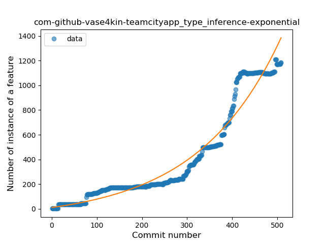
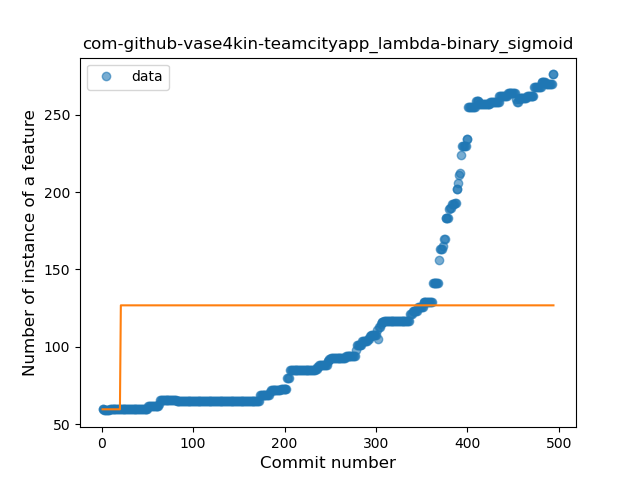

## com-github-vase4kin-teamcityapp
----
#### Metrics provided by Detekt
* Number of lines of code 53633
* Number of Kotlin files: 568
* Cyclomatic complexity: 3765
* Cyclomatic complexity by thousands of lines: 197 

----
**14** features analyzed

*	<a href="#type_inference">Type Inference</a> 
*	<a href="#lambda">Lambda</a> 
*	<a href="#safe_call">Safe Call</a> 
*	<a href="#when_expr">When expression</a> 
*	<a href="#unsafe_call">Unsafe Call</a> 
*	<a href="#companion_object">Companion Object</a> 
*	<a href="#string_template">String Template</a> 
*	<a href="#func_with_default_value">Function with Default Value</a> 
*	<a href="#singleton">Singleton</a> 
*	<a href="#smart_cast">Smart Cast</a> 
*	<a href="#data_class">Data Class</a> 
*	<a href="#func_call_with_named_arg">Function call with Named Argument</a> 
*	<a href="#extension_function">Extension Function</a> 
*	<a href="#overloaded_op">Overloaded Operator</a> 

### <a name="type_inference">Type Inference</a>
----
#### Functions
* **Sudden Rise - Exponential:** 
    * **R_Squared:** 0.94634146
* **Constant Rise - Linear:** 
    * **R_Squared:** 0.83366017
* **Plateau Sudden Rise - Binary Sigmoid:** 
    * **R_Squared:** 0.49296283
* **Sudden Rise Plateau - Logarithm:** 
    * **R_Squared:** 0.24817962

**Plots** :chart_with_upwards_trend:
-----

### <a name="lambda">Lambda</a>
----
#### Functions
* **Sudden Rise - Exponential:** 
    * **R_Squared:** 0.9403327
* **Constant Rise - Linear:** 
    * **R_Squared:** 0.79357935
* **Sudden Rise Plateau - Logarithm:** 
    * **R_Squared:** 0.30904987
* **Plateau Sudden Rise - Binary Sigmoid:** 
    * **R_Squared:** 0.0308304

**Plots** :chart_with_upwards_trend:
-----

### <a name="safe_call">Safe Call</a>
----
#### Functions
* **Sudden Rise - Exponential:** 
    * **R_Squared:** 0.89501922
* **Constant Rise - Linear:** 
    * **R_Squared:** 0.7107468
* **Sudden Rise Plateau - Logarithm:** 
    * **R_Squared:** 0.19567045

**Plots** :chart_with_upwards_trend:
-----

### <a name="when_expr">When expression</a>
----
#### Functions
* **Sudden Rise - Exponential:** 
    * **R_Squared:** 0.95860504
* **Plateau Gradual Rise - Sigmoid:** 
    * **R_Squared:** 0.96107492
* **Constant Rise - Linear:** 
    * **R_Squared:** 0.90977653
* **Sudden Rise Plateau - Logarithm:** 
    * **R_Squared:** 0.33632648

**Plots** :chart_with_upwards_trend:
-----

### <a name="unsafe_call">Unsafe Call</a>
----
#### Functions
* **Sudden Rise - Exponential:** 
    * **R_Squared:** 0.91975263
* **Constant Rise - Linear:** 
    * **R_Squared:** 0.89065747
* **Sudden Rise Plateau - Logarithm:** 
    * **R_Squared:** 0.43312653

**Plots** :chart_with_upwards_trend:
-----

### <a name="companion_object">Companion Object</a>
----
#### Functions
* **Sudden Rise - Exponential:** 
    * **R_Squared:** 0.92924327
* **Constant Rise - Linear:** 
    * **R_Squared:** 0.91711425
* **Sudden Rise Plateau - Logarithm:** 
    * **R_Squared:** 0.43606608
* **Plateau Gradual Rise - Sigmoid:** 
    * **R_Squared:** 0.24910736

**Plots** :chart_with_upwards_trend:
-----

### <a name="string_template">String Template</a>
----
#### Functions
* **Sudden Rise - Exponential:** 
    * **R_Squared:** 0.75326795
* **Constant Rise - Linear:** 
    * **R_Squared:** 0.59994022
* **Sudden Rise Plateau - Logarithm:** 
    * **R_Squared:** 0.20884322

**Plots** :chart_with_upwards_trend:
-----

### <a name="func_with_default_value">Function with Default Value</a>
----
#### Functions
* **Plateau Gradual Rise - Sigmoid:** 
    * **R_Squared:** 0.9855552
* **Sudden Rise - Exponential:** 
    * **R_Squared:** 0.83066891
* **Constant Rise - Linear:** 
    * **R_Squared:** 0.46651068
* **Sudden Rise Plateau - Logarithm:** 
    * **R_Squared:** 0.19554161

**Plots** :chart_with_upwards_trend:
-----

### <a name="singleton">Singleton</a>
----
#### Functions
* **Sudden Rise - Exponential:** 
    * **R_Squared:** 0.86184827
* **Constant Rise - Linear:** 
    * **R_Squared:** 0.17011863
* **Sudden Rise Plateau - Logarithm:** 
    * **R_Squared:** 0.04621704

**Plots** :chart_with_upwards_trend:
-----

### <a name="smart_cast">Smart Cast</a>
----
#### Functions
* **Plateau Gradual Rise - Sigmoid:** 
    * **R_Squared:** 0.95914159
* **Sudden Rise - Exponential:** 
    * **R_Squared:** 0.89590644
* **Constant Rise - Linear:** 
    * **R_Squared:** 0.78450262
* **Sudden Rise Plateau - Logarithm:** 
    * **R_Squared:** 0.25312866

**Plots** :chart_with_upwards_trend:
-----

### <a name="data_class">Data Class</a>
----
#### Functions
* **Plateau Gradual Rise - Sigmoid:** 
    * **R_Squared:** 0.97659375
* **Sudden Rise - Exponential:** 
    * **R_Squared:** 0.91861011
* **Constant Rise - Linear:** 
    * **R_Squared:** 0.85191532
* **Sudden Rise Plateau - Logarithm:** 
    * **R_Squared:** 0.28217968

**Plots** :chart_with_upwards_trend:
-----

### <a name="func_call_with_named_arg">Function call with Named Argument</a>
----
#### Functions
* **Sudden Rise Plateau - Logarithm:** 
    * **R_Squared:** 0.67589312
* **Constant Rise - Linear:** 
    * **R_Squared:** 0.57484848
* **Plateau Gradual Rise - Sigmoid:** 
    * **R_Squared:** 0.35075036

**Plots** :chart_with_upwards_trend:
-----

### <a name="extension_function">Extension Function</a>
----
#### Functions
* **Sudden Rise - Exponential:** 
    * **R_Squared:** 0.64348463
* **Constant Rise - Linear:** 
    * **R_Squared:** 0.58826518
* **Sudden Rise Plateau - Logarithm:** 
    * **R_Squared:** 0.49342695
* **Plateau Sudden Rise - Binary Sigmoid:** 
    * **R_Squared:** 0.29711097

**Plots** :chart_with_upwards_trend:
-----

### <a name="overloaded_op">Overloaded Operator</a>
----
#### Functions
* **Plateau Sudden Decline - Binary Sigmoid:** 
    * **R_Squared:** 1.0
* **Constant Decline - Linear:** 
    * **R_Squared:** 0.02752117
* **Sudden Rise Plateau - Logarithm:** 
    * **R_Squared:** -0.0

**Plots** :chart_with_upwards_trend:
-----

