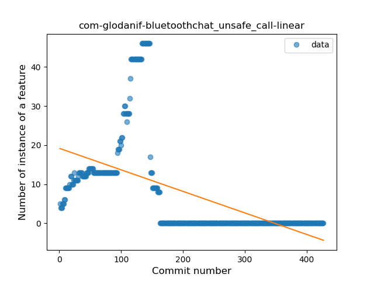
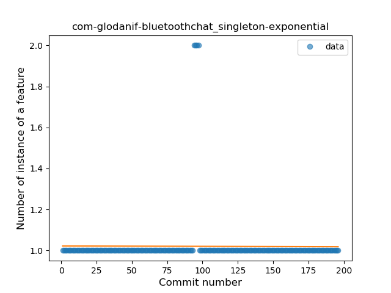
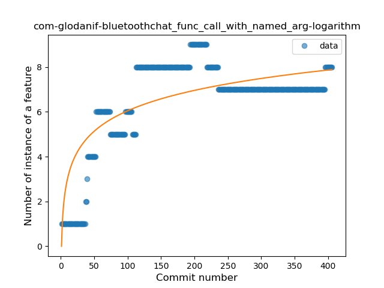
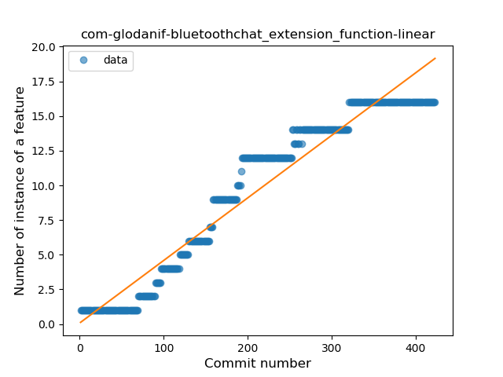
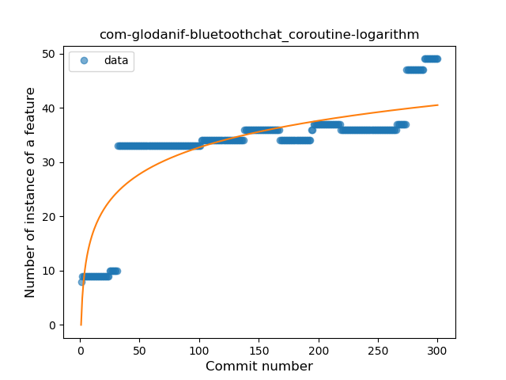

## com-glodanif-bluetoothchat
----
#### Metrics provided by Detekt
* Number of lines of code 10193
* Number of Kotlin files: 121
* Cyclomatic complexity: 1798
* Cyclomatic complexity by thousands of lines: 322 

----
**17** features analyzed

*	<a href="#type_inference">Type Inference</a> 
*	<a href="#lambda">Lambda</a> 
*	<a href="#safe_call">Safe Call</a> 
*	<a href="#when_expr">When expression</a> 
*	<a href="#unsafe_call">Unsafe Call</a> 
*	<a href="#companion_object">Companion Object</a> 
*	<a href="#string_template">String Template</a> 
*	<a href="#func_with_default_value">Function with Default Value</a> 
*	<a href="#singleton">Singleton</a> 
*	<a href="#smart_cast">Smart Cast</a> 
*	<a href="#data_class">Data Class</a> 
*	<a href="#func_call_with_named_arg">Function call with Named Argument</a> 
*	<a href="#extension_function">Extension Function</a> 
*	<a href="#property_delegation">Property Delegation</a> 
*	<a href="#inline_func">Inline Function</a> 
*	<a href="#coroutine">Coroutine</a> 
*	<a href="#infix_func">Infix Function</a> 

### <a name="type_inference">Type Inference</a>
----
#### Functions
* **Constant Rise - Linear:** 
    * **R_Squared:** 0.90393419
* **Sudden Rise Plateau - Logarithm:** 
    * **R_Squared:** 0.69021503
* **Plateau Sudden Rise - Binary Sigmoid:** 
    * **R_Squared:** 0.52447607

**Plots** :chart_with_upwards_trend:
-----

### <a name="lambda">Lambda</a>
----
#### Functions
* **Constant Rise - Linear:** 
    * **R_Squared:** 0.97553355
* **Plateau Sudden Rise - Binary Sigmoid:** 
    * **R_Squared:** 0.55005466
* **Sudden Rise Plateau - Logarithm:** 
    * **R_Squared:** 0.46201468

**Plots** :chart_with_upwards_trend:
-----

### <a name="safe_call">Safe Call</a>
----
#### Functions
* **Sudden Rise Plateau - Logarithm:** 
    * **R_Squared:** 0.80309642
* **Constant Rise - Linear:** 
    * **R_Squared:** 0.7428225
* **Plateau Sudden Rise - Binary Sigmoid:** 
    * **R_Squared:** 0.35999438

**Plots** :chart_with_upwards_trend:
-----

### <a name="when_expr">When expression</a>
----
#### Functions
* **Constant Rise - Linear:** 
    * **R_Squared:** 0.84698132
* **Sudden Rise Plateau - Logarithm:** 
    * **R_Squared:** 0.59995855

**Plots** :chart_with_upwards_trend:
-----

### <a name="unsafe_call">Unsafe Call</a>
----
#### Functions
* **Constant Decline - Linear:** 
    * **R_Squared:** 0.30060395
* **Sudden Rise Plateau - Logarithm:** 
    * **R_Squared:** -0.0

**Plots** :chart_with_upwards_trend:
-----

### <a name="companion_object">Companion Object</a>
----
#### Functions
* **Sudden Rise Plateau - Logarithm:** 
    * **R_Squared:** 0.77887586
* **Constant Rise - Linear:** 
    * **R_Squared:** 0.69541752

**Plots** :chart_with_upwards_trend:
-----

### <a name="string_template">String Template</a>
----
#### Functions
* **Sudden Rise Plateau - Logarithm:** 
    * **R_Squared:** 0.72540442
* **Plateau Sudden Rise - Binary Sigmoid:** 
    * **R_Squared:** 0.66566411
* **Constant Rise - Linear:** 
    * **R_Squared:** 0.52639648

**Plots** :chart_with_upwards_trend:
-----

### <a name="func_with_default_value">Function with Default Value</a>
----
#### Functions
* **Constant Rise - Linear:** 
    * **R_Squared:** 0.88576437
* **Sudden Rise Plateau - Logarithm:** 
    * **R_Squared:** 0.68228407

**Plots** :chart_with_upwards_trend:
-----

### <a name="singleton">Singleton</a>
----
#### Functions
* **Constant Decline - Linear:** 
    * **R_Squared:** 5.857e-05
* **Sudden Decline - Exponential:** 
    * **R_Squared:** 5.74e-05
* **Sudden Rise Plateau - Logarithm:** 
    * **R_Squared:** 0.0015894

**Plots** :chart_with_upwards_trend:
-----

### <a name="smart_cast">Smart Cast</a>
----
#### Functions
* **Sudden Rise Plateau - Logarithm:** 
    * **R_Squared:** 0.79173145
* **Constant Rise - Linear:** 
    * **R_Squared:** 0.55151746

**Plots** :chart_with_upwards_trend:
-----

### <a name="data_class">Data Class</a>
----
#### Functions
* **Constant Rise - Linear:** 
    * **R_Squared:** 0.84367787
* **Sudden Rise Plateau - Logarithm:** 
    * **R_Squared:** 0.55526118
* **Plateau Gradual Rise - Sigmoid:** 
    * **R_Squared:** 0.0

**Plots** :chart_with_upwards_trend:
-----

### <a name="func_call_with_named_arg">Function call with Named Argument</a>
----
#### Functions
* **Sudden Rise Plateau - Logarithm:** 
    * **R_Squared:** 0.6181184
* **Constant Rise - Linear:** 
    * **R_Squared:** 0.34212227

**Plots** :chart_with_upwards_trend:
-----

### <a name="extension_function">Extension Function</a>
----
#### Functions
* **Constant Rise - Linear:** 
    * **R_Squared:** 0.93771291
* **Sudden Rise Plateau - Logarithm:** 
    * **R_Squared:** 0.47371018

**Plots** :chart_with_upwards_trend:
-----

### <a name="property_delegation">Property Delegation</a>
----
#### Functions
* **Constant Rise - Linear:** 
    * **R_Squared:** 0.89770649
* **Sudden Rise - Exponential:** 
    * **R_Squared:** 0.90320654
* **Sudden Rise Plateau - Logarithm:** 
    * **R_Squared:** 0.63927134

**Plots** :chart_with_upwards_trend:
-----

### <a name="inline_func">Inline Function</a>
----
#### Functions
* **Plateau Sudden Rise - Binary Sigmoid:** 
    * **R_Squared:** 0.93150191
* **Constant Rise - Linear:** 
    * **R_Squared:** 0.78368746
* **Sudden Rise - Exponential:** 
    * **R_Squared:** 0.79002404
* **Sudden Rise Plateau - Logarithm:** 
    * **R_Squared:** 0.53193622

**Plots** :chart_with_upwards_trend:
-----

### <a name="coroutine">Coroutine</a>
----
#### Functions
* **Sudden Rise Plateau - Logarithm:** 
    * **R_Squared:** 0.71964046
* **Constant Rise - Linear:** 
    * **R_Squared:** 0.55712432

**Plots** :chart_with_upwards_trend:
-----

### <a name="infix_func">Infix Function</a>
----
#### Functions
* **Sudden Decline - Exponential:** 
    * **R_Squared:** 0.09986302
* **Constant Decline - Linear:** 
    * **R_Squared:** 0.08200007
* **Sudden Rise Plateau - Logarithm:** 
    * **R_Squared:** -0.0
* **Plateau Gradual Rise - Sigmoid:** 
    * **R_Squared:** 0.00578369

**Plots** :chart_with_upwards_trend:
-----

