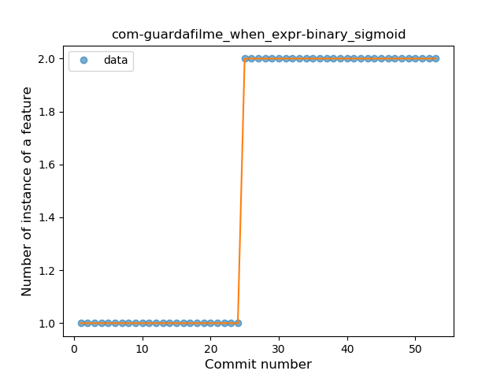
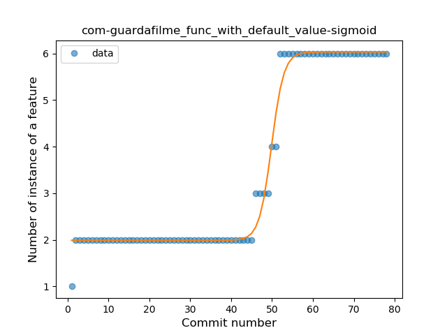
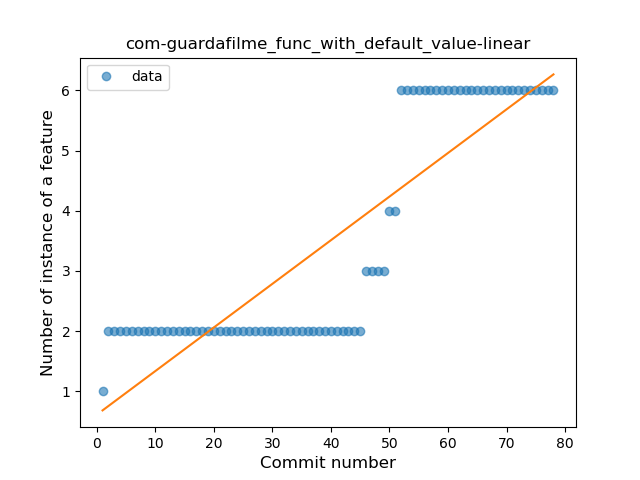
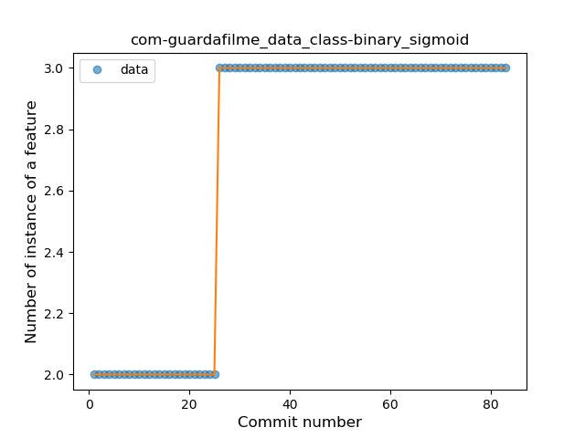
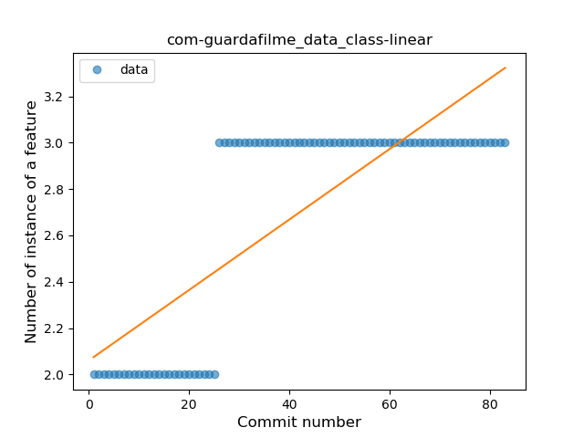
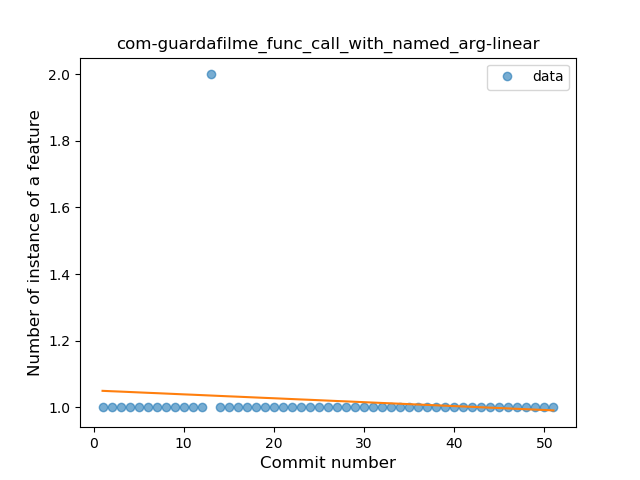

## com-guardafilme
----
#### Metrics provided by Detekt
* Number of lines of code 1929
* Number of Kotlin files: 43
* Cyclomatic complexity: 213
* Cyclomatic complexity by thousands of lines: 239 

----
**9** features analyzed

*	<a href="#type_inference">Type Inference</a> 
*	<a href="#lambda">Lambda</a> 
*	<a href="#safe_call">Safe Call</a> 
*	<a href="#when_expr">When expression</a> 
*	<a href="#companion_object">Companion Object</a> 
*	<a href="#func_with_default_value">Function with Default Value</a> 
*	<a href="#data_class">Data Class</a> 
*	<a href="#func_call_with_named_arg">Function call with Named Argument</a> 
*	<a href="#inline_func">Inline Function</a> 

### <a name="type_inference">Type Inference</a>
----
#### Functions
* **Sudden Rise Plateau - Logarithm:** 
    * **R_Squared:** 0.9208083
* **Constant Rise - Linear:** 
    * **R_Squared:** 0.84759253

**Plots** :chart_with_upwards_trend:
-----

### <a name="lambda">Lambda</a>
----
#### Functions
* **Instability - Polinomial 3:** )
    * **R_Squared:** 0.97138373
* **Constant Rise - Linear:** 
    * **R_Squared:** 0.94845358
* **Plateau Sudden Rise - Binary Sigmoid:** 
    * **R_Squared:** 0.66647222
* **Sudden Rise Plateau - Logarithm:** 
    * **R_Squared:** 0.63059043

**Plots** :chart_with_upwards_trend:
-----

### <a name="safe_call">Safe Call</a>
----
#### Functions
* **Sudden Rise - Exponential:** 
    * **R_Squared:** 0.90465151
* **Constant Rise - Linear:** 
    * **R_Squared:** 0.86562355
* **Sudden Rise Plateau - Logarithm:** 
    * **R_Squared:** 0.38549417

**Plots** :chart_with_upwards_trend:
-----

### <a name="when_expr">When expression</a>
----
#### Functions
* **Plateau Sudden Rise - Binary Sigmoid:** 
    * **R_Squared:** 1.0
* **Instability - Polinomial 3:** )
    * **R_Squared:** 0.85380273
* **Constant Rise - Linear:** 
    * **R_Squared:** 0.74358974
* **Sudden Rise Plateau - Logarithm:** 
    * **R_Squared:** 0.58301895

**Plots** :chart_with_upwards_trend:
-----

### <a name="companion_object">Companion Object</a>
----
#### Functions
* **Sudden Rise Plateau - Logarithm:** 
    * **R_Squared:** 0.8826398
* **Constant Rise - Linear:** 
    * **R_Squared:** 0.66045075

**Plots** :chart_with_upwards_trend:
-----

### <a name="func_with_default_value">Function with Default Value</a>
----
#### Functions
* **Plateau Gradual Rise - Sigmoid:** 
    * **R_Squared:** 0.98783202
* **Sudden Rise - Exponential:** 
    * **R_Squared:** 0.80789696
* **Constant Rise - Linear:** 
    * **R_Squared:** 0.75550576
* **Sudden Rise Plateau - Logarithm:** 
    * **R_Squared:** 0.42981053

**Plots** :chart_with_upwards_trend:
-----

### <a name="data_class">Data Class</a>
----
#### Functions
* **Plateau Sudden Rise - Binary Sigmoid:** 
    * **R_Squared:** 1.0
* **Sudden Rise Plateau - Logarithm:** 
    * **R_Squared:** 0.66716356
* **Constant Rise - Linear:** 
    * **R_Squared:** 0.6315331

**Plots** :chart_with_upwards_trend:
-----

### <a name="func_call_with_named_arg">Function call with Named Argument</a>
----
#### Functions
* **Constant Decline - Linear:** 
    * **R_Squared:** 0.0156
* **Sudden Rise Plateau - Logarithm:** 
    * **R_Squared:** -0.0
* **Plateau Gradual Rise - Sigmoid:** 
    * **R_Squared:** 0.00615384

**Plots** :chart_with_upwards_trend:
-----

### <a name="inline_func">Inline Function</a>
----
#### Functions
* **Plateau Sudden Rise - Binary Sigmoid:** 
    * **R_Squared:** 1.0
* **Sudden Rise Plateau - Logarithm:** 
    * **R_Squared:** 0.70035318
* **Constant Rise - Linear:** 
    * **R_Squared:** 0.57352941

**Plots** :chart_with_upwards_trend:
-----

