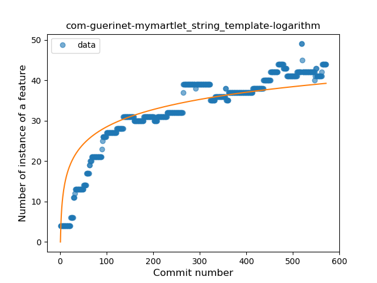
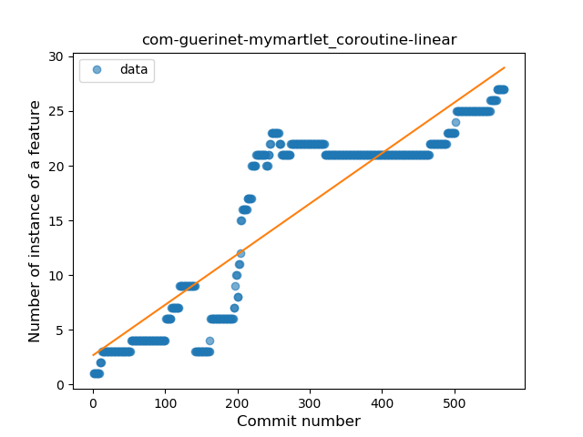

## com-guerinet-mymartlet
----
#### Metrics provided by Detekt
* Number of lines of code 10757
* Number of Kotlin files: 100
* Cyclomatic complexity: 801
* Cyclomatic complexity by thousands of lines: 216 

----
**18** features analyzed

*	<a href="#type_inference">Type Inference</a> 
*	<a href="#lambda">Lambda</a> 
*	<a href="#safe_call">Safe Call</a> 
*	<a href="#when_expr">When expression</a> 
*	<a href="#unsafe_call">Unsafe Call</a> 
*	<a href="#companion_object">Companion Object</a> 
*	<a href="#string_template">String Template</a> 
*	<a href="#func_with_default_value">Function with Default Value</a> 
*	<a href="#singleton">Singleton</a> 
*	<a href="#range_expr">Range Expression</a> 
*	<a href="#smart_cast">Smart Cast</a> 
*	<a href="#data_class">Data Class</a> 
*	<a href="#func_call_with_named_arg">Function call with Named Argument</a> 
*	<a href="#extension_function">Extension Function</a> 
*	<a href="#property_delegation">Property Delegation</a> 
*	<a href="#destructuring_declaration">Destructuring Declaration</a> 
*	<a href="#inline_func">Inline Function</a> 
*	<a href="#coroutine">Coroutine</a> 

### <a name="type_inference">Type Inference</a>
----
#### Functions
* **Sudden Rise Plateau - Logarithm:** 
    * **R_Squared:** 0.72622064
* **Constant Rise - Linear:** 
    * **R_Squared:** 0.69856244
* **Plateau Sudden Rise - Binary Sigmoid:** 
    * **R_Squared:** 0.56426195

**Plots** :chart_with_upwards_trend:
-----

### <a name="lambda">Lambda</a>
----
#### Functions
* **Constant Rise - Linear:** 
    * **R_Squared:** 0.75700624
* **Sudden Rise Plateau - Logarithm:** 
    * **R_Squared:** 0.73424308
* **Plateau Sudden Rise - Binary Sigmoid:** 
    * **R_Squared:** 0.40173245

**Plots** :chart_with_upwards_trend:
-----

### <a name="safe_call">Safe Call</a>
----
#### Functions
* **Plateau Sudden Rise - Binary Sigmoid:** 
    * **R_Squared:** 0.81100119
* **Sudden Rise Plateau - Logarithm:** 
    * **R_Squared:** 0.62381788
* **Constant Rise - Linear:** 
    * **R_Squared:** 0.45318548

**Plots** :chart_with_upwards_trend:
-----

### <a name="when_expr">When expression</a>
----
#### Functions
* **Sudden Rise Plateau - Logarithm:** 
    * **R_Squared:** 0.59127914
* **Plateau Sudden Rise - Binary Sigmoid:** 
    * **R_Squared:** 0.43730559
* **Constant Rise - Linear:** 
    * **R_Squared:** 0.27250051

**Plots** :chart_with_upwards_trend:
-----

### <a name="unsafe_call">Unsafe Call</a>
----
#### Functions
* **Plateau Gradual Rise - Sigmoid:** 
    * **R_Squared:** 0.18937412
* **Constant Decline - Linear:** 
    * **R_Squared:** 0.16177619
* **Sudden Rise Plateau - Logarithm:** 
    * **R_Squared:** -0.0

**Plots** :chart_with_upwards_trend:
-----

### <a name="companion_object">Companion Object</a>
----
#### Functions
* **Sudden Rise Plateau - Logarithm:** 
    * **R_Squared:** 0.69821742
* **Constant Rise - Linear:** 
    * **R_Squared:** 0.57027419

**Plots** :chart_with_upwards_trend:
-----

### <a name="string_template">String Template</a>
----
#### Functions
* **Sudden Rise Plateau - Logarithm:** 
    * **R_Squared:** 0.79640116
* **Constant Rise - Linear:** 
    * **R_Squared:** 0.78139446
* **Plateau Sudden Rise - Binary Sigmoid:** 
    * **R_Squared:** 0.33877994

**Plots** :chart_with_upwards_trend:
-----

### <a name="func_with_default_value">Function with Default Value</a>
----
#### Functions
* **Constant Rise - Linear:** 
    * **R_Squared:** 0.70138677
* **Sudden Rise Plateau - Logarithm:** 
    * **R_Squared:** 0.58385229

**Plots** :chart_with_upwards_trend:
-----

### <a name="singleton">Singleton</a>
----
#### Functions
* **Plateau Gradual Rise - Sigmoid:** 
    * **R_Squared:** 0.89623676
* **Constant Rise - Linear:** 
    * **R_Squared:** 0.87976446
* **Sudden Rise Plateau - Logarithm:** 
    * **R_Squared:** 0.54964365

**Plots** :chart_with_upwards_trend:
-----

### <a name="range_expr">Range Expression</a>
----
#### Functions
* **Sudden Rise Plateau - Logarithm:** 
    * **R_Squared:** 0.70013637
* **Constant Rise - Linear:** 
    * **R_Squared:** 0.60876695

**Plots** :chart_with_upwards_trend:
-----

### <a name="smart_cast">Smart Cast</a>
----
#### Functions
* **Plateau Gradual Rise - Sigmoid:** 
    * **R_Squared:** 0.93187932
* **Sudden Rise Plateau - Logarithm:** 
    * **R_Squared:** 0.7498421
* **Constant Rise - Linear:** 
    * **R_Squared:** 0.3977557

**Plots** :chart_with_upwards_trend:
-----

### <a name="data_class">Data Class</a>
----
#### Functions
* **Sudden Rise Plateau - Logarithm:** 
    * **R_Squared:** 0.04627992
* **Constant Decline - Linear:** 
    * **R_Squared:** 0.00533689

**Plots** :chart_with_upwards_trend:
-----

### <a name="func_call_with_named_arg">Function call with Named Argument</a>
----
#### Functions
* **Sudden Rise - Exponential:** 
    * **R_Squared:** 0.86083249
* **Constant Rise - Linear:** 
    * **R_Squared:** 0.84945408
* **Sudden Rise Plateau - Logarithm:** 
    * **R_Squared:** 0.41477498
* **Plateau Sudden Rise - Binary Sigmoid:** 
    * **R_Squared:** 0.04560385

**Plots** :chart_with_upwards_trend:
-----

### <a name="extension_function">Extension Function</a>
----
#### Functions
* **Plateau Gradual Rise - Sigmoid:** 
    * **R_Squared:** 0.90398888
* **Constant Rise - Linear:** 
    * **R_Squared:** 0.87347427
* **Sudden Rise Plateau - Logarithm:** 
    * **R_Squared:** 0.50689421

**Plots** :chart_with_upwards_trend:
-----

### <a name="property_delegation">Property Delegation</a>
----
#### Functions
* **Sudden Rise Plateau - Logarithm:** 
    * **R_Squared:** 0.75800216
* **Plateau Gradual Rise - Sigmoid:** 
    * **R_Squared:** 0.66107514
* **Constant Rise - Linear:** 
    * **R_Squared:** 0.42374581

**Plots** :chart_with_upwards_trend:
-----

### <a name="destructuring_declaration">Destructuring Declaration</a>
----
#### Functions
* **Plateau Gradual Rise - Sigmoid:** 
    * **R_Squared:** 0.96199582
* **Constant Rise - Linear:** 
    * **R_Squared:** 0.74748332
* **Sudden Rise Plateau - Logarithm:** 
    * **R_Squared:** 0.42133941

**Plots** :chart_with_upwards_trend:
-----

### <a name="inline_func">Inline Function</a>
----
#### Functions
* **Constant Decline - Linear:** 
    * **R_Squared:** 0.00529338
* **Sudden Rise Plateau - Logarithm:** 
    * **R_Squared:** 5.323e-05

**Plots** :chart_with_upwards_trend:
-----

### <a name="coroutine">Coroutine</a>
----
#### Functions
* **Constant Rise - Linear:** 
    * **R_Squared:** 0.80580079
* **Sudden Rise Plateau - Logarithm:** 
    * **R_Squared:** 0.46908491

**Plots** :chart_with_upwards_trend:
-----

