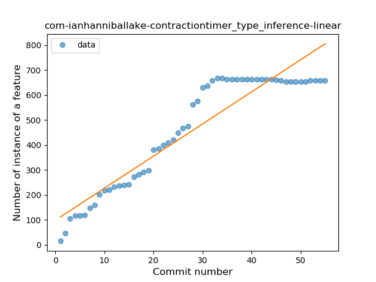
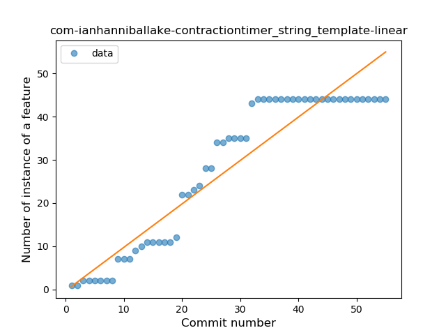
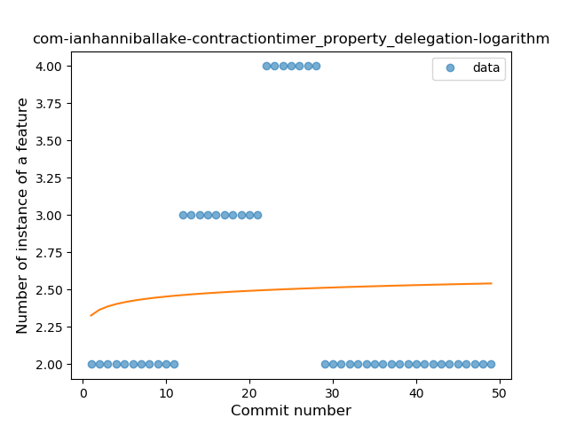

## com-ianhanniballake-contractiontimer
----
#### Metrics provided by Detekt
* Number of lines of code 5188
* Number of Kotlin files: 41
* Cyclomatic complexity: 723
* Cyclomatic complexity by thousands of lines: 245 

----
**13** features analyzed

*	<a href="#type_inference">Type Inference</a> 
*	<a href="#lambda">Lambda</a> 
*	<a href="#safe_call">Safe Call</a> 
*	<a href="#when_expr">When expression</a> 
*	<a href="#unsafe_call">Unsafe Call</a> 
*	<a href="#companion_object">Companion Object</a> 
*	<a href="#string_template">String Template</a> 
*	<a href="#func_with_default_value">Function with Default Value</a> 
*	<a href="#singleton">Singleton</a> 
*	<a href="#range_expr">Range Expression</a> 
*	<a href="#extension_function">Extension Function</a> 
*	<a href="#property_delegation">Property Delegation</a> 
*	<a href="#coroutine">Coroutine</a> 

### <a name="type_inference">Type Inference</a>
----
#### Functions
* **Constant Rise - Linear:** 
    * **R_Squared:** 0.88121295
* **Sudden Rise Plateau - Logarithm:** 
    * **R_Squared:** 0.76685732

**Plots** :chart_with_upwards_trend:
-----

### <a name="lambda">Lambda</a>
----
#### Functions
* **Constant Rise - Linear:** 
    * **R_Squared:** 0.94775165
* **Sudden Rise Plateau - Logarithm:** 
    * **R_Squared:** 0.77130404

**Plots** :chart_with_upwards_trend:
-----

### <a name="safe_call">Safe Call</a>
----
#### Functions
* **Sudden Rise Plateau - Logarithm:** 
    * **R_Squared:** 0.88055367
* **Constant Rise - Linear:** 
    * **R_Squared:** 0.83225551

**Plots** :chart_with_upwards_trend:
-----

### <a name="when_expr">When expression</a>
----
#### Functions
* **Plateau Gradual Rise - Sigmoid:** 
    * **R_Squared:** 0.98963196
* **Instability - Polinomial 3:** )
    * **R_Squared:** 0.9409941
* **Constant Rise - Linear:** 
    * **R_Squared:** 0.83174154
* **Sudden Rise Plateau - Logarithm:** 
    * **R_Squared:** 0.58529869

**Plots** :chart_with_upwards_trend:
-----

### <a name="unsafe_call">Unsafe Call</a>
----
#### Functions
* **Instability - Polinomial 4:** 
    * **R_Squared:** 0.92484829
* **Constant Rise - Linear:** 
    * **R_Squared:** 0.77152534
* **Sudden Rise Plateau - Logarithm:** 
    * **R_Squared:** 0.70592144
* **Plateau Gradual Rise - Sigmoid:** 
    * **R_Squared:** 0.25204317

**Plots** :chart_with_upwards_trend:
-----

### <a name="companion_object">Companion Object</a>
----
#### Functions
* **Sudden Rise Plateau - Logarithm:** 
    * **R_Squared:** 0.83571659
* **Constant Rise - Linear:** 
    * **R_Squared:** 0.79080926
* **Plateau Gradual Rise - Sigmoid:** 
    * **R_Squared:** 0.78948942

**Plots** :chart_with_upwards_trend:
-----

### <a name="string_template">String Template</a>
----
#### Functions
* **Constant Rise - Linear:** 
    * **R_Squared:** 0.89022179
* **Plateau Gradual Rise - Sigmoid:** 
    * **R_Squared:** 0.88218396
* **Sudden Rise Plateau - Logarithm:** 
    * **R_Squared:** 0.64303558

**Plots** :chart_with_upwards_trend:
-----

### <a name="func_with_default_value">Function with Default Value</a>
----
#### Functions
* **Instability - Polinomial 4:** 
    * **R_Squared:** 0.97993311
* **Instability - Polinomial 3:** )
    * **R_Squared:** 0.94983278
* **Sudden Rise Plateau - Logarithm:** 
    * **R_Squared:** 0.7170653
* **Constant Rise - Linear:** 
    * **R_Squared:** 0.42608696

**Plots** :chart_with_upwards_trend:
-----

### <a name="singleton">Singleton</a>
----
#### Functions
* **Plateau Sudden Rise - Binary Sigmoid:** 
    * **R_Squared:** 1.0
* **Instability - Polinomial 3:** )
    * **R_Squared:** 0.860041
* **Constant Rise - Linear:** 
    * **R_Squared:** 0.75035461
* **Sudden Rise Plateau - Logarithm:** 
    * **R_Squared:** 0.54740269

**Plots** :chart_with_upwards_trend:
-----

### <a name="range_expr">Range Expression</a>
----
#### Functions
* **Plateau Sudden Rise - Binary Sigmoid:** 
    * **R_Squared:** 1.0
* **Instability - Polinomial 3:** )
    * **R_Squared:** 0.79763017
* **Sudden Rise Plateau - Logarithm:** 
    * **R_Squared:** 0.61949314
* **Constant Rise - Linear:** 
    * **R_Squared:** 0.32844575

**Plots** :chart_with_upwards_trend:
-----

### <a name="extension_function">Extension Function</a>
----
#### Functions
* **Plateau Sudden Rise - Binary Sigmoid:** 
    * **R_Squared:** 1.0
* **Instability - Polinomial 4:** 
    * **R_Squared:** 0.85575448
* **Sudden Rise Plateau - Logarithm:** 
    * **R_Squared:** 0.71626045
* **Constant Rise - Linear:** 
    * **R_Squared:** 0.58333333

**Plots** :chart_with_upwards_trend:
-----

### <a name="property_delegation">Property Delegation</a>
----
#### Functions
* **Constant Decline - Linear:** 
    * **R_Squared:** 0.02809098
* **Sudden Rise Plateau - Logarithm:** 
    * **R_Squared:** 0.00439638

**Plots** :chart_with_upwards_trend:
-----

### <a name="coroutine">Coroutine</a>
----
#### Functions
* **Sudden Rise - Exponential:** 
    * **R_Squared:** 0.93310165
* **Constant Rise - Linear:** 
    * **R_Squared:** 0.88639561
* **Sudden Rise Plateau - Logarithm:** 
    * **R_Squared:** 0.46492426
* **Plateau Gradual Decline - Sigmoid:** 
    * **R_Squared:** 0.0

**Plots** :chart_with_upwards_trend:
-----

