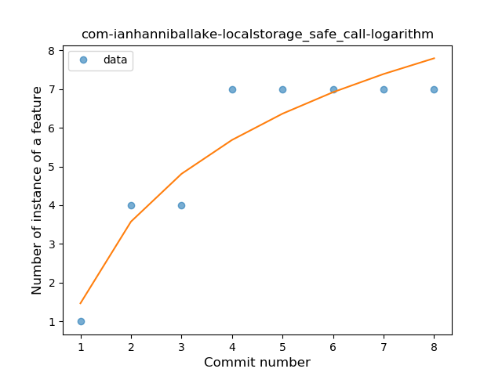
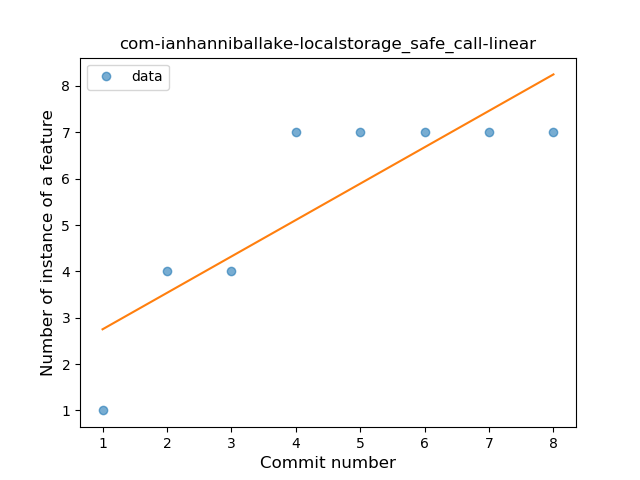
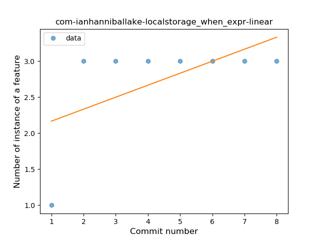
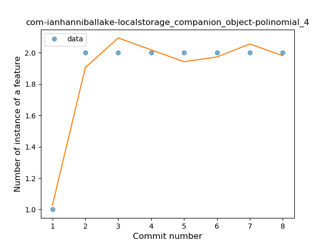
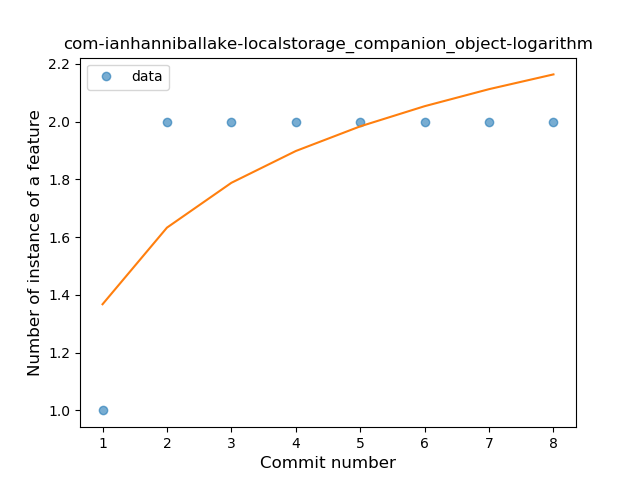

## com-ianhanniballake-localstorage
----
#### Metrics provided by Detekt
* Number of lines of code 738
* Number of Kotlin files: 4
* Cyclomatic complexity: 107
* Cyclomatic complexity by thousands of lines: 245 

----
**5** features analyzed

*	<a href="#type_inference">Type Inference</a> 
*	<a href="#lambda">Lambda</a> 
*	<a href="#safe_call">Safe Call</a> 
*	<a href="#when_expr">When expression</a> 
*	<a href="#companion_object">Companion Object</a> 

### <a name="type_inference">Type Inference</a>
----
#### Functions
* **Instability - Polinomial 3:** )
    * **R_Squared:** 0.93495792
* **Sudden Rise Plateau - Logarithm:** 
    * **R_Squared:** 0.78083518
* **Constant Rise - Linear:** 
    * **R_Squared:** 0.5335315

**Plots** :chart_with_upwards_trend:
-----

### <a name="lambda">Lambda</a>
----
#### Functions
* **Instability - Polinomial 4:** 
    * **R_Squared:** 0.93592191
* **Sudden Rise Plateau - Logarithm:** 
    * **R_Squared:** 0.88536144
* **Constant Rise - Linear:** 
    * **R_Squared:** 0.73535732

**Plots** :chart_with_upwards_trend:
-----

### <a name="safe_call">Safe Call</a>
----
#### Functions
* **Sudden Rise Plateau - Logarithm:** 
    * **R_Squared:** 0.88959438
* **Constant Rise - Linear:** 
    * **R_Squared:** 0.7202381

**Plots** :chart_with_upwards_trend:
-----

### <a name="when_expr">When expression</a>
----
#### Functions
* **Instability - Polinomial 4:** 
    * **R_Squared:** 0.96969697
* **Instability - Polinomial 3:** )
    * **R_Squared:** 0.87878788
* **Sudden Rise Plateau - Logarithm:** 
    * **R_Squared:** 0.57983506
* **Constant Rise - Linear:** 
    * **R_Squared:** 0.33333333

**Plots** :chart_with_upwards_trend:
-----

### <a name="companion_object">Companion Object</a>
----
#### Functions
* **Instability - Polinomial 4:** 
    * **R_Squared:** 0.96969697
* **Instability - Polinomial 3:** )
    * **R_Squared:** 0.87878788
* **Sudden Rise Plateau - Logarithm:** 
    * **R_Squared:** 0.57983506
* **Constant Rise - Linear:** 
    * **R_Squared:** 0.33333333

**Plots** :chart_with_upwards_trend:
-----

