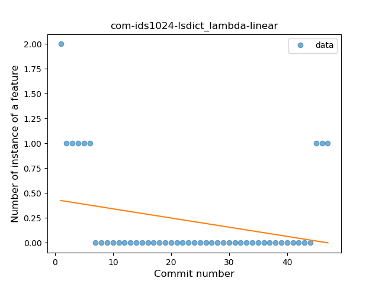
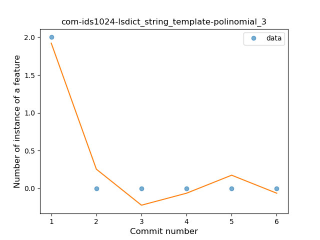

## com-ids1024-lsdict
----
#### Metrics provided by Detekt
* Number of lines of code 210
* Number of Kotlin files: 5
* Cyclomatic complexity: 29
* Cyclomatic complexity by thousands of lines: 302 

----
**4** features analyzed

*	<a href="#type_inference">Type Inference</a> 
*	<a href="#lambda">Lambda</a> 
*	<a href="#when_expr">When expression</a> 
*	<a href="#string_template">String Template</a> 

### <a name="type_inference">Type Inference</a>
----
#### Functions
* **Sudden Rise Plateau - Logarithm:** 
    * **R_Squared:** 0.8521282
* **Constant Rise - Linear:** 
    * **R_Squared:** 0.69759955

**Plots** :chart_with_upwards_trend:
-----

### <a name="lambda">Lambda</a>
----
#### Functions
* **Sudden Decline - Exponential:** 
    * **R_Squared:** 0.61670076
* **Plateau Gradual Decline - Sigmoid:** 
    * **R_Squared:** 0.62343522
* **Constant Decline - Linear:** 
    * **R_Squared:** 0.07496252
* **Sudden Rise Plateau - Logarithm:** 
    * **R_Squared:** 0.0

**Plots** :chart_with_upwards_trend:
-----

### <a name="when_expr">When expression</a>
----
#### Functions
* **Plateau Sudden Rise - Binary Sigmoid:** 
    * **R_Squared:** 1.0
* **Instability - Polinomial 3:** )
    * **R_Squared:** 0.82653254
* **Instability - Polinomial 4:** 
    * **R_Squared:** 0.83221629
* **Sudden Rise - Exponential:** 
    * **R_Squared:** 0.79289517
* **Constant Rise - Linear:** 
    * **R_Squared:** 0.48214286
* **Sudden Rise Plateau - Logarithm:** 
    * **R_Squared:** 0.26473412

**Plots** :chart_with_upwards_trend:
-----

### <a name="string_template">String Template</a>
----
#### Functions
* **Instability - Polinomial 4:** 
    * **R_Squared:** 0.9952381
* **Instability - Polinomial 3:** )
    * **R_Squared:** 0.95238095
* **Constant Decline - Linear:** 
    * **R_Squared:** 0.42857143
* **Sudden Rise Plateau - Logarithm:** 
    * **R_Squared:** -0.0

**Plots** :chart_with_upwards_trend:
-----

