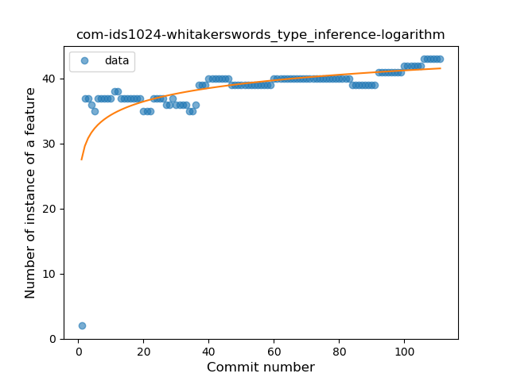

## com-ids1024-whitakerswords
----
#### Metrics provided by Detekt
* Number of lines of code 561
* Number of Kotlin files: 7
* Cyclomatic complexity: 93
* Cyclomatic complexity by thousands of lines: 320 

----
**7** features analyzed

*	<a href="#type_inference">Type Inference</a> 
*	<a href="#lambda">Lambda</a> 
*	<a href="#safe_call">Safe Call</a> 
*	<a href="#when_expr">When expression</a> 
*	<a href="#unsafe_call">Unsafe Call</a> 
*	<a href="#string_template">String Template</a> 
*	<a href="#destructuring_declaration">Destructuring Declaration</a> 

### <a name="type_inference">Type Inference</a>
----
#### Functions
* **Sudden Rise Plateau - Logarithm:** 
    * **R_Squared:** 0.46546314
* **Constant Rise - Linear:** 
    * **R_Squared:** 0.3225556

**Plots** :chart_with_upwards_trend:
-----

### <a name="lambda">Lambda</a>
----
#### Functions
* **Sudden Rise - Exponential:** 
    * **R_Squared:** 0.25834189
* **Constant Rise - Linear:** 
    * **R_Squared:** 0.14084044
* **Sudden Rise Plateau - Logarithm:** 
    * **R_Squared:** 0.06903453

**Plots** :chart_with_upwards_trend:
-----

### <a name="safe_call">Safe Call</a>
----
#### Functions
* **Plateau Gradual Decline - Sigmoid:** 
    * **R_Squared:** 0.80401537
* **Constant Decline - Linear:** 
    * **R_Squared:** 0.69733175
* **Sudden Rise Plateau - Logarithm:** 
    * **R_Squared:** -0.0

**Plots** :chart_with_upwards_trend:
-----

### <a name="when_expr">When expression</a>
----
#### Functions
* **Plateau Sudden Rise - Binary Sigmoid:** 
    * **R_Squared:** 1.0
* **Sudden Rise Plateau - Logarithm:** 
    * **R_Squared:** 0.67456729
* **Constant Rise - Linear:** 
    * **R_Squared:** 0.46342673

**Plots** :chart_with_upwards_trend:
-----

### <a name="unsafe_call">Unsafe Call</a>
----
#### Functions
* **Constant Rise - Linear:** 
    * **R_Squared:** 0.02945232
* **Sudden Rise Plateau - Logarithm:** 
    * **R_Squared:** 0.00020734

**Plots** :chart_with_upwards_trend:
-----

### <a name="string_template">String Template</a>
----
#### Functions
* **Plateau Gradual Rise - Sigmoid:** 
    * **R_Squared:** 0.96671078
* **Sudden Rise Plateau - Logarithm:** 
    * **R_Squared:** 0.75749397
* **Constant Rise - Linear:** 
    * **R_Squared:** 0.54319111

**Plots** :chart_with_upwards_trend:
-----

### <a name="destructuring_declaration">Destructuring Declaration</a>
----
#### Functions
* **Plateau Sudden Rise - Binary Sigmoid:** 
    * **R_Squared:** 1.0
* **Sudden Rise Plateau - Logarithm:** 
    * **R_Squared:** 0.38574358
* **Constant Rise - Linear:** 
    * **R_Squared:** 0.11522048

**Plots** :chart_with_upwards_trend:
-----

