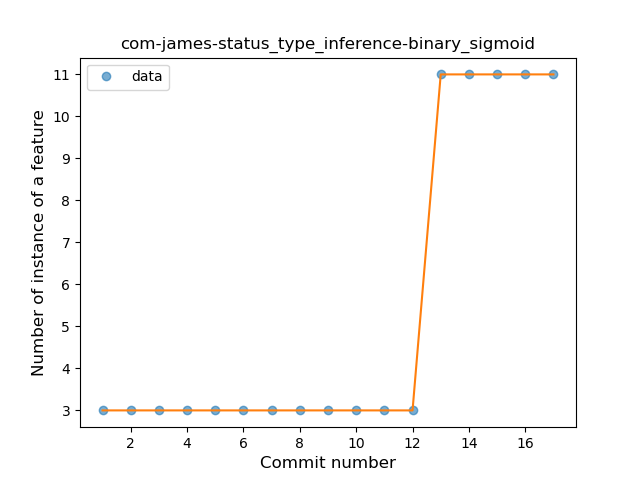

## com-james-status
----
#### Metrics provided by Detekt
* Number of lines of code 323
* Number of Kotlin files: 4
* Cyclomatic complexity: 41
* Cyclomatic complexity by thousands of lines: 344 

----
**3** features analyzed

*	<a href="#type_inference">Type Inference</a> 
*	<a href="#lambda">Lambda</a> 
*	<a href="#safe_call">Safe Call</a> 

### <a name="type_inference">Type Inference</a>
----
#### Functions
* **Plateau Sudden Rise - Binary Sigmoid:** 
    * **R_Squared:** 1.0
* **Instability - Polinomial 4:** 
    * **R_Squared:** 0.87287449
* **Sudden Rise - Exponential:** 
    * **R_Squared:** 0.76915081
* **Constant Rise - Linear:** 
    * **R_Squared:** 0.625
* **Sudden Rise Plateau - Logarithm:** 
    * **R_Squared:** 0.37409749

**Plots** :chart_with_upwards_trend:
-----

### <a name="lambda">Lambda</a>
----
#### Functions
* **Plateau Sudden Rise - Binary Sigmoid:** 
    * **R_Squared:** 1.0
* **Instability - Polinomial 4:** 
    * **R_Squared:** 0.87287449
* **Sudden Rise - Exponential:** 
    * **R_Squared:** 0.76915081
* **Constant Rise - Linear:** 
    * **R_Squared:** 0.625
* **Sudden Rise Plateau - Logarithm:** 
    * **R_Squared:** 0.37531091

**Plots** :chart_with_upwards_trend:
-----

### <a name="safe_call">Safe Call</a>
----
#### Functions
* **Plateau Sudden Rise - Binary Sigmoid:** 
    * **R_Squared:** 1.0
* **Instability - Polinomial 4:** 
    * **R_Squared:** 0.87287449
* **Sudden Rise - Exponential:** 
    * **R_Squared:** 0.76915081
* **Constant Rise - Linear:** 
    * **R_Squared:** 0.625
* **Sudden Rise Plateau - Logarithm:** 
    * **R_Squared:** 0.37531091

**Plots** :chart_with_upwards_trend:
-----

