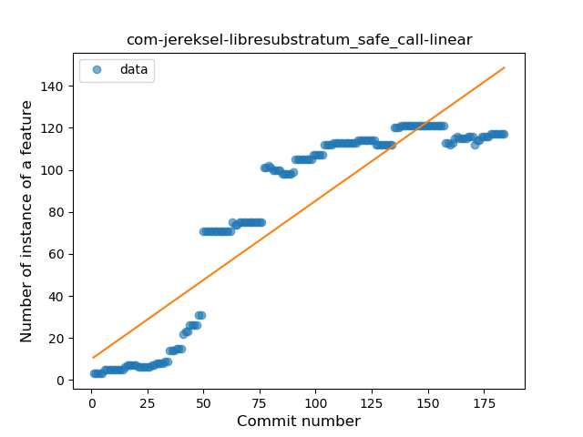
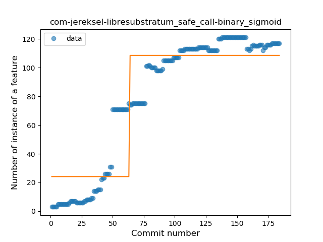
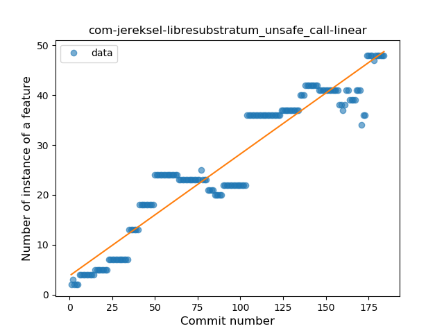
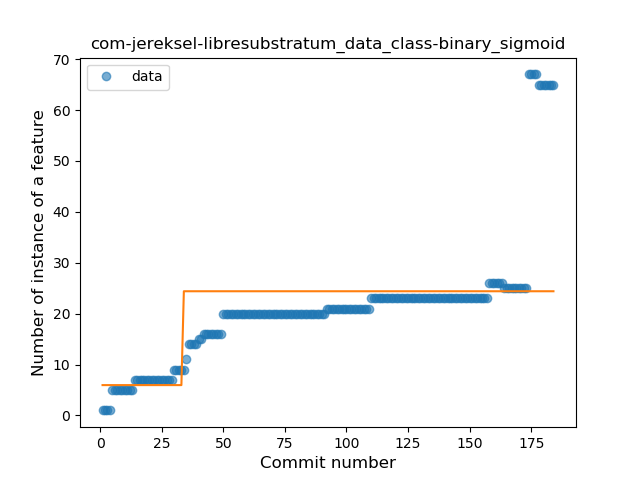
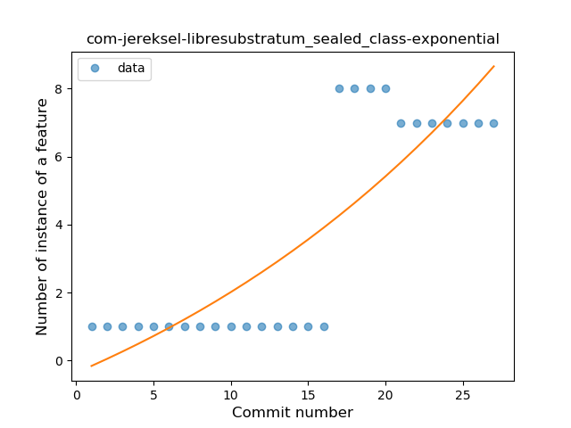
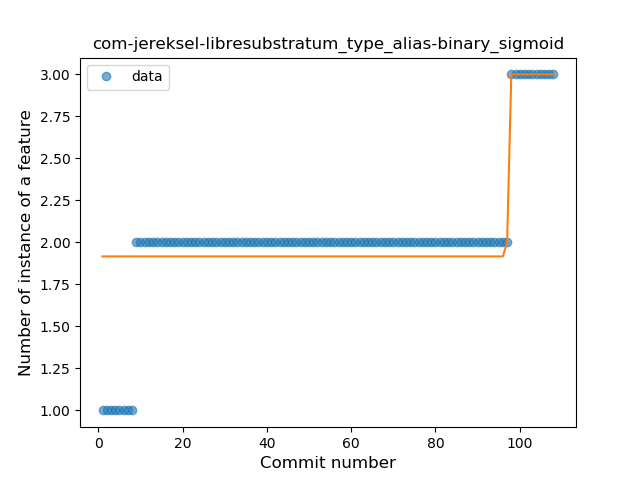
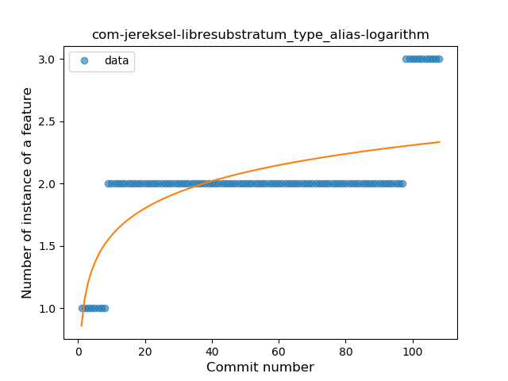

## com-jereksel-libresubstratum
----
#### Metrics provided by Detekt
* Number of lines of code 13968
* Number of Kotlin files: 174
* Cyclomatic complexity: 1097
* Cyclomatic complexity by thousands of lines: 170 

----
**22** features analyzed

*	<a href="#type_inference">Type Inference</a> 
*	<a href="#lambda">Lambda</a> 
*	<a href="#safe_call">Safe Call</a> 
*	<a href="#when_expr">When expression</a> 
*	<a href="#unsafe_call">Unsafe Call</a> 
*	<a href="#companion_object">Companion Object</a> 
*	<a href="#string_template">String Template</a> 
*	<a href="#func_with_default_value">Function with Default Value</a> 
*	<a href="#singleton">Singleton</a> 
*	<a href="#range_expr">Range Expression</a> 
*	<a href="#smart_cast">Smart Cast</a> 
*	<a href="#data_class">Data Class</a> 
*	<a href="#func_call_with_named_arg">Function call with Named Argument</a> 
*	<a href="#extension_function">Extension Function</a> 
*	<a href="#property_delegation">Property Delegation</a> 
*	<a href="#destructuring_declaration">Destructuring Declaration</a> 
*	<a href="#inline_func">Inline Function</a> 
*	<a href="#overloaded_op">Overloaded Operator</a> 
*	<a href="#coroutine">Coroutine</a> 
*	<a href="#sealed_class">Sealed Class</a> 
*	<a href="#type_alias">Type Alias</a> 
*	<a href="#infix_func">Infix Function</a> 

### <a name="type_inference">Type Inference</a>
----
#### Functions
* **Constant Rise - Linear:** 
    * **R_Squared:** 0.95406163
* **Sudden Rise Plateau - Logarithm:** 
    * **R_Squared:** 0.53797999
* **Plateau Sudden Rise - Binary Sigmoid:** 
    * **R_Squared:** 0.08040789

**Plots** :chart_with_upwards_trend:
-----

### <a name="lambda">Lambda</a>
----
#### Functions
* **Constant Rise - Linear:** 
    * **R_Squared:** 0.94292426
* **Sudden Rise Plateau - Logarithm:** 
    * **R_Squared:** 0.57448868

**Plots** :chart_with_upwards_trend:
-----

### <a name="safe_call">Safe Call</a>
----
#### Functions
* **Constant Rise - Linear:** 
    * **R_Squared:** 0.82056682
* **Plateau Sudden Rise - Binary Sigmoid:** 
    * **R_Squared:** 0.82043059
* **Sudden Rise Plateau - Logarithm:** 
    * **R_Squared:** 0.570541

**Plots** :chart_with_upwards_trend:
-----

### <a name="when_expr">When expression</a>
----
#### Functions
* **Plateau Gradual Rise - Sigmoid:** 
    * **R_Squared:** 0.85433656
* **Sudden Rise - Exponential:** 
    * **R_Squared:** 0.80990204
* **Constant Rise - Linear:** 
    * **R_Squared:** 0.51468572
* **Sudden Rise Plateau - Logarithm:** 
    * **R_Squared:** 0.31294848

**Plots** :chart_with_upwards_trend:
-----

### <a name="unsafe_call">Unsafe Call</a>
----
#### Functions
* **Constant Rise - Linear:** 
    * **R_Squared:** 0.91376871
* **Plateau Gradual Rise - Sigmoid:** 
    * **R_Squared:** 0.62658914
* **Sudden Rise Plateau - Logarithm:** 
    * **R_Squared:** 0.59226691

**Plots** :chart_with_upwards_trend:
-----

### <a name="companion_object">Companion Object</a>
----
#### Functions
* **Plateau Gradual Rise - Sigmoid:** 
    * **R_Squared:** 0.83957058
* **Sudden Rise Plateau - Logarithm:** 
    * **R_Squared:** 0.67914426
* **Constant Rise - Linear:** 
    * **R_Squared:** 0.63746465

**Plots** :chart_with_upwards_trend:
-----

### <a name="string_template">String Template</a>
----
#### Functions
* **Constant Rise - Linear:** 
    * **R_Squared:** 0.94487357
* **Sudden Rise Plateau - Logarithm:** 
    * **R_Squared:** 0.60953833
* **Plateau Gradual Rise - Sigmoid:** 
    * **R_Squared:** 0.61834973

**Plots** :chart_with_upwards_trend:
-----

### <a name="func_with_default_value">Function with Default Value</a>
----
#### Functions
* **Constant Rise - Linear:** 
    * **R_Squared:** 0.83462651
* **Sudden Rise Plateau - Logarithm:** 
    * **R_Squared:** 0.69009137
* **Plateau Gradual Rise - Sigmoid:** 
    * **R_Squared:** 0.30159854

**Plots** :chart_with_upwards_trend:
-----

### <a name="singleton">Singleton</a>
----
#### Functions
* **Sudden Rise - Exponential:** 
    * **R_Squared:** 0.93915882
* **Constant Rise - Linear:** 
    * **R_Squared:** 0.85030241
* **Sudden Rise Plateau - Logarithm:** 
    * **R_Squared:** 0.37849321

**Plots** :chart_with_upwards_trend:
-----

### <a name="range_expr">Range Expression</a>
----
#### Functions
* **Sudden Rise - Exponential:** 
    * **R_Squared:** 0.33114966
* **Constant Rise - Linear:** 
    * **R_Squared:** 0.30941879
* **Plateau Sudden Rise - Binary Sigmoid:** 
    * **R_Squared:** 0.31417705
* **Sudden Rise Plateau - Logarithm:** 
    * **R_Squared:** 0.27678395

**Plots** :chart_with_upwards_trend:
-----

### <a name="smart_cast">Smart Cast</a>
----
#### Functions
* **Plateau Gradual Rise - Sigmoid:** 
    * **R_Squared:** 0.97655076
* **Sudden Rise - Exponential:** 
    * **R_Squared:** 0.82673841
* **Instability - Polinomial 3:** )
    * **R_Squared:** 0.73334013
* **Constant Rise - Linear:** 
    * **R_Squared:** 0.33986114
* **Sudden Rise Plateau - Logarithm:** 
    * **R_Squared:** 0.09757162

**Plots** :chart_with_upwards_trend:
-----

### <a name="data_class">Data Class</a>
----
#### Functions
* **Sudden Rise - Exponential:** 
    * **R_Squared:** 0.7094223
* **Constant Rise - Linear:** 
    * **R_Squared:** 0.57297098
* **Sudden Rise Plateau - Logarithm:** 
    * **R_Squared:** 0.36400212
* **Plateau Sudden Rise - Binary Sigmoid:** 
    * **R_Squared:** 0.29796155

**Plots** :chart_with_upwards_trend:
-----

### <a name="func_call_with_named_arg">Function call with Named Argument</a>
----
#### Functions
* **Sudden Rise - Exponential:** 
    * **R_Squared:** 0.83284289
* **Constant Rise - Linear:** 
    * **R_Squared:** 0.67673169
* **Sudden Rise Plateau - Logarithm:** 
    * **R_Squared:** 0.30259887

**Plots** :chart_with_upwards_trend:
-----

### <a name="extension_function">Extension Function</a>
----
#### Functions
* **Constant Rise - Linear:** 
    * **R_Squared:** 0.91262829
* **Sudden Rise Plateau - Logarithm:** 
    * **R_Squared:** 0.59505704
* **Plateau Gradual Rise - Sigmoid:** 
    * **R_Squared:** 0.25991753

**Plots** :chart_with_upwards_trend:
-----

### <a name="property_delegation">Property Delegation</a>
----
#### Functions
* **Constant Rise - Linear:** 
    * **R_Squared:** 0.87126392
* **Sudden Rise Plateau - Logarithm:** 
    * **R_Squared:** 0.61931914

**Plots** :chart_with_upwards_trend:
-----

### <a name="destructuring_declaration">Destructuring Declaration</a>
----
#### Functions
* **Sudden Rise - Exponential:** 
    * **R_Squared:** 0.83019453
* **Constant Rise - Linear:** 
    * **R_Squared:** 0.69660394
* **Sudden Rise Plateau - Logarithm:** 
    * **R_Squared:** 0.35067751

**Plots** :chart_with_upwards_trend:
-----

### <a name="inline_func">Inline Function</a>
----
#### Functions
* **Sudden Rise - Exponential:** 
    * **R_Squared:** 0.8985021
* **Constant Rise - Linear:** 
    * **R_Squared:** 0.68294845
* **Sudden Rise Plateau - Logarithm:** 
    * **R_Squared:** 0.29957948

**Plots** :chart_with_upwards_trend:
-----

### <a name="overloaded_op">Overloaded Operator</a>
----
#### Functions
* **Sudden Rise - Exponential:** 
    * **R_Squared:** 0.12151267
* **Constant Rise - Linear:** 
    * **R_Squared:** 0.0271376
* **Sudden Rise Plateau - Logarithm:** 
    * **R_Squared:** -0.0

**Plots** :chart_with_upwards_trend:
-----

### <a name="coroutine">Coroutine</a>
----
#### Functions
* **Sudden Rise Plateau - Logarithm:** 
    * **R_Squared:** 0.75956616
* **Constant Rise - Linear:** 
    * **R_Squared:** 0.6704985

**Plots** :chart_with_upwards_trend:
-----

### <a name="sealed_class">Sealed Class</a>
----
#### Functions
* **Plateau Sudden Rise - Binary Sigmoid:** 
    * **R_Squared:** 0.99044924
* **Instability - Polinomial 4:** 
    * **R_Squared:** 0.83079887
* **Instability - Polinomial 3:** )
    * **R_Squared:** 0.79911419
* **Sudden Rise - Exponential:** 
    * **R_Squared:** 0.69939676
* **Constant Rise - Linear:** 
    * **R_Squared:** 0.68287938
* **Sudden Rise Plateau - Logarithm:** 
    * **R_Squared:** 0.38956358

**Plots** :chart_with_upwards_trend:
-----

### <a name="type_alias">Type Alias</a>
----
#### Functions
* **Plateau Sudden Rise - Binary Sigmoid:** 
    * **R_Squared:** 0.61233482
* **Sudden Rise - Exponential:** 
    * **R_Squared:** 0.53455065
* **Sudden Rise Plateau - Logarithm:** 
    * **R_Squared:** 0.486615
* **Constant Rise - Linear:** 
    * **R_Squared:** 0.4388653

**Plots** :chart_with_upwards_trend:
-----

### <a name="infix_func">Infix Function</a>
----
#### Functions
* **Plateau Sudden Decline - Binary Sigmoid:** 
    * **R_Squared:** 0.89067111
* **Sudden Decline - Exponential:** 
    * **R_Squared:** 0.59649548
* **Constant Decline - Linear:** 
    * **R_Squared:** 0.42990564
* **Sudden Rise Plateau - Logarithm:** 
    * **R_Squared:** -0.0

**Plots** :chart_with_upwards_trend:
-----

