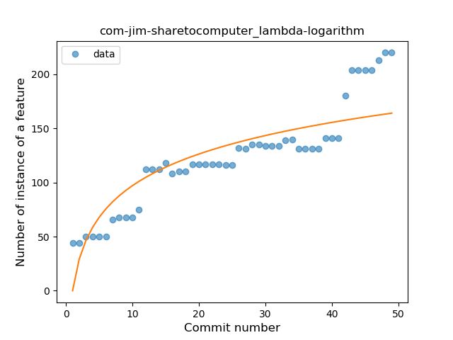
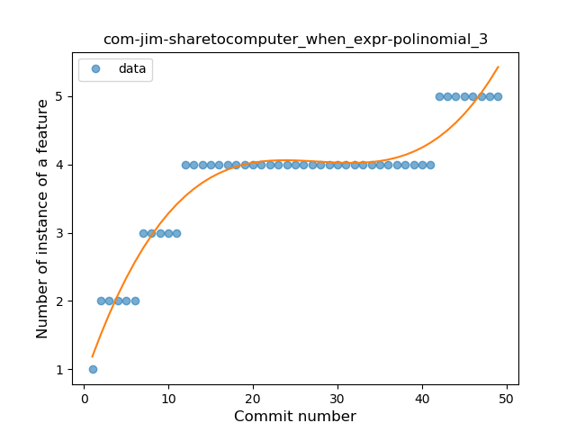
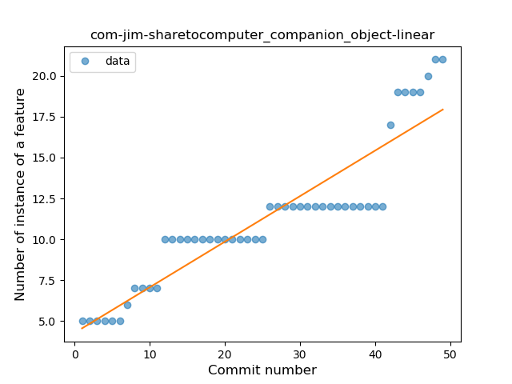
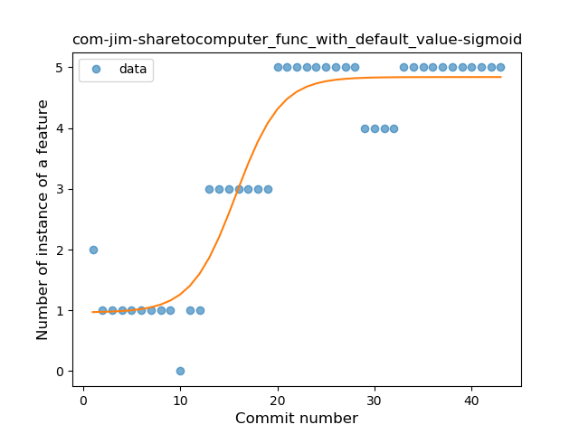
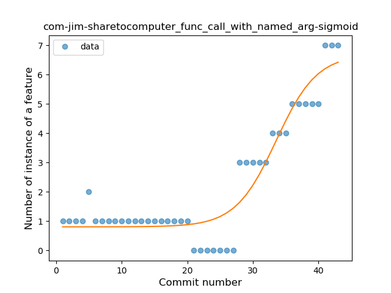
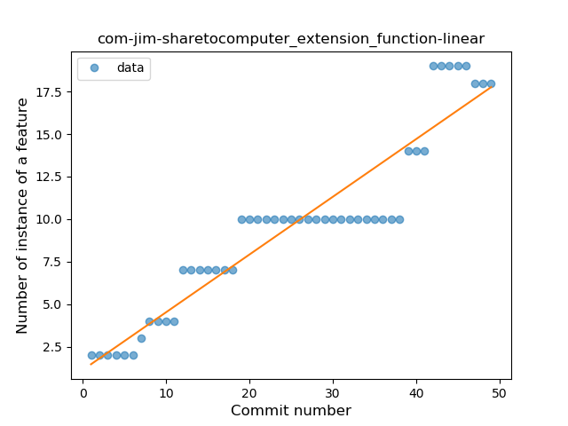
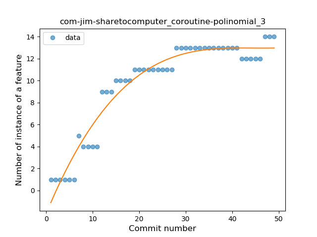

## com-jim-sharetocomputer
----
#### Metrics provided by Detekt
* Number of lines of code 5730
* Number of Kotlin files: 69
* Cyclomatic complexity: 567
* Cyclomatic complexity by thousands of lines: 199 

----
**16** features analyzed

*	<a href="#type_inference">Type Inference</a> 
*	<a href="#lambda">Lambda</a> 
*	<a href="#safe_call">Safe Call</a> 
*	<a href="#when_expr">When expression</a> 
*	<a href="#unsafe_call">Unsafe Call</a> 
*	<a href="#companion_object">Companion Object</a> 
*	<a href="#string_template">String Template</a> 
*	<a href="#func_with_default_value">Function with Default Value</a> 
*	<a href="#singleton">Singleton</a> 
*	<a href="#range_expr">Range Expression</a> 
*	<a href="#data_class">Data Class</a> 
*	<a href="#func_call_with_named_arg">Function call with Named Argument</a> 
*	<a href="#extension_function">Extension Function</a> 
*	<a href="#property_delegation">Property Delegation</a> 
*	<a href="#destructuring_declaration">Destructuring Declaration</a> 
*	<a href="#coroutine">Coroutine</a> 

### <a name="type_inference">Type Inference</a>
----
#### Functions
* **Sudden Rise - Exponential:** 
    * **R_Squared:** 0.89097289
* **Constant Rise - Linear:** 
    * **R_Squared:** 0.87731849
* **Sudden Rise Plateau - Logarithm:** 
    * **R_Squared:** 0.70887542

**Plots** :chart_with_upwards_trend:
-----

### <a name="lambda">Lambda</a>
----
#### Functions
* **Constant Rise - Linear:** 
    * **R_Squared:** 0.87565498
* **Sudden Rise - Exponential:** 
    * **R_Squared:** 0.87898481
* **Sudden Rise Plateau - Logarithm:** 
    * **R_Squared:** 0.74271522

**Plots** :chart_with_upwards_trend:
-----

### <a name="safe_call">Safe Call</a>
----
#### Functions
* **Constant Rise - Linear:** 
    * **R_Squared:** 0.87373178
* **Sudden Rise Plateau - Logarithm:** 
    * **R_Squared:** 0.766593

**Plots** :chart_with_upwards_trend:
-----

### <a name="when_expr">When expression</a>
----
#### Functions
* **Instability - Polinomial 3:** )
    * **R_Squared:** 0.9277385
* **Sudden Rise Plateau - Logarithm:** 
    * **R_Squared:** 0.85503675
* **Constant Rise - Linear:** 
    * **R_Squared:** 0.70652707

**Plots** :chart_with_upwards_trend:
-----

### <a name="unsafe_call">Unsafe Call</a>
----
#### Functions
* **Sudden Rise - Exponential:** 
    * **R_Squared:** 0.83132374
* **Constant Rise - Linear:** 
    * **R_Squared:** 0.81961437
* **Sudden Rise Plateau - Logarithm:** 
    * **R_Squared:** 0.64092488
* **Plateau Sudden Rise - Binary Sigmoid:** 
    * **R_Squared:** 0.52669515

**Plots** :chart_with_upwards_trend:
-----

### <a name="companion_object">Companion Object</a>
----
#### Functions
* **Sudden Rise - Exponential:** 
    * **R_Squared:** 0.87459835
* **Constant Rise - Linear:** 
    * **R_Squared:** 0.84212242
* **Sudden Rise Plateau - Logarithm:** 
    * **R_Squared:** 0.66604344

**Plots** :chart_with_upwards_trend:
-----

### <a name="string_template">String Template</a>
----
#### Functions
* **Instability - Polinomial 4:** 
    * **R_Squared:** 0.94487564
* **Sudden Rise Plateau - Logarithm:** 
    * **R_Squared:** 0.84120878
* **Constant Rise - Linear:** 
    * **R_Squared:** 0.72077573
* **Plateau Gradual Rise - Sigmoid:** 
    * **R_Squared:** 0.47076622

**Plots** :chart_with_upwards_trend:
-----

### <a name="func_with_default_value">Function with Default Value</a>
----
#### Functions
* **Plateau Gradual Rise - Sigmoid:** 
    * **R_Squared:** 0.90740076
* **Constant Rise - Linear:** 
    * **R_Squared:** 0.74626278
* **Sudden Rise Plateau - Logarithm:** 
    * **R_Squared:** 0.63308939

**Plots** :chart_with_upwards_trend:
-----

### <a name="singleton">Singleton</a>
----
#### Functions
* **Plateau Gradual Rise - Sigmoid:** 
    * **R_Squared:** 0.88553633
* **Sudden Rise Plateau - Logarithm:** 
    * **R_Squared:** 0.82719421
* **Constant Rise - Linear:** 
    * **R_Squared:** 0.62065634

**Plots** :chart_with_upwards_trend:
-----

### <a name="range_expr">Range Expression</a>
----
#### Functions
* **Plateau Gradual Rise - Sigmoid:** 
    * **R_Squared:** 0.93176469
* **Sudden Rise - Exponential:** 
    * **R_Squared:** 0.89406768
* **Constant Rise - Linear:** 
    * **R_Squared:** 0.71516619
* **Sudden Rise Plateau - Logarithm:** 
    * **R_Squared:** 0.39480982

**Plots** :chart_with_upwards_trend:
-----

### <a name="data_class">Data Class</a>
----
#### Functions
* **Instability - Polinomial 3:** )
    * **R_Squared:** 0.83020828
* **Sudden Rise Plateau - Logarithm:** 
    * **R_Squared:** 0.70962539
* **Constant Rise - Linear:** 
    * **R_Squared:** 0.52452401

**Plots** :chart_with_upwards_trend:
-----

### <a name="func_call_with_named_arg">Function call with Named Argument</a>
----
#### Functions
* **Plateau Gradual Rise - Sigmoid:** 
    * **R_Squared:** 0.89740859
* **Sudden Rise - Exponential:** 
    * **R_Squared:** 0.85566774
* **Constant Rise - Linear:** 
    * **R_Squared:** 0.57965715
* **Sudden Rise Plateau - Logarithm:** 
    * **R_Squared:** 0.24482844

**Plots** :chart_with_upwards_trend:
-----

### <a name="extension_function">Extension Function</a>
----
#### Functions
* **Constant Rise - Linear:** 
    * **R_Squared:** 0.88404327
* **Sudden Rise - Exponential:** 
    * **R_Squared:** 0.88979449
* **Sudden Rise Plateau - Logarithm:** 
    * **R_Squared:** 0.64461264

**Plots** :chart_with_upwards_trend:
-----

### <a name="property_delegation">Property Delegation</a>
----
#### Functions
* **Sudden Rise - Exponential:** 
    * **R_Squared:** 0.85046622
* **Constant Rise - Linear:** 
    * **R_Squared:** 0.78370448
* **Sudden Rise Plateau - Logarithm:** 
    * **R_Squared:** 0.61074892

**Plots** :chart_with_upwards_trend:
-----

### <a name="destructuring_declaration">Destructuring Declaration</a>
----
#### Functions
* **Constant Rise - Linear:** 
    * **R_Squared:** 0.81618362
* **Sudden Rise Plateau - Logarithm:** 
    * **R_Squared:** 0.75812609

**Plots** :chart_with_upwards_trend:
-----

### <a name="coroutine">Coroutine</a>
----
#### Functions
* **Plateau Gradual Rise - Sigmoid:** 
    * **R_Squared:** 0.9537628
* **Instability - Polinomial 3:** )
    * **R_Squared:** 0.94189385
* **Sudden Rise Plateau - Logarithm:** 
    * **R_Squared:** 0.82303993
* **Constant Rise - Linear:** 
    * **R_Squared:** 0.74726749

**Plots** :chart_with_upwards_trend:
-----

