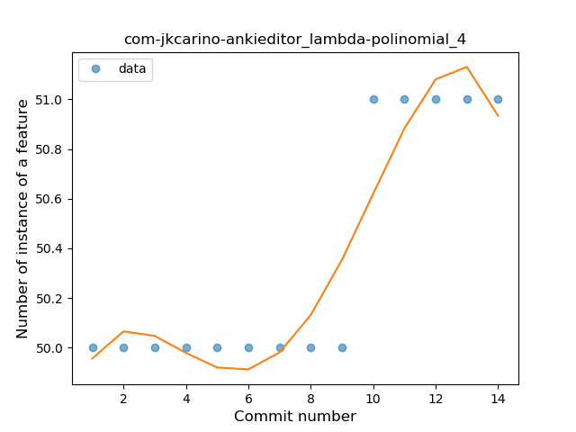
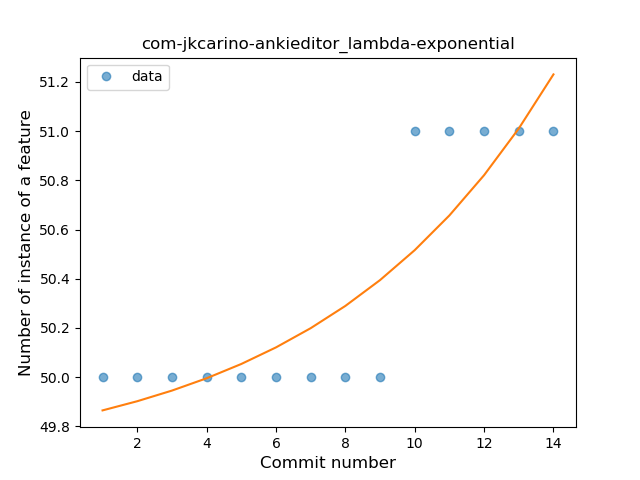
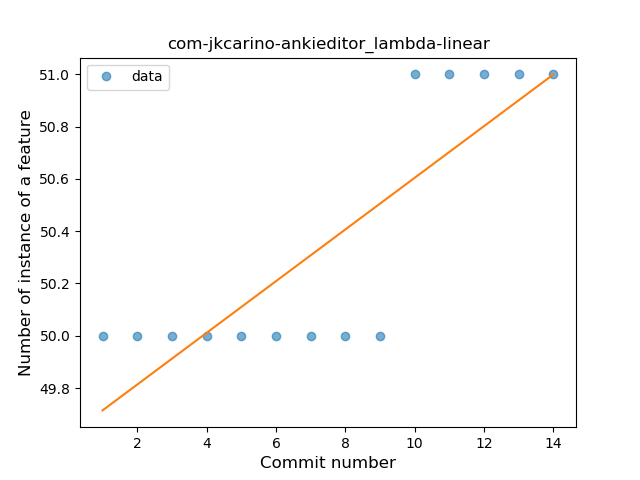
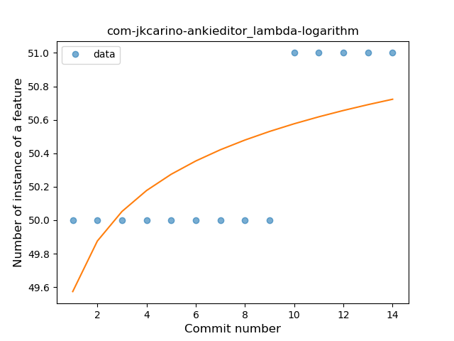
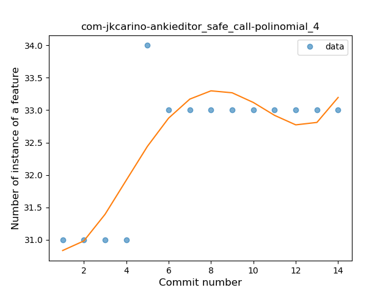
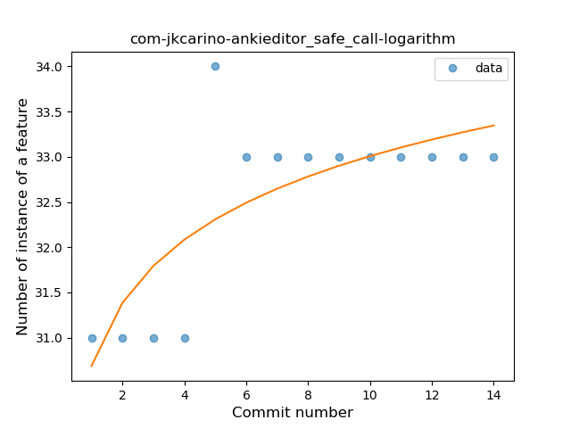
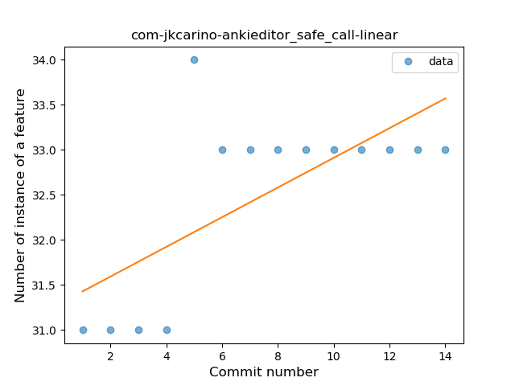
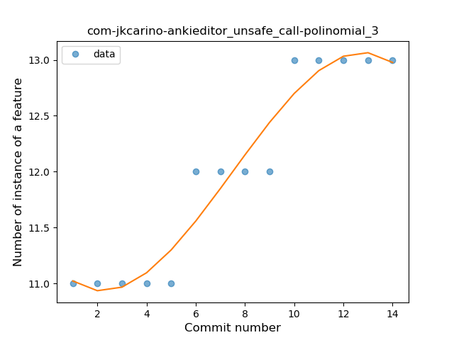
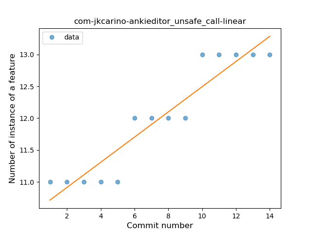
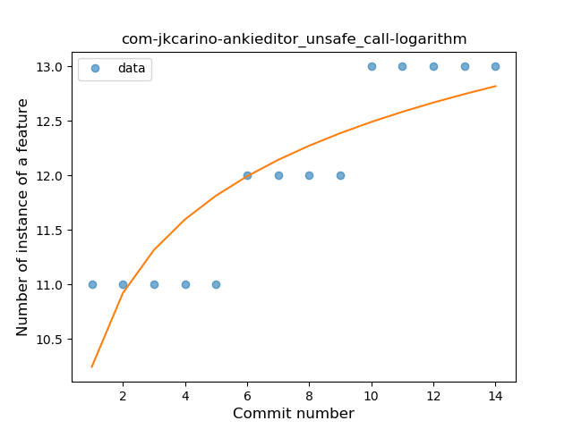

## com-jkcarino-ankieditor
----
#### Metrics provided by Detekt
* Number of lines of code 1510
* Number of Kotlin files: 20
* Cyclomatic complexity: 182
* Cyclomatic complexity by thousands of lines: 307 

----
**3** features analyzed

*	<a href="#lambda">Lambda</a> 
*	<a href="#safe_call">Safe Call</a> 
*	<a href="#unsafe_call">Unsafe Call</a> 

### <a name="lambda">Lambda</a>
----
#### Functions
* **Instability - Polinomial 4:** 
    * **R_Squared:** 0.89055944
* **Sudden Rise - Exponential:** 
    * **R_Squared:** 0.76224931
* **Constant Rise - Linear:** 
    * **R_Squared:** 0.69230769
* **Sudden Rise Plateau - Logarithm:** 
    * **R_Squared:** 0.45964229

**Plots** :chart_with_upwards_trend:
-----

### <a name="safe_call">Safe Call</a>
----
#### Functions
* **Instability - Polinomial 4:** 
    * **R_Squared:** 0.71815929
* **Sudden Rise Plateau - Logarithm:** 
    * **R_Squared:** 0.58579501
* **Constant Rise - Linear:** 
    * **R_Squared:** 0.45787546

**Plots** :chart_with_upwards_trend:
-----

### <a name="unsafe_call">Unsafe Call</a>
----
#### Functions
* **Instability - Polinomial 3:** )
    * **R_Squared:** 0.9354616
* **Constant Rise - Linear:** 
    * **R_Squared:** 0.89010989
* **Sudden Rise Plateau - Logarithm:** 
    * **R_Squared:** 0.74182566

**Plots** :chart_with_upwards_trend:
-----

