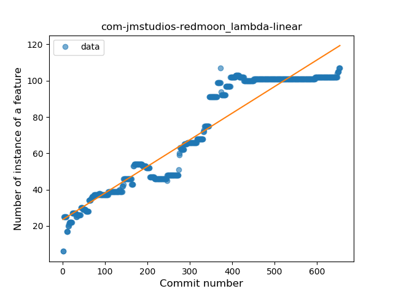
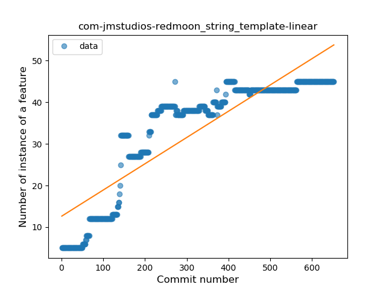
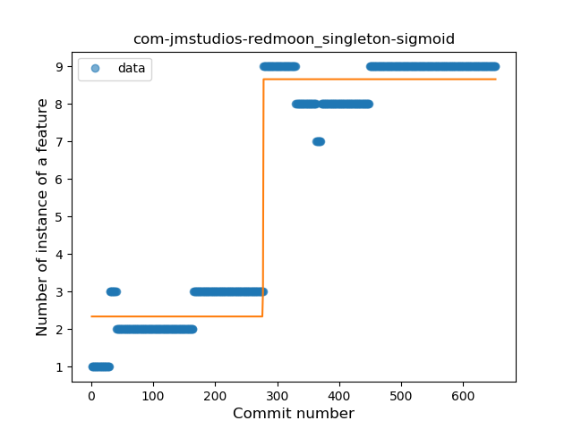
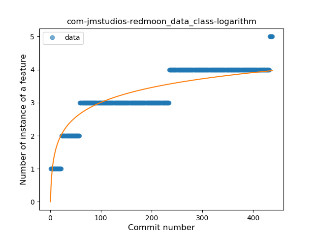
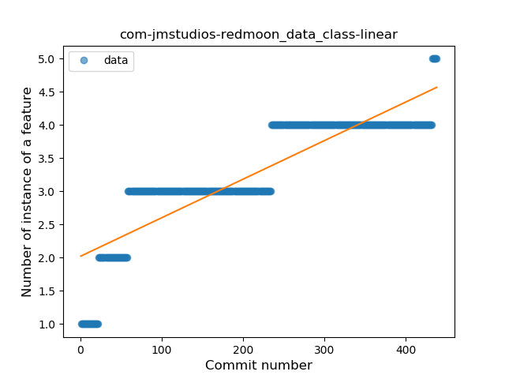
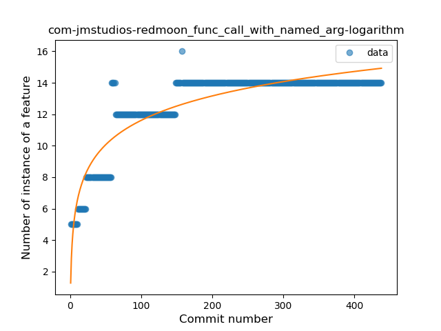
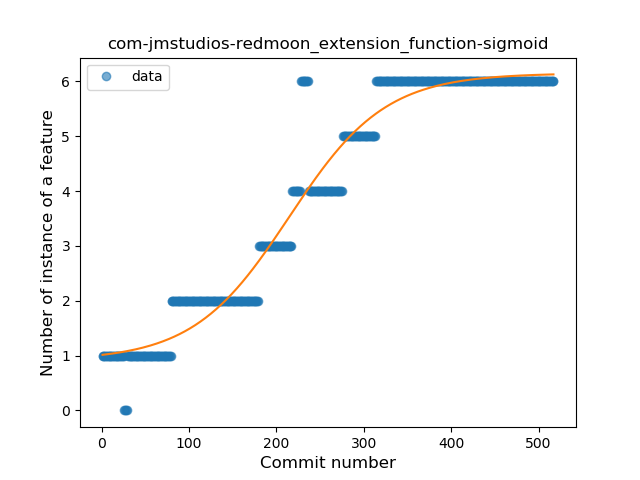
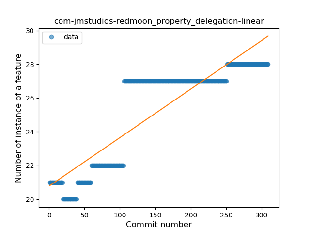
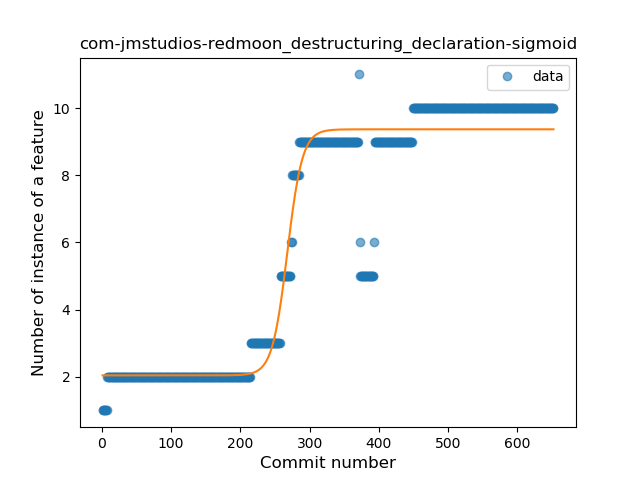

## com-jmstudios-redmoon
----
#### Metrics provided by Detekt
* Number of lines of code 4175
* Number of Kotlin files: 48
* Cyclomatic complexity: 569
* Cyclomatic complexity by thousands of lines: 301 

----
**18** features analyzed

*	<a href="#type_inference">Type Inference</a> 
*	<a href="#lambda">Lambda</a> 
*	<a href="#safe_call">Safe Call</a> 
*	<a href="#when_expr">When expression</a> 
*	<a href="#unsafe_call">Unsafe Call</a> 
*	<a href="#companion_object">Companion Object</a> 
*	<a href="#string_template">String Template</a> 
*	<a href="#func_with_default_value">Function with Default Value</a> 
*	<a href="#singleton">Singleton</a> 
*	<a href="#range_expr">Range Expression</a> 
*	<a href="#data_class">Data Class</a> 
*	<a href="#func_call_with_named_arg">Function call with Named Argument</a> 
*	<a href="#extension_function">Extension Function</a> 
*	<a href="#property_delegation">Property Delegation</a> 
*	<a href="#destructuring_declaration">Destructuring Declaration</a> 
*	<a href="#inline_func">Inline Function</a> 
*	<a href="#super_delegation">Super Delegation</a> 
*	<a href="#tailrec_func">Tail-recursive Function</a> 

### <a name="type_inference">Type Inference</a>
----
#### Functions
* **Constant Decline - Linear:** 
    * **R_Squared:** 0.12634391
* **Plateau Sudden Decline - Binary Sigmoid:** 
    * **R_Squared:** 0.10977325
* **Sudden Decline - Exponential:** 
    * **R_Squared:** 0.0
* **Sudden Rise Plateau - Logarithm:** 
    * **R_Squared:** -0.0

**Plots** :chart_with_upwards_trend:
-----

### <a name="lambda">Lambda</a>
----
#### Functions
* **Constant Rise - Linear:** 
    * **R_Squared:** 0.899331
* **Sudden Rise Plateau - Logarithm:** 
    * **R_Squared:** 0.5679198
* **Plateau Gradual Rise - Sigmoid:** 
    * **R_Squared:** 0.32912142

**Plots** :chart_with_upwards_trend:
-----

### <a name="safe_call">Safe Call</a>
----
#### Functions
* **Plateau Gradual Rise - Sigmoid:** 
    * **R_Squared:** 0.97514518
* **Constant Rise - Linear:** 
    * **R_Squared:** 0.81014748
* **Sudden Rise Plateau - Logarithm:** 
    * **R_Squared:** 0.48021727

**Plots** :chart_with_upwards_trend:
-----

### <a name="when_expr">When expression</a>
----
#### Functions
* **Constant Rise - Linear:** 
    * **R_Squared:** 0.87801428
* **Sudden Rise Plateau - Logarithm:** 
    * **R_Squared:** 0.63971441
* **Plateau Sudden Rise - Binary Sigmoid:** 
    * **R_Squared:** 0.0867967

**Plots** :chart_with_upwards_trend:
-----

### <a name="unsafe_call">Unsafe Call</a>
----
#### Functions
* **Sudden Decline - Exponential:** 
    * **R_Squared:** 0.56386335
* **Constant Decline - Linear:** 
    * **R_Squared:** 0.28936875
* **Plateau Sudden Decline - Binary Sigmoid:** 
    * **R_Squared:** 0.22793214
* **Sudden Rise Plateau - Logarithm:** 
    * **R_Squared:** -0.0

**Plots** :chart_with_upwards_trend:
-----

### <a name="companion_object">Companion Object</a>
----
#### Functions
* **Sudden Rise Plateau - Logarithm:** 
    * **R_Squared:** 0.19794228
* **Plateau Sudden Rise - Binary Sigmoid:** 
    * **R_Squared:** 0.08621306
* **Constant Rise - Linear:** 
    * **R_Squared:** 0.06340766

**Plots** :chart_with_upwards_trend:
-----

### <a name="string_template">String Template</a>
----
#### Functions
* **Constant Rise - Linear:** 
    * **R_Squared:** 0.77635592
* **Sudden Rise Plateau - Logarithm:** 
    * **R_Squared:** 0.62074507
* **Plateau Sudden Rise - Binary Sigmoid:** 
    * **R_Squared:** 0.15996628

**Plots** :chart_with_upwards_trend:
-----

### <a name="func_with_default_value">Function with Default Value</a>
----
#### Functions
* **Plateau Gradual Rise - Sigmoid:** 
    * **R_Squared:** 0.85140897
* **Constant Rise - Linear:** 
    * **R_Squared:** 0.43592747
* **Sudden Rise Plateau - Logarithm:** 
    * **R_Squared:** 0.35950166

**Plots** :chart_with_upwards_trend:
-----

### <a name="singleton">Singleton</a>
----
#### Functions
* **Plateau Gradual Rise - Sigmoid:** 
    * **R_Squared:** 0.9665725
* **Constant Rise - Linear:** 
    * **R_Squared:** 0.80461423
* **Sudden Rise Plateau - Logarithm:** 
    * **R_Squared:** 0.43771673

**Plots** :chart_with_upwards_trend:
-----

### <a name="range_expr">Range Expression</a>
----
#### Functions
* **Constant Rise - Linear:** 
    * **R_Squared:** 0.74382565
* **Sudden Rise - Exponential:** 
    * **R_Squared:** 0.74613342
* **Sudden Rise Plateau - Logarithm:** 
    * **R_Squared:** 0.3038251
* **Plateau Sudden Rise - Binary Sigmoid:** 
    * **R_Squared:** 0.00184625

**Plots** :chart_with_upwards_trend:
-----

### <a name="data_class">Data Class</a>
----
#### Functions
* **Sudden Rise Plateau - Logarithm:** 
    * **R_Squared:** 0.82396974
* **Constant Rise - Linear:** 
    * **R_Squared:** 0.77179815

**Plots** :chart_with_upwards_trend:
-----

### <a name="func_call_with_named_arg">Function call with Named Argument</a>
----
#### Functions
* **Sudden Rise Plateau - Logarithm:** 
    * **R_Squared:** 0.84209254
* **Constant Rise - Linear:** 
    * **R_Squared:** 0.53797796

**Plots** :chart_with_upwards_trend:
-----

### <a name="extension_function">Extension Function</a>
----
#### Functions
* **Plateau Gradual Rise - Sigmoid:** 
    * **R_Squared:** 0.95766936
* **Constant Rise - Linear:** 
    * **R_Squared:** 0.89256042
* **Sudden Rise Plateau - Logarithm:** 
    * **R_Squared:** 0.50003769

**Plots** :chart_with_upwards_trend:
-----

### <a name="property_delegation">Property Delegation</a>
----
#### Functions
* **Constant Rise - Linear:** 
    * **R_Squared:** 0.77491532
* **Sudden Rise Plateau - Logarithm:** 
    * **R_Squared:** 0.70864486

**Plots** :chart_with_upwards_trend:
-----

### <a name="destructuring_declaration">Destructuring Declaration</a>
----
#### Functions
* **Plateau Gradual Rise - Sigmoid:** 
    * **R_Squared:** 0.93511467
* **Constant Rise - Linear:** 
    * **R_Squared:** 0.81899391
* **Sudden Rise Plateau - Logarithm:** 
    * **R_Squared:** 0.40552884

**Plots** :chart_with_upwards_trend:
-----

### <a name="inline_func">Inline Function</a>
----
#### Functions
* **Plateau Sudden Rise - Binary Sigmoid:** 
    * **R_Squared:** 0.35842027
* **Sudden Rise Plateau - Logarithm:** 
    * **R_Squared:** 0.16796485
* **Constant Rise - Linear:** 
    * **R_Squared:** 0.02419205

**Plots** :chart_with_upwards_trend:
-----

### <a name="super_delegation">Super Delegation</a>
----
#### Functions
* **Plateau Sudden Decline - Binary Sigmoid:** 
    * **R_Squared:** 1.0
* **Sudden Decline - Exponential:** 
    * **R_Squared:** 0.7824499
* **Constant Decline - Linear:** 
    * **R_Squared:** 0.43882979
* **Sudden Rise Plateau - Logarithm:** 
    * **R_Squared:** -0.0

**Plots** :chart_with_upwards_trend:
-----

### <a name="tailrec_func">Tail-recursive Function</a>
----
#### Functions
* **Plateau Sudden Rise - Binary Sigmoid:** 
    * **R_Squared:** 0.87132649
* **Constant Rise - Linear:** 
    * **R_Squared:** 0.55820322
* **Sudden Rise Plateau - Logarithm:** 
    * **R_Squared:** 0.37834758

**Plots** :chart_with_upwards_trend:
-----

