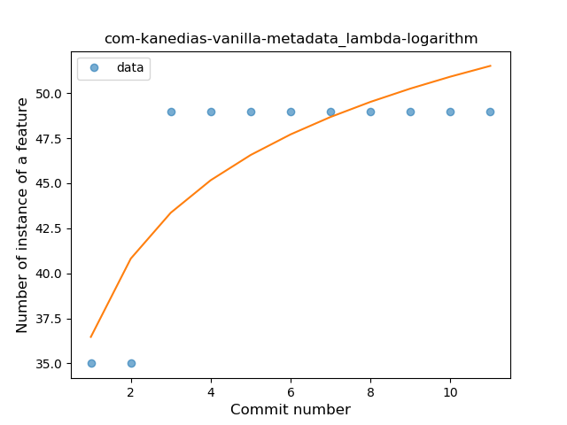
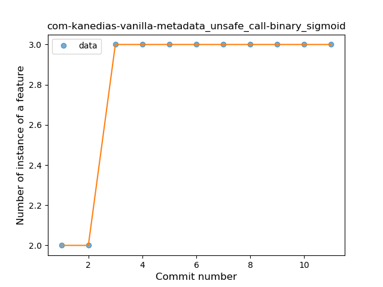
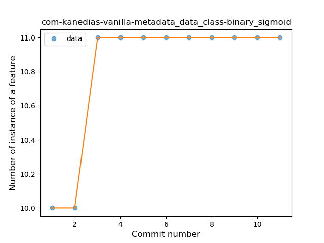

## com-kanedias-vanilla-metadata
----
#### Metrics provided by Detekt
* Number of lines of code 774
* Number of Kotlin files: 4
* Cyclomatic complexity: 59
* Cyclomatic complexity by thousands of lines: 177 

----
**6** features analyzed

*	<a href="#type_inference">Type Inference</a> 
*	<a href="#lambda">Lambda</a> 
*	<a href="#safe_call">Safe Call</a> 
*	<a href="#unsafe_call">Unsafe Call</a> 
*	<a href="#string_template">String Template</a> 
*	<a href="#data_class">Data Class</a> 

### <a name="type_inference">Type Inference</a>
----
#### Functions
* **Instability - Polinomial 3:** )
    * **R_Squared:** 0.84615385
* **Sudden Rise Plateau - Logarithm:** 
    * **R_Squared:** 0.68196254
* **Constant Rise - Linear:** 
    * **R_Squared:** 0.45

**Plots** :chart_with_upwards_trend:
-----

### <a name="lambda">Lambda</a>
----
#### Functions
* **Instability - Polinomial 3:** )
    * **R_Squared:** 0.84615385
* **Sudden Rise Plateau - Logarithm:** 
    * **R_Squared:** 0.68196254
* **Constant Rise - Linear:** 
    * **R_Squared:** 0.45

**Plots** :chart_with_upwards_trend:
-----

### <a name="safe_call">Safe Call</a>
----
#### Functions
* **Instability - Polinomial 3:** )
    * **R_Squared:** 0.84615385
* **Sudden Rise Plateau - Logarithm:** 
    * **R_Squared:** 0.68196254
* **Constant Rise - Linear:** 
    * **R_Squared:** 0.45

**Plots** :chart_with_upwards_trend:
-----

### <a name="unsafe_call">Unsafe Call</a>
----
#### Functions
* **Plateau Sudden Rise - Binary Sigmoid:** 
    * **R_Squared:** 1.0
* **Instability - Polinomial 3:** )
    * **R_Squared:** 0.84615385
* **Sudden Rise Plateau - Logarithm:** 
    * **R_Squared:** 0.68196254
* **Constant Rise - Linear:** 
    * **R_Squared:** 0.45

**Plots** :chart_with_upwards_trend:
-----

### <a name="string_template">String Template</a>
----
#### Functions
* **Plateau Sudden Rise - Binary Sigmoid:** 
    * **R_Squared:** 1.0
* **Instability - Polinomial 3:** )
    * **R_Squared:** 0.84615385
* **Sudden Rise Plateau - Logarithm:** 
    * **R_Squared:** 0.68196254
* **Constant Rise - Linear:** 
    * **R_Squared:** 0.45

**Plots** :chart_with_upwards_trend:
-----

### <a name="data_class">Data Class</a>
----
#### Functions
* **Plateau Sudden Rise - Binary Sigmoid:** 
    * **R_Squared:** 1.0
* **Instability - Polinomial 3:** )
    * **R_Squared:** 0.84615385
* **Sudden Rise Plateau - Logarithm:** 
    * **R_Squared:** 0.68196254
* **Constant Rise - Linear:** 
    * **R_Squared:** 0.45

**Plots** :chart_with_upwards_trend:
-----

