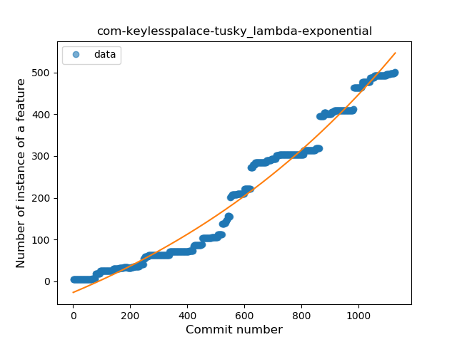
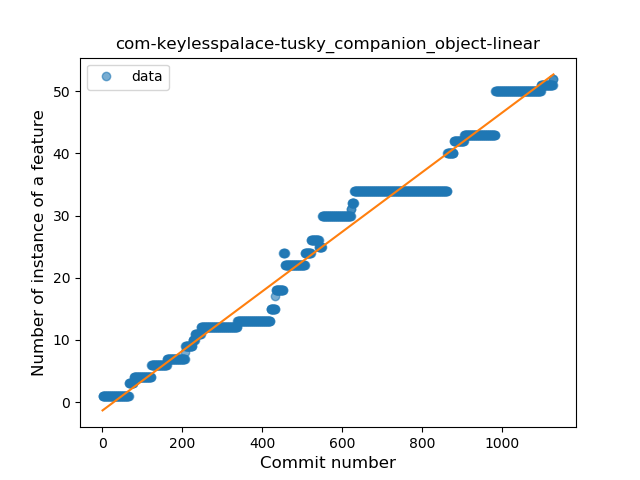
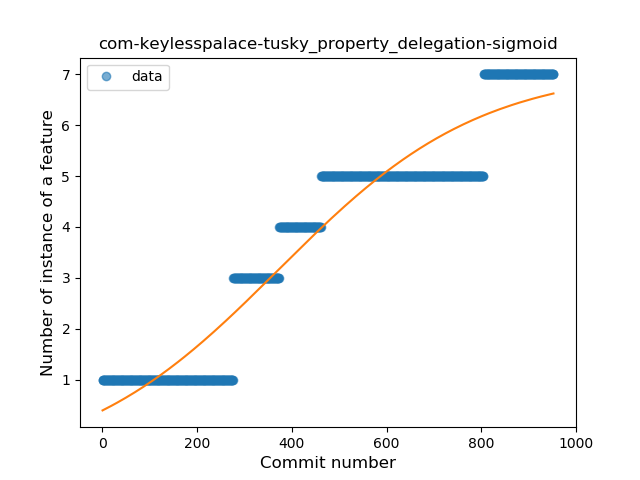

## com-keylesspalace-tusky
----
#### Metrics provided by Detekt
* Number of lines of code 20616
* Number of Kotlin files: 189
* Cyclomatic complexity: 2516
* Cyclomatic complexity by thousands of lines: 239 

----
**18** features analyzed

*	<a href="#type_inference">Type Inference</a> 
*	<a href="#lambda">Lambda</a> 
*	<a href="#safe_call">Safe Call</a> 
*	<a href="#when_expr">When expression</a> 
*	<a href="#unsafe_call">Unsafe Call</a> 
*	<a href="#companion_object">Companion Object</a> 
*	<a href="#string_template">String Template</a> 
*	<a href="#func_with_default_value">Function with Default Value</a> 
*	<a href="#singleton">Singleton</a> 
*	<a href="#range_expr">Range Expression</a> 
*	<a href="#smart_cast">Smart Cast</a> 
*	<a href="#data_class">Data Class</a> 
*	<a href="#func_call_with_named_arg">Function call with Named Argument</a> 
*	<a href="#extension_function">Extension Function</a> 
*	<a href="#property_delegation">Property Delegation</a> 
*	<a href="#destructuring_declaration">Destructuring Declaration</a> 
*	<a href="#sealed_class">Sealed Class</a> 
*	<a href="#type_alias">Type Alias</a> 

### <a name="type_inference">Type Inference</a>
----
#### Functions
* **Constant Rise - Linear:** 
    * **R_Squared:** 0.97195191
* **Sudden Rise Plateau - Logarithm:** 
    * **R_Squared:** 0.4525442
* **Plateau Sudden Rise - Binary Sigmoid:** 
    * **R_Squared:** 0.32767609

**Plots** :chart_with_upwards_trend:
-----

### <a name="lambda">Lambda</a>
----
#### Functions
* **Sudden Rise - Exponential:** 
    * **R_Squared:** 0.9743113
* **Constant Rise - Linear:** 
    * **R_Squared:** 0.95470635
* **Plateau Sudden Rise - Binary Sigmoid:** 
    * **R_Squared:** 0.45851204
* **Sudden Rise Plateau - Logarithm:** 
    * **R_Squared:** 0.29098792

**Plots** :chart_with_upwards_trend:
-----

### <a name="safe_call">Safe Call</a>
----
#### Functions
* **Constant Rise - Linear:** 
    * **R_Squared:** 0.97629609
* **Sudden Rise - Exponential:** 
    * **R_Squared:** 0.97992203
* **Sudden Rise Plateau - Logarithm:** 
    * **R_Squared:** 0.36378256
* **Plateau Sudden Rise - Binary Sigmoid:** 
    * **R_Squared:** 0.31091572

**Plots** :chart_with_upwards_trend:
-----

### <a name="when_expr">When expression</a>
----
#### Functions
* **Constant Rise - Linear:** 
    * **R_Squared:** 0.9650298
* **Sudden Rise Plateau - Logarithm:** 
    * **R_Squared:** 0.46701103

**Plots** :chart_with_upwards_trend:
-----

### <a name="unsafe_call">Unsafe Call</a>
----
#### Functions
* **Constant Rise - Linear:** 
    * **R_Squared:** 0.94723045
* **Plateau Gradual Rise - Sigmoid:** 
    * **R_Squared:** 0.84323133
* **Sudden Rise Plateau - Logarithm:** 
    * **R_Squared:** 0.38898646

**Plots** :chart_with_upwards_trend:
-----

### <a name="companion_object">Companion Object</a>
----
#### Functions
* **Constant Rise - Linear:** 
    * **R_Squared:** 0.97770439
* **Sudden Rise Plateau - Logarithm:** 
    * **R_Squared:** 0.39209179
* **Plateau Sudden Rise - Binary Sigmoid:** 
    * **R_Squared:** 0.0852274

**Plots** :chart_with_upwards_trend:
-----

### <a name="string_template">String Template</a>
----
#### Functions
* **Plateau Gradual Rise - Sigmoid:** 
    * **R_Squared:** 0.96443924
* **Constant Rise - Linear:** 
    * **R_Squared:** 0.9355516
* **Sudden Rise Plateau - Logarithm:** 
    * **R_Squared:** 0.35569926

**Plots** :chart_with_upwards_trend:
-----

### <a name="func_with_default_value">Function with Default Value</a>
----
#### Functions
* **Constant Rise - Linear:** 
    * **R_Squared:** 0.96147565
* **Sudden Rise Plateau - Logarithm:** 
    * **R_Squared:** 0.49556909
* **Plateau Sudden Rise - Binary Sigmoid:** 
    * **R_Squared:** 0.11215069

**Plots** :chart_with_upwards_trend:
-----

### <a name="singleton">Singleton</a>
----
#### Functions
* **Constant Rise - Linear:** 
    * **R_Squared:** 0.89659291
* **Sudden Rise Plateau - Logarithm:** 
    * **R_Squared:** 0.44752841

**Plots** :chart_with_upwards_trend:
-----

### <a name="range_expr">Range Expression</a>
----
#### Functions
* **Plateau Gradual Rise - Sigmoid:** 
    * **R_Squared:** 0.96690558
* **Sudden Rise - Exponential:** 
    * **R_Squared:** 0.93203043
* **Constant Rise - Linear:** 
    * **R_Squared:** 0.91216598
* **Sudden Rise Plateau - Logarithm:** 
    * **R_Squared:** 0.32848445

**Plots** :chart_with_upwards_trend:
-----

### <a name="smart_cast">Smart Cast</a>
----
#### Functions
* **Constant Rise - Linear:** 
    * **R_Squared:** 0.96806412
* **Sudden Rise Plateau - Logarithm:** 
    * **R_Squared:** 0.45571468

**Plots** :chart_with_upwards_trend:
-----

### <a name="data_class">Data Class</a>
----
#### Functions
* **Constant Rise - Linear:** 
    * **R_Squared:** 0.94815425
* **Sudden Rise Plateau - Logarithm:** 
    * **R_Squared:** 0.57240466
* **Plateau Sudden Rise - Binary Sigmoid:** 
    * **R_Squared:** 0.03318614

**Plots** :chart_with_upwards_trend:
-----

### <a name="func_call_with_named_arg">Function call with Named Argument</a>
----
#### Functions
* **Plateau Gradual Rise - Sigmoid:** 
    * **R_Squared:** 0.97049234
* **Constant Rise - Linear:** 
    * **R_Squared:** 0.9305682
* **Sudden Rise Plateau - Logarithm:** 
    * **R_Squared:** 0.34047085

**Plots** :chart_with_upwards_trend:
-----

### <a name="extension_function">Extension Function</a>
----
#### Functions
* **Constant Rise - Linear:** 
    * **R_Squared:** 0.86796369
* **Sudden Rise Plateau - Logarithm:** 
    * **R_Squared:** 0.37683375

**Plots** :chart_with_upwards_trend:
-----

### <a name="property_delegation">Property Delegation</a>
----
#### Functions
* **Constant Rise - Linear:** 
    * **R_Squared:** 0.91093318
* **Plateau Gradual Rise - Sigmoid:** 
    * **R_Squared:** 0.9180898
* **Sudden Rise Plateau - Logarithm:** 
    * **R_Squared:** 0.41881393

**Plots** :chart_with_upwards_trend:
-----

### <a name="destructuring_declaration">Destructuring Declaration</a>
----
#### Functions
* **Plateau Gradual Rise - Sigmoid:** 
    * **R_Squared:** 0.95701081
* **Constant Rise - Linear:** 
    * **R_Squared:** 0.88529218
* **Sudden Rise Plateau - Logarithm:** 
    * **R_Squared:** 0.31223018

**Plots** :chart_with_upwards_trend:
-----

### <a name="sealed_class">Sealed Class</a>
----
#### Functions
* **Plateau Sudden Rise - Binary Sigmoid:** 
    * **R_Squared:** 1.0
* **Constant Rise - Linear:** 
    * **R_Squared:** 0.64373338
* **Sudden Rise Plateau - Logarithm:** 
    * **R_Squared:** 0.59787556

**Plots** :chart_with_upwards_trend:
-----

### <a name="type_alias">Type Alias</a>
----
#### Functions
* **Constant Rise - Linear:** 
    * **R_Squared:** 0.72483496
* **Sudden Rise - Exponential:** 
    * **R_Squared:** 0.7251826
* **Sudden Rise Plateau - Logarithm:** 
    * **R_Squared:** 0.60063889

**Plots** :chart_with_upwards_trend:
-----

