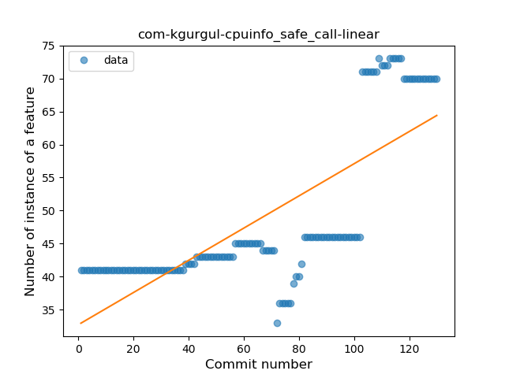
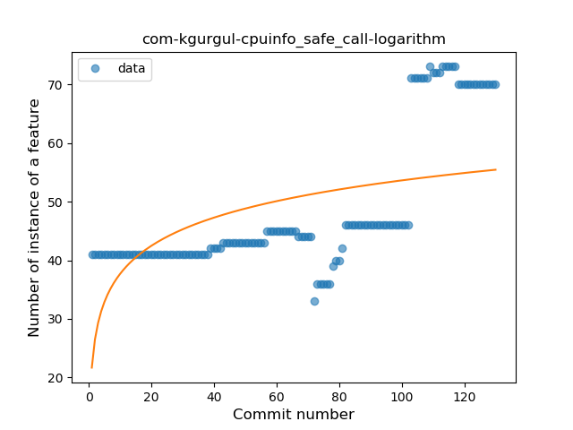
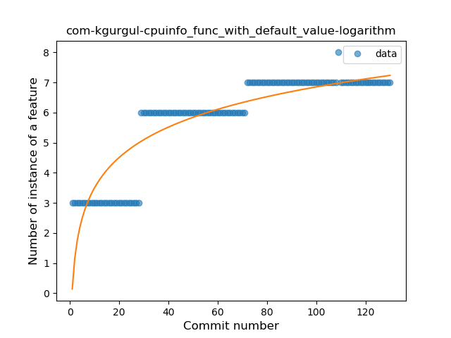
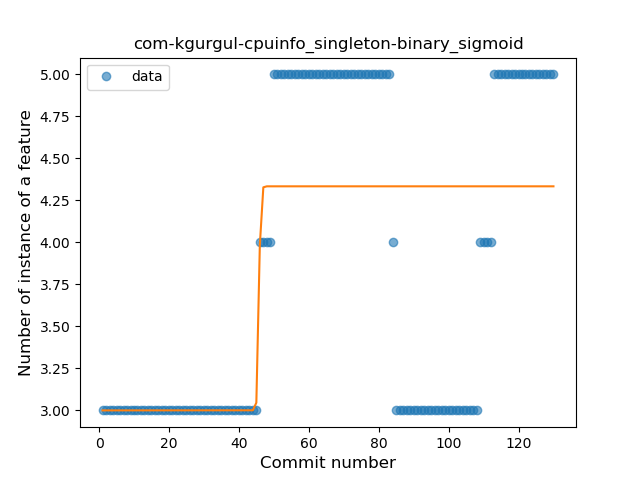
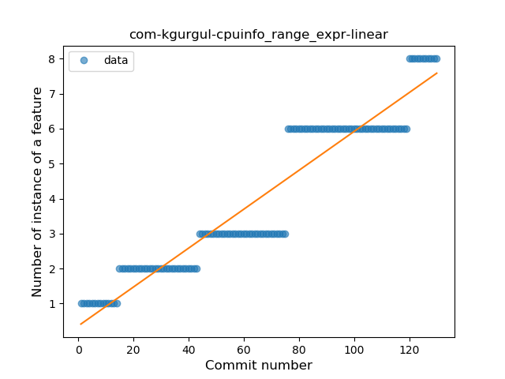
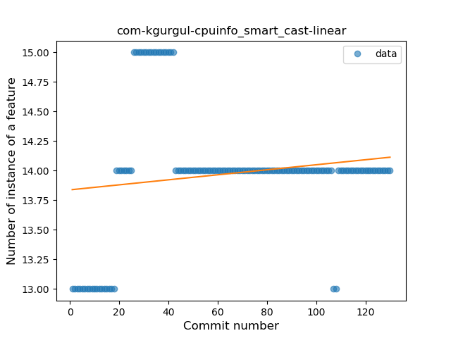
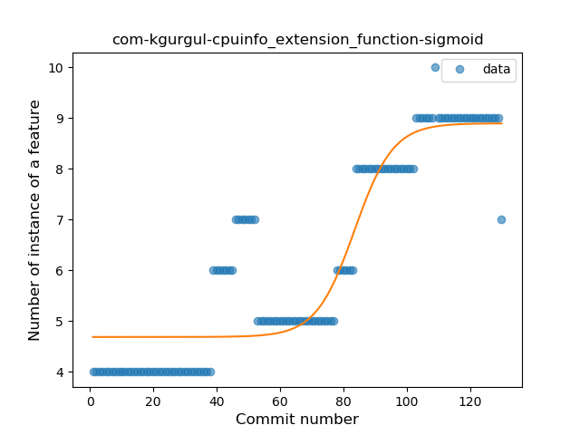

## com-kgurgul-cpuinfo
----
#### Metrics provided by Detekt
* Number of lines of code 8378
* Number of Kotlin files: 91
* Cyclomatic complexity: 831
* Cyclomatic complexity by thousands of lines: 245 

----
**17** features analyzed

*	<a href="#type_inference">Type Inference</a> 
*	<a href="#lambda">Lambda</a> 
*	<a href="#safe_call">Safe Call</a> 
*	<a href="#when_expr">When expression</a> 
*	<a href="#unsafe_call">Unsafe Call</a> 
*	<a href="#companion_object">Companion Object</a> 
*	<a href="#string_template">String Template</a> 
*	<a href="#func_with_default_value">Function with Default Value</a> 
*	<a href="#singleton">Singleton</a> 
*	<a href="#range_expr">Range Expression</a> 
*	<a href="#smart_cast">Smart Cast</a> 
*	<a href="#data_class">Data Class</a> 
*	<a href="#func_call_with_named_arg">Function call with Named Argument</a> 
*	<a href="#extension_function">Extension Function</a> 
*	<a href="#property_delegation">Property Delegation</a> 
*	<a href="#inline_func">Inline Function</a> 
*	<a href="#coroutine">Coroutine</a> 

### <a name="type_inference">Type Inference</a>
----
#### Functions
* **Instability - Polinomial 3:** )
    * **R_Squared:** 0.91400838
* **Sudden Rise Plateau - Logarithm:** 
    * **R_Squared:** 0.81779182
* **Constant Rise - Linear:** 
    * **R_Squared:** 0.62382044

**Plots** :chart_with_upwards_trend:
-----

### <a name="lambda">Lambda</a>
----
#### Functions
* **Instability - Polinomial 3:** )
    * **R_Squared:** 0.86516555
* **Sudden Rise - Exponential:** 
    * **R_Squared:** 0.65337546
* **Constant Rise - Linear:** 
    * **R_Squared:** 0.63034908
* **Sudden Rise Plateau - Logarithm:** 
    * **R_Squared:** 0.6176423

**Plots** :chart_with_upwards_trend:
-----

### <a name="safe_call">Safe Call</a>
----
#### Functions
* **Sudden Rise - Exponential:** 
    * **R_Squared:** 0.78956918
* **Constant Rise - Linear:** 
    * **R_Squared:** 0.58147063
* **Sudden Rise Plateau - Logarithm:** 
    * **R_Squared:** 0.2926402

**Plots** :chart_with_upwards_trend:
-----

### <a name="when_expr">When expression</a>
----
#### Functions
* **Sudden Rise - Exponential:** 
    * **R_Squared:** 0.82690093
* **Constant Rise - Linear:** 
    * **R_Squared:** 0.55955862
* **Sudden Rise Plateau - Logarithm:** 
    * **R_Squared:** 0.27937

**Plots** :chart_with_upwards_trend:
-----

### <a name="unsafe_call">Unsafe Call</a>
----
#### Functions
* **Sudden Rise Plateau - Logarithm:** 
    * **R_Squared:** 0.82546932
* **Constant Rise - Linear:** 
    * **R_Squared:** 0.79098705

**Plots** :chart_with_upwards_trend:
-----

### <a name="companion_object">Companion Object</a>
----
#### Functions
* **Instability - Polinomial 3:** )
    * **R_Squared:** 0.6940186
* **Sudden Rise Plateau - Logarithm:** 
    * **R_Squared:** 0.48489064
* **Constant Rise - Linear:** 
    * **R_Squared:** 0.32986198

**Plots** :chart_with_upwards_trend:
-----

### <a name="string_template">String Template</a>
----
#### Functions
* **Constant Rise - Linear:** 
    * **R_Squared:** 0.69363711
* **Sudden Rise Plateau - Logarithm:** 
    * **R_Squared:** 0.68349061

**Plots** :chart_with_upwards_trend:
-----

### <a name="func_with_default_value">Function with Default Value</a>
----
#### Functions
* **Plateau Gradual Rise - Sigmoid:** 
    * **R_Squared:** 0.91486279
* **Sudden Rise Plateau - Logarithm:** 
    * **R_Squared:** 0.78104281
* **Constant Rise - Linear:** 
    * **R_Squared:** 0.72771228

**Plots** :chart_with_upwards_trend:
-----

### <a name="singleton">Singleton</a>
----
#### Functions
* **Plateau Sudden Rise - Binary Sigmoid:** 
    * **R_Squared:** 0.43873783
* **Constant Rise - Linear:** 
    * **R_Squared:** 0.22471179
* **Sudden Rise Plateau - Logarithm:** 
    * **R_Squared:** 0.23333318

**Plots** :chart_with_upwards_trend:
-----

### <a name="range_expr">Range Expression</a>
----
#### Functions
* **Constant Rise - Linear:** 
    * **R_Squared:** 0.90409233
* **Sudden Rise - Exponential:** 
    * **R_Squared:** 0.91213298
* **Plateau Gradual Rise - Sigmoid:** 
    * **R_Squared:** 0.91639362
* **Sudden Rise Plateau - Logarithm:** 
    * **R_Squared:** 0.52489597

**Plots** :chart_with_upwards_trend:
-----

### <a name="smart_cast">Smart Cast</a>
----
#### Functions
* **Sudden Rise Plateau - Logarithm:** 
    * **R_Squared:** 0.15710188
* **Constant Rise - Linear:** 
    * **R_Squared:** 0.02232393

**Plots** :chart_with_upwards_trend:
-----

### <a name="data_class">Data Class</a>
----
#### Functions
* **Sudden Rise Plateau - Logarithm:** 
    * **R_Squared:** 0.77383968
* **Constant Rise - Linear:** 
    * **R_Squared:** 0.67691977
* **Plateau Sudden Rise - Binary Sigmoid:** 
    * **R_Squared:** 0.00621282

**Plots** :chart_with_upwards_trend:
-----

### <a name="func_call_with_named_arg">Function call with Named Argument</a>
----
#### Functions
* **Plateau Gradual Rise - Sigmoid:** 
    * **R_Squared:** 0.96190639
* **Sudden Rise - Exponential:** 
    * **R_Squared:** 0.87898385
* **Constant Rise - Linear:** 
    * **R_Squared:** 0.79612565
* **Sudden Rise Plateau - Logarithm:** 
    * **R_Squared:** 0.24853594

**Plots** :chart_with_upwards_trend:
-----

### <a name="extension_function">Extension Function</a>
----
#### Functions
* **Plateau Gradual Rise - Sigmoid:** 
    * **R_Squared:** 0.83803081
* **Sudden Rise - Exponential:** 
    * **R_Squared:** 0.81972156
* **Constant Rise - Linear:** 
    * **R_Squared:** 0.80616477
* **Sudden Rise Plateau - Logarithm:** 
    * **R_Squared:** 0.5542969

**Plots** :chart_with_upwards_trend:
-----

### <a name="property_delegation">Property Delegation</a>
----
#### Functions
* **Instability - Polinomial 3:** )
    * **R_Squared:** 0.80673721
* **Plateau Sudden Decline - Binary Sigmoid:** 
    * **R_Squared:** 0.67681592
* **Sudden Decline - Exponential:** 
    * **R_Squared:** 0.62675172
* **Constant Decline - Linear:** 
    * **R_Squared:** 0.56868824
* **Sudden Rise Plateau - Logarithm:** 
    * **R_Squared:** -0.0

**Plots** :chart_with_upwards_trend:
-----

### <a name="inline_func">Inline Function</a>
----
#### Functions
* **Plateau Gradual Rise - Sigmoid:** 
    * **R_Squared:** 0.97746388
* **Sudden Rise - Exponential:** 
    * **R_Squared:** 0.7779289
* **Constant Rise - Linear:** 
    * **R_Squared:** 0.7435651
* **Sudden Rise Plateau - Logarithm:** 
    * **R_Squared:** 0.4303303

**Plots** :chart_with_upwards_trend:
-----

### <a name="coroutine">Coroutine</a>
----
#### Functions
* **Plateau Gradual Rise - Sigmoid:** 
    * **R_Squared:** 0.98098904
* **Sudden Rise - Exponential:** 
    * **R_Squared:** 0.86202228
* **Constant Rise - Linear:** 
    * **R_Squared:** 0.60460705
* **Sudden Rise Plateau - Logarithm:** 
    * **R_Squared:** 0.25024299

**Plots** :chart_with_upwards_trend:
-----

