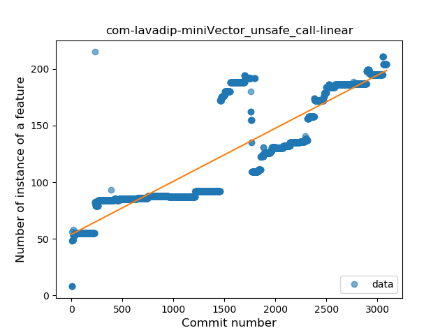
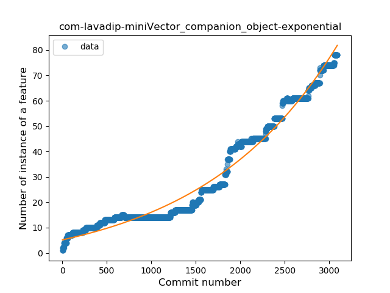
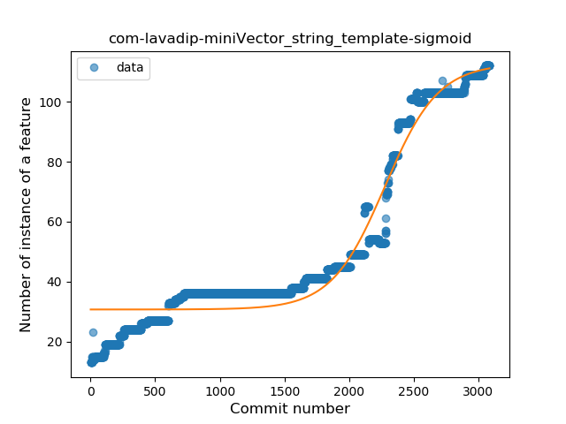
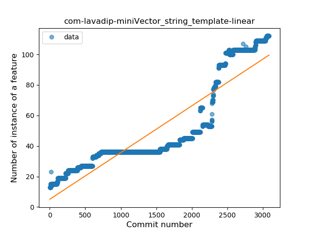
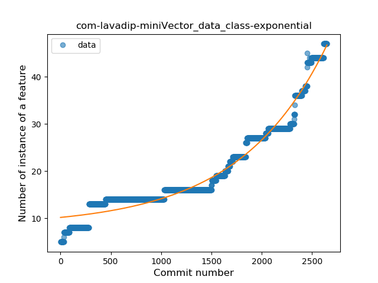
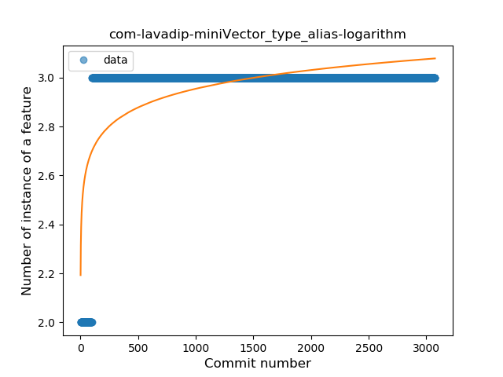
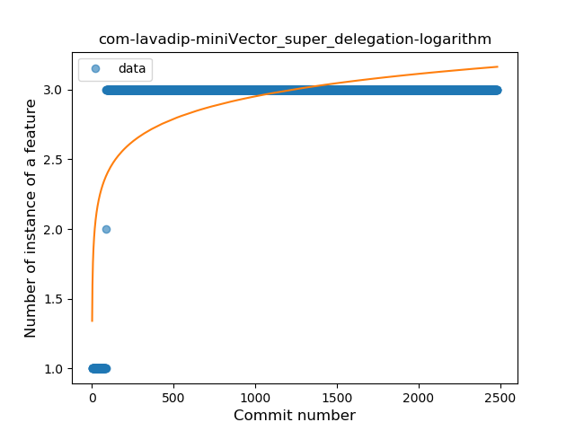

## com-lavadip-miniVector
----
#### Metrics provided by Detekt
* Number of lines of code 30749
* Number of Kotlin files: 222
* Cyclomatic complexity: 3695
* Cyclomatic complexity by thousands of lines: 287 

----
**22** features analyzed

*	<a href="#type_inference">Type Inference</a> 
*	<a href="#lambda">Lambda</a> 
*	<a href="#safe_call">Safe Call</a> 
*	<a href="#when_expr">When expression</a> 
*	<a href="#unsafe_call">Unsafe Call</a> 
*	<a href="#companion_object">Companion Object</a> 
*	<a href="#string_template">String Template</a> 
*	<a href="#func_with_default_value">Function with Default Value</a> 
*	<a href="#singleton">Singleton</a> 
*	<a href="#range_expr">Range Expression</a> 
*	<a href="#smart_cast">Smart Cast</a> 
*	<a href="#data_class">Data Class</a> 
*	<a href="#func_call_with_named_arg">Function call with Named Argument</a> 
*	<a href="#extension_function">Extension Function</a> 
*	<a href="#property_delegation">Property Delegation</a> 
*	<a href="#destructuring_declaration">Destructuring Declaration</a> 
*	<a href="#inline_func">Inline Function</a> 
*	<a href="#overloaded_op">Overloaded Operator</a> 
*	<a href="#coroutine">Coroutine</a> 
*	<a href="#sealed_class">Sealed Class</a> 
*	<a href="#type_alias">Type Alias</a> 
*	<a href="#super_delegation">Super Delegation</a> 

### <a name="type_inference">Type Inference</a>
----
#### Functions
* **Sudden Rise - Exponential:** 
    * **R_Squared:** 0.94681051
* **Constant Rise - Linear:** 
    * **R_Squared:** 0.93611075
* **Sudden Rise Plateau - Logarithm:** 
    * **R_Squared:** 0.40741151
* **Plateau Sudden Rise - Binary Sigmoid:** 
    * **R_Squared:** 0.14426366

**Plots** :chart_with_upwards_trend:
-----

### <a name="lambda">Lambda</a>
----
#### Functions
* **Sudden Rise - Exponential:** 
    * **R_Squared:** 0.95656395
* **Constant Rise - Linear:** 
    * **R_Squared:** 0.923287
* **Sudden Rise Plateau - Logarithm:** 
    * **R_Squared:** 0.35255431
* **Plateau Sudden Rise - Binary Sigmoid:** 
    * **R_Squared:** 0.21850621

**Plots** :chart_with_upwards_trend:
-----

### <a name="safe_call">Safe Call</a>
----
#### Functions
* **Sudden Rise - Exponential:** 
    * **R_Squared:** 0.95958419
* **Constant Rise - Linear:** 
    * **R_Squared:** 0.88748261
* **Sudden Rise Plateau - Logarithm:** 
    * **R_Squared:** 0.19723488
* **Plateau Sudden Rise - Binary Sigmoid:** 
    * **R_Squared:** 0.13389624

**Plots** :chart_with_upwards_trend:
-----

### <a name="when_expr">When expression</a>
----
#### Functions
* **Sudden Rise - Exponential:** 
    * **R_Squared:** 0.9812019
* **Constant Rise - Linear:** 
    * **R_Squared:** 0.91621842
* **Sudden Rise Plateau - Logarithm:** 
    * **R_Squared:** 0.28464923

**Plots** :chart_with_upwards_trend:
-----

### <a name="unsafe_call">Unsafe Call</a>
----
#### Functions
* **Constant Rise - Linear:** 
    * **R_Squared:** 0.7718201
* **Sudden Rise - Exponential:** 
    * **R_Squared:** 0.77254382
* **Sudden Rise Plateau - Logarithm:** 
    * **R_Squared:** 0.43646714
* **Plateau Sudden Rise - Binary Sigmoid:** 
    * **R_Squared:** 0.1090823

**Plots** :chart_with_upwards_trend:
-----

### <a name="companion_object">Companion Object</a>
----
#### Functions
* **Sudden Rise - Exponential:** 
    * **R_Squared:** 0.97523212
* **Constant Rise - Linear:** 
    * **R_Squared:** 0.90870112
* **Sudden Rise Plateau - Logarithm:** 
    * **R_Squared:** 0.26672095
* **Plateau Gradual Rise - Sigmoid:** 
    * **R_Squared:** 0.18259887

**Plots** :chart_with_upwards_trend:
-----

### <a name="string_template">String Template</a>
----
#### Functions
* **Plateau Gradual Rise - Sigmoid:** 
    * **R_Squared:** 0.95588307
* **Sudden Rise - Exponential:** 
    * **R_Squared:** 0.92823239
* **Constant Rise - Linear:** 
    * **R_Squared:** 0.82216721
* **Sudden Rise Plateau - Logarithm:** 
    * **R_Squared:** 0.28987036

**Plots** :chart_with_upwards_trend:
-----

### <a name="func_with_default_value">Function with Default Value</a>
----
#### Functions
* **Sudden Rise - Exponential:** 
    * **R_Squared:** 0.97214557
* **Constant Rise - Linear:** 
    * **R_Squared:** 0.89853001
* **Plateau Sudden Rise - Binary Sigmoid:** 
    * **R_Squared:** 0.37512555
* **Sudden Rise Plateau - Logarithm:** 
    * **R_Squared:** 0.26783319

**Plots** :chart_with_upwards_trend:
-----

### <a name="singleton">Singleton</a>
----
#### Functions
* **Constant Rise - Linear:** 
    * **R_Squared:** 0.941443
* **Sudden Rise - Exponential:** 
    * **R_Squared:** 0.94013551
* **Sudden Rise Plateau - Logarithm:** 
    * **R_Squared:** 0.34185038
* **Plateau Sudden Rise - Binary Sigmoid:** 
    * **R_Squared:** 0.02687255

**Plots** :chart_with_upwards_trend:
-----

### <a name="range_expr">Range Expression</a>
----
#### Functions
* **Plateau Gradual Rise - Sigmoid:** 
    * **R_Squared:** 0.9455827
* **Sudden Rise - Exponential:** 
    * **R_Squared:** 0.9052492
* **Constant Rise - Linear:** 
    * **R_Squared:** 0.7413013
* **Sudden Rise Plateau - Logarithm:** 
    * **R_Squared:** 0.3172347

**Plots** :chart_with_upwards_trend:
-----

### <a name="smart_cast">Smart Cast</a>
----
#### Functions
* **Sudden Rise - Exponential:** 
    * **R_Squared:** 0.95676803
* **Constant Rise - Linear:** 
    * **R_Squared:** 0.88853129
* **Sudden Rise Plateau - Logarithm:** 
    * **R_Squared:** 0.29375069

**Plots** :chart_with_upwards_trend:
-----

### <a name="data_class">Data Class</a>
----
#### Functions
* **Sudden Rise - Exponential:** 
    * **R_Squared:** 0.96510319
* **Constant Rise - Linear:** 
    * **R_Squared:** 0.85734158
* **Sudden Rise Plateau - Logarithm:** 
    * **R_Squared:** 0.3524322
* **Plateau Sudden Rise - Binary Sigmoid:** 
    * **R_Squared:** 0.01071016

**Plots** :chart_with_upwards_trend:
-----

### <a name="func_call_with_named_arg">Function call with Named Argument</a>
----
#### Functions
* **Sudden Rise - Exponential:** 
    * **R_Squared:** 0.93072502
* **Constant Rise - Linear:** 
    * **R_Squared:** 0.64025297
* **Sudden Rise Plateau - Logarithm:** 
    * **R_Squared:** 0.1259757
* **Plateau Gradual Rise - Sigmoid:** 
    * **R_Squared:** 0.05339243

**Plots** :chart_with_upwards_trend:
-----

### <a name="extension_function">Extension Function</a>
----
#### Functions
* **Sudden Rise - Exponential:** 
    * **R_Squared:** 0.9585338
* **Plateau Gradual Rise - Sigmoid:** 
    * **R_Squared:** 0.9670244
* **Constant Rise - Linear:** 
    * **R_Squared:** 0.92313428
* **Sudden Rise Plateau - Logarithm:** 
    * **R_Squared:** 0.31781143

**Plots** :chart_with_upwards_trend:
-----

### <a name="property_delegation">Property Delegation</a>
----
#### Functions
* **Constant Rise - Linear:** 
    * **R_Squared:** 0.7179952
* **Sudden Rise Plateau - Logarithm:** 
    * **R_Squared:** 0.63221491

**Plots** :chart_with_upwards_trend:
-----

### <a name="destructuring_declaration">Destructuring Declaration</a>
----
#### Functions
* **Constant Rise - Linear:** 
    * **R_Squared:** 0.84710703
* **Sudden Rise Plateau - Logarithm:** 
    * **R_Squared:** 0.42977587

**Plots** :chart_with_upwards_trend:
-----

### <a name="inline_func">Inline Function</a>
----
#### Functions
* **Plateau Sudden Rise - Binary Sigmoid:** 
    * **R_Squared:** 1.0
* **Sudden Rise Plateau - Logarithm:** 
    * **R_Squared:** 0.37354808
* **Constant Rise - Linear:** 
    * **R_Squared:** 0.08735848

**Plots** :chart_with_upwards_trend:
-----

### <a name="overloaded_op">Overloaded Operator</a>
----
#### Functions
* **Plateau Sudden Rise - Binary Sigmoid:** 
    * **R_Squared:** 1.0
* **Sudden Rise - Exponential:** 
    * **R_Squared:** 0.79147579
* **Constant Rise - Linear:** 
    * **R_Squared:** 0.33668625
* **Sudden Rise Plateau - Logarithm:** 
    * **R_Squared:** 0.13009708

**Plots** :chart_with_upwards_trend:
-----

### <a name="coroutine">Coroutine</a>
----
#### Functions
* **Constant Rise - Linear:** 
    * **R_Squared:** 0.00585277
* **Sudden Rise - Exponential:** 
    * **R_Squared:** 0.00616551
* **Sudden Rise Plateau - Logarithm:** 
    * **R_Squared:** 0.00331239

**Plots** :chart_with_upwards_trend:
-----

### <a name="sealed_class">Sealed Class</a>
----
#### Functions
* **Constant Rise - Linear:** 
    * **R_Squared:** 0.8979839
* **Sudden Rise Plateau - Logarithm:** 
    * **R_Squared:** 0.5538747

**Plots** :chart_with_upwards_trend:
-----

### <a name="type_alias">Type Alias</a>
----
#### Functions
* **Plateau Sudden Rise - Binary Sigmoid:** 
    * **R_Squared:** 1.0
* **Sudden Rise Plateau - Logarithm:** 
    * **R_Squared:** 0.38884231
* **Constant Rise - Linear:** 
    * **R_Squared:** 0.09256269

**Plots** :chart_with_upwards_trend:
-----

### <a name="super_delegation">Super Delegation</a>
----
#### Functions
* **Sudden Rise Plateau - Logarithm:** 
    * **R_Squared:** 0.40363578
* **Constant Rise - Linear:** 
    * **R_Squared:** 0.10004807

**Plots** :chart_with_upwards_trend:
-----

