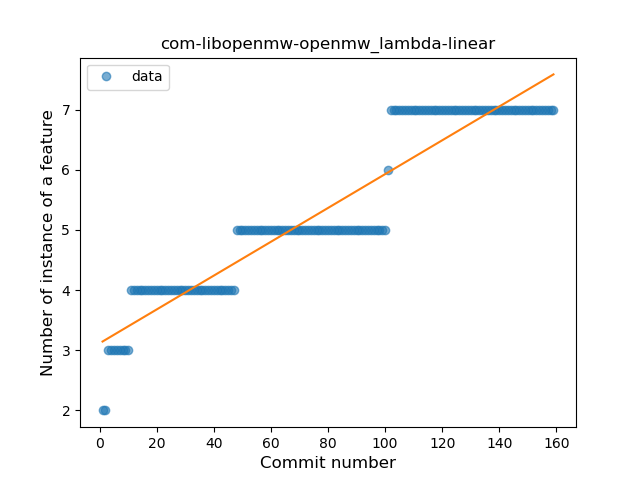
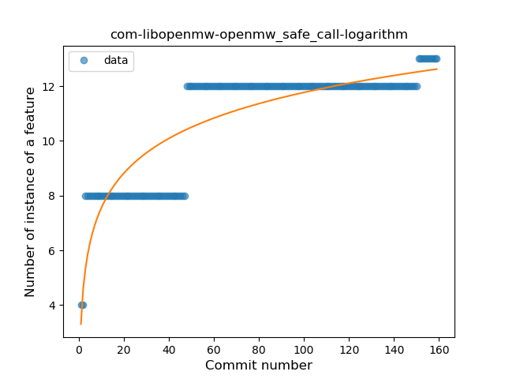

## com-libopenmw-openmw
----
#### Metrics provided by Detekt
* Number of lines of code 842
* Number of Kotlin files: 3
* Cyclomatic complexity: 88
* Cyclomatic complexity by thousands of lines: 184 

----
**6** features analyzed

*	<a href="#type_inference">Type Inference</a> 
*	<a href="#lambda">Lambda</a> 
*	<a href="#safe_call">Safe Call</a> 
*	<a href="#when_expr">When expression</a> 
*	<a href="#string_template">String Template</a> 
*	<a href="#range_expr">Range Expression</a> 

### <a name="type_inference">Type Inference</a>
----
#### Functions
* **Sudden Rise Plateau - Logarithm:** 
    * **R_Squared:** 0.70994075
* **Constant Rise - Linear:** 
    * **R_Squared:** 0.61945762

**Plots** :chart_with_upwards_trend:
-----

### <a name="lambda">Lambda</a>
----
#### Functions
* **Constant Rise - Linear:** 
    * **R_Squared:** 0.88515723
* **Plateau Gradual Rise - Sigmoid:** 
    * **R_Squared:** 0.8893794
* **Sudden Rise Plateau - Logarithm:** 
    * **R_Squared:** 0.75573342

**Plots** :chart_with_upwards_trend:
-----

### <a name="safe_call">Safe Call</a>
----
#### Functions
* **Sudden Rise Plateau - Logarithm:** 
    * **R_Squared:** 0.75107212
* **Constant Rise - Linear:** 
    * **R_Squared:** 0.65593886
* **Plateau Sudden Rise - Binary Sigmoid:** 
    * **R_Squared:** 0.14804921

**Plots** :chart_with_upwards_trend:
-----

### <a name="when_expr">When expression</a>
----
#### Functions
* **Plateau Sudden Rise - Binary Sigmoid:** 
    * **R_Squared:** 1.0
* **Sudden Rise Plateau - Logarithm:** 
    * **R_Squared:** 0.65574037
* **Constant Rise - Linear:** 
    * **R_Squared:** 0.62468354

**Plots** :chart_with_upwards_trend:
-----

### <a name="string_template">String Template</a>
----
#### Functions
* **Plateau Sudden Rise - Binary Sigmoid:** 
    * **R_Squared:** 0.21231423
* **Sudden Rise Plateau - Logarithm:** 
    * **R_Squared:** 0.20042573
* **Constant Rise - Linear:** 
    * **R_Squared:** 0.03726266
* **Sudden Rise - Exponential:** 
    * **R_Squared:** 0.03703772

**Plots** :chart_with_upwards_trend:
-----

### <a name="range_expr">Range Expression</a>
----
#### Functions
* **Plateau Sudden Rise - Binary Sigmoid:** 
    * **R_Squared:** 1.0
* **Sudden Rise Plateau - Logarithm:** 
    * **R_Squared:** 0.65959688
* **Constant Rise - Linear:** 
    * **R_Squared:** 0.6134372

**Plots** :chart_with_upwards_trend:
-----

