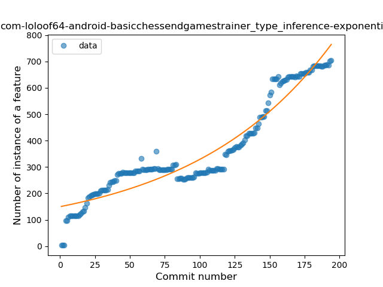
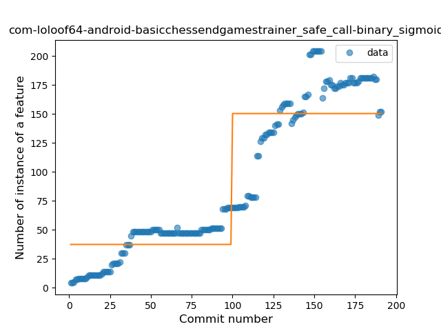
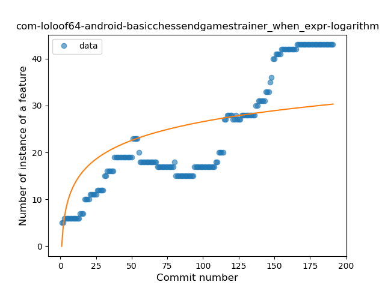
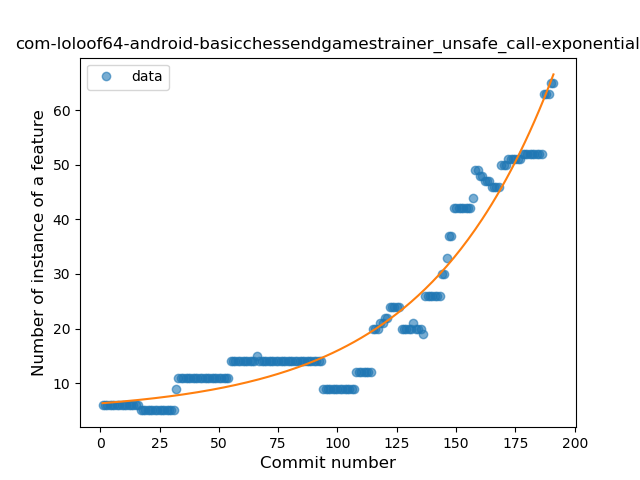
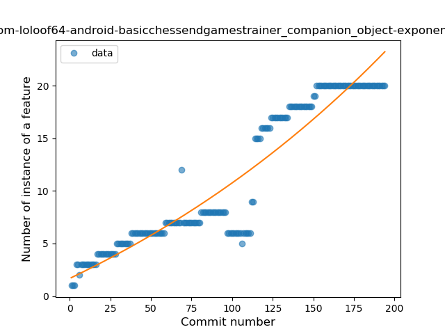
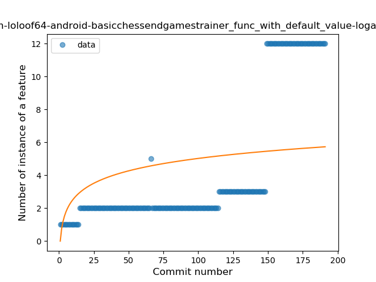
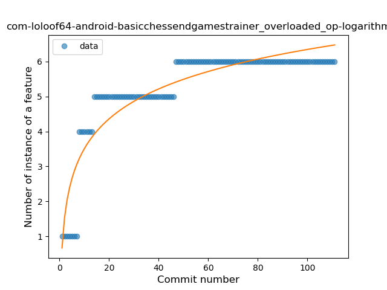
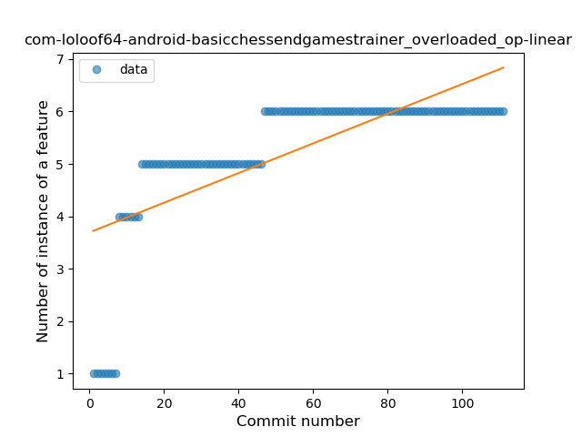
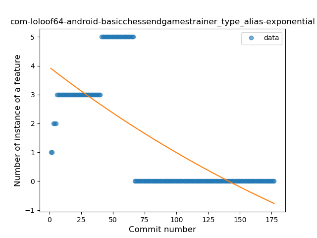

## com-loloof64-android-basicchessendgamestrainer
----
#### Metrics provided by Detekt
* Number of lines of code 6593
* Number of Kotlin files: 36
* Cyclomatic complexity: 1093
* Cyclomatic complexity by thousands of lines: 270 

----
**20** features analyzed

*	<a href="#type_inference">Type Inference</a> 
*	<a href="#lambda">Lambda</a> 
*	<a href="#safe_call">Safe Call</a> 
*	<a href="#when_expr">When expression</a> 
*	<a href="#unsafe_call">Unsafe Call</a> 
*	<a href="#companion_object">Companion Object</a> 
*	<a href="#string_template">String Template</a> 
*	<a href="#func_with_default_value">Function with Default Value</a> 
*	<a href="#singleton">Singleton</a> 
*	<a href="#range_expr">Range Expression</a> 
*	<a href="#smart_cast">Smart Cast</a> 
*	<a href="#data_class">Data Class</a> 
*	<a href="#func_call_with_named_arg">Function call with Named Argument</a> 
*	<a href="#extension_function">Extension Function</a> 
*	<a href="#property_delegation">Property Delegation</a> 
*	<a href="#destructuring_declaration">Destructuring Declaration</a> 
*	<a href="#overloaded_op">Overloaded Operator</a> 
*	<a href="#sealed_class">Sealed Class</a> 
*	<a href="#type_alias">Type Alias</a> 
*	<a href="#infix_func">Infix Function</a> 

### <a name="type_inference">Type Inference</a>
----
#### Functions
* **Sudden Rise - Exponential:** 
    * **R_Squared:** 0.91781392
* **Constant Rise - Linear:** 
    * **R_Squared:** 0.86985671
* **Sudden Rise Plateau - Logarithm:** 
    * **R_Squared:** 0.52481716

**Plots** :chart_with_upwards_trend:
-----

### <a name="lambda">Lambda</a>
----
#### Functions
* **Constant Rise - Linear:** 
    * **R_Squared:** 0.97697765
* **Sudden Rise - Exponential:** 
    * **R_Squared:** 0.98456678
* **Plateau Gradual Rise - Sigmoid:** 
    * **R_Squared:** 0.53895929
* **Sudden Rise Plateau - Logarithm:** 
    * **R_Squared:** 0.48873091

**Plots** :chart_with_upwards_trend:
-----

### <a name="safe_call">Safe Call</a>
----
#### Functions
* **Constant Rise - Linear:** 
    * **R_Squared:** 0.89659612
* **Sudden Rise - Exponential:** 
    * **R_Squared:** 0.90384103
* **Plateau Sudden Rise - Binary Sigmoid:** 
    * **R_Squared:** 0.77321268
* **Sudden Rise Plateau - Logarithm:** 
    * **R_Squared:** 0.4152232

**Plots** :chart_with_upwards_trend:
-----

### <a name="when_expr">When expression</a>
----
#### Functions
* **Sudden Rise - Exponential:** 
    * **R_Squared:** 0.89880899
* **Constant Rise - Linear:** 
    * **R_Squared:** 0.85955166
* **Sudden Rise Plateau - Logarithm:** 
    * **R_Squared:** 0.50773885
* **Plateau Gradual Rise - Sigmoid:** 
    * **R_Squared:** 0.31653612

**Plots** :chart_with_upwards_trend:
-----

### <a name="unsafe_call">Unsafe Call</a>
----
#### Functions
* **Sudden Rise - Exponential:** 
    * **R_Squared:** 0.93876554
* **Constant Rise - Linear:** 
    * **R_Squared:** 0.77883127
* **Sudden Rise Plateau - Logarithm:** 
    * **R_Squared:** 0.31148293
* **Plateau Sudden Rise - Binary Sigmoid:** 
    * **R_Squared:** 0.04401662

**Plots** :chart_with_upwards_trend:
-----

### <a name="companion_object">Companion Object</a>
----
#### Functions
* **Sudden Rise - Exponential:** 
    * **R_Squared:** 0.887983
* **Constant Rise - Linear:** 
    * **R_Squared:** 0.87787131
* **Sudden Rise Plateau - Logarithm:** 
    * **R_Squared:** 0.4591253
* **Plateau Gradual Rise - Sigmoid:** 
    * **R_Squared:** 0.08970193

**Plots** :chart_with_upwards_trend:
-----

### <a name="string_template">String Template</a>
----
#### Functions
* **Sudden Rise - Exponential:** 
    * **R_Squared:** 0.82523205
* **Constant Rise - Linear:** 
    * **R_Squared:** 0.68418806
* **Sudden Rise Plateau - Logarithm:** 
    * **R_Squared:** 0.37700926
* **Plateau Sudden Rise - Binary Sigmoid:** 
    * **R_Squared:** 0.03913085

**Plots** :chart_with_upwards_trend:
-----

### <a name="func_with_default_value">Function with Default Value</a>
----
#### Functions
* **Plateau Gradual Rise - Sigmoid:** 
    * **R_Squared:** 0.98394343
* **Sudden Rise - Exponential:** 
    * **R_Squared:** 0.81727846
* **Constant Rise - Linear:** 
    * **R_Squared:** 0.61279692
* **Sudden Rise Plateau - Logarithm:** 
    * **R_Squared:** 0.21559158

**Plots** :chart_with_upwards_trend:
-----

### <a name="singleton">Singleton</a>
----
#### Functions
* **Plateau Gradual Rise - Sigmoid:** 
    * **R_Squared:** 0.97883822
* **Constant Rise - Linear:** 
    * **R_Squared:** 0.92387877
* **Sudden Rise Plateau - Logarithm:** 
    * **R_Squared:** 0.43518263

**Plots** :chart_with_upwards_trend:
-----

### <a name="range_expr">Range Expression</a>
----
#### Functions
* **Constant Rise - Linear:** 
    * **R_Squared:** 0.91241416
* **Sudden Rise Plateau - Logarithm:** 
    * **R_Squared:** 0.72624932
* **Plateau Gradual Rise - Sigmoid:** 
    * **R_Squared:** 0.60823564

**Plots** :chart_with_upwards_trend:
-----

### <a name="smart_cast">Smart Cast</a>
----
#### Functions
* **Sudden Rise - Exponential:** 
    * **R_Squared:** 0.84145812
* **Constant Rise - Linear:** 
    * **R_Squared:** 0.82268104
* **Sudden Rise Plateau - Logarithm:** 
    * **R_Squared:** 0.38161
* **Plateau Sudden Rise - Binary Sigmoid:** 
    * **R_Squared:** 0.06263676

**Plots** :chart_with_upwards_trend:
-----

### <a name="data_class">Data Class</a>
----
#### Functions
* **Sudden Rise - Exponential:** 
    * **R_Squared:** 0.89745799
* **Constant Rise - Linear:** 
    * **R_Squared:** 0.85979191
* **Sudden Rise Plateau - Logarithm:** 
    * **R_Squared:** 0.34522919
* **Plateau Sudden Rise - Binary Sigmoid:** 
    * **R_Squared:** 0.17137006

**Plots** :chart_with_upwards_trend:
-----

### <a name="func_call_with_named_arg">Function call with Named Argument</a>
----
#### Functions
* **Sudden Rise - Exponential:** 
    * **R_Squared:** 0.91065074
* **Constant Rise - Linear:** 
    * **R_Squared:** 0.78879176
* **Plateau Sudden Rise - Binary Sigmoid:** 
    * **R_Squared:** 0.37529211
* **Sudden Rise Plateau - Logarithm:** 
    * **R_Squared:** 0.30289941

**Plots** :chart_with_upwards_trend:
-----

### <a name="extension_function">Extension Function</a>
----
#### Functions
* **Sudden Rise - Exponential:** 
    * **R_Squared:** 0.92437737
* **Constant Rise - Linear:** 
    * **R_Squared:** 0.83250449
* **Sudden Rise Plateau - Logarithm:** 
    * **R_Squared:** 0.42051885

**Plots** :chart_with_upwards_trend:
-----

### <a name="property_delegation">Property Delegation</a>
----
#### Functions
* **Sudden Rise - Exponential:** 
    * **R_Squared:** 0.1447141
* **Constant Rise - Linear:** 
    * **R_Squared:** 0.08355918
* **Sudden Rise Plateau - Logarithm:** 
    * **R_Squared:** 0.00165482

**Plots** :chart_with_upwards_trend:
-----

### <a name="destructuring_declaration">Destructuring Declaration</a>
----
#### Functions
* **Constant Decline - Linear:** 
    * **R_Squared:** 0.05783244
* **Plateau Gradual Rise - Sigmoid:** 
    * **R_Squared:** 0.06413125
* **Sudden Rise Plateau - Logarithm:** 
    * **R_Squared:** -0.0

**Plots** :chart_with_upwards_trend:
-----

### <a name="overloaded_op">Overloaded Operator</a>
----
#### Functions
* **Sudden Rise Plateau - Logarithm:** 
    * **R_Squared:** 0.8351353
* **Constant Rise - Linear:** 
    * **R_Squared:** 0.52316026

**Plots** :chart_with_upwards_trend:
-----

### <a name="sealed_class">Sealed Class</a>
----
#### Functions
* **Sudden Rise Plateau - Logarithm:** 
    * **R_Squared:** 0.18097581
* **Constant Rise - Linear:** 
    * **R_Squared:** 0.03797468

**Plots** :chart_with_upwards_trend:
-----

### <a name="type_alias">Type Alias</a>
----
#### Functions
* **Constant Decline - Linear:** 
    * **R_Squared:** 0.50154061
* **Sudden Decline - Exponential:** 
    * **R_Squared:** 0.50529485
* **Plateau Sudden Decline - Binary Sigmoid:** 
    * **R_Squared:** 0.33602641
* **Sudden Rise Plateau - Logarithm:** 
    * **R_Squared:** 0.0

**Plots** :chart_with_upwards_trend:
-----

### <a name="infix_func">Infix Function</a>
----
#### Functions
* **Plateau Sudden Rise - Binary Sigmoid:** 
    * **R_Squared:** 0.92483431
* **Sudden Rise Plateau - Logarithm:** 
    * **R_Squared:** 0.57656282
* **Constant Rise - Linear:** 
    * **R_Squared:** 0.44509143

**Plots** :chart_with_upwards_trend:
-----

