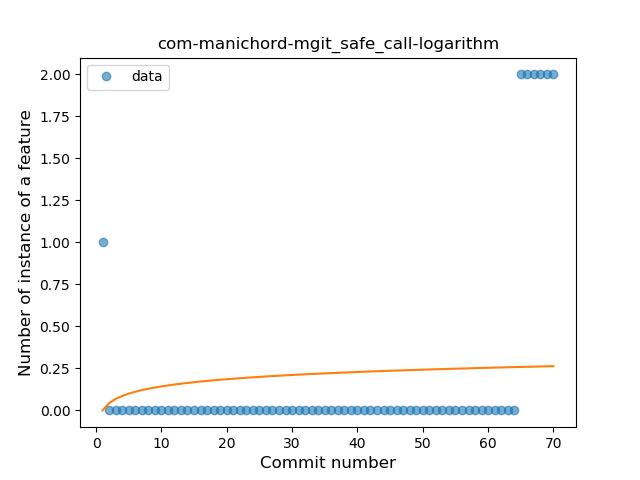

## com-manichord-mgit
----
#### Metrics provided by Detekt
* Number of lines of code 231
* Number of Kotlin files: 8
* Cyclomatic complexity: 31
* Cyclomatic complexity by thousands of lines: 274 

----
**3** features analyzed

*	<a href="#type_inference">Type Inference</a> 
*	<a href="#lambda">Lambda</a> 
*	<a href="#safe_call">Safe Call</a> 

### <a name="type_inference">Type Inference</a>
----
#### Functions
* **Instability - Polinomial 3:** )
    * **R_Squared:** 0.87142133
* **Sudden Rise Plateau - Logarithm:** 
    * **R_Squared:** 0.71473037
* **Constant Rise - Linear:** 
    * **R_Squared:** 0.4624904

**Plots** :chart_with_upwards_trend:
-----

### <a name="lambda">Lambda</a>
----
#### Functions
* **Plateau Sudden Rise - Binary Sigmoid:** 
    * **R_Squared:** 0.66569607
* **Sudden Rise Plateau - Logarithm:** 
    * **R_Squared:** 0.27072404
* **Constant Rise - Linear:** 
    * **R_Squared:** 0.1061991

**Plots** :chart_with_upwards_trend:
-----

### <a name="safe_call">Safe Call</a>
----
#### Functions
* **Sudden Rise - Exponential:** 
    * **R_Squared:** 0.76217383
* **Constant Rise - Linear:** 
    * **R_Squared:** 0.18925018
* **Sudden Rise Plateau - Logarithm:** 
    * **R_Squared:** 0.03175727
* **Plateau Sudden Decline - Binary Sigmoid:** 
    * **R_Squared:** 0.02978301

**Plots** :chart_with_upwards_trend:
-----

