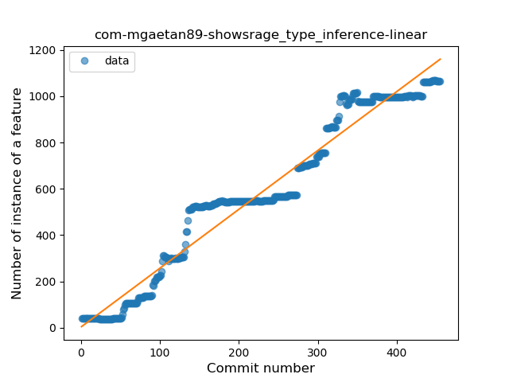
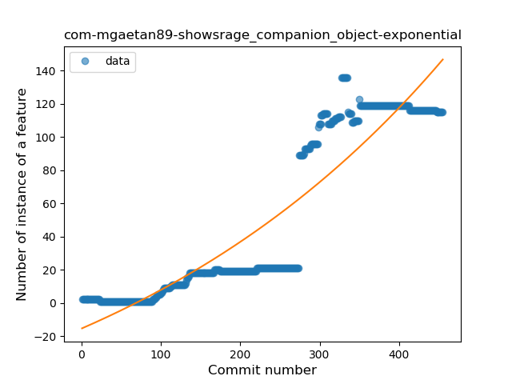

## com-mgaetan89-showsrage
----
#### Metrics provided by Detekt
* Number of lines of code 19052
* Number of Kotlin files: 279
* Cyclomatic complexity: 2126
* Cyclomatic complexity by thousands of lines: 198 

----
**15** features analyzed

*	<a href="#type_inference">Type Inference</a> 
*	<a href="#lambda">Lambda</a> 
*	<a href="#safe_call">Safe Call</a> 
*	<a href="#when_expr">When expression</a> 
*	<a href="#unsafe_call">Unsafe Call</a> 
*	<a href="#companion_object">Companion Object</a> 
*	<a href="#string_template">String Template</a> 
*	<a href="#func_with_default_value">Function with Default Value</a> 
*	<a href="#singleton">Singleton</a> 
*	<a href="#range_expr">Range Expression</a> 
*	<a href="#smart_cast">Smart Cast</a> 
*	<a href="#data_class">Data Class</a> 
*	<a href="#func_call_with_named_arg">Function call with Named Argument</a> 
*	<a href="#extension_function">Extension Function</a> 
*	<a href="#property_delegation">Property Delegation</a> 

### <a name="type_inference">Type Inference</a>
----
#### Functions
* **Constant Rise - Linear:** 
    * **R_Squared:** 0.95688553
* **Plateau Sudden Rise - Binary Sigmoid:** 
    * **R_Squared:** 0.6783704
* **Sudden Rise Plateau - Logarithm:** 
    * **R_Squared:** 0.47144205

**Plots** :chart_with_upwards_trend:
-----

### <a name="lambda">Lambda</a>
----
#### Functions
* **Sudden Rise - Exponential:** 
    * **R_Squared:** 0.94562325
* **Constant Rise - Linear:** 
    * **R_Squared:** 0.91656325
* **Sudden Rise Plateau - Logarithm:** 
    * **R_Squared:** 0.30728046
* **Plateau Sudden Rise - Binary Sigmoid:** 
    * **R_Squared:** 0.29331894

**Plots** :chart_with_upwards_trend:
-----

### <a name="safe_call">Safe Call</a>
----
#### Functions
* **Constant Rise - Linear:** 
    * **R_Squared:** 0.84765271
* **Sudden Rise Plateau - Logarithm:** 
    * **R_Squared:** 0.51934881
* **Plateau Sudden Rise - Binary Sigmoid:** 
    * **R_Squared:** 0.49997354

**Plots** :chart_with_upwards_trend:
-----

### <a name="when_expr">When expression</a>
----
#### Functions
* **Constant Rise - Linear:** 
    * **R_Squared:** 0.90360268
* **Sudden Rise Plateau - Logarithm:** 
    * **R_Squared:** 0.49799028
* **Plateau Sudden Rise - Binary Sigmoid:** 
    * **R_Squared:** 0.28522121

**Plots** :chart_with_upwards_trend:
-----

### <a name="unsafe_call">Unsafe Call</a>
----
#### Functions
* **Plateau Sudden Rise - Binary Sigmoid:** 
    * **R_Squared:** 0.54590148
* **Sudden Rise Plateau - Logarithm:** 
    * **R_Squared:** 0.2280923
* **Constant Rise - Linear:** 
    * **R_Squared:** 0.13441742

**Plots** :chart_with_upwards_trend:
-----

### <a name="companion_object">Companion Object</a>
----
#### Functions
* **Sudden Rise - Exponential:** 
    * **R_Squared:** 0.84234298
* **Constant Rise - Linear:** 
    * **R_Squared:** 0.82396771
* **Plateau Gradual Rise - Sigmoid:** 
    * **R_Squared:** 0.37499253
* **Sudden Rise Plateau - Logarithm:** 
    * **R_Squared:** 0.25076286

**Plots** :chart_with_upwards_trend:
-----

### <a name="string_template">String Template</a>
----
#### Functions
* **Sudden Rise - Exponential:** 
    * **R_Squared:** 0.90642802
* **Constant Rise - Linear:** 
    * **R_Squared:** 0.79259336
* **Sudden Rise Plateau - Logarithm:** 
    * **R_Squared:** 0.2399171
* **Plateau Sudden Rise - Binary Sigmoid:** 
    * **R_Squared:** 0.08951102

**Plots** :chart_with_upwards_trend:
-----

### <a name="func_with_default_value">Function with Default Value</a>
----
#### Functions
* **Constant Rise - Linear:** 
    * **R_Squared:** 0.86058248
* **Sudden Rise Plateau - Logarithm:** 
    * **R_Squared:** 0.5069903

**Plots** :chart_with_upwards_trend:
-----

### <a name="singleton">Singleton</a>
----
#### Functions
* **Plateau Gradual Rise - Sigmoid:** 
    * **R_Squared:** 0.61395832
* **Sudden Rise Plateau - Logarithm:** 
    * **R_Squared:** 0.48476685
* **Constant Rise - Linear:** 
    * **R_Squared:** 0.32166772

**Plots** :chart_with_upwards_trend:
-----

### <a name="range_expr">Range Expression</a>
----
#### Functions
* **Sudden Rise - Exponential:** 
    * **R_Squared:** 0.83112933
* **Constant Rise - Linear:** 
    * **R_Squared:** 0.75242988
* **Sudden Rise Plateau - Logarithm:** 
    * **R_Squared:** 0.25002859
* **Plateau Sudden Rise - Binary Sigmoid:** 
    * **R_Squared:** 0.01614384

**Plots** :chart_with_upwards_trend:
-----

### <a name="smart_cast">Smart Cast</a>
----
#### Functions
* **Sudden Rise Plateau - Logarithm:** 
    * **R_Squared:** 0.76861921
* **Constant Rise - Linear:** 
    * **R_Squared:** 0.5439572

**Plots** :chart_with_upwards_trend:
-----

### <a name="data_class">Data Class</a>
----
#### Functions
* **Plateau Sudden Rise - Binary Sigmoid:** 
    * **R_Squared:** 0.87122548
* **Sudden Rise Plateau - Logarithm:** 
    * **R_Squared:** 0.53311424
* **Constant Rise - Linear:** 
    * **R_Squared:** 0.39813416

**Plots** :chart_with_upwards_trend:
-----

### <a name="func_call_with_named_arg">Function call with Named Argument</a>
----
#### Functions
* **Plateau Gradual Rise - Sigmoid:** 
    * **R_Squared:** 0.99846337
* **Sudden Rise - Exponential:** 
    * **R_Squared:** 0.7597481
* **Constant Rise - Linear:** 
    * **R_Squared:** 0.72360337
* **Sudden Rise Plateau - Logarithm:** 
    * **R_Squared:** 0.26097327

**Plots** :chart_with_upwards_trend:
-----

### <a name="extension_function">Extension Function</a>
----
#### Functions
* **Plateau Gradual Rise - Sigmoid:** 
    * **R_Squared:** 0.95869526
* **Constant Rise - Linear:** 
    * **R_Squared:** 0.61404377
* **Sudden Rise Plateau - Logarithm:** 
    * **R_Squared:** 0.61028414

**Plots** :chart_with_upwards_trend:
-----

### <a name="property_delegation">Property Delegation</a>
----
#### Functions
* **Plateau Gradual Rise - Sigmoid:** 
    * **R_Squared:** 0.28747851
* **Constant Rise - Linear:** 
    * **R_Squared:** 0.18044745
* **Sudden Rise - Exponential:** 
    * **R_Squared:** 0.18121117
* **Sudden Rise Plateau - Logarithm:** 
    * **R_Squared:** 0.07104939

**Plots** :chart_with_upwards_trend:
-----

