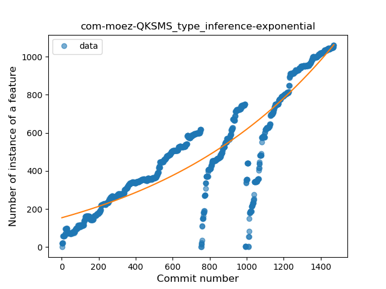
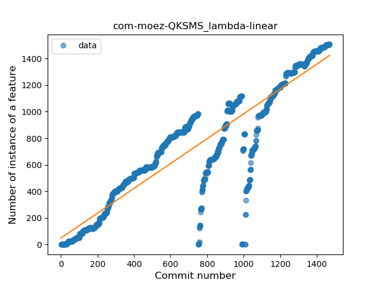
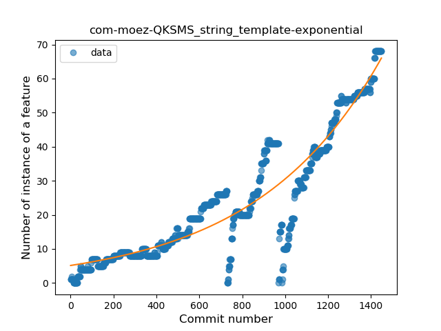
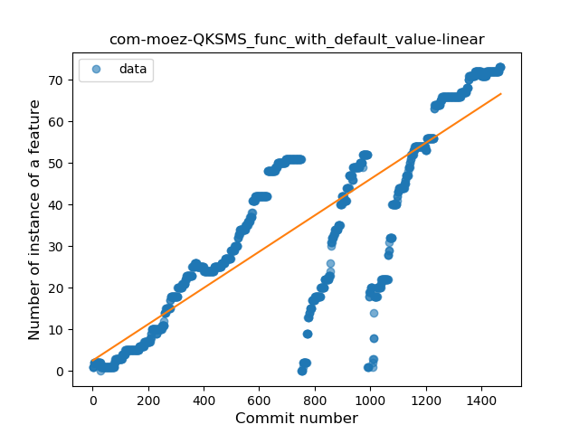
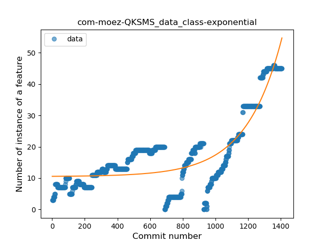
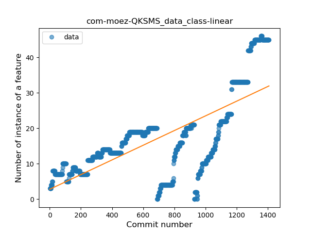
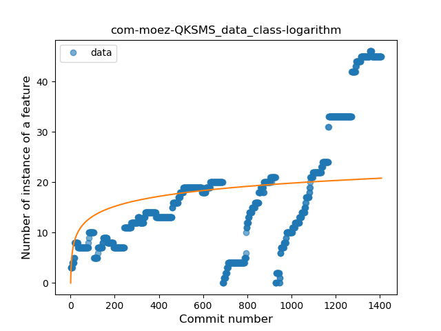
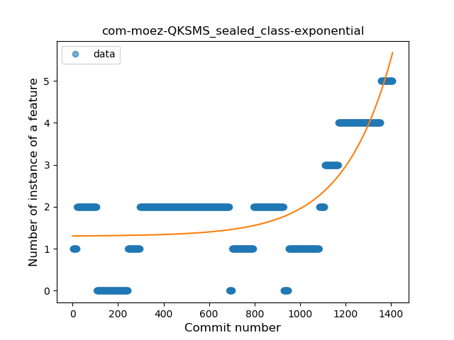

## com-moez-QKSMS
----
#### Metrics provided by Detekt
* Number of lines of code 25838
* Number of Kotlin files: 333
* Cyclomatic complexity: 2566
* Cyclomatic complexity by thousands of lines: 248 

----
**19** features analyzed

*	<a href="#type_inference">Type Inference</a> 
*	<a href="#lambda">Lambda</a> 
*	<a href="#safe_call">Safe Call</a> 
*	<a href="#when_expr">When expression</a> 
*	<a href="#unsafe_call">Unsafe Call</a> 
*	<a href="#companion_object">Companion Object</a> 
*	<a href="#string_template">String Template</a> 
*	<a href="#func_with_default_value">Function with Default Value</a> 
*	<a href="#singleton">Singleton</a> 
*	<a href="#range_expr">Range Expression</a> 
*	<a href="#smart_cast">Smart Cast</a> 
*	<a href="#data_class">Data Class</a> 
*	<a href="#func_call_with_named_arg">Function call with Named Argument</a> 
*	<a href="#extension_function">Extension Function</a> 
*	<a href="#property_delegation">Property Delegation</a> 
*	<a href="#destructuring_declaration">Destructuring Declaration</a> 
*	<a href="#inline_func">Inline Function</a> 
*	<a href="#coroutine">Coroutine</a> 
*	<a href="#sealed_class">Sealed Class</a> 

### <a name="type_inference">Type Inference</a>
----
#### Functions
* **Sudden Rise - Exponential:** 
    * **R_Squared:** 0.81081624
* **Constant Rise - Linear:** 
    * **R_Squared:** 0.79043481
* **Sudden Rise Plateau - Logarithm:** 
    * **R_Squared:** 0.3506554
* **Plateau Sudden Rise - Binary Sigmoid:** 
    * **R_Squared:** 0.2639909

**Plots** :chart_with_upwards_trend:
-----

### <a name="lambda">Lambda</a>
----
#### Functions
* **Constant Rise - Linear:** 
    * **R_Squared:** 0.83176877
* **Sudden Rise Plateau - Logarithm:** 
    * **R_Squared:** 0.37165159
* **Plateau Sudden Rise - Binary Sigmoid:** 
    * **R_Squared:** 0.25739711

**Plots** :chart_with_upwards_trend:
-----

### <a name="safe_call">Safe Call</a>
----
#### Functions
* **Sudden Rise - Exponential:** 
    * **R_Squared:** 0.91271439
* **Constant Rise - Linear:** 
    * **R_Squared:** 0.81517451
* **Sudden Rise Plateau - Logarithm:** 
    * **R_Squared:** 0.23956326
* **Plateau Sudden Rise - Binary Sigmoid:** 
    * **R_Squared:** 0.17969019

**Plots** :chart_with_upwards_trend:
-----

### <a name="when_expr">When expression</a>
----
#### Functions
* **Sudden Rise - Exponential:** 
    * **R_Squared:** 0.86520708
* **Constant Rise - Linear:** 
    * **R_Squared:** 0.80486425
* **Sudden Rise Plateau - Logarithm:** 
    * **R_Squared:** 0.28084331

**Plots** :chart_with_upwards_trend:
-----

### <a name="unsafe_call">Unsafe Call</a>
----
#### Functions
* **Sudden Rise - Exponential:** 
    * **R_Squared:** 0.64981856
* **Constant Rise - Linear:** 
    * **R_Squared:** 0.54628829
* **Sudden Rise Plateau - Logarithm:** 
    * **R_Squared:** 0.15241003

**Plots** :chart_with_upwards_trend:
-----

### <a name="companion_object">Companion Object</a>
----
#### Functions
* **Constant Rise - Linear:** 
    * **R_Squared:** 0.65876556
* **Sudden Rise - Exponential:** 
    * **R_Squared:** 0.66830591
* **Sudden Rise Plateau - Logarithm:** 
    * **R_Squared:** 0.31637308

**Plots** :chart_with_upwards_trend:
-----

### <a name="string_template">String Template</a>
----
#### Functions
* **Sudden Rise - Exponential:** 
    * **R_Squared:** 0.87496484
* **Constant Rise - Linear:** 
    * **R_Squared:** 0.80815096
* **Sudden Rise Plateau - Logarithm:** 
    * **R_Squared:** 0.26677139

**Plots** :chart_with_upwards_trend:
-----

### <a name="func_with_default_value">Function with Default Value</a>
----
#### Functions
* **Constant Rise - Linear:** 
    * **R_Squared:** 0.7100721
* **Sudden Rise - Exponential:** 
    * **R_Squared:** 0.71346606
* **Sudden Rise Plateau - Logarithm:** 
    * **R_Squared:** 0.3162257
* **Plateau Sudden Rise - Binary Sigmoid:** 
    * **R_Squared:** 0.26772761

**Plots** :chart_with_upwards_trend:
-----

### <a name="singleton">Singleton</a>
----
#### Functions
* **Plateau Gradual Rise - Sigmoid:** 
    * **R_Squared:** 0.52140008
* **Sudden Rise - Exponential:** 
    * **R_Squared:** 0.45397808
* **Constant Rise - Linear:** 
    * **R_Squared:** 0.23813731
* **Sudden Rise Plateau - Logarithm:** 
    * **R_Squared:** 0.12746195

**Plots** :chart_with_upwards_trend:
-----

### <a name="range_expr">Range Expression</a>
----
#### Functions
* **Sudden Rise - Exponential:** 
    * **R_Squared:** 0.48284668
* **Constant Rise - Linear:** 
    * **R_Squared:** 0.27449047
* **Sudden Rise Plateau - Logarithm:** 
    * **R_Squared:** 0.18821148

**Plots** :chart_with_upwards_trend:
-----

### <a name="smart_cast">Smart Cast</a>
----
#### Functions
* **Sudden Rise - Exponential:** 
    * **R_Squared:** 0.9026413
* **Constant Rise - Linear:** 
    * **R_Squared:** 0.86436341
* **Sudden Rise Plateau - Logarithm:** 
    * **R_Squared:** 0.27642191
* **Plateau Sudden Rise - Binary Sigmoid:** 
    * **R_Squared:** 0.02158189

**Plots** :chart_with_upwards_trend:
-----

### <a name="data_class">Data Class</a>
----
#### Functions
* **Plateau Gradual Rise - Sigmoid:** 
    * **R_Squared:** 0.81290758
* **Sudden Rise - Exponential:** 
    * **R_Squared:** 0.77370514
* **Constant Rise - Linear:** 
    * **R_Squared:** 0.51999587
* **Sudden Rise Plateau - Logarithm:** 
    * **R_Squared:** 0.20749954

**Plots** :chart_with_upwards_trend:
-----

### <a name="func_call_with_named_arg">Function call with Named Argument</a>
----
#### Functions
* **Constant Rise - Linear:** 
    * **R_Squared:** 0.85966829
* **Sudden Rise - Exponential:** 
    * **R_Squared:** 0.85997697
* **Sudden Rise Plateau - Logarithm:** 
    * **R_Squared:** 0.39267768
* **Plateau Sudden Rise - Binary Sigmoid:** 
    * **R_Squared:** 0.13713115

**Plots** :chart_with_upwards_trend:
-----

### <a name="extension_function">Extension Function</a>
----
#### Functions
* **Sudden Rise - Exponential:** 
    * **R_Squared:** 0.31557561
* **Constant Rise - Linear:** 
    * **R_Squared:** 0.27345355
* **Sudden Rise Plateau - Logarithm:** 
    * **R_Squared:** 0.24246172
* **Plateau Sudden Rise - Binary Sigmoid:** 
    * **R_Squared:** 0.0747847

**Plots** :chart_with_upwards_trend:
-----

### <a name="property_delegation">Property Delegation</a>
----
#### Functions
* **Sudden Rise Plateau - Logarithm:** 
    * **R_Squared:** 0.39872031
* **Constant Rise - Linear:** 
    * **R_Squared:** 0.38608513

**Plots** :chart_with_upwards_trend:
-----

### <a name="destructuring_declaration">Destructuring Declaration</a>
----
#### Functions
* **Plateau Gradual Rise - Sigmoid:** 
    * **R_Squared:** 0.93012389
* **Sudden Rise - Exponential:** 
    * **R_Squared:** 0.8554428
* **Constant Rise - Linear:** 
    * **R_Squared:** 0.74315502
* **Sudden Rise Plateau - Logarithm:** 
    * **R_Squared:** 0.16110603

**Plots** :chart_with_upwards_trend:
-----

### <a name="inline_func">Inline Function</a>
----
#### Functions
* **Plateau Sudden Decline - Binary Sigmoid:** 
    * **R_Squared:** 1.0
* **Constant Decline - Linear:** 
    * **R_Squared:** 0.67352532
* **Sudden Rise Plateau - Logarithm:** 
    * **R_Squared:** -0.0

**Plots** :chart_with_upwards_trend:
-----

### <a name="coroutine">Coroutine</a>
----
#### Functions
* **Plateau Sudden Rise - Binary Sigmoid:** 
    * **R_Squared:** 1.0
* **Sudden Rise Plateau - Logarithm:** 
    * **R_Squared:** 0.59682382
* **Constant Rise - Linear:** 
    * **R_Squared:** 0.2799783

**Plots** :chart_with_upwards_trend:
-----

### <a name="sealed_class">Sealed Class</a>
----
#### Functions
* **Sudden Rise - Exponential:** 
    * **R_Squared:** 0.6318707
* **Constant Rise - Linear:** 
    * **R_Squared:** 0.41449084
* **Sudden Rise Plateau - Logarithm:** 
    * **R_Squared:** 0.16168173
* **Plateau Sudden Rise - Binary Sigmoid:** 
    * **R_Squared:** 0.00748399

**Plots** :chart_with_upwards_trend:
-----

