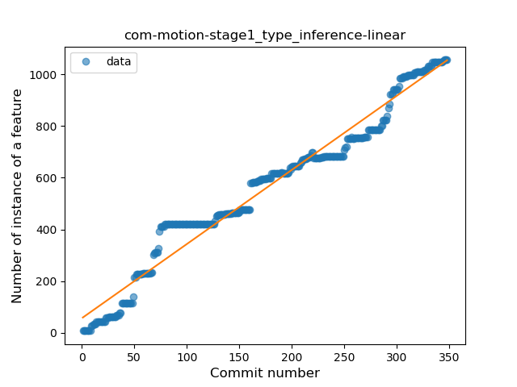
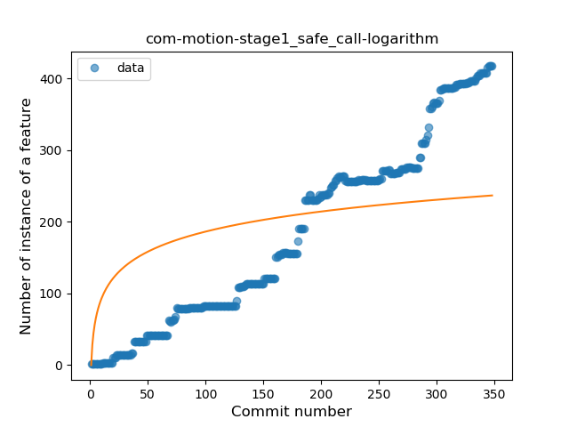
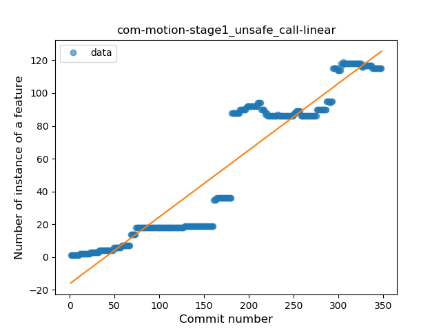
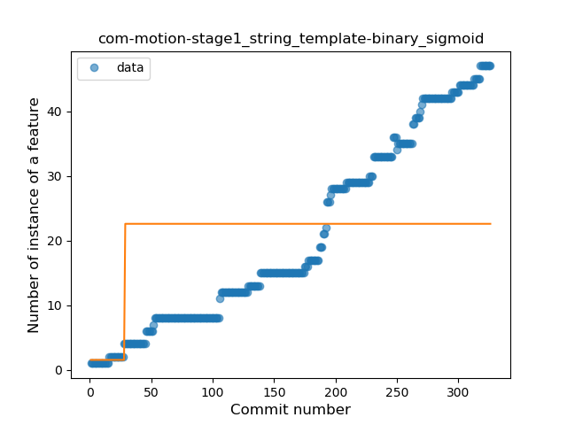
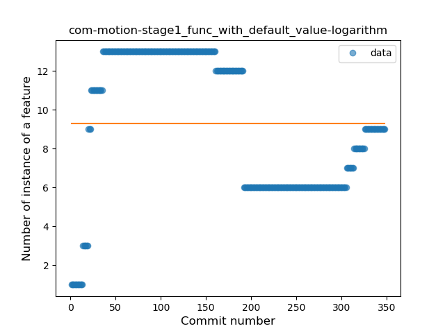
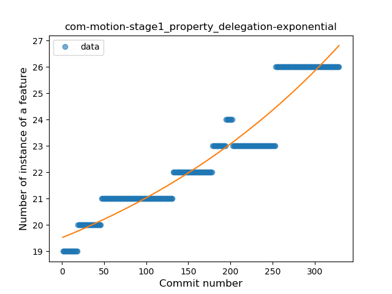
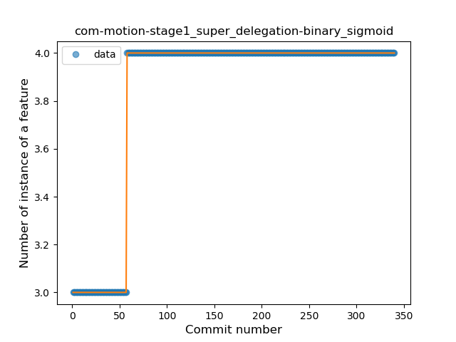

## com-motion-stage1
----
#### Metrics provided by Detekt
* Number of lines of code 17444
* Number of Kotlin files: 191
* Cyclomatic complexity: 2093
* Cyclomatic complexity by thousands of lines: 227 

----
**17** features analyzed

*	<a href="#type_inference">Type Inference</a> 
*	<a href="#lambda">Lambda</a> 
*	<a href="#safe_call">Safe Call</a> 
*	<a href="#when_expr">When expression</a> 
*	<a href="#unsafe_call">Unsafe Call</a> 
*	<a href="#companion_object">Companion Object</a> 
*	<a href="#string_template">String Template</a> 
*	<a href="#func_with_default_value">Function with Default Value</a> 
*	<a href="#singleton">Singleton</a> 
*	<a href="#range_expr">Range Expression</a> 
*	<a href="#smart_cast">Smart Cast</a> 
*	<a href="#data_class">Data Class</a> 
*	<a href="#func_call_with_named_arg">Function call with Named Argument</a> 
*	<a href="#extension_function">Extension Function</a> 
*	<a href="#property_delegation">Property Delegation</a> 
*	<a href="#inline_func">Inline Function</a> 
*	<a href="#super_delegation">Super Delegation</a> 

### <a name="type_inference">Type Inference</a>
----
#### Functions
* **Constant Rise - Linear:** 
    * **R_Squared:** 0.96547017
* **Plateau Sudden Rise - Binary Sigmoid:** 
    * **R_Squared:** 0.64144629
* **Sudden Rise Plateau - Logarithm:** 
    * **R_Squared:** 0.54815206

**Plots** :chart_with_upwards_trend:
-----

### <a name="lambda">Lambda</a>
----
#### Functions
* **Constant Rise - Linear:** 
    * **R_Squared:** 0.97942064
* **Plateau Sudden Rise - Binary Sigmoid:** 
    * **R_Squared:** 0.69364055
* **Sudden Rise Plateau - Logarithm:** 
    * **R_Squared:** 0.5256916

**Plots** :chart_with_upwards_trend:
-----

### <a name="safe_call">Safe Call</a>
----
#### Functions
* **Constant Rise - Linear:** 
    * **R_Squared:** 0.96861928
* **Sudden Rise - Exponential:** 
    * **R_Squared:** 0.9773067
* **Plateau Sudden Rise - Binary Sigmoid:** 
    * **R_Squared:** 0.61500387
* **Sudden Rise Plateau - Logarithm:** 
    * **R_Squared:** 0.40237103

**Plots** :chart_with_upwards_trend:
-----

### <a name="when_expr">When expression</a>
----
#### Functions
* **Sudden Rise - Exponential:** 
    * **R_Squared:** 0.95231702
* **Constant Rise - Linear:** 
    * **R_Squared:** 0.92948059
* **Sudden Rise Plateau - Logarithm:** 
    * **R_Squared:** 0.47948495

**Plots** :chart_with_upwards_trend:
-----

### <a name="unsafe_call">Unsafe Call</a>
----
#### Functions
* **Constant Rise - Linear:** 
    * **R_Squared:** 0.89785722
* **Sudden Rise - Exponential:** 
    * **R_Squared:** 0.90071996
* **Sudden Rise Plateau - Logarithm:** 
    * **R_Squared:** 0.34454378
* **Plateau Sudden Rise - Binary Sigmoid:** 
    * **R_Squared:** 0.20212259

**Plots** :chart_with_upwards_trend:
-----

### <a name="companion_object">Companion Object</a>
----
#### Functions
* **Constant Rise - Linear:** 
    * **R_Squared:** 0.93688246
* **Plateau Sudden Rise - Binary Sigmoid:** 
    * **R_Squared:** 0.65795946
* **Sudden Rise Plateau - Logarithm:** 
    * **R_Squared:** 0.61024642

**Plots** :chart_with_upwards_trend:
-----

### <a name="string_template">String Template</a>
----
#### Functions
* **Sudden Rise - Exponential:** 
    * **R_Squared:** 0.9786431
* **Constant Rise - Linear:** 
    * **R_Squared:** 0.95603373
* **Sudden Rise Plateau - Logarithm:** 
    * **R_Squared:** 0.38991344
* **Plateau Sudden Rise - Binary Sigmoid:** 
    * **R_Squared:** 0.16389743

**Plots** :chart_with_upwards_trend:
-----

### <a name="func_with_default_value">Function with Default Value</a>
----
#### Functions
* **Constant Decline - Linear:** 
    * **R_Squared:** 0.14855767
* **Sudden Rise Plateau - Logarithm:** 
    * **R_Squared:** 0.0

**Plots** :chart_with_upwards_trend:
-----

### <a name="singleton">Singleton</a>
----
#### Functions
* **Sudden Rise Plateau - Logarithm:** 
    * **R_Squared:** 0.90565599
* **Constant Rise - Linear:** 
    * **R_Squared:** 0.6096382

**Plots** :chart_with_upwards_trend:
-----

### <a name="range_expr">Range Expression</a>
----
#### Functions
* **Plateau Gradual Rise - Sigmoid:** 
    * **R_Squared:** 0.94580871
* **Sudden Rise - Exponential:** 
    * **R_Squared:** 0.89369436
* **Constant Rise - Linear:** 
    * **R_Squared:** 0.64238447
* **Sudden Rise Plateau - Logarithm:** 
    * **R_Squared:** 0.2210775

**Plots** :chart_with_upwards_trend:
-----

### <a name="smart_cast">Smart Cast</a>
----
#### Functions
* **Sudden Rise - Exponential:** 
    * **R_Squared:** 0.88328091
* **Constant Rise - Linear:** 
    * **R_Squared:** 0.8547578
* **Sudden Rise Plateau - Logarithm:** 
    * **R_Squared:** 0.50542868
* **Plateau Sudden Rise - Binary Sigmoid:** 
    * **R_Squared:** 0.3239589

**Plots** :chart_with_upwards_trend:
-----

### <a name="data_class">Data Class</a>
----
#### Functions
* **Plateau Sudden Rise - Binary Sigmoid:** 
    * **R_Squared:** 0.9747551
* **Sudden Rise Plateau - Logarithm:** 
    * **R_Squared:** 0.73637077
* **Constant Rise - Linear:** 
    * **R_Squared:** 0.50255082

**Plots** :chart_with_upwards_trend:
-----

### <a name="func_call_with_named_arg">Function call with Named Argument</a>
----
#### Functions
* **Plateau Sudden Rise - Binary Sigmoid:** 
    * **R_Squared:** 1.0
* **Constant Rise - Linear:** 
    * **R_Squared:** 0.74844665
* **Sudden Rise - Exponential:** 
    * **R_Squared:** 0.7502223
* **Sudden Rise Plateau - Logarithm:** 
    * **R_Squared:** 0.4441654

**Plots** :chart_with_upwards_trend:
-----

### <a name="extension_function">Extension Function</a>
----
#### Functions
* **Constant Decline - Linear:** 
    * **R_Squared:** 0.49061665
* **Plateau Sudden Rise - Binary Sigmoid:** 
    * **R_Squared:** 0.01254437
* **Sudden Rise Plateau - Logarithm:** 
    * **R_Squared:** -0.0

**Plots** :chart_with_upwards_trend:
-----

### <a name="property_delegation">Property Delegation</a>
----
#### Functions
* **Sudden Rise - Exponential:** 
    * **R_Squared:** 0.92104764
* **Constant Rise - Linear:** 
    * **R_Squared:** 0.9066267
* **Sudden Rise Plateau - Logarithm:** 
    * **R_Squared:** 0.66781308

**Plots** :chart_with_upwards_trend:
-----

### <a name="inline_func">Inline Function</a>
----
#### Functions
* **Plateau Sudden Decline - Binary Sigmoid:** 
    * **R_Squared:** 1.0
* **Sudden Decline - Exponential:** 
    * **R_Squared:** 0.75300393
* **Constant Decline - Linear:** 
    * **R_Squared:** 0.7229683
* **Sudden Rise Plateau - Logarithm:** 
    * **R_Squared:** -0.0

**Plots** :chart_with_upwards_trend:
-----

### <a name="super_delegation">Super Delegation</a>
----
#### Functions
* **Plateau Sudden Rise - Binary Sigmoid:** 
    * **R_Squared:** 1.0
* **Sudden Rise Plateau - Logarithm:** 
    * **R_Squared:** 0.65633009
* **Constant Rise - Linear:** 
    * **R_Squared:** 0.41862819

**Plots** :chart_with_upwards_trend:
-----

