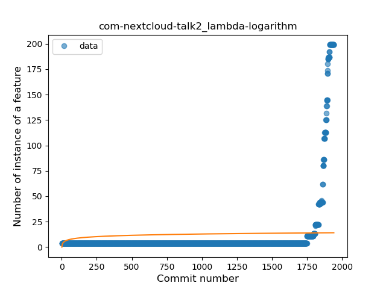
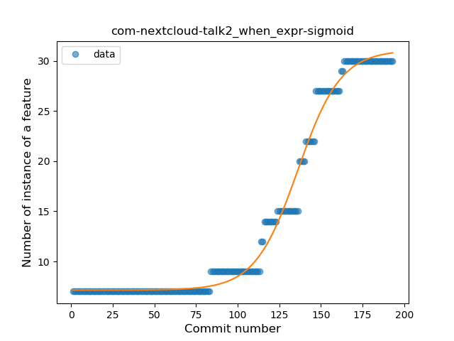
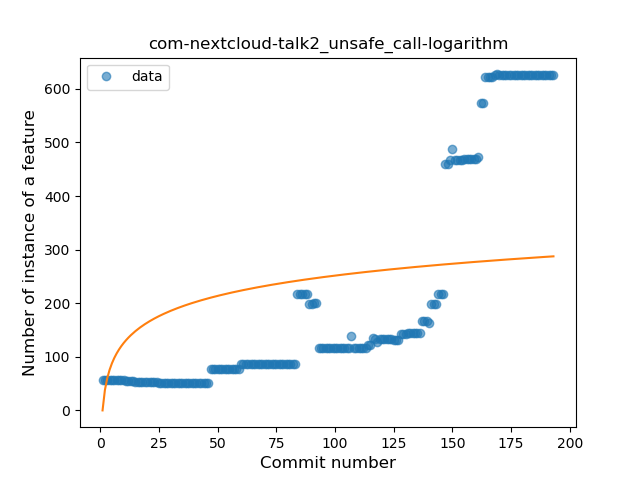
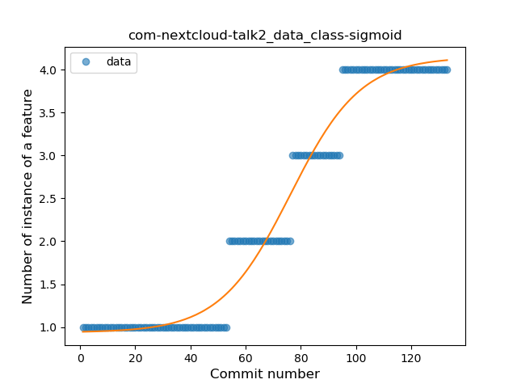

## com-nextcloud-talk2
----
#### Metrics provided by Detekt
* Number of lines of code 12528
* Number of Kotlin files: 77
* Cyclomatic complexity: 1425
* Cyclomatic complexity by thousands of lines: 221 

----
**16** features analyzed

*	<a href="#type_inference">Type Inference</a> 
*	<a href="#lambda">Lambda</a> 
*	<a href="#safe_call">Safe Call</a> 
*	<a href="#when_expr">When expression</a> 
*	<a href="#unsafe_call">Unsafe Call</a> 
*	<a href="#companion_object">Companion Object</a> 
*	<a href="#string_template">String Template</a> 
*	<a href="#func_with_default_value">Function with Default Value</a> 
*	<a href="#singleton">Singleton</a> 
*	<a href="#range_expr">Range Expression</a> 
*	<a href="#smart_cast">Smart Cast</a> 
*	<a href="#data_class">Data Class</a> 
*	<a href="#func_call_with_named_arg">Function call with Named Argument</a> 
*	<a href="#extension_function">Extension Function</a> 
*	<a href="#property_delegation">Property Delegation</a> 
*	<a href="#coroutine">Coroutine</a> 

### <a name="type_inference">Type Inference</a>
----
#### Functions
* **Sudden Rise - Exponential:** 
    * **R_Squared:** 0.96922351
* **Constant Rise - Linear:** 
    * **R_Squared:** 0.22602934
* **Sudden Rise Plateau - Logarithm:** 
    * **R_Squared:** 0.03476848
* **Plateau Sudden Rise - Binary Sigmoid:** 
    * **R_Squared:** 0.00059066

**Plots** :chart_with_upwards_trend:
-----

### <a name="lambda">Lambda</a>
----
#### Functions
* **Sudden Rise - Exponential:** 
    * **R_Squared:** 0.95330996
* **Constant Rise - Linear:** 
    * **R_Squared:** 0.1444846
* **Sudden Rise Plateau - Logarithm:** 
    * **R_Squared:** 0.02197007
* **Plateau Sudden Rise - Binary Sigmoid:** 
    * **R_Squared:** 0.00189584

**Plots** :chart_with_upwards_trend:
-----

### <a name="safe_call">Safe Call</a>
----
#### Functions
* **Sudden Rise - Exponential:** 
    * **R_Squared:** 0.87918141
* **Constant Rise - Linear:** 
    * **R_Squared:** 0.15585035
* **Sudden Rise Plateau - Logarithm:** 
    * **R_Squared:** 0.02009494
* **Plateau Sudden Rise - Binary Sigmoid:** 
    * **R_Squared:** 0.0002692

**Plots** :chart_with_upwards_trend:
-----

### <a name="when_expr">When expression</a>
----
#### Functions
* **Plateau Gradual Rise - Sigmoid:** 
    * **R_Squared:** 0.98916231
* **Sudden Rise - Exponential:** 
    * **R_Squared:** 0.92089672
* **Constant Rise - Linear:** 
    * **R_Squared:** 0.79830717
* **Sudden Rise Plateau - Logarithm:** 
    * **R_Squared:** 0.33820368

**Plots** :chart_with_upwards_trend:
-----

### <a name="unsafe_call">Unsafe Call</a>
----
#### Functions
* **Sudden Rise - Exponential:** 
    * **R_Squared:** 0.89452
* **Constant Rise - Linear:** 
    * **R_Squared:** 0.70962465
* **Sudden Rise Plateau - Logarithm:** 
    * **R_Squared:** 0.23582863

**Plots** :chart_with_upwards_trend:
-----

### <a name="companion_object">Companion Object</a>
----
#### Functions
* **Plateau Gradual Rise - Sigmoid:** 
    * **R_Squared:** 0.97876617
* **Sudden Rise - Exponential:** 
    * **R_Squared:** 0.95811508
* **Constant Rise - Linear:** 
    * **R_Squared:** 0.22083177
* **Sudden Rise Plateau - Logarithm:** 
    * **R_Squared:** 0.04948325

**Plots** :chart_with_upwards_trend:
-----

### <a name="string_template">String Template</a>
----
#### Functions
* **Plateau Gradual Rise - Sigmoid:** 
    * **R_Squared:** 0.8686304
* **Sudden Rise - Exponential:** 
    * **R_Squared:** 0.85513463
* **Constant Rise - Linear:** 
    * **R_Squared:** 0.83468735
* **Sudden Rise Plateau - Logarithm:** 
    * **R_Squared:** 0.48160483

**Plots** :chart_with_upwards_trend:
-----

### <a name="func_with_default_value">Function with Default Value</a>
----
#### Functions
* **Plateau Gradual Rise - Sigmoid:** 
    * **R_Squared:** 0.94810842
* **Constant Rise - Linear:** 
    * **R_Squared:** 0.91339901
* **Sudden Rise - Exponential:** 
    * **R_Squared:** 0.9198635
* **Sudden Rise Plateau - Logarithm:** 
    * **R_Squared:** 0.43682361

**Plots** :chart_with_upwards_trend:
-----

### <a name="singleton">Singleton</a>
----
#### Functions
* **Constant Rise - Linear:** 
    * **R_Squared:** 0.8195981
* **Sudden Rise Plateau - Logarithm:** 
    * **R_Squared:** 0.66034229

**Plots** :chart_with_upwards_trend:
-----

### <a name="range_expr">Range Expression</a>
----
#### Functions
* **Plateau Gradual Rise - Sigmoid:** 
    * **R_Squared:** 0.97040099
* **Sudden Rise - Exponential:** 
    * **R_Squared:** 0.8402551
* **Constant Rise - Linear:** 
    * **R_Squared:** 0.76532703
* **Sudden Rise Plateau - Logarithm:** 
    * **R_Squared:** 0.37204548

**Plots** :chart_with_upwards_trend:
-----

### <a name="smart_cast">Smart Cast</a>
----
#### Functions
* **Plateau Gradual Rise - Sigmoid:** 
    * **R_Squared:** 0.98458755
* **Sudden Rise - Exponential:** 
    * **R_Squared:** 0.93346606
* **Constant Rise - Linear:** 
    * **R_Squared:** 0.12946311
* **Sudden Rise Plateau - Logarithm:** 
    * **R_Squared:** 0.04562075

**Plots** :chart_with_upwards_trend:
-----

### <a name="data_class">Data Class</a>
----
#### Functions
* **Plateau Gradual Rise - Sigmoid:** 
    * **R_Squared:** 0.96936595
* **Sudden Rise - Exponential:** 
    * **R_Squared:** 0.90845537
* **Constant Rise - Linear:** 
    * **R_Squared:** 0.89625776
* **Sudden Rise Plateau - Logarithm:** 
    * **R_Squared:** 0.48324748

**Plots** :chart_with_upwards_trend:
-----

### <a name="func_call_with_named_arg">Function call with Named Argument</a>
----
#### Functions
* **Plateau Gradual Rise - Sigmoid:** 
    * **R_Squared:** 0.92671399
* **Constant Rise - Linear:** 
    * **R_Squared:** 0.90409389
* **Sudden Rise Plateau - Logarithm:** 
    * **R_Squared:** 0.46786577

**Plots** :chart_with_upwards_trend:
-----

### <a name="extension_function">Extension Function</a>
----
#### Functions
* **Plateau Gradual Rise - Sigmoid:** 
    * **R_Squared:** 0.98077793
* **Constant Rise - Linear:** 
    * **R_Squared:** 0.8434128
* **Sudden Rise - Exponential:** 
    * **R_Squared:** 0.84363577
* **Sudden Rise Plateau - Logarithm:** 
    * **R_Squared:** 0.52057609

**Plots** :chart_with_upwards_trend:
-----

### <a name="property_delegation">Property Delegation</a>
----
#### Functions
* **Plateau Gradual Rise - Sigmoid:** 
    * **R_Squared:** 0.98197807
* **Constant Rise - Linear:** 
    * **R_Squared:** 0.77260799
* **Sudden Rise Plateau - Logarithm:** 
    * **R_Squared:** 0.74139612

**Plots** :chart_with_upwards_trend:
-----

### <a name="coroutine">Coroutine</a>
----
#### Functions
* **Plateau Gradual Rise - Sigmoid:** 
    * **R_Squared:** 0.97200265
* **Constant Rise - Linear:** 
    * **R_Squared:** 0.72490282
* **Sudden Rise Plateau - Logarithm:** 
    * **R_Squared:** 0.72800604

**Plots** :chart_with_upwards_trend:
-----

