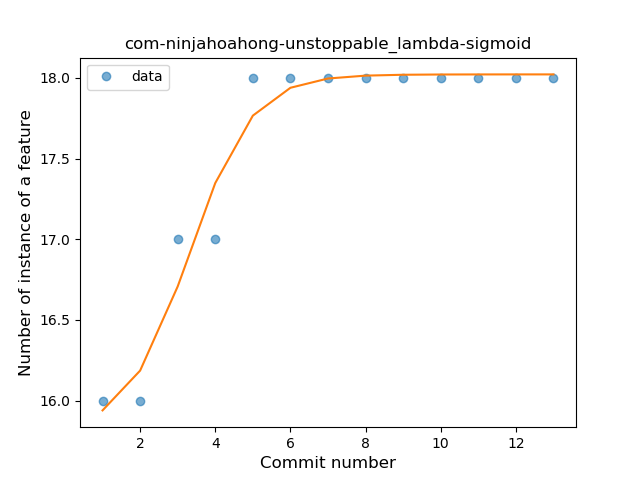

## com-ninjahoahong-unstoppable
----
#### Metrics provided by Detekt
* Number of lines of code 870
* Number of Kotlin files: 23
* Cyclomatic complexity: 135
* Cyclomatic complexity by thousands of lines: 304 

----
**5** features analyzed

*	<a href="#type_inference">Type Inference</a> 
*	<a href="#lambda">Lambda</a> 
*	<a href="#unsafe_call">Unsafe Call</a> 
*	<a href="#string_template">String Template</a> 
*	<a href="#range_expr">Range Expression</a> 

### <a name="type_inference">Type Inference</a>
----
#### Functions
* **Instability - Polinomial 3:** )
    * **R_Squared:** 0.91323295
* **Sudden Rise Plateau - Logarithm:** 
    * **R_Squared:** 0.83656258
* **Constant Rise - Linear:** 
    * **R_Squared:** 0.61509255

**Plots** :chart_with_upwards_trend:
-----

### <a name="lambda">Lambda</a>
----
#### Functions
* **Plateau Gradual Rise - Sigmoid:** 
    * **R_Squared:** 0.95766473
* **Instability - Polinomial 4:** 
    * **R_Squared:** 0.94304569
* **Sudden Rise Plateau - Logarithm:** 
    * **R_Squared:** 0.84068557
* **Constant Rise - Linear:** 
    * **R_Squared:** 0.63905775

**Plots** :chart_with_upwards_trend:
-----

### <a name="unsafe_call">Unsafe Call</a>
----
#### Functions
* **Plateau Gradual Rise - Sigmoid:** 
    * **R_Squared:** 0.91634742
* **Constant Rise - Linear:** 
    * **R_Squared:** 0.83687259
* **Sudden Rise - Exponential:** 
    * **R_Squared:** 0.83813603
* **Sudden Rise Plateau - Logarithm:** 
    * **R_Squared:** 0.72404381

**Plots** :chart_with_upwards_trend:
-----

### <a name="string_template">String Template</a>
----
#### Functions
* **Plateau Sudden Rise - Binary Sigmoid:** 
    * **R_Squared:** 1.0
* **Instability - Polinomial 4:** 
    * **R_Squared:** 0.88968678
* **Sudden Rise - Exponential:** 
    * **R_Squared:** 0.76008193
* **Constant Rise - Linear:** 
    * **R_Squared:** 0.71428571
* **Sudden Rise Plateau - Logarithm:** 
    * **R_Squared:** 0.4953867

**Plots** :chart_with_upwards_trend:
-----

### <a name="range_expr">Range Expression</a>
----
#### Functions
* **Instability - Polinomial 3:** )
    * **R_Squared:** 0.83928571
* **Instability - Polinomial 4:** 
    * **R_Squared:** 0.8487395
* **Sudden Rise Plateau - Logarithm:** 
    * **R_Squared:** 0.64786709
* **Constant Rise - Linear:** 
    * **R_Squared:** 0.39285714

**Plots** :chart_with_upwards_trend:
-----

