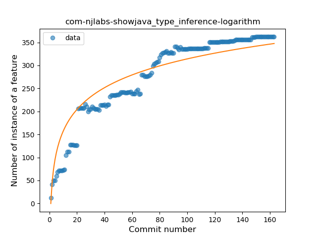
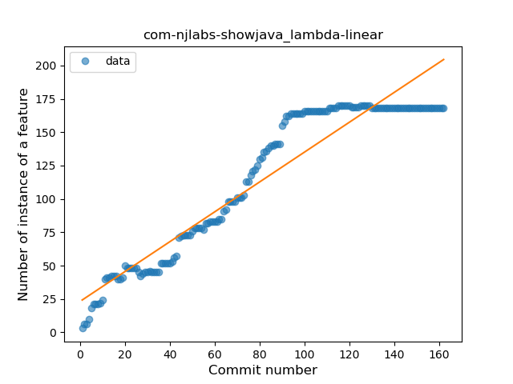
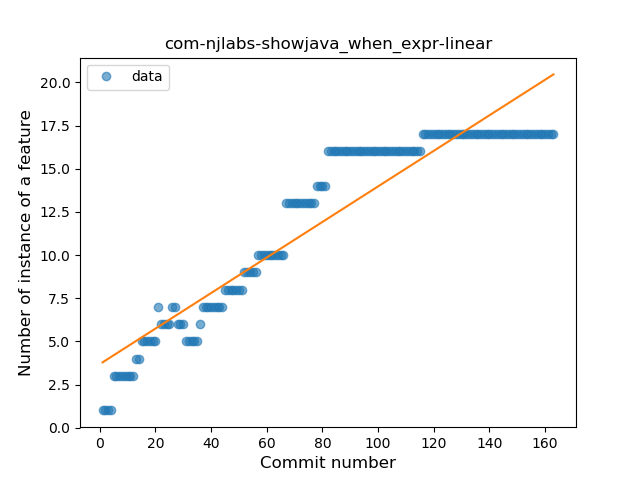
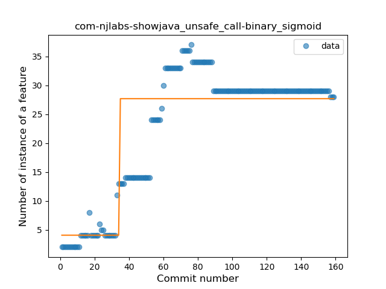
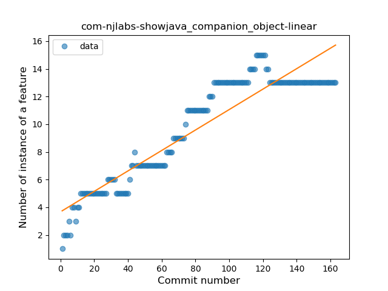
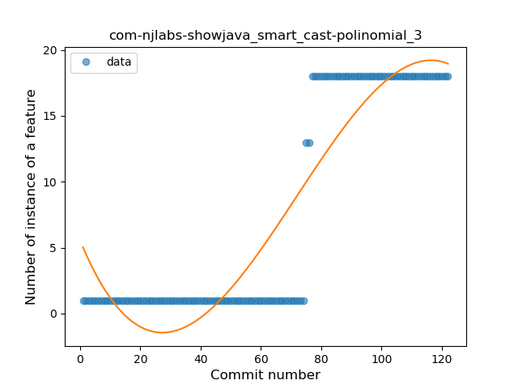
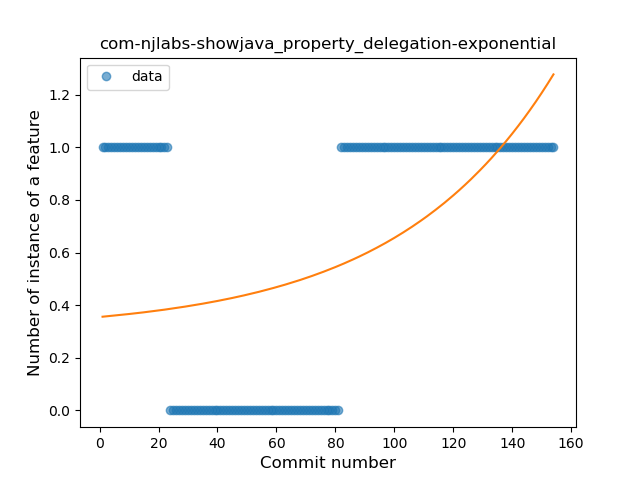

## com-njlabs-showjava
----
#### Metrics provided by Detekt
* Number of lines of code 7129
* Number of Kotlin files: 58
* Cyclomatic complexity: 812
* Cyclomatic complexity by thousands of lines: 247 

----
**13** features analyzed

*	<a href="#type_inference">Type Inference</a> 
*	<a href="#lambda">Lambda</a> 
*	<a href="#safe_call">Safe Call</a> 
*	<a href="#when_expr">When expression</a> 
*	<a href="#unsafe_call">Unsafe Call</a> 
*	<a href="#companion_object">Companion Object</a> 
*	<a href="#string_template">String Template</a> 
*	<a href="#func_with_default_value">Function with Default Value</a> 
*	<a href="#singleton">Singleton</a> 
*	<a href="#smart_cast">Smart Cast</a> 
*	<a href="#func_call_with_named_arg">Function call with Named Argument</a> 
*	<a href="#extension_function">Extension Function</a> 
*	<a href="#property_delegation">Property Delegation</a> 

### <a name="type_inference">Type Inference</a>
----
#### Functions
* **Sudden Rise Plateau - Logarithm:** 
    * **R_Squared:** 0.87469491
* **Constant Rise - Linear:** 
    * **R_Squared:** 0.84495618

**Plots** :chart_with_upwards_trend:
-----

### <a name="lambda">Lambda</a>
----
#### Functions
* **Constant Rise - Linear:** 
    * **R_Squared:** 0.90362085
* **Sudden Rise Plateau - Logarithm:** 
    * **R_Squared:** 0.64193722
* **Plateau Sudden Rise - Binary Sigmoid:** 
    * **R_Squared:** 0.21561251

**Plots** :chart_with_upwards_trend:
-----

### <a name="safe_call">Safe Call</a>
----
#### Functions
* **Constant Rise - Linear:** 
    * **R_Squared:** 0.83573383
* **Sudden Rise Plateau - Logarithm:** 
    * **R_Squared:** 0.81843851
* **Plateau Gradual Rise - Sigmoid:** 
    * **R_Squared:** 0.68033476

**Plots** :chart_with_upwards_trend:
-----

### <a name="when_expr">When expression</a>
----
#### Functions
* **Constant Rise - Linear:** 
    * **R_Squared:** 0.88418775
* **Sudden Rise Plateau - Logarithm:** 
    * **R_Squared:** 0.71299253

**Plots** :chart_with_upwards_trend:
-----

### <a name="unsafe_call">Unsafe Call</a>
----
#### Functions
* **Plateau Sudden Rise - Binary Sigmoid:** 
    * **R_Squared:** 0.74692967
* **Constant Rise - Linear:** 
    * **R_Squared:** 0.60017945
* **Sudden Rise Plateau - Logarithm:** 
    * **R_Squared:** 0.57694713

**Plots** :chart_with_upwards_trend:
-----

### <a name="companion_object">Companion Object</a>
----
#### Functions
* **Constant Rise - Linear:** 
    * **R_Squared:** 0.86025386
* **Sudden Rise Plateau - Logarithm:** 
    * **R_Squared:** 0.72370069

**Plots** :chart_with_upwards_trend:
-----

### <a name="string_template">String Template</a>
----
#### Functions
* **Constant Rise - Linear:** 
    * **R_Squared:** 0.79134773
* **Sudden Rise Plateau - Logarithm:** 
    * **R_Squared:** 0.78976463

**Plots** :chart_with_upwards_trend:
-----

### <a name="func_with_default_value">Function with Default Value</a>
----
#### Functions
* **Constant Rise - Linear:** 
    * **R_Squared:** 0.83868682
* **Sudden Rise Plateau - Logarithm:** 
    * **R_Squared:** 0.56670585

**Plots** :chart_with_upwards_trend:
-----

### <a name="singleton">Singleton</a>
----
#### Functions
* **Plateau Gradual Rise - Sigmoid:** 
    * **R_Squared:** 0.42329687
* **Constant Decline - Linear:** 
    * **R_Squared:** 0.0458687
* **Sudden Rise Plateau - Logarithm:** 
    * **R_Squared:** 0.00616863

**Plots** :chart_with_upwards_trend:
-----

### <a name="smart_cast">Smart Cast</a>
----
#### Functions
* **Instability - Polinomial 3:** )
    * **R_Squared:** 0.84205956
* **Sudden Rise - Exponential:** 
    * **R_Squared:** 0.76475533
* **Constant Rise - Linear:** 
    * **R_Squared:** 0.72285198
* **Sudden Rise Plateau - Logarithm:** 
    * **R_Squared:** 0.25072718

**Plots** :chart_with_upwards_trend:
-----

### <a name="func_call_with_named_arg">Function call with Named Argument</a>
----
#### Functions
* **Sudden Decline - Exponential:** 
    * **R_Squared:** 1.0
* **Constant Decline - Linear:** 
    * **R_Squared:** 0.01875
* **Sudden Rise Plateau - Logarithm:** 
    * **R_Squared:** -0.0

**Plots** :chart_with_upwards_trend:
-----

### <a name="extension_function">Extension Function</a>
----
#### Functions
* **Plateau Gradual Rise - Sigmoid:** 
    * **R_Squared:** 0.90039439
* **Sudden Rise Plateau - Logarithm:** 
    * **R_Squared:** 0.77428946
* **Constant Rise - Linear:** 
    * **R_Squared:** 0.75548572

**Plots** :chart_with_upwards_trend:
-----

### <a name="property_delegation">Property Delegation</a>
----
#### Functions
* **Sudden Rise - Exponential:** 
    * **R_Squared:** 0.27193444
* **Constant Rise - Linear:** 
    * **R_Squared:** 0.19107105
* **Sudden Rise Plateau - Logarithm:** 
    * **R_Squared:** 0.01628753

**Plots** :chart_with_upwards_trend:
-----

