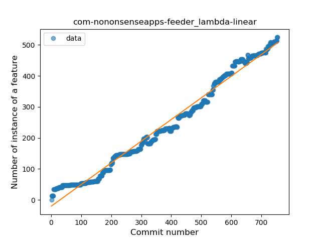
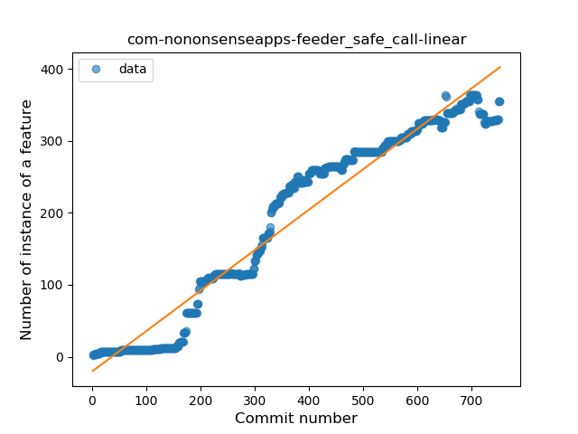
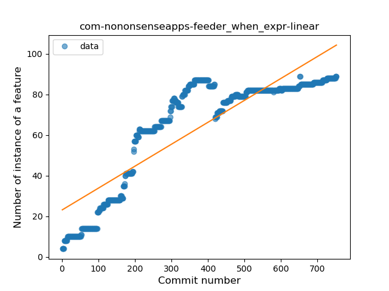
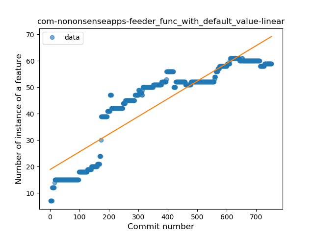
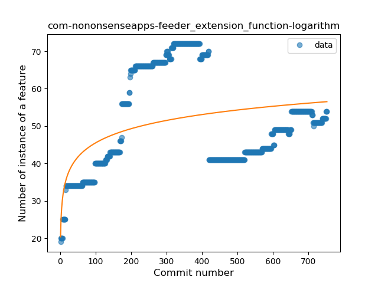
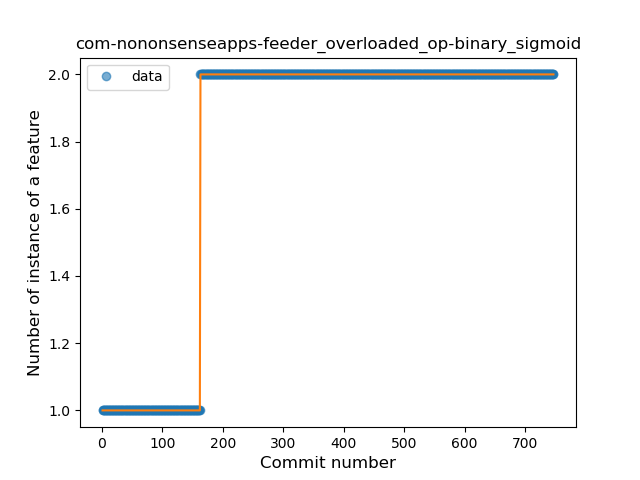
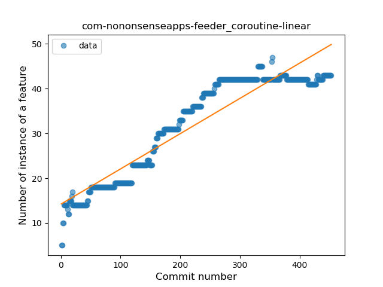
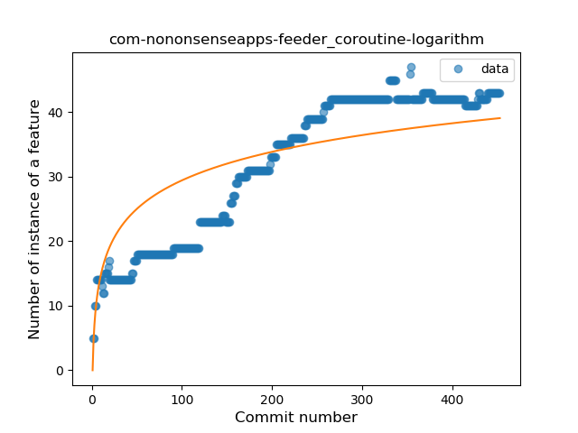
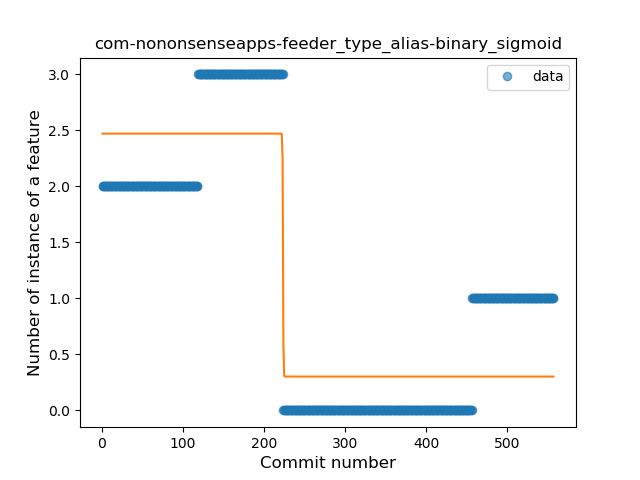
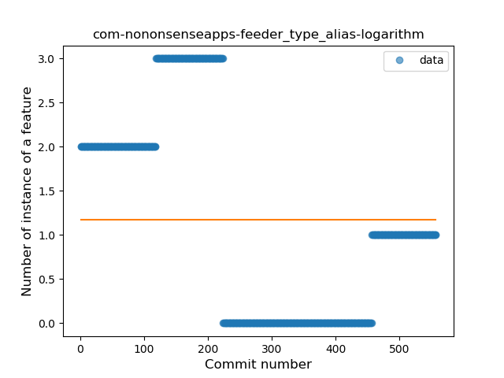

## com-nononsenseapps-feeder
----
#### Metrics provided by Detekt
* Number of lines of code 13872
* Number of Kotlin files: 116
* Cyclomatic complexity: 1719
* Cyclomatic complexity by thousands of lines: 219 

----
**21** features analyzed

*	<a href="#type_inference">Type Inference</a> 
*	<a href="#lambda">Lambda</a> 
*	<a href="#safe_call">Safe Call</a> 
*	<a href="#when_expr">When expression</a> 
*	<a href="#unsafe_call">Unsafe Call</a> 
*	<a href="#companion_object">Companion Object</a> 
*	<a href="#string_template">String Template</a> 
*	<a href="#func_with_default_value">Function with Default Value</a> 
*	<a href="#singleton">Singleton</a> 
*	<a href="#range_expr">Range Expression</a> 
*	<a href="#smart_cast">Smart Cast</a> 
*	<a href="#data_class">Data Class</a> 
*	<a href="#func_call_with_named_arg">Function call with Named Argument</a> 
*	<a href="#extension_function">Extension Function</a> 
*	<a href="#property_delegation">Property Delegation</a> 
*	<a href="#destructuring_declaration">Destructuring Declaration</a> 
*	<a href="#inline_func">Inline Function</a> 
*	<a href="#overloaded_op">Overloaded Operator</a> 
*	<a href="#coroutine">Coroutine</a> 
*	<a href="#type_alias">Type Alias</a> 
*	<a href="#super_delegation">Super Delegation</a> 

### <a name="type_inference">Type Inference</a>
----
#### Functions
* **Constant Rise - Linear:** 
    * **R_Squared:** 0.89521876
* **Plateau Sudden Rise - Binary Sigmoid:** 
    * **R_Squared:** 0.63664034
* **Sudden Rise Plateau - Logarithm:** 
    * **R_Squared:** 0.51189689

**Plots** :chart_with_upwards_trend:
-----

### <a name="lambda">Lambda</a>
----
#### Functions
* **Constant Rise - Linear:** 
    * **R_Squared:** 0.98325203
* **Sudden Rise - Exponential:** 
    * **R_Squared:** 0.99133239
* **Plateau Sudden Rise - Binary Sigmoid:** 
    * **R_Squared:** 0.73583275
* **Sudden Rise Plateau - Logarithm:** 
    * **R_Squared:** 0.3889515

**Plots** :chart_with_upwards_trend:
-----

### <a name="safe_call">Safe Call</a>
----
#### Functions
* **Constant Rise - Linear:** 
    * **R_Squared:** 0.94554087
* **Plateau Sudden Rise - Binary Sigmoid:** 
    * **R_Squared:** 0.77482813
* **Sudden Rise Plateau - Logarithm:** 
    * **R_Squared:** 0.39716475

**Plots** :chart_with_upwards_trend:
-----

### <a name="when_expr">When expression</a>
----
#### Functions
* **Constant Rise - Linear:** 
    * **R_Squared:** 0.76175299
* **Sudden Rise Plateau - Logarithm:** 
    * **R_Squared:** 0.59119078
* **Plateau Gradual Rise - Sigmoid:** 
    * **R_Squared:** 0.27698415

**Plots** :chart_with_upwards_trend:
-----

### <a name="unsafe_call">Unsafe Call</a>
----
#### Functions
* **Sudden Rise Plateau - Logarithm:** 
    * **R_Squared:** 0.39620207
* **Constant Rise - Linear:** 
    * **R_Squared:** 0.37393612
* **Plateau Sudden Rise - Binary Sigmoid:** 
    * **R_Squared:** 0.29966235

**Plots** :chart_with_upwards_trend:
-----

### <a name="companion_object">Companion Object</a>
----
#### Functions
* **Plateau Gradual Rise - Sigmoid:** 
    * **R_Squared:** 0.50109739
* **Sudden Rise Plateau - Logarithm:** 
    * **R_Squared:** 0.20567231
* **Constant Rise - Linear:** 
    * **R_Squared:** 0.04080576

**Plots** :chart_with_upwards_trend:
-----

### <a name="string_template">String Template</a>
----
#### Functions
* **Constant Rise - Linear:** 
    * **R_Squared:** 0.96550652
* **Sudden Rise Plateau - Logarithm:** 
    * **R_Squared:** 0.48467164
* **Plateau Sudden Rise - Binary Sigmoid:** 
    * **R_Squared:** 0.47690672

**Plots** :chart_with_upwards_trend:
-----

### <a name="func_with_default_value">Function with Default Value</a>
----
#### Functions
* **Constant Rise - Linear:** 
    * **R_Squared:** 0.81747402
* **Sudden Rise Plateau - Logarithm:** 
    * **R_Squared:** 0.6490798

**Plots** :chart_with_upwards_trend:
-----

### <a name="singleton">Singleton</a>
----
#### Functions
* **Plateau Gradual Rise - Sigmoid:** 
    * **R_Squared:** 0.95385564
* **Constant Rise - Linear:** 
    * **R_Squared:** 0.80416772
* **Sudden Rise Plateau - Logarithm:** 
    * **R_Squared:** 0.51585603

**Plots** :chart_with_upwards_trend:
-----

### <a name="range_expr">Range Expression</a>
----
#### Functions
* **Plateau Gradual Rise - Sigmoid:** 
    * **R_Squared:** 0.8131006
* **Constant Rise - Linear:** 
    * **R_Squared:** 0.72329374
* **Sudden Rise Plateau - Logarithm:** 
    * **R_Squared:** 0.62002362

**Plots** :chart_with_upwards_trend:
-----

### <a name="smart_cast">Smart Cast</a>
----
#### Functions
* **Plateau Gradual Rise - Sigmoid:** 
    * **R_Squared:** 0.81282288
* **Sudden Rise - Exponential:** 
    * **R_Squared:** 0.77228214
* **Constant Rise - Linear:** 
    * **R_Squared:** 0.55094712
* **Sudden Rise Plateau - Logarithm:** 
    * **R_Squared:** 0.35033976

**Plots** :chart_with_upwards_trend:
-----

### <a name="data_class">Data Class</a>
----
#### Functions
* **Constant Rise - Linear:** 
    * **R_Squared:** 0.89430311
* **Sudden Rise Plateau - Logarithm:** 
    * **R_Squared:** 0.51222561

**Plots** :chart_with_upwards_trend:
-----

### <a name="func_call_with_named_arg">Function call with Named Argument</a>
----
#### Functions
* **Constant Rise - Linear:** 
    * **R_Squared:** 0.93351532
* **Plateau Sudden Rise - Binary Sigmoid:** 
    * **R_Squared:** 0.63067106
* **Sudden Rise Plateau - Logarithm:** 
    * **R_Squared:** 0.46622343

**Plots** :chart_with_upwards_trend:
-----

### <a name="extension_function">Extension Function</a>
----
#### Functions
* **Sudden Rise Plateau - Logarithm:** 
    * **R_Squared:** 0.16797204
* **Constant Rise - Linear:** 
    * **R_Squared:** 0.02319346

**Plots** :chart_with_upwards_trend:
-----

### <a name="property_delegation">Property Delegation</a>
----
#### Functions
* **Sudden Rise - Exponential:** 
    * **R_Squared:** 0.82826796
* **Constant Rise - Linear:** 
    * **R_Squared:** 0.20707401
* **Sudden Rise Plateau - Logarithm:** 
    * **R_Squared:** 0.04475209
* **Plateau Sudden Rise - Binary Sigmoid:** 
    * **R_Squared:** 0.00049235

**Plots** :chart_with_upwards_trend:
-----

### <a name="destructuring_declaration">Destructuring Declaration</a>
----
#### Functions
* **Constant Rise - Linear:** 
    * **R_Squared:** 0.65734617
* **Sudden Rise Plateau - Logarithm:** 
    * **R_Squared:** 0.46168551

**Plots** :chart_with_upwards_trend:
-----

### <a name="inline_func">Inline Function</a>
----
#### Functions
* **Constant Decline - Linear:** 
    * **R_Squared:** 0.26894716
* **Sudden Rise Plateau - Logarithm:** 
    * **R_Squared:** -0.0

**Plots** :chart_with_upwards_trend:
-----

### <a name="overloaded_op">Overloaded Operator</a>
----
#### Functions
* **Plateau Sudden Rise - Binary Sigmoid:** 
    * **R_Squared:** 1.0
* **Sudden Rise Plateau - Logarithm:** 
    * **R_Squared:** 0.65501356
* **Constant Rise - Linear:** 
    * **R_Squared:** 0.50950882

**Plots** :chart_with_upwards_trend:
-----

### <a name="coroutine">Coroutine</a>
----
#### Functions
* **Constant Rise - Linear:** 
    * **R_Squared:** 0.88231145
* **Sudden Rise Plateau - Logarithm:** 
    * **R_Squared:** 0.69148167
* **Plateau Sudden Rise - Binary Sigmoid:** 
    * **R_Squared:** 0.1880877

**Plots** :chart_with_upwards_trend:
-----

### <a name="type_alias">Type Alias</a>
----
#### Functions
* **Plateau Sudden Decline - Binary Sigmoid:** 
    * **R_Squared:** 0.83231539
* **Sudden Decline - Exponential:** 
    * **R_Squared:** 0.39818966
* **Constant Decline - Linear:** 
    * **R_Squared:** 0.36276311
* **Sudden Rise Plateau - Logarithm:** 
    * **R_Squared:** -0.0

**Plots** :chart_with_upwards_trend:
-----

### <a name="super_delegation">Super Delegation</a>
----
#### Functions
* **Instability - Polinomial 3:** )
    * **R_Squared:** 0.38127558
* **Sudden Rise - Exponential:** 
    * **R_Squared:** 0.21816178
* **Constant Rise - Linear:** 
    * **R_Squared:** 0.14681467
* **Sudden Rise Plateau - Logarithm:** 
    * **R_Squared:** 0.01106159

**Plots** :chart_with_upwards_trend:
-----

