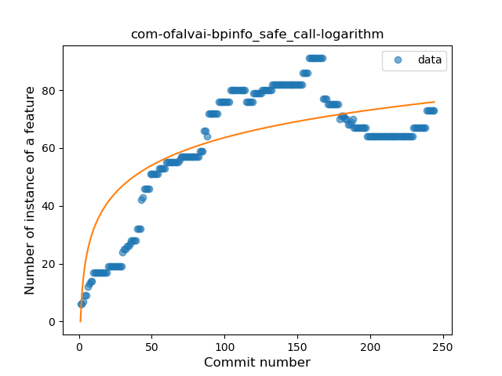
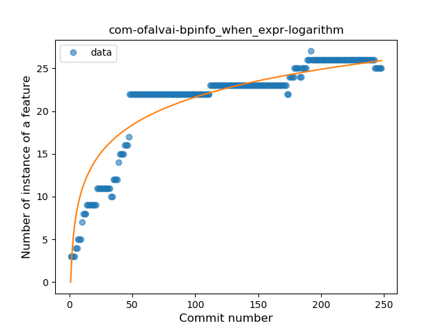
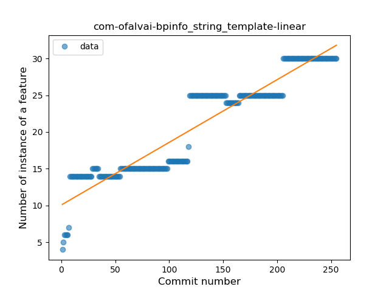
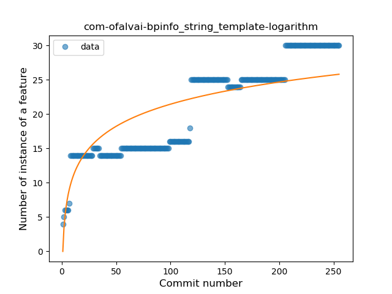
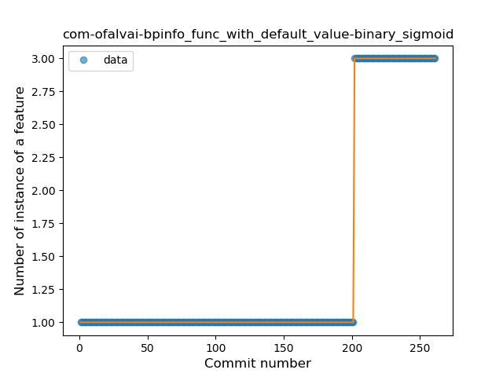
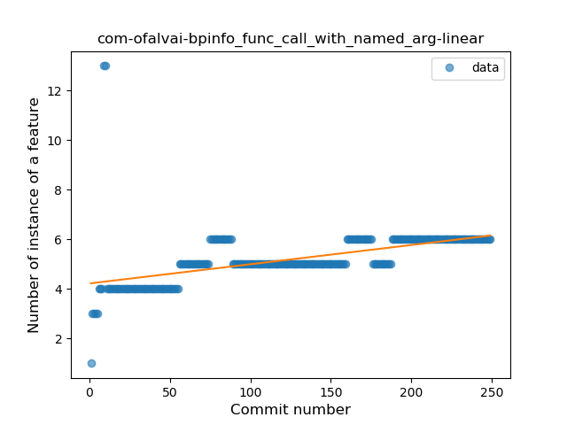
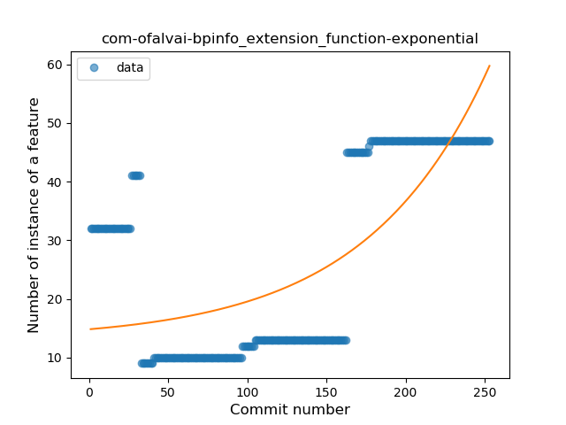
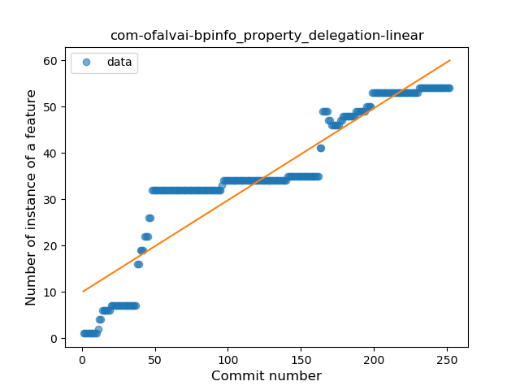
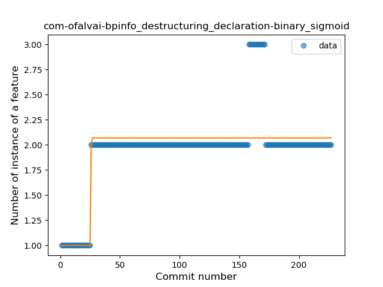

## com-ofalvai-bpinfo
----
#### Metrics provided by Detekt
* Number of lines of code 6310
* Number of Kotlin files: 58
* Cyclomatic complexity: 714
* Cyclomatic complexity by thousands of lines: 263 

----
**17** features analyzed

*	<a href="#type_inference">Type Inference</a> 
*	<a href="#lambda">Lambda</a> 
*	<a href="#safe_call">Safe Call</a> 
*	<a href="#when_expr">When expression</a> 
*	<a href="#unsafe_call">Unsafe Call</a> 
*	<a href="#companion_object">Companion Object</a> 
*	<a href="#string_template">String Template</a> 
*	<a href="#func_with_default_value">Function with Default Value</a> 
*	<a href="#singleton">Singleton</a> 
*	<a href="#range_expr">Range Expression</a> 
*	<a href="#smart_cast">Smart Cast</a> 
*	<a href="#data_class">Data Class</a> 
*	<a href="#func_call_with_named_arg">Function call with Named Argument</a> 
*	<a href="#extension_function">Extension Function</a> 
*	<a href="#property_delegation">Property Delegation</a> 
*	<a href="#destructuring_declaration">Destructuring Declaration</a> 
*	<a href="#sealed_class">Sealed Class</a> 

### <a name="type_inference">Type Inference</a>
----
#### Functions
* **Instability - Polinomial 3:** )
    * **R_Squared:** 0.95092967
* **Sudden Rise Plateau - Logarithm:** 
    * **R_Squared:** 0.71547471
* **Constant Rise - Linear:** 
    * **R_Squared:** 0.66673098

**Plots** :chart_with_upwards_trend:
-----

### <a name="lambda">Lambda</a>
----
#### Functions
* **Constant Rise - Linear:** 
    * **R_Squared:** 0.97552645
* **Sudden Rise Plateau - Logarithm:** 
    * **R_Squared:** 0.56987542
* **Plateau Sudden Rise - Binary Sigmoid:** 
    * **R_Squared:** 0.56479941

**Plots** :chart_with_upwards_trend:
-----

### <a name="safe_call">Safe Call</a>
----
#### Functions
* **Sudden Rise Plateau - Logarithm:** 
    * **R_Squared:** 0.66313435
* **Plateau Sudden Rise - Binary Sigmoid:** 
    * **R_Squared:** 0.65095328
* **Constant Rise - Linear:** 
    * **R_Squared:** 0.47249696

**Plots** :chart_with_upwards_trend:
-----

### <a name="when_expr">When expression</a>
----
#### Functions
* **Sudden Rise Plateau - Logarithm:** 
    * **R_Squared:** 0.86721822
* **Constant Rise - Linear:** 
    * **R_Squared:** 0.66805976

**Plots** :chart_with_upwards_trend:
-----

### <a name="unsafe_call">Unsafe Call</a>
----
#### Functions
* **Plateau Gradual Rise - Sigmoid:** 
    * **R_Squared:** 0.53738226
* **Sudden Rise Plateau - Logarithm:** 
    * **R_Squared:** 0.30642312
* **Constant Rise - Linear:** 
    * **R_Squared:** 0.21748114

**Plots** :chart_with_upwards_trend:
-----

### <a name="companion_object">Companion Object</a>
----
#### Functions
* **Sudden Rise Plateau - Logarithm:** 
    * **R_Squared:** 0.71115255
* **Constant Rise - Linear:** 
    * **R_Squared:** 0.63877412

**Plots** :chart_with_upwards_trend:
-----

### <a name="string_template">String Template</a>
----
#### Functions
* **Constant Rise - Linear:** 
    * **R_Squared:** 0.88833389
* **Sudden Rise Plateau - Logarithm:** 
    * **R_Squared:** 0.68867635
* **Plateau Sudden Rise - Binary Sigmoid:** 
    * **R_Squared:** 0.38794762

**Plots** :chart_with_upwards_trend:
-----

### <a name="func_with_default_value">Function with Default Value</a>
----
#### Functions
* **Plateau Sudden Rise - Binary Sigmoid:** 
    * **R_Squared:** 1.0
* **Sudden Rise - Exponential:** 
    * **R_Squared:** 0.77344064
* **Constant Rise - Linear:** 
    * **R_Squared:** 0.53112155
* **Sudden Rise Plateau - Logarithm:** 
    * **R_Squared:** 0.22564471

**Plots** :chart_with_upwards_trend:
-----

### <a name="singleton">Singleton</a>
----
#### Functions
* **Plateau Gradual Rise - Sigmoid:** 
    * **R_Squared:** 0.97074455
* **Constant Rise - Linear:** 
    * **R_Squared:** 0.94341483
* **Sudden Rise Plateau - Logarithm:** 
    * **R_Squared:** 0.48903794

**Plots** :chart_with_upwards_trend:
-----

### <a name="range_expr">Range Expression</a>
----
#### Functions
* **Sudden Rise Plateau - Logarithm:** 
    * **R_Squared:** 0.68871966
* **Constant Rise - Linear:** 
    * **R_Squared:** 0.42024394

**Plots** :chart_with_upwards_trend:
-----

### <a name="smart_cast">Smart Cast</a>
----
#### Functions
* **Sudden Rise - Exponential:** 
    * **R_Squared:** 0.72260984
* **Constant Rise - Linear:** 
    * **R_Squared:** 0.68488419
* **Sudden Rise Plateau - Logarithm:** 
    * **R_Squared:** 0.55449631

**Plots** :chart_with_upwards_trend:
-----

### <a name="data_class">Data Class</a>
----
#### Functions
* **Plateau Sudden Rise - Binary Sigmoid:** 
    * **R_Squared:** 1.0
* **Constant Rise - Linear:** 
    * **R_Squared:** 0.71423958
* **Sudden Rise Plateau - Logarithm:** 
    * **R_Squared:** 0.5915407

**Plots** :chart_with_upwards_trend:
-----

### <a name="func_call_with_named_arg">Function call with Named Argument</a>
----
#### Functions
* **Constant Rise - Linear:** 
    * **R_Squared:** 0.26638521
* **Sudden Rise Plateau - Logarithm:** 
    * **R_Squared:** 0.24280893

**Plots** :chart_with_upwards_trend:
-----

### <a name="extension_function">Extension Function</a>
----
#### Functions
* **Sudden Rise - Exponential:** 
    * **R_Squared:** 0.53584968
* **Constant Rise - Linear:** 
    * **R_Squared:** 0.38675911
* **Sudden Rise Plateau - Logarithm:** 
    * **R_Squared:** 0.0912457

**Plots** :chart_with_upwards_trend:
-----

### <a name="property_delegation">Property Delegation</a>
----
#### Functions
* **Constant Rise - Linear:** 
    * **R_Squared:** 0.86804288
* **Sudden Rise Plateau - Logarithm:** 
    * **R_Squared:** 0.66051798
* **Plateau Gradual Rise - Sigmoid:** 
    * **R_Squared:** 0.66563079

**Plots** :chart_with_upwards_trend:
-----

### <a name="destructuring_declaration">Destructuring Declaration</a>
----
#### Functions
* **Plateau Sudden Rise - Binary Sigmoid:** 
    * **R_Squared:** 0.66140097
* **Sudden Rise Plateau - Logarithm:** 
    * **R_Squared:** 0.48597029
* **Constant Rise - Linear:** 
    * **R_Squared:** 0.27859091

**Plots** :chart_with_upwards_trend:
-----

### <a name="sealed_class">Sealed Class</a>
----
#### Functions
* **Plateau Sudden Rise - Binary Sigmoid:** 
    * **R_Squared:** 1.0
* **Sudden Rise Plateau - Logarithm:** 
    * **R_Squared:** 0.64829937
* **Constant Rise - Linear:** 
    * **R_Squared:** 0.36742192

**Plots** :chart_with_upwards_trend:
-----

