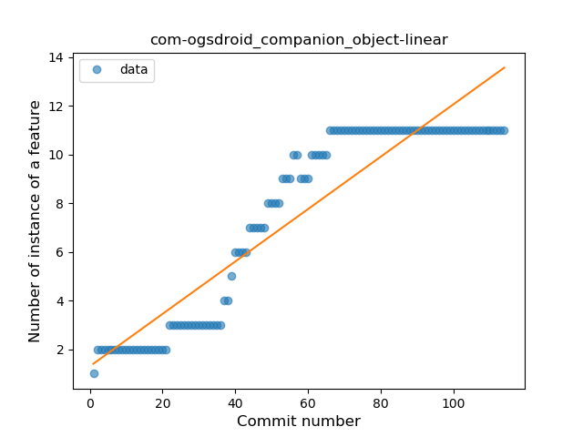
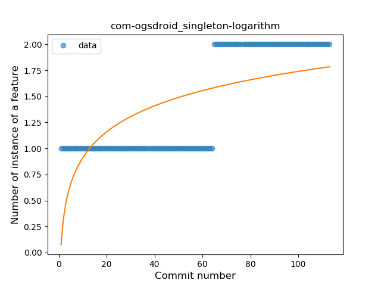
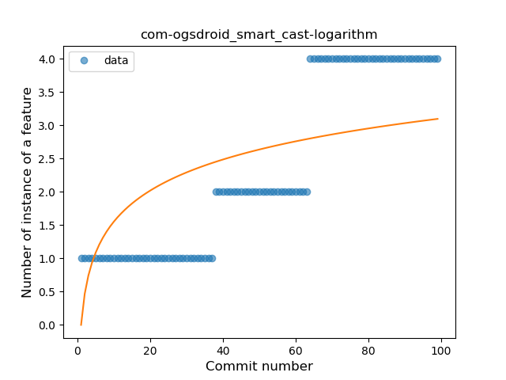

## com-ogsdroid
----
#### Metrics provided by Detekt
* Number of lines of code 3257
* Number of Kotlin files: 19
* Cyclomatic complexity: 352
* Cyclomatic complexity by thousands of lines: 172 

----
**14** features analyzed

*	<a href="#type_inference">Type Inference</a> 
*	<a href="#lambda">Lambda</a> 
*	<a href="#safe_call">Safe Call</a> 
*	<a href="#when_expr">When expression</a> 
*	<a href="#unsafe_call">Unsafe Call</a> 
*	<a href="#companion_object">Companion Object</a> 
*	<a href="#string_template">String Template</a> 
*	<a href="#func_with_default_value">Function with Default Value</a> 
*	<a href="#singleton">Singleton</a> 
*	<a href="#range_expr">Range Expression</a> 
*	<a href="#smart_cast">Smart Cast</a> 
*	<a href="#data_class">Data Class</a> 
*	<a href="#func_call_with_named_arg">Function call with Named Argument</a> 
*	<a href="#destructuring_declaration">Destructuring Declaration</a> 

### <a name="type_inference">Type Inference</a>
----
#### Functions
* **Constant Rise - Linear:** 
    * **R_Squared:** 0.88380266
* **Sudden Rise Plateau - Logarithm:** 
    * **R_Squared:** 0.70394795

**Plots** :chart_with_upwards_trend:
-----

### <a name="lambda">Lambda</a>
----
#### Functions
* **Constant Rise - Linear:** 
    * **R_Squared:** 0.88950672
* **Sudden Rise Plateau - Logarithm:** 
    * **R_Squared:** 0.64708897

**Plots** :chart_with_upwards_trend:
-----

### <a name="safe_call">Safe Call</a>
----
#### Functions
* **Instability - Polinomial 3:** )
    * **R_Squared:** 0.96232764
* **Constant Rise - Linear:** 
    * **R_Squared:** 0.86574638
* **Sudden Rise Plateau - Logarithm:** 
    * **R_Squared:** 0.52606233

**Plots** :chart_with_upwards_trend:
-----

### <a name="when_expr">When expression</a>
----
#### Functions
* **Plateau Gradual Rise - Sigmoid:** 
    * **R_Squared:** 0.94898724
* **Constant Rise - Linear:** 
    * **R_Squared:** 0.82804555
* **Sudden Rise Plateau - Logarithm:** 
    * **R_Squared:** 0.75362421

**Plots** :chart_with_upwards_trend:
-----

### <a name="unsafe_call">Unsafe Call</a>
----
#### Functions
* **Instability - Polinomial 3:** )
    * **R_Squared:** 0.91026538
* **Constant Rise - Linear:** 
    * **R_Squared:** 0.81067291
* **Plateau Sudden Rise - Binary Sigmoid:** 
    * **R_Squared:** 0.51217984
* **Sudden Rise Plateau - Logarithm:** 
    * **R_Squared:** 0.42389615

**Plots** :chart_with_upwards_trend:
-----

### <a name="companion_object">Companion Object</a>
----
#### Functions
* **Constant Rise - Linear:** 
    * **R_Squared:** 0.86508945
* **Sudden Rise Plateau - Logarithm:** 
    * **R_Squared:** 0.61697396

**Plots** :chart_with_upwards_trend:
-----

### <a name="string_template">String Template</a>
----
#### Functions
* **Plateau Gradual Rise - Sigmoid:** 
    * **R_Squared:** 0.97592177
* **Constant Rise - Linear:** 
    * **R_Squared:** 0.88301282
* **Sudden Rise Plateau - Logarithm:** 
    * **R_Squared:** 0.70432979

**Plots** :chart_with_upwards_trend:
-----

### <a name="func_with_default_value">Function with Default Value</a>
----
#### Functions
* **Plateau Gradual Rise - Sigmoid:** 
    * **R_Squared:** 0.98412505
* **Constant Rise - Linear:** 
    * **R_Squared:** 0.75334952
* **Sudden Rise Plateau - Logarithm:** 
    * **R_Squared:** 0.52009779

**Plots** :chart_with_upwards_trend:
-----

### <a name="singleton">Singleton</a>
----
#### Functions
* **Plateau Sudden Rise - Binary Sigmoid:** 
    * **R_Squared:** 1.0
* **Sudden Rise - Exponential:** 
    * **R_Squared:** 0.75152985
* **Constant Rise - Linear:** 
    * **R_Squared:** 0.73684211
* **Sudden Rise Plateau - Logarithm:** 
    * **R_Squared:** 0.45858237

**Plots** :chart_with_upwards_trend:
-----

### <a name="range_expr">Range Expression</a>
----
#### Functions
* **Plateau Gradual Rise - Sigmoid:** 
    * **R_Squared:** 0.85688276
* **Sudden Rise Plateau - Logarithm:** 
    * **R_Squared:** 0.42824656
* **Constant Rise - Linear:** 
    * **R_Squared:** 0.14349855

**Plots** :chart_with_upwards_trend:
-----

### <a name="smart_cast">Smart Cast</a>
----
#### Functions
* **Plateau Gradual Rise - Sigmoid:** 
    * **R_Squared:** 0.9286615
* **Constant Rise - Linear:** 
    * **R_Squared:** 0.85541365
* **Sudden Rise - Exponential:** 
    * **R_Squared:** 0.8653395
* **Sudden Rise Plateau - Logarithm:** 
    * **R_Squared:** 0.48700956

**Plots** :chart_with_upwards_trend:
-----

### <a name="data_class">Data Class</a>
----
#### Functions
* **Constant Rise - Linear:** 
    * **R_Squared:** 0.86816582
* **Sudden Rise Plateau - Logarithm:** 
    * **R_Squared:** 0.45528843

**Plots** :chart_with_upwards_trend:
-----

### <a name="func_call_with_named_arg">Function call with Named Argument</a>
----
#### Functions
* **Plateau Sudden Rise - Binary Sigmoid:** 
    * **R_Squared:** 0.9202454
* **Instability - Polinomial 3:** )
    * **R_Squared:** 0.7412272
* **Sudden Rise - Exponential:** 
    * **R_Squared:** 0.57336634
* **Constant Rise - Linear:** 
    * **R_Squared:** 0.53543668
* **Sudden Rise Plateau - Logarithm:** 
    * **R_Squared:** 0.24622318

**Plots** :chart_with_upwards_trend:
-----

### <a name="destructuring_declaration">Destructuring Declaration</a>
----
#### Functions
* **Plateau Gradual Decline - Sigmoid:** 
    * **R_Squared:** 0.20095368
* **Sudden Decline - Exponential:** 
    * **R_Squared:** 0.08058206
* **Constant Decline - Linear:** 
    * **R_Squared:** 0.02738376
* **Sudden Rise Plateau - Logarithm:** 
    * **R_Squared:** -0.0

**Plots** :chart_with_upwards_trend:
-----

