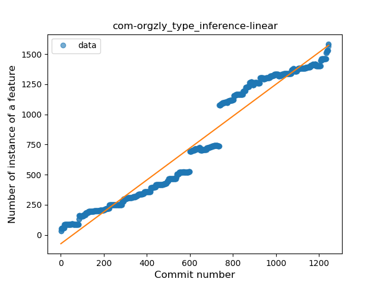
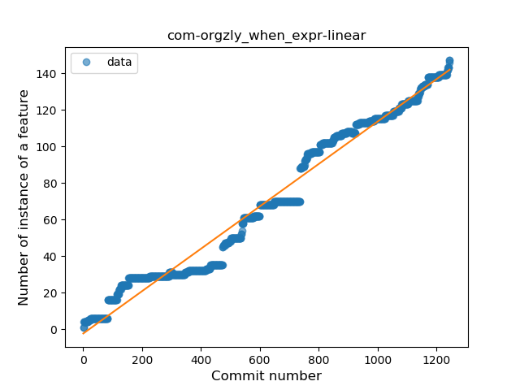
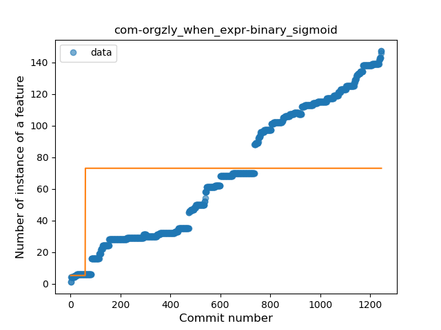
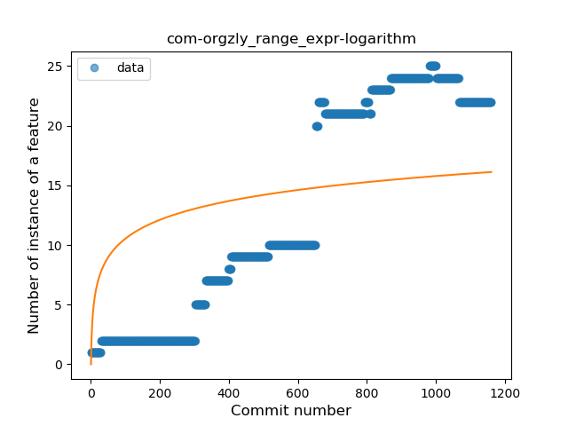
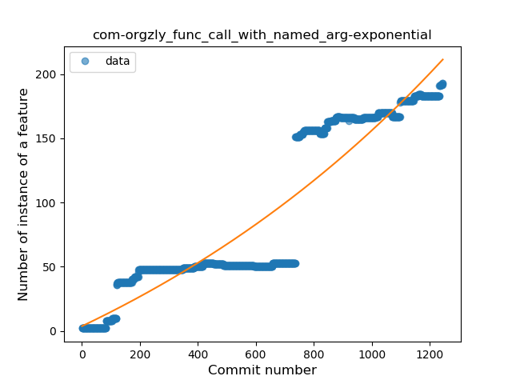
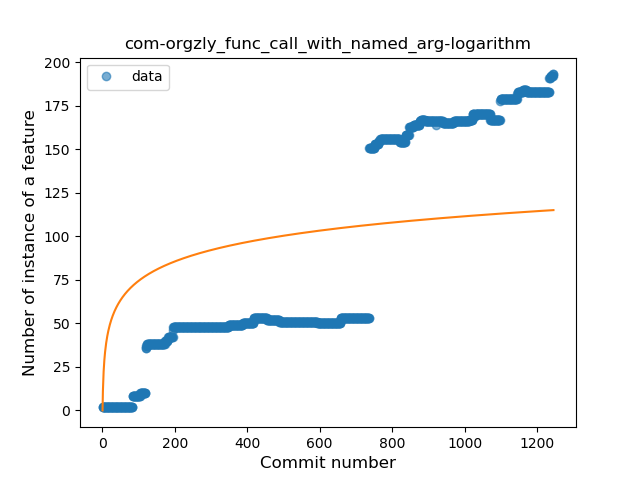
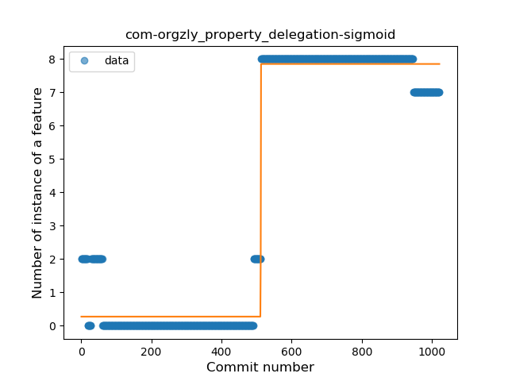

## com-orgzly
----
#### Metrics provided by Detekt
* Number of lines of code 28184
* Number of Kotlin files: 274
* Cyclomatic complexity: 3982
* Cyclomatic complexity by thousands of lines: 263 

----
**18** features analyzed

*	<a href="#type_inference">Type Inference</a> 
*	<a href="#lambda">Lambda</a> 
*	<a href="#safe_call">Safe Call</a> 
*	<a href="#when_expr">When expression</a> 
*	<a href="#unsafe_call">Unsafe Call</a> 
*	<a href="#companion_object">Companion Object</a> 
*	<a href="#string_template">String Template</a> 
*	<a href="#func_with_default_value">Function with Default Value</a> 
*	<a href="#singleton">Singleton</a> 
*	<a href="#range_expr">Range Expression</a> 
*	<a href="#smart_cast">Smart Cast</a> 
*	<a href="#data_class">Data Class</a> 
*	<a href="#func_call_with_named_arg">Function call with Named Argument</a> 
*	<a href="#extension_function">Extension Function</a> 
*	<a href="#property_delegation">Property Delegation</a> 
*	<a href="#destructuring_declaration">Destructuring Declaration</a> 
*	<a href="#overloaded_op">Overloaded Operator</a> 
*	<a href="#sealed_class">Sealed Class</a> 

### <a name="type_inference">Type Inference</a>
----
#### Functions
* **Constant Rise - Linear:** 
    * **R_Squared:** 0.95499723
* **Sudden Rise - Exponential:** 
    * **R_Squared:** 0.9573734
* **Sudden Rise Plateau - Logarithm:** 
    * **R_Squared:** 0.35047746
* **Plateau Sudden Rise - Binary Sigmoid:** 
    * **R_Squared:** 0.08010002

**Plots** :chart_with_upwards_trend:
-----

### <a name="lambda">Lambda</a>
----
#### Functions
* **Sudden Rise - Exponential:** 
    * **R_Squared:** 0.93629403
* **Constant Rise - Linear:** 
    * **R_Squared:** 0.89830428
* **Plateau Sudden Rise - Binary Sigmoid:** 
    * **R_Squared:** 0.40277187
* **Sudden Rise Plateau - Logarithm:** 
    * **R_Squared:** 0.27144137

**Plots** :chart_with_upwards_trend:
-----

### <a name="safe_call">Safe Call</a>
----
#### Functions
* **Sudden Rise - Exponential:** 
    * **R_Squared:** 0.86392571
* **Constant Rise - Linear:** 
    * **R_Squared:** 0.84049306
* **Sudden Rise Plateau - Logarithm:** 
    * **R_Squared:** 0.27947122
* **Plateau Sudden Rise - Binary Sigmoid:** 
    * **R_Squared:** 0.19895792

**Plots** :chart_with_upwards_trend:
-----

### <a name="when_expr">When expression</a>
----
#### Functions
* **Constant Rise - Linear:** 
    * **R_Squared:** 0.97436585
* **Sudden Rise - Exponential:** 
    * **R_Squared:** 0.97777975
* **Sudden Rise Plateau - Logarithm:** 
    * **R_Squared:** 0.38087231
* **Plateau Sudden Rise - Binary Sigmoid:** 
    * **R_Squared:** 0.11614884

**Plots** :chart_with_upwards_trend:
-----

### <a name="unsafe_call">Unsafe Call</a>
----
#### Functions
* **Constant Rise - Linear:** 
    * **R_Squared:** 0.85731219
* **Sudden Rise - Exponential:** 
    * **R_Squared:** 0.85801708
* **Sudden Rise Plateau - Logarithm:** 
    * **R_Squared:** 0.26764926

**Plots** :chart_with_upwards_trend:
-----

### <a name="companion_object">Companion Object</a>
----
#### Functions
* **Sudden Rise - Exponential:** 
    * **R_Squared:** 0.90440532
* **Constant Rise - Linear:** 
    * **R_Squared:** 0.88188277
* **Sudden Rise Plateau - Logarithm:** 
    * **R_Squared:** 0.25445253
* **Plateau Sudden Rise - Binary Sigmoid:** 
    * **R_Squared:** 0.02469343

**Plots** :chart_with_upwards_trend:
-----

### <a name="string_template">String Template</a>
----
#### Functions
* **Constant Rise - Linear:** 
    * **R_Squared:** 0.90994715
* **Sudden Rise - Exponential:** 
    * **R_Squared:** 0.91465534
* **Sudden Rise Plateau - Logarithm:** 
    * **R_Squared:** 0.39135363
* **Plateau Sudden Rise - Binary Sigmoid:** 
    * **R_Squared:** 0.37791161

**Plots** :chart_with_upwards_trend:
-----

### <a name="func_with_default_value">Function with Default Value</a>
----
#### Functions
* **Constant Rise - Linear:** 
    * **R_Squared:** 0.96191579
* **Sudden Rise - Exponential:** 
    * **R_Squared:** 0.96943764
* **Sudden Rise Plateau - Logarithm:** 
    * **R_Squared:** 0.44078864

**Plots** :chart_with_upwards_trend:
-----

### <a name="singleton">Singleton</a>
----
#### Functions
* **Constant Rise - Linear:** 
    * **R_Squared:** 0.86725902
* **Sudden Rise Plateau - Logarithm:** 
    * **R_Squared:** 0.54680812

**Plots** :chart_with_upwards_trend:
-----

### <a name="range_expr">Range Expression</a>
----
#### Functions
* **Constant Rise - Linear:** 
    * **R_Squared:** 0.89682417
* **Sudden Rise Plateau - Logarithm:** 
    * **R_Squared:** 0.33139778
* **Plateau Sudden Rise - Binary Sigmoid:** 
    * **R_Squared:** 0.01730436

**Plots** :chart_with_upwards_trend:
-----

### <a name="smart_cast">Smart Cast</a>
----
#### Functions
* **Constant Rise - Linear:** 
    * **R_Squared:** 0.89628614
* **Sudden Rise Plateau - Logarithm:** 
    * **R_Squared:** 0.56596224
* **Plateau Sudden Rise - Binary Sigmoid:** 
    * **R_Squared:** 0.21813494

**Plots** :chart_with_upwards_trend:
-----

### <a name="data_class">Data Class</a>
----
#### Functions
* **Sudden Rise - Exponential:** 
    * **R_Squared:** 0.92033355
* **Constant Rise - Linear:** 
    * **R_Squared:** 0.9059273
* **Sudden Rise Plateau - Logarithm:** 
    * **R_Squared:** 0.40732641

**Plots** :chart_with_upwards_trend:
-----

### <a name="func_call_with_named_arg">Function call with Named Argument</a>
----
#### Functions
* **Sudden Rise - Exponential:** 
    * **R_Squared:** 0.86638417
* **Constant Rise - Linear:** 
    * **R_Squared:** 0.85518572
* **Sudden Rise Plateau - Logarithm:** 
    * **R_Squared:** 0.31326388
* **Plateau Sudden Rise - Binary Sigmoid:** 
    * **R_Squared:** 0.18108771

**Plots** :chart_with_upwards_trend:
-----

### <a name="extension_function">Extension Function</a>
----
#### Functions
* **Plateau Gradual Rise - Sigmoid:** 
    * **R_Squared:** 0.98203078
* **Sudden Rise - Exponential:** 
    * **R_Squared:** 0.80587264
* **Constant Rise - Linear:** 
    * **R_Squared:** 0.69567022
* **Sudden Rise Plateau - Logarithm:** 
    * **R_Squared:** 0.34859094

**Plots** :chart_with_upwards_trend:
-----

### <a name="property_delegation">Property Delegation</a>
----
#### Functions
* **Plateau Gradual Rise - Sigmoid:** 
    * **R_Squared:** 0.97956726
* **Constant Rise - Linear:** 
    * **R_Squared:** 0.69282774
* **Sudden Rise Plateau - Logarithm:** 
    * **R_Squared:** 0.20091708

**Plots** :chart_with_upwards_trend:
-----

### <a name="destructuring_declaration">Destructuring Declaration</a>
----
#### Functions
* **Constant Rise - Linear:** 
    * **R_Squared:** 0.77402833
* **Sudden Rise - Exponential:** 
    * **R_Squared:** 0.77567421
* **Sudden Rise Plateau - Logarithm:** 
    * **R_Squared:** 0.46626223

**Plots** :chart_with_upwards_trend:
-----

### <a name="overloaded_op">Overloaded Operator</a>
----
#### Functions
* **Plateau Sudden Rise - Binary Sigmoid:** 
    * **R_Squared:** 1.0
* **Sudden Rise Plateau - Logarithm:** 
    * **R_Squared:** 0.58322843
* **Constant Rise - Linear:** 
    * **R_Squared:** 0.46902903

**Plots** :chart_with_upwards_trend:
-----

### <a name="sealed_class">Sealed Class</a>
----
#### Functions
* **Sudden Rise - Exponential:** 
    * **R_Squared:** 0.8075323
* **Constant Rise - Linear:** 
    * **R_Squared:** 0.74300707
* **Sudden Rise Plateau - Logarithm:** 
    * **R_Squared:** 0.33124644

**Plots** :chart_with_upwards_trend:
-----

