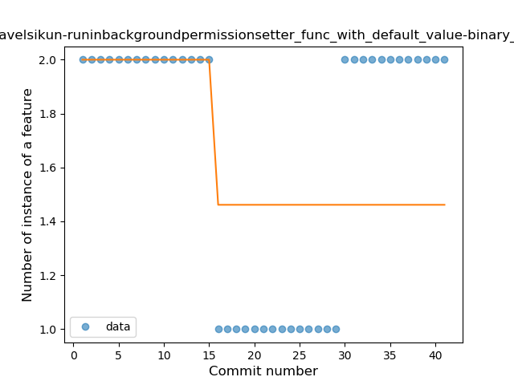

## com-pavelsikun-runinbackgroundpermissionsetter
----
#### Metrics provided by Detekt
* Number of lines of code 330
* Number of Kotlin files: 4
* Cyclomatic complexity: 42
* Cyclomatic complexity by thousands of lines: 241 

----
**5** features analyzed

*	<a href="#type_inference">Type Inference</a> 
*	<a href="#lambda">Lambda</a> 
*	<a href="#when_expr">When expression</a> 
*	<a href="#func_with_default_value">Function with Default Value</a> 
*	<a href="#extension_function">Extension Function</a> 

### <a name="type_inference">Type Inference</a>
----
#### Functions
* **Constant Rise - Linear:** 
    * **R_Squared:** 0.91421646
* **Sudden Rise Plateau - Logarithm:** 
    * **R_Squared:** 0.77031264
* **Plateau Sudden Rise - Binary Sigmoid:** 
    * **R_Squared:** 0.23167739

**Plots** :chart_with_upwards_trend:
-----

### <a name="lambda">Lambda</a>
----
#### Functions
* **Constant Rise - Linear:** 
    * **R_Squared:** 0.81322453
* **Sudden Rise Plateau - Logarithm:** 
    * **R_Squared:** 0.7607175

**Plots** :chart_with_upwards_trend:
-----

### <a name="when_expr">When expression</a>
----
#### Functions
* **Plateau Sudden Rise - Binary Sigmoid:** 
    * **R_Squared:** 1.0
* **Sudden Rise - Exponential:** 
    * **R_Squared:** 0.75908732
* **Constant Rise - Linear:** 
    * **R_Squared:** 0.67647059
* **Sudden Rise Plateau - Logarithm:** 
    * **R_Squared:** 0.40014024

**Plots** :chart_with_upwards_trend:
-----

### <a name="func_with_default_value">Function with Default Value</a>
----
#### Functions
* **Plateau Sudden Decline - Binary Sigmoid:** 
    * **R_Squared:** 0.2991453
* **Sudden Decline - Exponential:** 
    * **R_Squared:** 0.13221157
* **Constant Decline - Linear:** 
    * **R_Squared:** 0.00833333
* **Sudden Rise Plateau - Logarithm:** 
    * **R_Squared:** -0.0

**Plots** :chart_with_upwards_trend:
-----

### <a name="extension_function">Extension Function</a>
----
#### Functions
* **Plateau Sudden Decline - Binary Sigmoid:** 
    * **R_Squared:** 1.0
* **Constant Decline - Linear:** 
    * **R_Squared:** 0.58928571
* **Sudden Rise Plateau - Logarithm:** 
    * **R_Squared:** -0.0

**Plots** :chart_with_upwards_trend:
-----

