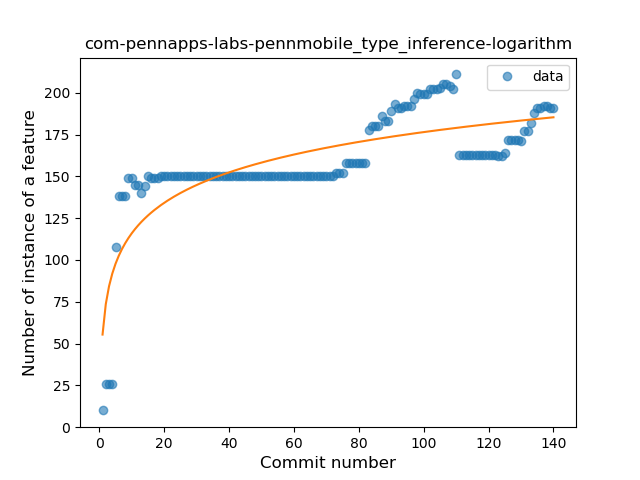
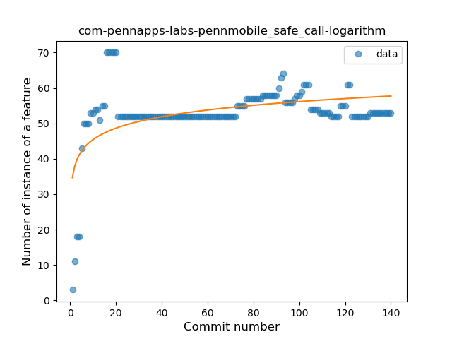

## com-pennapps-labs-pennmobile
----
#### Metrics provided by Detekt
* Number of lines of code 2438
* Number of Kotlin files: 35
* Cyclomatic complexity: 221
* Cyclomatic complexity by thousands of lines: 168 

----
**8** features analyzed

*	<a href="#type_inference">Type Inference</a> 
*	<a href="#lambda">Lambda</a> 
*	<a href="#safe_call">Safe Call</a> 
*	<a href="#when_expr">When expression</a> 
*	<a href="#unsafe_call">Unsafe Call</a> 
*	<a href="#companion_object">Companion Object</a> 
*	<a href="#string_template">String Template</a> 
*	<a href="#range_expr">Range Expression</a> 

### <a name="type_inference">Type Inference</a>
----
#### Functions
* **Sudden Rise Plateau - Logarithm:** 
    * **R_Squared:** 0.64850236
* **Constant Rise - Linear:** 
    * **R_Squared:** 0.44823856

**Plots** :chart_with_upwards_trend:
-----

### <a name="lambda">Lambda</a>
----
#### Functions
* **Sudden Rise Plateau - Logarithm:** 
    * **R_Squared:** 0.81026797
* **Constant Rise - Linear:** 
    * **R_Squared:** 0.76727946

**Plots** :chart_with_upwards_trend:
-----

### <a name="safe_call">Safe Call</a>
----
#### Functions
* **Sudden Rise Plateau - Logarithm:** 
    * **R_Squared:** 0.28480416
* **Constant Rise - Linear:** 
    * **R_Squared:** 0.0737482

**Plots** :chart_with_upwards_trend:
-----

### <a name="when_expr">When expression</a>
----
#### Functions
* **Plateau Sudden Rise - Binary Sigmoid:** 
    * **R_Squared:** 0.91714667
* **Instability - Polinomial 3:** )
    * **R_Squared:** 0.85447877
* **Constant Rise - Linear:** 
    * **R_Squared:** 0.83824502
* **Sudden Rise Plateau - Logarithm:** 
    * **R_Squared:** 0.67917068

**Plots** :chart_with_upwards_trend:
-----

### <a name="unsafe_call">Unsafe Call</a>
----
#### Functions
* **Plateau Sudden Decline - Binary Sigmoid:** 
    * **R_Squared:** 0.43889235
* **Sudden Decline - Exponential:** 
    * **R_Squared:** 0.40796254
* **Constant Decline - Linear:** 
    * **R_Squared:** 0.21886917
* **Sudden Rise Plateau - Logarithm:** 
    * **R_Squared:** -0.0

**Plots** :chart_with_upwards_trend:
-----

### <a name="companion_object">Companion Object</a>
----
#### Functions
* **Plateau Gradual Rise - Sigmoid:** 
    * **R_Squared:** 0.9128691
* **Constant Rise - Linear:** 
    * **R_Squared:** 0.72830584
* **Sudden Rise Plateau - Logarithm:** 
    * **R_Squared:** 0.54982171

**Plots** :chart_with_upwards_trend:
-----

### <a name="string_template">String Template</a>
----
#### Functions
* **Plateau Sudden Decline - Binary Sigmoid:** 
    * **R_Squared:** 0.18888889
* **Sudden Decline - Exponential:** 
    * **R_Squared:** 0.13070639
* **Constant Decline - Linear:** 
    * **R_Squared:** 0.05465019
* **Sudden Rise Plateau - Logarithm:** 
    * **R_Squared:** -0.0

**Plots** :chart_with_upwards_trend:
-----

### <a name="range_expr">Range Expression</a>
----
#### Functions
* **Plateau Gradual Rise - Sigmoid:** 
    * **R_Squared:** 0.90753118
* **Sudden Rise - Exponential:** 
    * **R_Squared:** 0.86097593
* **Constant Rise - Linear:** 
    * **R_Squared:** 0.74572356
* **Sudden Rise Plateau - Logarithm:** 
    * **R_Squared:** 0.37351149

**Plots** :chart_with_upwards_trend:
-----

