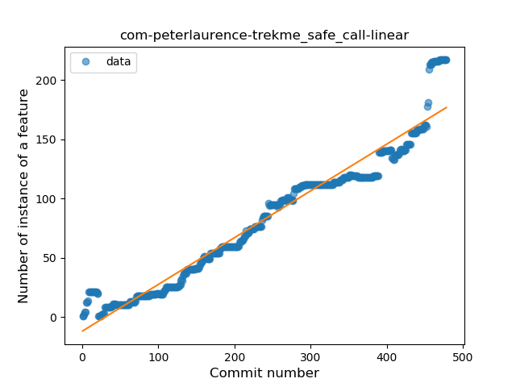
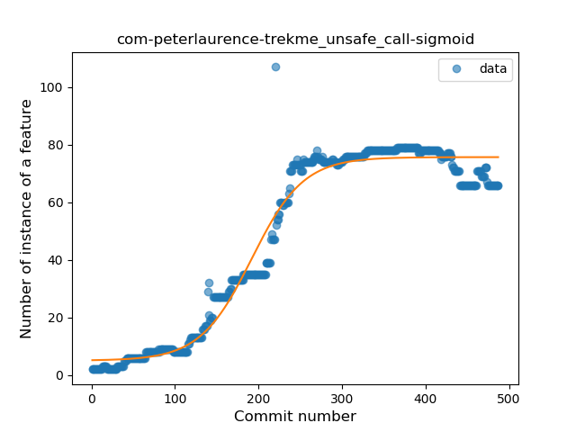
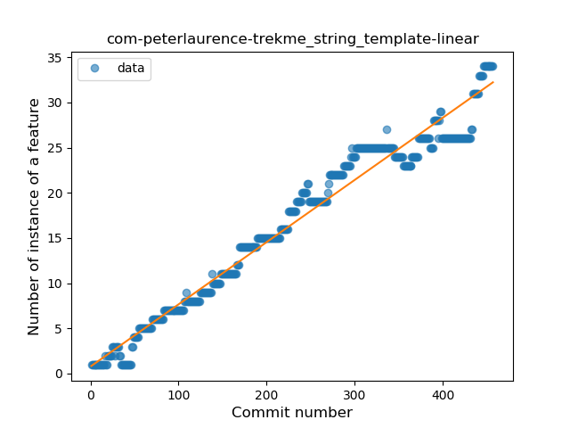
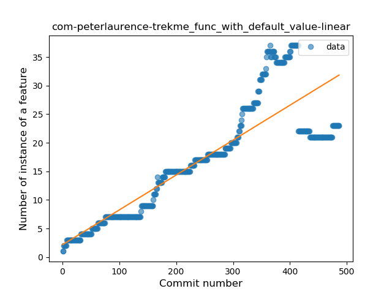
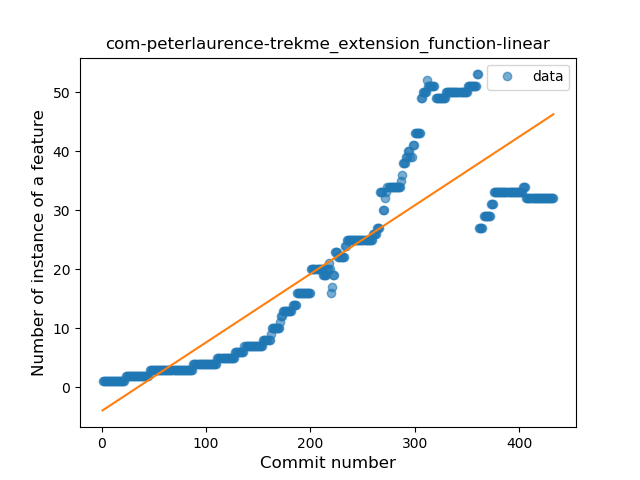
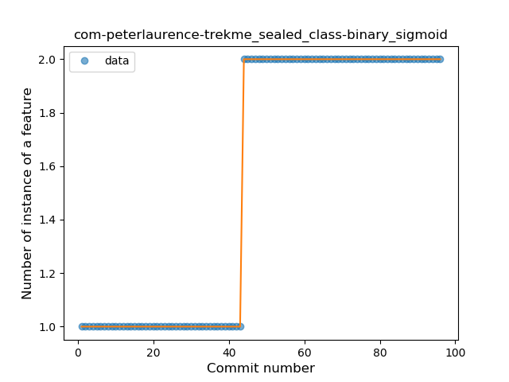
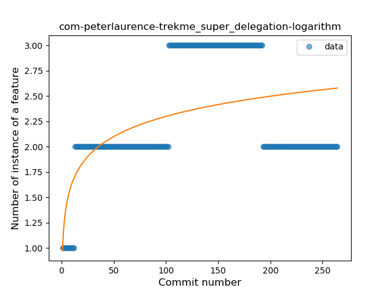

## com-peterlaurence-trekme
----
#### Metrics provided by Detekt
* Number of lines of code 11160
* Number of Kotlin files: 124
* Cyclomatic complexity: 1401
* Cyclomatic complexity by thousands of lines: 270 

----
**20** features analyzed

*	<a href="#type_inference">Type Inference</a> 
*	<a href="#lambda">Lambda</a> 
*	<a href="#safe_call">Safe Call</a> 
*	<a href="#when_expr">When expression</a> 
*	<a href="#unsafe_call">Unsafe Call</a> 
*	<a href="#companion_object">Companion Object</a> 
*	<a href="#string_template">String Template</a> 
*	<a href="#func_with_default_value">Function with Default Value</a> 
*	<a href="#singleton">Singleton</a> 
*	<a href="#range_expr">Range Expression</a> 
*	<a href="#smart_cast">Smart Cast</a> 
*	<a href="#data_class">Data Class</a> 
*	<a href="#func_call_with_named_arg">Function call with Named Argument</a> 
*	<a href="#extension_function">Extension Function</a> 
*	<a href="#property_delegation">Property Delegation</a> 
*	<a href="#destructuring_declaration">Destructuring Declaration</a> 
*	<a href="#coroutine">Coroutine</a> 
*	<a href="#sealed_class">Sealed Class</a> 
*	<a href="#type_alias">Type Alias</a> 
*	<a href="#super_delegation">Super Delegation</a> 

### <a name="type_inference">Type Inference</a>
----
#### Functions
* **Constant Rise - Linear:** 
    * **R_Squared:** 0.91833463
* **Plateau Sudden Rise - Binary Sigmoid:** 
    * **R_Squared:** 0.71197083
* **Sudden Rise Plateau - Logarithm:** 
    * **R_Squared:** 0.54538307

**Plots** :chart_with_upwards_trend:
-----

### <a name="lambda">Lambda</a>
----
#### Functions
* **Constant Rise - Linear:** 
    * **R_Squared:** 0.957016
* **Sudden Rise - Exponential:** 
    * **R_Squared:** 0.95739451
* **Plateau Sudden Rise - Binary Sigmoid:** 
    * **R_Squared:** 0.53869869
* **Sudden Rise Plateau - Logarithm:** 
    * **R_Squared:** 0.37026435

**Plots** :chart_with_upwards_trend:
-----

### <a name="safe_call">Safe Call</a>
----
#### Functions
* **Sudden Rise - Exponential:** 
    * **R_Squared:** 0.9560756
* **Constant Rise - Linear:** 
    * **R_Squared:** 0.94420197
* **Sudden Rise Plateau - Logarithm:** 
    * **R_Squared:** 0.3787965

**Plots** :chart_with_upwards_trend:
-----

### <a name="when_expr">When expression</a>
----
#### Functions
* **Constant Rise - Linear:** 
    * **R_Squared:** 0.97113702
* **Sudden Rise Plateau - Logarithm:** 
    * **R_Squared:** 0.62321739

**Plots** :chart_with_upwards_trend:
-----

### <a name="unsafe_call">Unsafe Call</a>
----
#### Functions
* **Plateau Gradual Rise - Sigmoid:** 
    * **R_Squared:** 0.96875536
* **Constant Rise - Linear:** 
    * **R_Squared:** 0.80525161
* **Sudden Rise Plateau - Logarithm:** 
    * **R_Squared:** 0.42231378

**Plots** :chart_with_upwards_trend:
-----

### <a name="companion_object">Companion Object</a>
----
#### Functions
* **Constant Rise - Linear:** 
    * **R_Squared:** 0.90348755
* **Sudden Rise Plateau - Logarithm:** 
    * **R_Squared:** 0.49724845

**Plots** :chart_with_upwards_trend:
-----

### <a name="string_template">String Template</a>
----
#### Functions
* **Constant Rise - Linear:** 
    * **R_Squared:** 0.9672808
* **Sudden Rise Plateau - Logarithm:** 
    * **R_Squared:** 0.49314629
* **Plateau Sudden Rise - Binary Sigmoid:** 
    * **R_Squared:** 0.04403109

**Plots** :chart_with_upwards_trend:
-----

### <a name="func_with_default_value">Function with Default Value</a>
----
#### Functions
* **Constant Rise - Linear:** 
    * **R_Squared:** 0.74914495
* **Sudden Rise Plateau - Logarithm:** 
    * **R_Squared:** 0.4106788

**Plots** :chart_with_upwards_trend:
-----

### <a name="singleton">Singleton</a>
----
#### Functions
* **Constant Rise - Linear:** 
    * **R_Squared:** 0.87783907
* **Sudden Rise Plateau - Logarithm:** 
    * **R_Squared:** 0.58641773

**Plots** :chart_with_upwards_trend:
-----

### <a name="range_expr">Range Expression</a>
----
#### Functions
* **Constant Rise - Linear:** 
    * **R_Squared:** 0.27191205
* **Sudden Rise Plateau - Logarithm:** 
    * **R_Squared:** 0.27369712

**Plots** :chart_with_upwards_trend:
-----

### <a name="smart_cast">Smart Cast</a>
----
#### Functions
* **Sudden Rise - Exponential:** 
    * **R_Squared:** 0.92443228
* **Constant Rise - Linear:** 
    * **R_Squared:** 0.7308425
* **Sudden Rise Plateau - Logarithm:** 
    * **R_Squared:** 0.22538268

**Plots** :chart_with_upwards_trend:
-----

### <a name="data_class">Data Class</a>
----
#### Functions
* **Constant Rise - Linear:** 
    * **R_Squared:** 0.97459796
* **Sudden Rise Plateau - Logarithm:** 
    * **R_Squared:** 0.53222199

**Plots** :chart_with_upwards_trend:
-----

### <a name="func_call_with_named_arg">Function call with Named Argument</a>
----
#### Functions
* **Constant Rise - Linear:** 
    * **R_Squared:** 0.61612078
* **Sudden Rise - Exponential:** 
    * **R_Squared:** 0.62122611
* **Sudden Rise Plateau - Logarithm:** 
    * **R_Squared:** 0.21034119

**Plots** :chart_with_upwards_trend:
-----

### <a name="extension_function">Extension Function</a>
----
#### Functions
* **Constant Rise - Linear:** 
    * **R_Squared:** 0.77109841
* **Sudden Rise Plateau - Logarithm:** 
    * **R_Squared:** 0.31885837
* **Plateau Sudden Rise - Binary Sigmoid:** 
    * **R_Squared:** 0.10441631

**Plots** :chart_with_upwards_trend:
-----

### <a name="property_delegation">Property Delegation</a>
----
#### Functions
* **Sudden Rise - Exponential:** 
    * **R_Squared:** 0.8899765
* **Constant Rise - Linear:** 
    * **R_Squared:** 0.63407172
* **Sudden Rise Plateau - Logarithm:** 
    * **R_Squared:** 0.15060669

**Plots** :chart_with_upwards_trend:
-----

### <a name="destructuring_declaration">Destructuring Declaration</a>
----
#### Functions
* **Sudden Rise Plateau - Logarithm:** 
    * **R_Squared:** 0.40569483
* **Constant Rise - Linear:** 
    * **R_Squared:** 0.10537144

**Plots** :chart_with_upwards_trend:
-----

### <a name="coroutine">Coroutine</a>
----
#### Functions
* **Constant Rise - Linear:** 
    * **R_Squared:** 0.87829311
* **Sudden Rise Plateau - Logarithm:** 
    * **R_Squared:** 0.44572157
* **Plateau Sudden Rise - Binary Sigmoid:** 
    * **R_Squared:** 0.22907744

**Plots** :chart_with_upwards_trend:
-----

### <a name="sealed_class">Sealed Class</a>
----
#### Functions
* **Plateau Sudden Rise - Binary Sigmoid:** 
    * **R_Squared:** 1.0
* **Constant Rise - Linear:** 
    * **R_Squared:** 0.74194249
* **Sudden Rise Plateau - Logarithm:** 
    * **R_Squared:** 0.56870661

**Plots** :chart_with_upwards_trend:
-----

### <a name="type_alias">Type Alias</a>
----
#### Functions
* **Plateau Gradual Rise - Sigmoid:** 
    * **R_Squared:** 0.91866494
* **Constant Rise - Linear:** 
    * **R_Squared:** 0.88155999
* **Sudden Rise - Exponential:** 
    * **R_Squared:** 0.88806299
* **Sudden Rise Plateau - Logarithm:** 
    * **R_Squared:** 0.57029999

**Plots** :chart_with_upwards_trend:
-----

### <a name="super_delegation">Super Delegation</a>
----
#### Functions
* **Sudden Rise Plateau - Logarithm:** 
    * **R_Squared:** 0.25481405
* **Constant Rise - Linear:** 
    * **R_Squared:** 0.06766091

**Plots** :chart_with_upwards_trend:
-----

