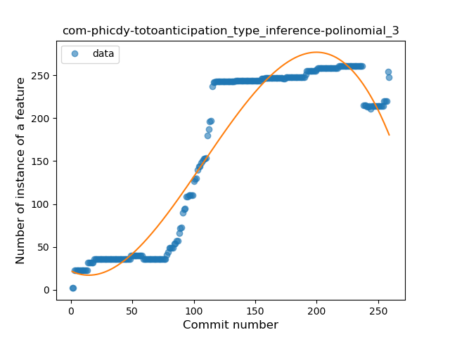
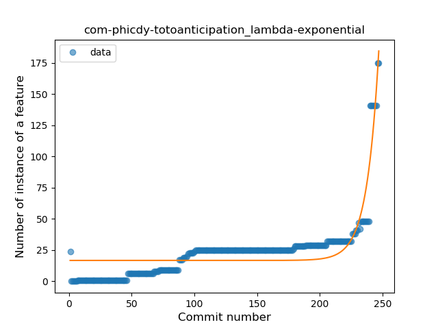
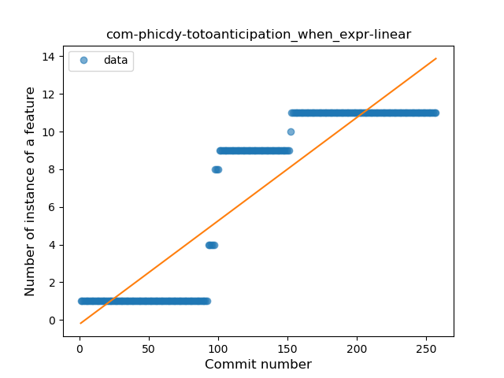
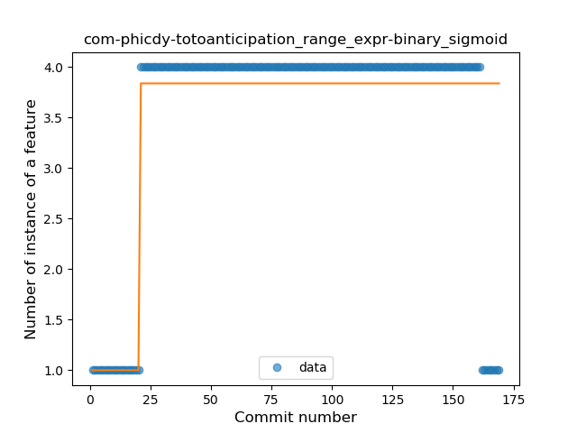

## com-phicdy-totoanticipation
----
#### Metrics provided by Detekt
* Number of lines of code 5181
* Number of Kotlin files: 73
* Cyclomatic complexity: 490
* Cyclomatic complexity by thousands of lines: 127 

----
**14** features analyzed

*	<a href="#type_inference">Type Inference</a> 
*	<a href="#lambda">Lambda</a> 
*	<a href="#safe_call">Safe Call</a> 
*	<a href="#when_expr">When expression</a> 
*	<a href="#unsafe_call">Unsafe Call</a> 
*	<a href="#companion_object">Companion Object</a> 
*	<a href="#string_template">String Template</a> 
*	<a href="#singleton">Singleton</a> 
*	<a href="#range_expr">Range Expression</a> 
*	<a href="#smart_cast">Smart Cast</a> 
*	<a href="#data_class">Data Class</a> 
*	<a href="#func_call_with_named_arg">Function call with Named Argument</a> 
*	<a href="#property_delegation">Property Delegation</a> 
*	<a href="#coroutine">Coroutine</a> 

### <a name="type_inference">Type Inference</a>
----
#### Functions
* **Instability - Polinomial 3:** )
    * **R_Squared:** 0.92561817
* **Constant Rise - Linear:** 
    * **R_Squared:** 0.77047266
* **Sudden Rise Plateau - Logarithm:** 
    * **R_Squared:** 0.45828166
* **Plateau Sudden Rise - Binary Sigmoid:** 
    * **R_Squared:** 0.19674644

**Plots** :chart_with_upwards_trend:
-----

### <a name="lambda">Lambda</a>
----
#### Functions
* **Sudden Rise - Exponential:** 
    * **R_Squared:** 0.79892408
* **Constant Rise - Linear:** 
    * **R_Squared:** 0.47800863
* **Sudden Rise Plateau - Logarithm:** 
    * **R_Squared:** 0.17442578

**Plots** :chart_with_upwards_trend:
-----

### <a name="safe_call">Safe Call</a>
----
#### Functions
* **Sudden Rise - Exponential:** 
    * **R_Squared:** 0.80789632
* **Constant Rise - Linear:** 
    * **R_Squared:** 0.75239264
* **Sudden Rise Plateau - Logarithm:** 
    * **R_Squared:** 0.49173572

**Plots** :chart_with_upwards_trend:
-----

### <a name="when_expr">When expression</a>
----
#### Functions
* **Constant Rise - Linear:** 
    * **R_Squared:** 0.81222292
* **Sudden Rise Plateau - Logarithm:** 
    * **R_Squared:** 0.42270174

**Plots** :chart_with_upwards_trend:
-----

### <a name="unsafe_call">Unsafe Call</a>
----
#### Functions
* **Sudden Decline - Exponential:** 
    * **R_Squared:** 0.98307734
* **Constant Decline - Linear:** 
    * **R_Squared:** 0.03659897
* **Sudden Rise Plateau - Logarithm:** 
    * **R_Squared:** -0.0

**Plots** :chart_with_upwards_trend:
-----

### <a name="companion_object">Companion Object</a>
----
#### Functions
* **Constant Rise - Linear:** 
    * **R_Squared:** 0.81846429
* **Sudden Rise Plateau - Logarithm:** 
    * **R_Squared:** 0.56188171

**Plots** :chart_with_upwards_trend:
-----

### <a name="string_template">String Template</a>
----
#### Functions
* **Sudden Rise Plateau - Logarithm:** 
    * **R_Squared:** 0.84326131
* **Constant Rise - Linear:** 
    * **R_Squared:** 0.73223804

**Plots** :chart_with_upwards_trend:
-----

### <a name="singleton">Singleton</a>
----
#### Functions
* **Plateau Gradual Rise - Sigmoid:** 
    * **R_Squared:** 0.93127979
* **Sudden Rise Plateau - Logarithm:** 
    * **R_Squared:** 0.81452732
* **Constant Rise - Linear:** 
    * **R_Squared:** 0.72229719

**Plots** :chart_with_upwards_trend:
-----

### <a name="range_expr">Range Expression</a>
----
#### Functions
* **Plateau Sudden Rise - Binary Sigmoid:** 
    * **R_Squared:** 0.6759348
* **Sudden Rise Plateau - Logarithm:** 
    * **R_Squared:** 0.30824203
* **Constant Rise - Linear:** 
    * **R_Squared:** 0.07617047

**Plots** :chart_with_upwards_trend:
-----

### <a name="smart_cast">Smart Cast</a>
----
#### Functions
* **Sudden Rise Plateau - Logarithm:** 
    * **R_Squared:** 0.1514691
* **Constant Rise - Linear:** 
    * **R_Squared:** 0.02803738

**Plots** :chart_with_upwards_trend:
-----

### <a name="data_class">Data Class</a>
----
#### Functions
* **Plateau Gradual Rise - Sigmoid:** 
    * **R_Squared:** 0.99142493
* **Sudden Rise - Exponential:** 
    * **R_Squared:** 0.84131128
* **Constant Rise - Linear:** 
    * **R_Squared:** 0.36931656
* **Sudden Rise Plateau - Logarithm:** 
    * **R_Squared:** 0.13856209

**Plots** :chart_with_upwards_trend:
-----

### <a name="func_call_with_named_arg">Function call with Named Argument</a>
----
#### Functions
* **Plateau Sudden Rise - Binary Sigmoid:** 
    * **R_Squared:** 1.0
* **Instability - Polinomial 4:** 
    * **R_Squared:** 0.88392889
* **Sudden Rise - Exponential:** 
    * **R_Squared:** 0.75830137
* **Constant Rise - Linear:** 
    * **R_Squared:** 0.69565217
* **Sudden Rise Plateau - Logarithm:** 
    * **R_Squared:** 0.44237729

**Plots** :chart_with_upwards_trend:
-----

### <a name="property_delegation">Property Delegation</a>
----
#### Functions
* **Plateau Sudden Rise - Binary Sigmoid:** 
    * **R_Squared:** 1.0
* **Sudden Rise Plateau - Logarithm:** 
    * **R_Squared:** 0.65487722
* **Constant Rise - Linear:** 
    * **R_Squared:** 0.61551724

**Plots** :chart_with_upwards_trend:
-----

### <a name="coroutine">Coroutine</a>
----
#### Functions
* **Sudden Rise Plateau - Logarithm:** 
    * **R_Squared:** 0.83883545
* **Constant Rise - Linear:** 
    * **R_Squared:** 0.80876866

**Plots** :chart_with_upwards_trend:
-----

