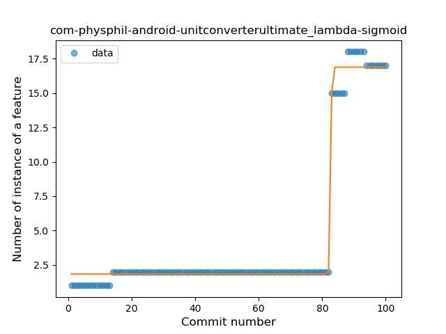
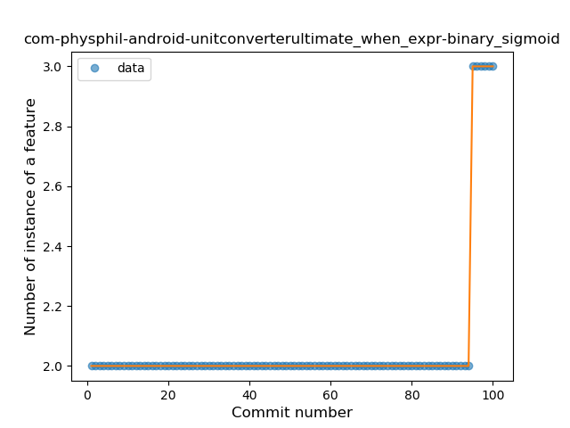
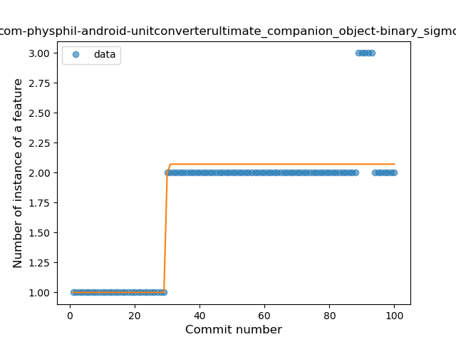
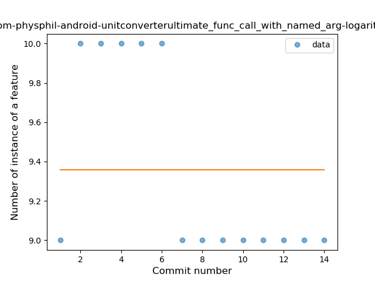
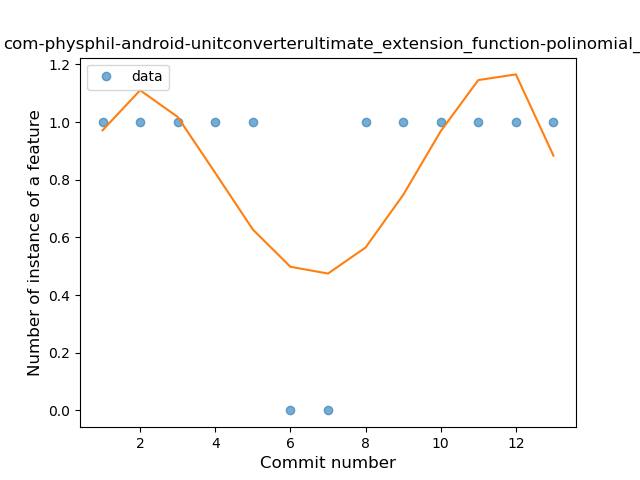
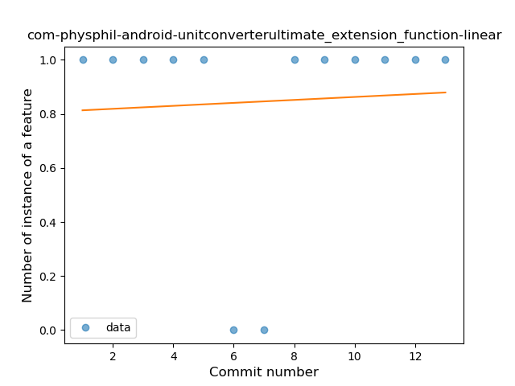

## com-physphil-android-unitconverterultimate
----
#### Metrics provided by Detekt
* Number of lines of code 843
* Number of Kotlin files: 23
* Cyclomatic complexity: 69
* Cyclomatic complexity by thousands of lines: 167 

----
**10** features analyzed

*	<a href="#type_inference">Type Inference</a> 
*	<a href="#lambda">Lambda</a> 
*	<a href="#when_expr">When expression</a> 
*	<a href="#companion_object">Companion Object</a> 
*	<a href="#string_template">String Template</a> 
*	<a href="#singleton">Singleton</a> 
*	<a href="#data_class">Data Class</a> 
*	<a href="#func_call_with_named_arg">Function call with Named Argument</a> 
*	<a href="#extension_function">Extension Function</a> 
*	<a href="#sealed_class">Sealed Class</a> 

### <a name="type_inference">Type Inference</a>
----
#### Functions
* **Instability - Polinomial 3:** )
    * **R_Squared:** 0.90784427
* **Sudden Rise - Exponential:** 
    * **R_Squared:** 0.88000945
* **Constant Rise - Linear:** 
    * **R_Squared:** 0.496616
* **Sudden Rise Plateau - Logarithm:** 
    * **R_Squared:** 0.24469953

**Plots** :chart_with_upwards_trend:
-----

### <a name="lambda">Lambda</a>
----
#### Functions
* **Plateau Gradual Rise - Sigmoid:** 
    * **R_Squared:** 0.99018779
* **Instability - Polinomial 3:** )
    * **R_Squared:** 0.83942843
* **Sudden Rise - Exponential:** 
    * **R_Squared:** 0.80825626
* **Constant Rise - Linear:** 
    * **R_Squared:** 0.47931266
* **Sudden Rise Plateau - Logarithm:** 
    * **R_Squared:** 0.15885717

**Plots** :chart_with_upwards_trend:
-----

### <a name="when_expr">When expression</a>
----
#### Functions
* **Plateau Sudden Rise - Binary Sigmoid:** 
    * **R_Squared:** 1.0
* **Sudden Rise - Exponential:** 
    * **R_Squared:** 0.80731691
* **Constant Rise - Linear:** 
    * **R_Squared:** 0.16921692
* **Sudden Rise Plateau - Logarithm:** 
    * **R_Squared:** 0.06646999

**Plots** :chart_with_upwards_trend:
-----

### <a name="companion_object">Companion Object</a>
----
#### Functions
* **Plateau Sudden Rise - Binary Sigmoid:** 
    * **R_Squared:** 0.83559288
* **Constant Rise - Linear:** 
    * **R_Squared:** 0.64503221
* **Sudden Rise Plateau - Logarithm:** 
    * **R_Squared:** 0.61858064

**Plots** :chart_with_upwards_trend:
-----

### <a name="string_template">String Template</a>
----
#### Functions
* **Plateau Sudden Decline - Binary Sigmoid:** 
    * **R_Squared:** 1.0
* **Instability - Polinomial 4:** 
    * **R_Squared:** 0.87445887
* **Sudden Decline - Exponential:** 
    * **R_Squared:** 0.80520179
* **Constant Decline - Linear:** 
    * **R_Squared:** 0.57142857
* **Sudden Rise Plateau - Logarithm:** 
    * **R_Squared:** -0.0

**Plots** :chart_with_upwards_trend:
-----

### <a name="singleton">Singleton</a>
----
#### Functions
* **Instability - Polinomial 4:** 
    * **R_Squared:** 0.6236781
* **Instability - Polinomial 3:** )
    * **R_Squared:** 0.61097542
* **Sudden Rise - Exponential:** 
    * **R_Squared:** 0.4743858
* **Constant Rise - Linear:** 
    * **R_Squared:** 0.46282051
* **Sudden Rise Plateau - Logarithm:** 
    * **R_Squared:** 0.32897735

**Plots** :chart_with_upwards_trend:
-----

### <a name="data_class">Data Class</a>
----
#### Functions
* **Plateau Sudden Rise - Binary Sigmoid:** 
    * **R_Squared:** 0.95334745
* **Sudden Rise - Exponential:** 
    * **R_Squared:** 0.65668736
* **Constant Rise - Linear:** 
    * **R_Squared:** 0.35098407
* **Sudden Rise Plateau - Logarithm:** 
    * **R_Squared:** 0.1556883

**Plots** :chart_with_upwards_trend:
-----

### <a name="func_call_with_named_arg">Function call with Named Argument</a>
----
#### Functions
* **Instability - Polinomial 4:** 
    * **R_Squared:** 0.89092509
* **Instability - Polinomial 3:** )
    * **R_Squared:** 0.74694913
* **Constant Decline - Linear:** 
    * **R_Squared:** 0.41880342
* **Plateau Gradual Rise - Sigmoid:** 
    * **R_Squared:** 0.04273504
* **Sudden Rise Plateau - Logarithm:** 
    * **R_Squared:** -0.0

**Plots** :chart_with_upwards_trend:
-----

### <a name="extension_function">Extension Function</a>
----
#### Functions
* **Instability - Polinomial 4:** 
    * **R_Squared:** 0.42509897
* **Sudden Rise - Exponential:** 
    * **R_Squared:** 0.05263263
* **Constant Rise - Linear:** 
    * **R_Squared:** 0.00324675
* **Sudden Rise Plateau - Logarithm:** 
    * **R_Squared:** -0.0

**Plots** :chart_with_upwards_trend:
-----

### <a name="sealed_class">Sealed Class</a>
----
#### Functions
* **Instability - Polinomial 4:** 
    * **R_Squared:** 0.83823529
* **Instability - Polinomial 3:** )
    * **R_Squared:** 0.67647059
* **Sudden Rise Plateau - Logarithm:** 
    * **R_Squared:** 0.44759412
* **Constant Rise - Linear:** 
    * **R_Squared:** 0.2

**Plots** :chart_with_upwards_trend:
-----

