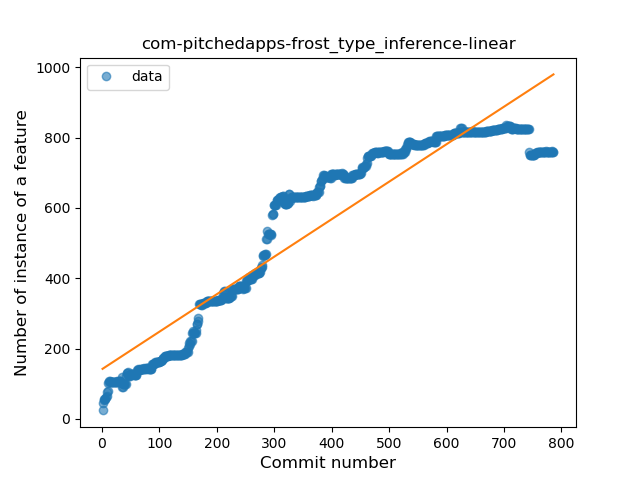
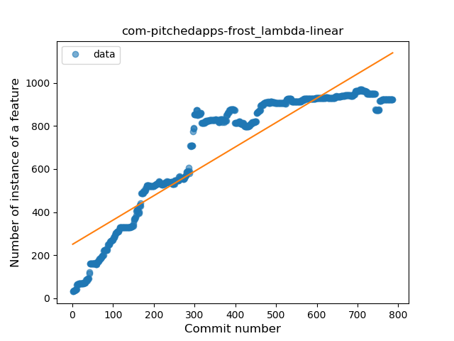
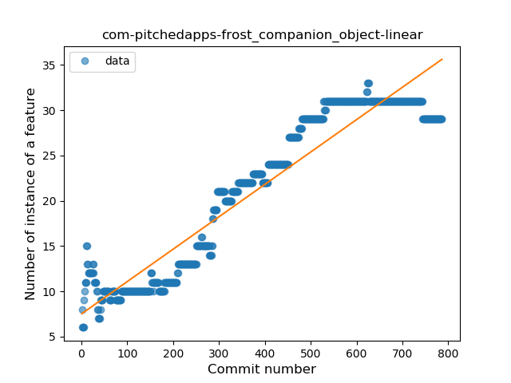
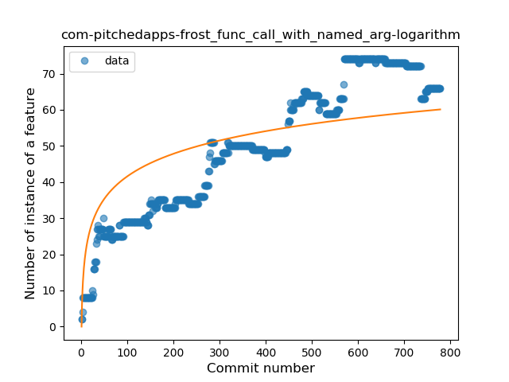
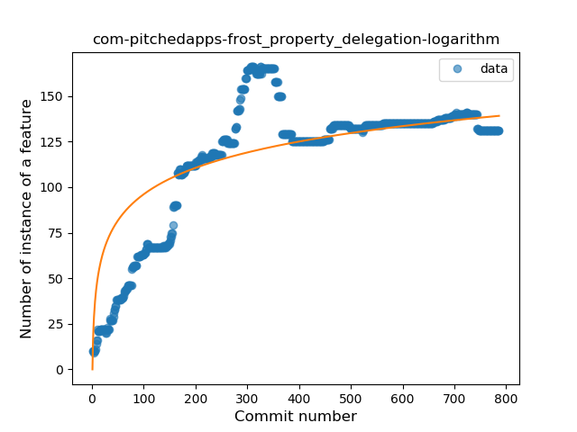
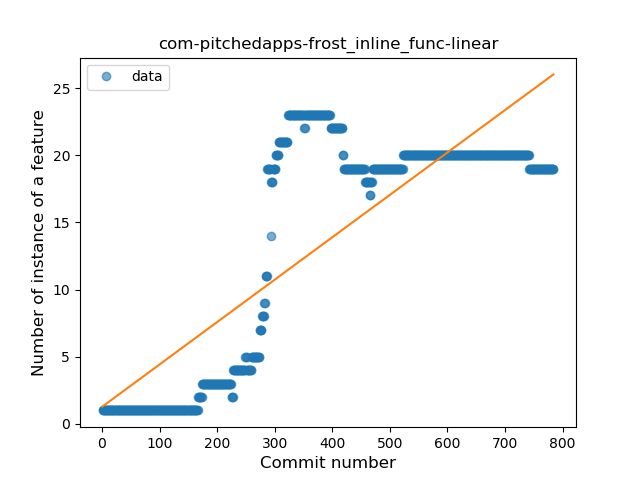
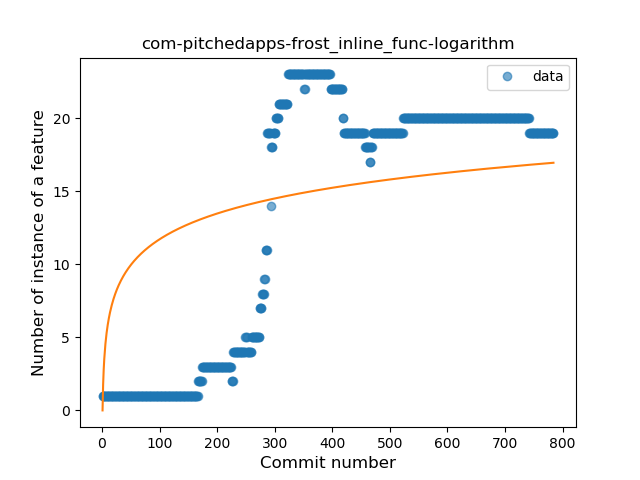
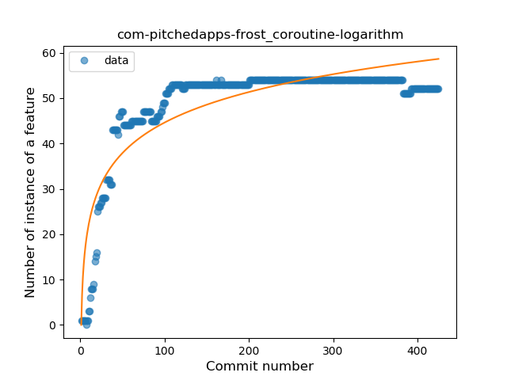

## com-pitchedapps-frost
----
#### Metrics provided by Detekt
* Number of lines of code 16720
* Number of Kotlin files: 141
* Cyclomatic complexity: 1701
* Cyclomatic complexity by thousands of lines: 227 

----
**20** features analyzed

*	<a href="#type_inference">Type Inference</a> 
*	<a href="#lambda">Lambda</a> 
*	<a href="#safe_call">Safe Call</a> 
*	<a href="#when_expr">When expression</a> 
*	<a href="#unsafe_call">Unsafe Call</a> 
*	<a href="#companion_object">Companion Object</a> 
*	<a href="#string_template">String Template</a> 
*	<a href="#func_with_default_value">Function with Default Value</a> 
*	<a href="#singleton">Singleton</a> 
*	<a href="#range_expr">Range Expression</a> 
*	<a href="#smart_cast">Smart Cast</a> 
*	<a href="#data_class">Data Class</a> 
*	<a href="#func_call_with_named_arg">Function call with Named Argument</a> 
*	<a href="#extension_function">Extension Function</a> 
*	<a href="#property_delegation">Property Delegation</a> 
*	<a href="#destructuring_declaration">Destructuring Declaration</a> 
*	<a href="#inline_func">Inline Function</a> 
*	<a href="#overloaded_op">Overloaded Operator</a> 
*	<a href="#coroutine">Coroutine</a> 
*	<a href="#super_delegation">Super Delegation</a> 

### <a name="type_inference">Type Inference</a>
----
#### Functions
* **Constant Rise - Linear:** 
    * **R_Squared:** 0.87879196
* **Sudden Rise Plateau - Logarithm:** 
    * **R_Squared:** 0.54605159
* **Plateau Sudden Rise - Binary Sigmoid:** 
    * **R_Squared:** 0.53373473

**Plots** :chart_with_upwards_trend:
-----

### <a name="lambda">Lambda</a>
----
#### Functions
* **Constant Rise - Linear:** 
    * **R_Squared:** 0.82142451
* **Sudden Rise Plateau - Logarithm:** 
    * **R_Squared:** 0.62281136
* **Plateau Sudden Rise - Binary Sigmoid:** 
    * **R_Squared:** 0.60667436

**Plots** :chart_with_upwards_trend:
-----

### <a name="safe_call">Safe Call</a>
----
#### Functions
* **Plateau Sudden Rise - Binary Sigmoid:** 
    * **R_Squared:** 0.88447636
* **Sudden Rise Plateau - Logarithm:** 
    * **R_Squared:** 0.69349464
* **Constant Rise - Linear:** 
    * **R_Squared:** 0.65668374

**Plots** :chart_with_upwards_trend:
-----

### <a name="when_expr">When expression</a>
----
#### Functions
* **Constant Rise - Linear:** 
    * **R_Squared:** 0.9068226
* **Sudden Rise Plateau - Logarithm:** 
    * **R_Squared:** 0.54093262

**Plots** :chart_with_upwards_trend:
-----

### <a name="unsafe_call">Unsafe Call</a>
----
#### Functions
* **Constant Rise - Linear:** 
    * **R_Squared:** 0.78999445
* **Sudden Rise Plateau - Logarithm:** 
    * **R_Squared:** 0.70122942
* **Plateau Sudden Rise - Binary Sigmoid:** 
    * **R_Squared:** 0.22809984

**Plots** :chart_with_upwards_trend:
-----

### <a name="companion_object">Companion Object</a>
----
#### Functions
* **Constant Rise - Linear:** 
    * **R_Squared:** 0.89994545
* **Sudden Rise Plateau - Logarithm:** 
    * **R_Squared:** 0.53811361

**Plots** :chart_with_upwards_trend:
-----

### <a name="string_template">String Template</a>
----
#### Functions
* **Constant Rise - Linear:** 
    * **R_Squared:** 0.8147978
* **Plateau Sudden Rise - Binary Sigmoid:** 
    * **R_Squared:** 0.66394057
* **Sudden Rise Plateau - Logarithm:** 
    * **R_Squared:** 0.52550014

**Plots** :chart_with_upwards_trend:
-----

### <a name="func_with_default_value">Function with Default Value</a>
----
#### Functions
* **Sudden Rise Plateau - Logarithm:** 
    * **R_Squared:** 0.72695581
* **Constant Rise - Linear:** 
    * **R_Squared:** 0.67693673
* **Plateau Sudden Rise - Binary Sigmoid:** 
    * **R_Squared:** 0.1310407

**Plots** :chart_with_upwards_trend:
-----

### <a name="singleton">Singleton</a>
----
#### Functions
* **Plateau Gradual Rise - Sigmoid:** 
    * **R_Squared:** 0.86190119
* **Constant Rise - Linear:** 
    * **R_Squared:** 0.53211856
* **Sudden Rise Plateau - Logarithm:** 
    * **R_Squared:** 0.50292331

**Plots** :chart_with_upwards_trend:
-----

### <a name="range_expr">Range Expression</a>
----
#### Functions
* **Plateau Gradual Rise - Sigmoid:** 
    * **R_Squared:** 0.94254275
* **Constant Rise - Linear:** 
    * **R_Squared:** 0.92672507
* **Sudden Rise Plateau - Logarithm:** 
    * **R_Squared:** 0.53395372

**Plots** :chart_with_upwards_trend:
-----

### <a name="smart_cast">Smart Cast</a>
----
#### Functions
* **Plateau Gradual Rise - Sigmoid:** 
    * **R_Squared:** 0.9383665
* **Constant Rise - Linear:** 
    * **R_Squared:** 0.638914
* **Sudden Rise Plateau - Logarithm:** 
    * **R_Squared:** 0.4342262

**Plots** :chart_with_upwards_trend:
-----

### <a name="data_class">Data Class</a>
----
#### Functions
* **Constant Rise - Linear:** 
    * **R_Squared:** 0.67006658
* **Sudden Rise Plateau - Logarithm:** 
    * **R_Squared:** 0.38817697

**Plots** :chart_with_upwards_trend:
-----

### <a name="func_call_with_named_arg">Function call with Named Argument</a>
----
#### Functions
* **Constant Rise - Linear:** 
    * **R_Squared:** 0.90865367
* **Sudden Rise Plateau - Logarithm:** 
    * **R_Squared:** 0.63190022

**Plots** :chart_with_upwards_trend:
-----

### <a name="extension_function">Extension Function</a>
----
#### Functions
* **Constant Rise - Linear:** 
    * **R_Squared:** 0.78687538
* **Sudden Rise Plateau - Logarithm:** 
    * **R_Squared:** 0.59123353
* **Plateau Sudden Rise - Binary Sigmoid:** 
    * **R_Squared:** 0.10542106

**Plots** :chart_with_upwards_trend:
-----

### <a name="property_delegation">Property Delegation</a>
----
#### Functions
* **Plateau Gradual Rise - Sigmoid:** 
    * **R_Squared:** 0.69856007
* **Sudden Rise Plateau - Logarithm:** 
    * **R_Squared:** 0.65943724
* **Constant Rise - Linear:** 
    * **R_Squared:** 0.50460779

**Plots** :chart_with_upwards_trend:
-----

### <a name="destructuring_declaration">Destructuring Declaration</a>
----
#### Functions
* **Sudden Rise Plateau - Logarithm:** 
    * **R_Squared:** 0.81269057
* **Constant Rise - Linear:** 
    * **R_Squared:** 0.59441899

**Plots** :chart_with_upwards_trend:
-----

### <a name="inline_func">Inline Function</a>
----
#### Functions
* **Constant Rise - Linear:** 
    * **R_Squared:** 0.66345987
* **Sudden Rise Plateau - Logarithm:** 
    * **R_Squared:** 0.36098797

**Plots** :chart_with_upwards_trend:
-----

### <a name="overloaded_op">Overloaded Operator</a>
----
#### Functions
* **Sudden Rise Plateau - Logarithm:** 
    * **R_Squared:** 0.58047748
* **Constant Rise - Linear:** 
    * **R_Squared:** 0.52872917

**Plots** :chart_with_upwards_trend:
-----

### <a name="coroutine">Coroutine</a>
----
#### Functions
* **Sudden Rise Plateau - Logarithm:** 
    * **R_Squared:** 0.78099164
* **Plateau Gradual Rise - Sigmoid:** 
    * **R_Squared:** 0.76990297
* **Constant Rise - Linear:** 
    * **R_Squared:** 0.35282924

**Plots** :chart_with_upwards_trend:
-----

### <a name="super_delegation">Super Delegation</a>
----
#### Functions
* **Sudden Rise Plateau - Logarithm:** 
    * **R_Squared:** 0.74200517
* **Constant Rise - Linear:** 
    * **R_Squared:** 0.58514942

**Plots** :chart_with_upwards_trend:
-----

