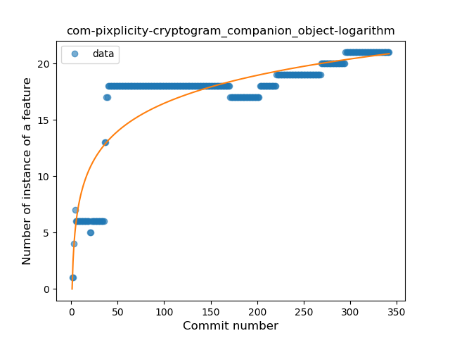
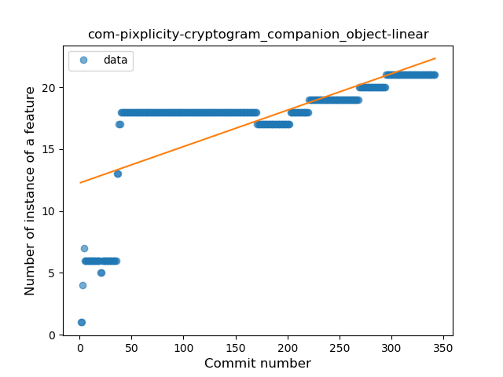
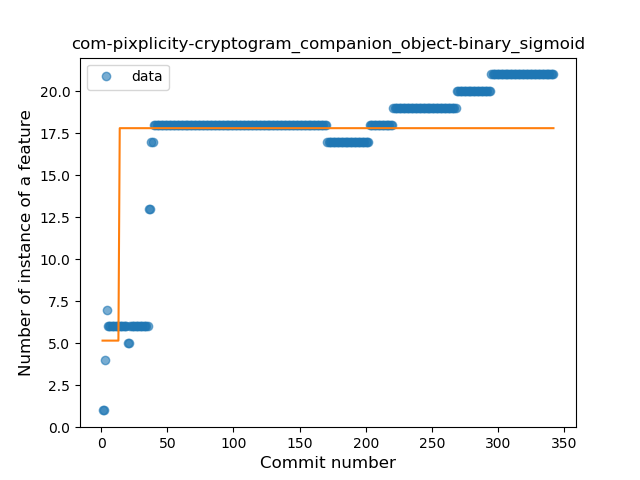
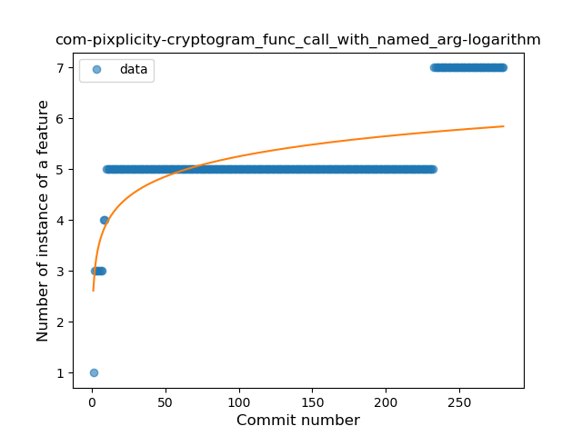

## com-pixplicity-cryptogram
----
#### Metrics provided by Detekt
* Number of lines of code 7392
* Number of Kotlin files: 51
* Cyclomatic complexity: 1230
* Cyclomatic complexity by thousands of lines: 292 

----
**13** features analyzed

*	<a href="#type_inference">Type Inference</a> 
*	<a href="#lambda">Lambda</a> 
*	<a href="#safe_call">Safe Call</a> 
*	<a href="#when_expr">When expression</a> 
*	<a href="#unsafe_call">Unsafe Call</a> 
*	<a href="#companion_object">Companion Object</a> 
*	<a href="#string_template">String Template</a> 
*	<a href="#func_with_default_value">Function with Default Value</a> 
*	<a href="#singleton">Singleton</a> 
*	<a href="#range_expr">Range Expression</a> 
*	<a href="#smart_cast">Smart Cast</a> 
*	<a href="#func_call_with_named_arg">Function call with Named Argument</a> 
*	<a href="#destructuring_declaration">Destructuring Declaration</a> 

### <a name="type_inference">Type Inference</a>
----
#### Functions
* **Instability - Polinomial 3:** )
    * **R_Squared:** 0.81177643
* **Sudden Rise Plateau - Logarithm:** 
    * **R_Squared:** 0.69236071
* **Constant Rise - Linear:** 
    * **R_Squared:** 0.42526355
* **Plateau Sudden Rise - Binary Sigmoid:** 
    * **R_Squared:** 0.16468527

**Plots** :chart_with_upwards_trend:
-----

### <a name="lambda">Lambda</a>
----
#### Functions
* **Sudden Rise Plateau - Logarithm:** 
    * **R_Squared:** 0.83293355
* **Constant Rise - Linear:** 
    * **R_Squared:** 0.71792066
* **Plateau Sudden Rise - Binary Sigmoid:** 
    * **R_Squared:** 0.4833788

**Plots** :chart_with_upwards_trend:
-----

### <a name="safe_call">Safe Call</a>
----
#### Functions
* **Constant Rise - Linear:** 
    * **R_Squared:** 0.76102974
* **Sudden Rise Plateau - Logarithm:** 
    * **R_Squared:** 0.72485624
* **Plateau Sudden Rise - Binary Sigmoid:** 
    * **R_Squared:** 0.69611078

**Plots** :chart_with_upwards_trend:
-----

### <a name="when_expr">When expression</a>
----
#### Functions
* **Plateau Sudden Rise - Binary Sigmoid:** 
    * **R_Squared:** 0.90342213
* **Sudden Rise Plateau - Logarithm:** 
    * **R_Squared:** 0.75581828
* **Constant Rise - Linear:** 
    * **R_Squared:** 0.52298442

**Plots** :chart_with_upwards_trend:
-----

### <a name="unsafe_call">Unsafe Call</a>
----
#### Functions
* **Constant Decline - Linear:** 
    * **R_Squared:** 0.06371567
* **Plateau Sudden Rise - Binary Sigmoid:** 
    * **R_Squared:** 0.02340959
* **Sudden Rise Plateau - Logarithm:** 
    * **R_Squared:** 0.01317491
* **Sudden Decline - Exponential:** 
    * **R_Squared:** 0.0

**Plots** :chart_with_upwards_trend:
-----

### <a name="companion_object">Companion Object</a>
----
#### Functions
* **Sudden Rise Plateau - Logarithm:** 
    * **R_Squared:** 0.7464376
* **Constant Rise - Linear:** 
    * **R_Squared:** 0.48850132
* **Plateau Sudden Rise - Binary Sigmoid:** 
    * **R_Squared:** 0.33790472

**Plots** :chart_with_upwards_trend:
-----

### <a name="string_template">String Template</a>
----
#### Functions
* **Sudden Rise Plateau - Logarithm:** 
    * **R_Squared:** 0.14687879
* **Plateau Sudden Rise - Binary Sigmoid:** 
    * **R_Squared:** 0.07531595
* **Constant Rise - Linear:** 
    * **R_Squared:** 0.00571773

**Plots** :chart_with_upwards_trend:
-----

### <a name="func_with_default_value">Function with Default Value</a>
----
#### Functions
* **Plateau Gradual Rise - Sigmoid:** 
    * **R_Squared:** 0.7532584
* **Sudden Rise Plateau - Logarithm:** 
    * **R_Squared:** 0.69175298
* **Constant Rise - Linear:** 
    * **R_Squared:** 0.49802761

**Plots** :chart_with_upwards_trend:
-----

### <a name="singleton">Singleton</a>
----
#### Functions
* **Plateau Gradual Rise - Sigmoid:** 
    * **R_Squared:** 0.9926209
* **Sudden Rise Plateau - Logarithm:** 
    * **R_Squared:** 0.62907667
* **Constant Rise - Linear:** 
    * **R_Squared:** 0.3033238

**Plots** :chart_with_upwards_trend:
-----

### <a name="range_expr">Range Expression</a>
----
#### Functions
* **Constant Rise - Linear:** 
    * **R_Squared:** 0.6537264
* **Sudden Rise Plateau - Logarithm:** 
    * **R_Squared:** 0.64838643

**Plots** :chart_with_upwards_trend:
-----

### <a name="smart_cast">Smart Cast</a>
----
#### Functions
* **Plateau Sudden Decline - Binary Sigmoid:** 
    * **R_Squared:** 1.0
* **Sudden Decline - Exponential:** 
    * **R_Squared:** 0.79135538
* **Constant Decline - Linear:** 
    * **R_Squared:** 0.33884441
* **Sudden Rise Plateau - Logarithm:** 
    * **R_Squared:** -0.0

**Plots** :chart_with_upwards_trend:
-----

### <a name="func_call_with_named_arg">Function call with Named Argument</a>
----
#### Functions
* **Plateau Sudden Rise - Binary Sigmoid:** 
    * **R_Squared:** 0.80874768
* **Sudden Rise - Exponential:** 
    * **R_Squared:** 0.66614721
* **Constant Rise - Linear:** 
    * **R_Squared:** 0.47561995
* **Sudden Rise Plateau - Logarithm:** 
    * **R_Squared:** 0.40083442

**Plots** :chart_with_upwards_trend:
-----

### <a name="destructuring_declaration">Destructuring Declaration</a>
----
#### Functions
* **Constant Rise - Linear:** 
    * **R_Squared:** 0.08423837
* **Sudden Rise Plateau - Logarithm:** 
    * **R_Squared:** 0.07685899

**Plots** :chart_with_upwards_trend:
-----

