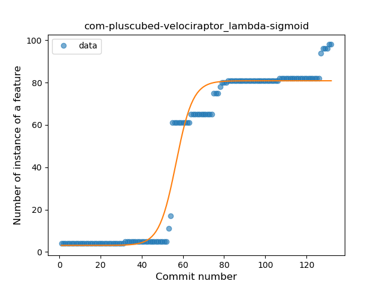
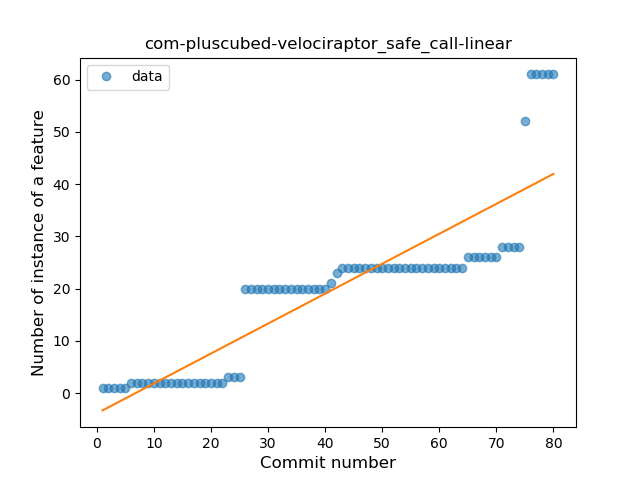
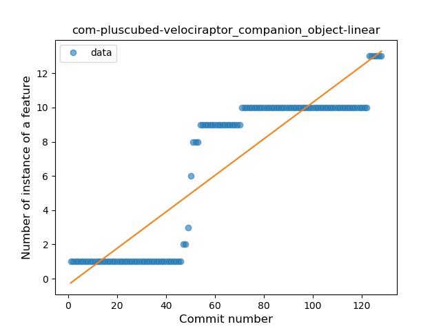
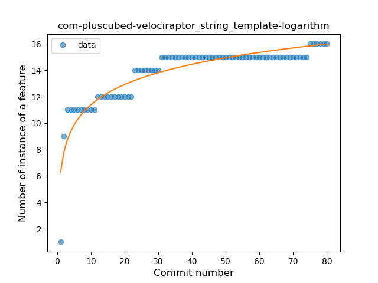
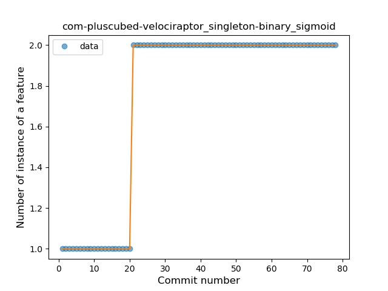
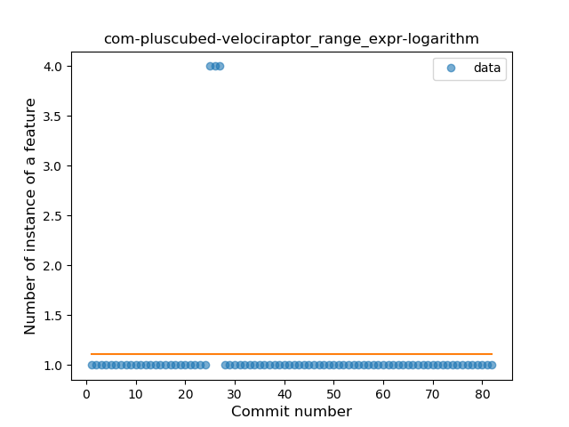
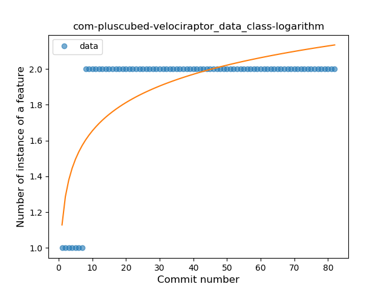
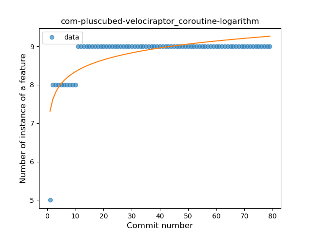

## com-pluscubed-velociraptor
----
#### Metrics provided by Detekt
* Number of lines of code 4269
* Number of Kotlin files: 28
* Cyclomatic complexity: 605
* Cyclomatic complexity by thousands of lines: 238 

----
**14** features analyzed

*	<a href="#type_inference">Type Inference</a> 
*	<a href="#lambda">Lambda</a> 
*	<a href="#safe_call">Safe Call</a> 
*	<a href="#when_expr">When expression</a> 
*	<a href="#unsafe_call">Unsafe Call</a> 
*	<a href="#companion_object">Companion Object</a> 
*	<a href="#string_template">String Template</a> 
*	<a href="#func_with_default_value">Function with Default Value</a> 
*	<a href="#singleton">Singleton</a> 
*	<a href="#range_expr">Range Expression</a> 
*	<a href="#data_class">Data Class</a> 
*	<a href="#func_call_with_named_arg">Function call with Named Argument</a> 
*	<a href="#property_delegation">Property Delegation</a> 
*	<a href="#coroutine">Coroutine</a> 

### <a name="type_inference">Type Inference</a>
----
#### Functions
* **Instability - Polinomial 3:** )
    * **R_Squared:** 0.93277689
* **Constant Rise - Linear:** 
    * **R_Squared:** 0.85473002
* **Sudden Rise Plateau - Logarithm:** 
    * **R_Squared:** 0.41551171

**Plots** :chart_with_upwards_trend:
-----

### <a name="lambda">Lambda</a>
----
#### Functions
* **Plateau Gradual Rise - Sigmoid:** 
    * **R_Squared:** 0.96577017
* **Instability - Polinomial 3:** )
    * **R_Squared:** 0.91031926
* **Constant Rise - Linear:** 
    * **R_Squared:** 0.84344316
* **Sudden Rise Plateau - Logarithm:** 
    * **R_Squared:** 0.41403996

**Plots** :chart_with_upwards_trend:
-----

### <a name="safe_call">Safe Call</a>
----
#### Functions
* **Sudden Rise - Exponential:** 
    * **R_Squared:** 0.77963733
* **Constant Rise - Linear:** 
    * **R_Squared:** 0.76134038
* **Plateau Gradual Rise - Sigmoid:** 
    * **R_Squared:** 0.57374828
* **Sudden Rise Plateau - Logarithm:** 
    * **R_Squared:** 0.40751802

**Plots** :chart_with_upwards_trend:
-----

### <a name="when_expr">When expression</a>
----
#### Functions
* **Plateau Gradual Rise - Sigmoid:** 
    * **R_Squared:** 0.94695255
* **Constant Rise - Linear:** 
    * **R_Squared:** 0.82459245
* **Sudden Rise Plateau - Logarithm:** 
    * **R_Squared:** 0.63860335

**Plots** :chart_with_upwards_trend:
-----

### <a name="unsafe_call">Unsafe Call</a>
----
#### Functions
* **Instability - Polinomial 3:** )
    * **R_Squared:** 0.90551435
* **Plateau Sudden Rise - Binary Sigmoid:** 
    * **R_Squared:** 0.83552532
* **Constant Rise - Linear:** 
    * **R_Squared:** 0.76124519
* **Sudden Rise Plateau - Logarithm:** 
    * **R_Squared:** 0.37243641

**Plots** :chart_with_upwards_trend:
-----

### <a name="companion_object">Companion Object</a>
----
#### Functions
* **Constant Rise - Linear:** 
    * **R_Squared:** 0.81115609
* **Sudden Rise Plateau - Logarithm:** 
    * **R_Squared:** 0.46059462

**Plots** :chart_with_upwards_trend:
-----

### <a name="string_template">String Template</a>
----
#### Functions
* **Sudden Rise Plateau - Logarithm:** 
    * **R_Squared:** 0.84272892
* **Instability - Polinomial 3:** )
    * **R_Squared:** 0.80939171
* **Constant Rise - Linear:** 
    * **R_Squared:** 0.58418733

**Plots** :chart_with_upwards_trend:
-----

### <a name="func_with_default_value">Function with Default Value</a>
----
#### Functions
* **Plateau Gradual Rise - Sigmoid:** 
    * **R_Squared:** 0.87493336
* **Sudden Rise Plateau - Logarithm:** 
    * **R_Squared:** 0.8178039
* **Constant Rise - Linear:** 
    * **R_Squared:** 0.55895463

**Plots** :chart_with_upwards_trend:
-----

### <a name="singleton">Singleton</a>
----
#### Functions
* **Plateau Sudden Rise - Binary Sigmoid:** 
    * **R_Squared:** 1.0
* **Sudden Rise Plateau - Logarithm:** 
    * **R_Squared:** 0.68210364
* **Constant Rise - Linear:** 
    * **R_Squared:** 0.57208614

**Plots** :chart_with_upwards_trend:
-----

### <a name="range_expr">Range Expression</a>
----
#### Functions
* **Plateau Gradual Decline - Sigmoid:** 
    * **R_Squared:** 0.07690447
* **Constant Decline - Linear:** 
    * **R_Squared:** 0.01628455
* **Sudden Rise Plateau - Logarithm:** 
    * **R_Squared:** -0.0

**Plots** :chart_with_upwards_trend:
-----

### <a name="data_class">Data Class</a>
----
#### Functions
* **Plateau Sudden Rise - Binary Sigmoid:** 
    * **R_Squared:** 1.0
* **Sudden Rise Plateau - Logarithm:** 
    * **R_Squared:** 0.55559912
* **Constant Rise - Linear:** 
    * **R_Squared:** 0.23427041

**Plots** :chart_with_upwards_trend:
-----

### <a name="func_call_with_named_arg">Function call with Named Argument</a>
----
#### Functions
* **Sudden Rise Plateau - Logarithm:** 
    * **R_Squared:** 0.68068866
* **Constant Rise - Linear:** 
    * **R_Squared:** 0.60425447

**Plots** :chart_with_upwards_trend:
-----

### <a name="property_delegation">Property Delegation</a>
----
#### Functions
* **Plateau Sudden Decline - Binary Sigmoid:** 
    * **R_Squared:** 1.0
* **Constant Decline - Linear:** 
    * **R_Squared:** 0.23823529
* **Sudden Rise Plateau - Logarithm:** 
    * **R_Squared:** -0.0

**Plots** :chart_with_upwards_trend:
-----

### <a name="coroutine">Coroutine</a>
----
#### Functions
* **Sudden Rise Plateau - Logarithm:** 
    * **R_Squared:** 0.56974532
* **Constant Rise - Linear:** 
    * **R_Squared:** 0.22728086

**Plots** :chart_with_upwards_trend:
-----

